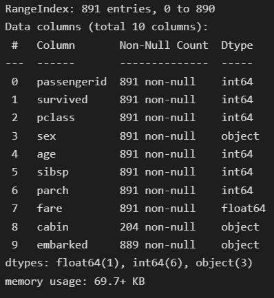
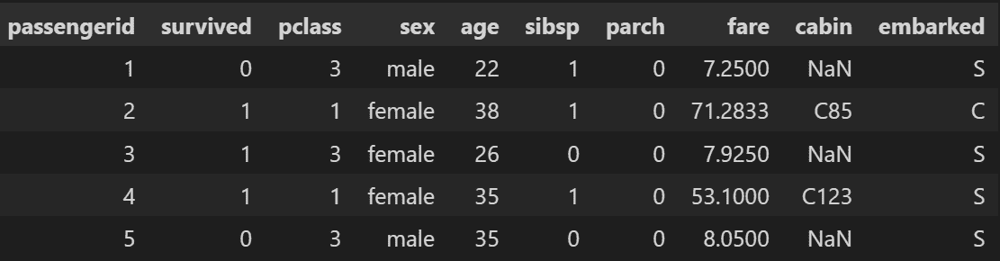

# 如何测试熊猫 ETL 数据管道

> 原文：<https://towardsdatascience.com/how-to-test-pandas-etl-data-pipeline-e49fb5dac4ce>

## *满怀期望地测试您的熊猫 ETL 数据管道*


照片由[seli̇m·阿尔达·埃尔伊尔马兹](https://unsplash.com/es/@selimarda?utm_source=medium&utm_medium=referral)在 [Unsplash](https://unsplash.com?utm_source=medium&utm_medium=referral) 上拍摄

# 介绍

构建强大的数据管道绝非易事。构建数据管道时出现的常见问题包括“我如何知道我的数据管道是否在做它应该做的事情？”以及“我能信任我的数据管道的输出吗？”。

这就是在我们的数据管道的输出上构建和执行测试有所帮助的时候。如果数据管道输出通过了一系列全面的测试，我们就可以相当有把握地认为数据管道正在按照预期的方式工作。一种常见的方法是对输出数据执行断言。然而，创建处理大量场景的断言是一项单调乏味的任务。在本文中，我们将通过一个例子来说明如何利用 python 的 Great Expectations [1]库及其现成的数据断言来执行这样的测试。

# 设置

以下设置用于该示例。

1.  虚拟代码
2.  python 3.9
3.  `pip install great_expectations==0.15.22`
4.  `pip install Pandas==1.4.3`
5.  数据集:泰坦尼克号[2]

# 例子

在本节中，我们将探索在 VSCode 中使用 Jupyter Notebook 创建期望和期望套件的基础。

**什么是期望？**

期望是对数据的断言。本质上，我们是在检查数据是否是我们所期望的。这里有一些期望的例子。

```
expect_column_values_to_be_not_nullexpect_column_values_to_be_uniqueexpect_column_values_to_match_regexexpect_column_median_to_be_betweenexpect_table_row_count_to_be_between
```

期望的名字很好地描述了期望的作用。伟大的期望伴随着丰富的现成期望。您还可以通过创建[自定义期望](https://docs.greatexpectations.io/docs/guides/expectations/creating_custom_expectations/overview/)来扩展 Great Expectation 的功能。

**什么是期望套件？**

期望套件仅仅是期望的集合。

# 浏览数据

`**File: explore.ipynb**`

我们将在下面的例子中使用 Titanic[2]数据集。让我们快速浏览一下数据集。我们有两组数据—训练和测试。

```
#explore.ipynbimport pandas as pddf_train = pd.read_csv('path/to/data/titanic-train.csv')
df_train.head()
```


作者图片

```
df_train.info()
```



作者图片

```
df_test = pd.read_csv('path/to/data/titanic-test.csv')
df_test.head()
```


作者图片

`df_test`中的列与`df_train`相同，只是少了`Survived`列。

# 数据处理

`File: pipeline.py`

在本节中，我们执行简单的数据处理步骤。`pipeline.py`由两个函数`process_data`和`run_pipeline`组成。

```
#pipeline.py
import pandas as pddef process_data(df: pd.DataFrame) -> pd.DataFrame:

    df_output = (df
                 .drop(columns = ['Name', 'Ticket'])
                 .rename({i:i.lower() for i in df.columns.to_list()}, axis = 1)
                 .assign(age = lambda x: x.age.fillna(x.age.mean()).astype('int'))
                 )

    return df_outputdef run_pipeline(input_path: str, output_path: str, save = True) -> pd.DataFrame:

    df = pd.read_csv(input_path)
    df_processed = process_data(df)

    if save:
        df_processed.to_csv(output_path, index = False)

    return df_processed
```

`process_data`执行以下数据处理步骤:

1.  删除`Name`和`Ticket`列
2.  小写所有列名
3.  用平均值填充缺失的`Age`列

`run_pipeline`将数据读入 Pandas 数据帧，在数据帧上调用`process_data`并返回处理后的数据帧。



作者图片

# 创造期望和套件

`File: create_expectations.ipynb`

在本笔记本中，我们创建了期望和期望套件来验证我们管道的输出。提出一套全面的检查是一个反复的过程。它需要对数据和领域的理解。首先，尝试执行探索性数据分析，并与领域专家交流，以了解数据是如何收集的，数据字段的含义以及如何利用数据管道的输出。

主要目标是:( a)检查数据管道是否正确处理了数据;( b)确定是否存在任何明显的数据质量问题。

创建的期望将验证是否:

1.  存在指定的列
2.  `age`列中有空值
3.  `passengerid`列中的值不同
4.  如果`gender`栏中有除“男性”和“女性”以外的其他值

**导入库**

```
import great_expectations as ge
import pandas as pd
import json
import pipeline
```

**运行管道**

```
input_path = 'path/to/data/titanic-train.csv'
output_path = 'path/to/data/titanic-train-processed.csv'df = pipeline.run_pipeline(input_path, output_path)
gdf = ge.from_pandas(df)
```

`df`包含已处理的数据帧，并被转换为`great_expectations.dataset.pandas_dataset.PandasDataset`，允许将远大前程方法应用于熊猫数据帧。下图显示了数据帧处理后的结果。

```
gdf.head()
```

**创造期望**

让我们使用`expect_table_columns_to_match_set`方法验证表输入表列名是否正确。我们提供预期的列名，并检查数据帧中的列名是否与我们提供的相匹配。

```
expected_columns = \\
    ['passengerid', 'survived', 'pclass', 'sex', 'age', 'sibsp', 'parch', 'fare', 'cabin', 'embarked']
gdf.expect_table_columns_to_match_set(column_set = expected_columns)
```

运行上面的代码会返回下面的输出。`"success":true`表示测试已通过。

```
# output
{
  "exception_info": {
    "raised_exception": false,
    "exception_traceback": null,
    "exception_message": null
  },
  "result": {
    "observed_value": [
      "passengerid",
      "survived",
      "pclass",
      "sex",
      "age",
      "sibsp",
      "parch",
      "fare",
      "cabin",
      "embarked"
    ]
  },
  "meta": {},
  "success": true
}
```

由于我们已经在数据处理步骤中进行了插补，`age`列不应包含任何空值。我们可以使用`expect_column_values_to_not_be_null`来验证这一点。

```
gdf.expect_column_values_to_not_be_null(column = 'age')#output
{
  "exception_info": {
    "raised_exception": false,
    "exception_traceback": null,
    "exception_message": null
  },
  "result": {
    "element_count": 891,
    "unexpected_count": 0,
    "unexpected_percent": 0.0,
    "unexpected_percent_total": 0.0,
    "partial_unexpected_list": []
  },
  "meta": {},
  "success": true
}
```

`passengerid`列包含每个乘客的唯一标识符。由于数据集中的每一行都代表单个乘客的信息，所以不应该有重复的`passengerid`。我们可以用`expect_column_values_to_be_unique`方法来验证这一点。

```
gdf.expect_column_values_to_be_unique(column = 'passengerid')#output
{
  "exception_info": {
    "raised_exception": false,
    "exception_traceback": null,
    "exception_message": null
  },
  "result": {
    "element_count": 891,
    "missing_count": 0,
    "missing_percent": 0.0,
    "unexpected_count": 0,
    "unexpected_percent": 0.0,
    "unexpected_percent_total": 0.0,
    "unexpected_percent_nonmissing": 0.0,
    "partial_unexpected_list": []
  },
  "meta": {},
  "success": true
}
```

我们可以通过使用`expect_column_values_to_be_in_set`方法来验证一个列是否包含正确的值集。在这种情况下，`sex`列中的值只能是“男性”或“女性”。

```
gdf.expect_column_values_to_be_in_set(column = 'sex', value_set=['male', 'female']){
  "exception_info": {
    "raised_exception": false,
    "exception_traceback": null,
    "exception_message": null
  },
  "result": {
    "element_count": 891,
    "missing_count": 0,
    "missing_percent": 0.0,
    "unexpected_count": 0,
    "unexpected_percent": 0.0,
    "unexpected_percent_total": 0.0,
    "unexpected_percent_nonmissing": 0.0,
    "partial_unexpected_list": []
  },
  "meta": {},
  "success": true
}
```

**创建期望套件**

我们可以从上面的个人期望中创建一个期望套件。一个期望套件仅仅是一个期望的集合，这些期望被一起用来验证一个数据集。

```
expectation_suite = gdf.get_expectation_suite(discard_failed_expectations=False)
```

默认情况下`get_expectation_suite`只返回`success: true`的期望值。将`discard_failed_expectations`设置为`False`，以返回所有期望值。期望套件是一个字典，包含我们之前创建的 4 个期望的配置。

```
# expectation_suite{
  "ge_cloud_id": null,
  "expectation_suite_name": "default",
  "expectations": [
    {
      "expectation_type": "expect_column_values_to_be_unique",
      "kwargs": {
        "column": "passengerid"
      },
      "meta": {}
    },
    {
      "expectation_type": "expect_column_values_to_be_in_set",
      "kwargs": {
        "column": "sex",
        "value_set": [
          "male",
          "female"
        ]
      },
      "meta": {}
    },
    {
      "expectation_type": "expect_table_columns_to_match_set",
      "kwargs": {
        "column_set": [
          "passengerid",
          "survived",
          "pclass",
          "sex",
          "age",
          "sibsp",
          "parch",
          "fare",
          "cabin",
          "embarked"
        ]
      },
      "meta": {}
    },
    {
      "expectation_type": "expect_column_values_to_not_be_null",
      "kwargs": {
        "column": "age"
      },
      "meta": {}
    }
  ],
  "meta": {
    "great_expectations_version": "0.15.22"
  },
  "data_asset_type": "Dataset"
}
```

期望套件可以保存为一个 JSON 文件。

```
with open( "my_expectation_file.json", "w") as my_file:
    my_file.write(
        json.dumps(expectation_suite.to_json_dict())
    )
```

现在我们已经创建了一个期望套件，让我们来看看如何使用期望套件来测试新的未知数据的数据管道。

# 验证数据

`File: validate_expectations.ipynb`

在这本笔记本中，我们展示了如何验证新数据集是否满足预定义的预期。我们将通过数据管道(`pipeline.py`)传递新数据，并根据我们之前创建的期望套件来验证数据输出。

**导入库**

```
import great_expectations as ge
import pandas as pd
import json
import pipeline
```

让我们把新的数据通过和以前一样的数据处理管道。

```
input_path = 'path/to/data/titanic-test.csv'
output_path = 'path/to/data/titanic-test-processed.csv'df = pipeline.run_pipeline(input_path, output_path)
gdf = ge.from_pandas(df)
```

我们创建两个函数来(a)加载期望套件和(b)根据期望套件验证数据。

```
def load_expectation_suite(path: str) -> dict:
    """Load expectation suite stored in JSON format
    and convert into dictionary. Args:
        path (str): path to expectation suite json file Returns:
        dict: expectation suite
    """ with open(path, 'r') as f:
        expectation_suite = json.load(f) return expectation_suitedef great_expectation_validation(df: pd.DataFrame,
                                 expectation_suite_path: str) -> dict:
    """Run validation on DataFrame based on expecation suite Args:
        df (pd.DataFrame): DataFrame to validate
        expectation_suite_path (str): path to expectation suite json file Returns:
        dict: Validation result
    """ expectation_suite = load_expectation_suite(expectation_suite_path)
    gdf = ge.from_pandas(df, expectation_suite=expectation_suite)
    validation_results = gdf.validate(result_format = 'SUMMARY', catch_exceptions = True) return validation_results
```

运行`great_expectation_validation`函数获取验证结果。

```
validation_result = \\
    great_expectation_validation(df = df_processed, 
                                 expectation_suite_path = 'my_expectation_file.json')
```

`validation_result`是字典的形式。总体验证结果可在此处找到:

```
validation_result['success']# output:
# False
```

`Fasle`表示期望套件中至少有一个期望失败。`True`表示数据通过了预期套件中的所有测试。

通过和未通过期望的汇总统计数据可在此处找到:

```
validation_result['statistics']# output:
# {'evaluated_expectations': 4,
# 'successful_expectations': 3,
# 'unsuccessful_expectations': 1,
# 'success_percent': 75.0}
```

我们评估了 4 个期望，其中一个失败了。要查看哪些期望失败:

```
for r in validation_result['results']:
    if not(r['success']):
        print (f"failed: {r['expectation_config']['expectation_type']}")
    else:
        print (f"success: {r['expectation_config']['expectation_type']}")# output:
# failed: expect_table_columns_to_match_set
# success: expect_column_values_to_be_unique
# success: expect_column_values_to_not_be_null
# success: expect_column_values_to_be_in_set
```

由于`survived`列丢失，我们未能通过`expect_table_columns_to_match_set`。

```
{
  "result": {
    "observed_value": [
      "age",
      "cabin",
      "embarked",
      "fare",
      "parch",
      "passengerid",
      "pclass",
      "sex",
      "sibsp"
    ],
    "details": {
      "mismatched": {
        "missing": [
          **"survived"**
        ]
      }
    }
  },
  "exception_info": {
    "raised_exception": false,
    "exception_message": null,
    "exception_traceback": null
  },
  "meta": {},
  "success": false
}
```

# 结论

为您的数据管道创建一套全面的测试有助于确保管道按预期工作。在本文中，我们演示了如何在 Great Expectations 中使用开箱即用的期望来测试您的 Pandas ETL 数据管道。

[加入 Medium](https://medium.com/@edwin.tan/membership) 阅读更多这样的故事！

# 参考

[1]https://greatexpectations.io/

[2] [泰坦尼克号数据集](https://www.openml.org/search?type=data&sort=runs&id=40945&status=active)。作者:小弗兰克·哈勒尔，托马斯·卡森。许可证:公共