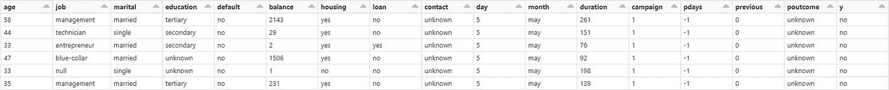

# 如何测试 PySpark ETL 数据管道

> 原文：<https://towardsdatascience.com/how-to-test-pyspark-etl-data-pipeline-1c5a6ab6a04b>

## 满怀期望地验证大数据管道


在 [Unsplash](https://unsplash.com?utm_source=medium&utm_medium=referral) 上由 [Erlend Ekseth](https://unsplash.com/@er1end?utm_source=medium&utm_medium=referral) 拍摄的照片

# 介绍

Garbage in garbage out 是一个常用的表达方式，用于强调数据质量对于机器学习、数据分析和商业智能等任务的重要性。随着创建和存储的数据量不断增加，构建高质量的数据管道变得前所未有的具有挑战性。

PySpark 是为大型数据集构建 ETL 管道的常用工具。构建数据管道时出现的一个常见问题是“我们如何知道我们的数据管道正在以预期的方式转换数据？”。为了回答这个问题，我们从软件开发范例中借用了单元测试的思想。单元测试的目的是通过使用测试来检查输出是否符合预期，从而验证代码的每个组件是否按预期执行。以类似的方式，我们可以通过编写一个测试来检查输出数据，从而验证我们的数据管道是否如预期的那样工作。

# 例子

在本节中，我们将通过一个例子来说明如何利用 Great Expectation 来验证您的 PySpark 数据管道。

# 设置

此示例使用以下设置:

1.  PySpark
2.  远大前程==0.15.34
3.  数据砖笔记本

我们将在 Databricks 社区版中使用 Databricks 笔记本。但是，您可以自由使用任何集成开发环境和云或本地 spark 集群。

# 数据

我们使用的是 UCI 银行营销数据集[2]，其中包含一家葡萄牙银行的直接营销活动信息。这是数据的样子。



图片作者。

理解数据对于为 PySpark 数据管道创建全面的测试至关重要。数据质量方面的常见考虑因素包括但不限于:

*   完全
*   一致性
*   正确性
*   独特性

上述每一项的可接受质量在很大程度上取决于上下文和用例。

# 创造期望

在本节中，我们探索并创建预期，这些预期将在后面的部分中用于测试新的未知数据。

那么什么是期望呢？期望是对数据的断言。顾名思义，我们正在验证数据是否是我们所期望的。对常见数据质量检查的[预定义期望](https://greatexpectations.io/expectations/)带来了巨大的期望。下面是一些预定义期望的例子。

```
expect_column_values_to_be_not_null
expect_column_values_tpytho_be_unique
expect_column_values_to_match_regex
expect_column_median_to_be_between
expect_table_row_count_to_be_between
```

这些期望的名字很好地描述了期望的表现。如果预定义的期望不符合您的需求，远大期望还允许您创建[自定义期望](https://docs.greatexpectations.io/docs/guides/expectations/creating_custom_expectations)。

**进口**

```
import great_expectations as ge
from great_expectations.dataset.sparkdf_dataset import SparkDFDataset
from pyspark.sql import functions as f, Window
import json
```

**加载数据**

我们从 csv 文件加载数据，并对数据集执行一些处理步骤:

*   将`job`栏中的“未知”值更改为“空”
*   创建一个“id”列，其中包含每行的唯一标识符

```
df = \\
  spark\\
  .read\\
  .format('csv')\\
  .option('header', True)\\
  .load('/FileStore/tables/bank_full.csv', sep = ';')\\
  .withColumn('job', f.when(f.col('job') == 'unknown', f.lit(None)).otherwise(f.col('job')))\\
  .withColumn('id', f.monotonically_increasing_id())
```

`SparkDFDataset`是 PySpark 数据帧的一个薄薄的包装器，它允许我们在 Pyspark 数据帧上使用大期望方法。

```
gdf = SparkDFDataset(df)
```

**检查列名**

让我们通过向`expect_table_columns_to_match_set`方法提供预期列的列表来验证 DataFrame 是否包含正确的列集。

```
expected_columns = ['age', 'job', 'marital',
                    'education', 'default', 'balance',
                    'housing', 'loan', 'contact',
                    'day', 'month', 'duration',
                    'campaign', 'pdays', 'previous',
                    'poutcome', 'y']
```

```
gdf.expect_table_columns_to_match_set(column_set = expected_columns)
```

运行上面的代码会返回下面的输出。`"success":true`表示测试已通过。

```
# output
{
  "result": {
    "observed_value": [
      "age",
      "job",
      "marital",
      "education",
      "default",
      "balance",
      "housing",
      "loan",
      "contact",
      "day",
      "month",
      "duration",
      "campaign",
      "pdays",
      "previous",
      "poutcome",
      "y"
    ]
  },
  "exception_info": {
    "raised_exception": false,
    "exception_traceback": null,
    "exception_message": null
  },
  "meta": {},
  "success": true
}
```

**检查分类栏中的值**

我们可以使用`expect_column_values_to_be_in_set`方法检查分类列是否包含意外数据。我们期望`marital`列只包含以下值`single`、`married`和`divorced`。

```
gdf.expect_column_values_to_be_in_set(column = 'marital', value_set = {'single', 'married', 'divorced'})
```

如果`marital`列包含任何在值集中找不到的值，Great Expectation 将无法通过检查。

```
# output
{
  "result": {
    "element_count": 45211,
    "missing_count": 0,
    "missing_percent": 0.0,
    "unexpected_count": 0,
    "unexpected_percent": 0.0,
    "unexpected_percent_total": 0.0,
    "unexpected_percent_nonmissing": 0.0,
    "partial_unexpected_list": []
  },
  "exception_info": {
    "raised_exception": false,
    "exception_traceback": null,
    "exception_message": null
  },
  "meta": {},
  "success": true
}
```

**检查列不包含空值**

如果我们希望列不包含任何空值，我们可以使用`expect_column_values_to_not_be_null`方法并在参数中指定感兴趣的列。

```
gdf.expect_column_values_to_not_be_null(column = 'job')
```

在这种情况下，`job`列检查失败，因为该列中有空值。

```
{
  "result": {
    "element_count": 45211,
    "unexpected_count": 288,
    "unexpected_percent": 0.6370131162770122,
    "unexpected_percent_total": 0.6370131162770122,
    "partial_unexpected_list": [
      null,
      null,
      null,
      null,
      null,
      null,
      null,
      null,
      null,
      null,
      null,
      null,
      null,
      null,
      null,
      null,
      null,
      null,
      null,
      null
    ]
  },
  "exception_info": {
    "raised_exception": false,
    "exception_traceback": null,
    "exception_message": null
  },
  "meta": {},
  "success": false
}
```

**检查**列的唯一性

Great Expectation 还提供了开箱即用的方法来检查给定列中的值是否唯一。让我们检查一下`id`列是否包含唯一值。

```
gdf.expect_column_values_to_be_unique('id')
```

正如我们所料，该列包含唯一的值。

```
# output
{
  "result": {
    "element_count": 45211,
    "missing_count": 0,
    "missing_percent": 0.0,
    "unexpected_count": 0,
    "unexpected_percent": 0.0,
    "unexpected_percent_total": 0.0,
    "unexpected_percent_nonmissing": 0.0,
    "partial_unexpected_list": []
  },
  "exception_info": {
    "raised_exception": false,
    "exception_traceback": null,
    "exception_message": null
  },
  "meta": {},
  "success": true
}
```

# 创建期望套件

既然我们已经创建了各种期望，我们可以将它们放在一个期望套件中。

```
expectation_suite = gdf.get_expectation_suite(discard_failed_expectations=False)
```

期望只不过是期望的集合。

```
#expectation_suite
{
  "expectations": [
    {
      "kwargs": {
        "column_set": [
          "age",
          "job",
          "marital",
          "education",
          "default",
          "balance",
          "housing",
          "loan",
          "contact",
          "day",
          "month",
          "duration",
          "campaign",
          "pdays",
          "previous",
          "poutcome",
          "y"
        ]
      },
      "expectation_type": "expect_table_columns_to_match_set",
      "meta": {}
    },
    {
      "kwargs": {
        "column": "marital",
        "value_set": [
          "married",
          "divorced",
          "single"
        ]
      },
      "expectation_type": "expect_column_values_to_be_in_set",
      "meta": {}
    },
    {
      "kwargs": {
        "column": "job"
      },
      "expectation_type": "expect_column_values_to_not_be_null",
      "meta": {}
    },
    {
      "kwargs": {
        "column": "id"
      },
      "expectation_type": "expect_column_values_to_be_unique",
      "meta": {}
    }
  ],
  "data_asset_type": "Dataset",
  "meta": {
    "great_expectations_version": "0.15.34"
  },
  "expectation_suite_name": "default",
  "ge_cloud_id": null
}
```

让我们以 JSON 格式保存期望套件。

```
# save expectation suite
with open('my_expectation_suite.json', 'w') as my_file:
    my_file.write(
        json.dumps(expectation_suite.to_json_dict())
    )
```

# 运行期望套件

假设我们有一组新的数据，它需要检查。我们使用之前保存的 expect suite 对新笔记本中的未知数据执行数据质量检查。

**进口**

```
import great_expectations as ge
from great_expectations.dataset.sparkdf_dataset import SparkDFDataset
import pyspark
from pyspark.sql import functions as f, Window
import json
```

**加载数据**

```
df = \\
  spark\\
  .read\\
  .format('csv')\\
  .option('header', True)\\
  .load('/FileStore/tables/bank_full_new.csv', sep = ';')\\
  .withColumn('job', f.when(f.col('job') == 'unknown', f.lit(None)).otherwise(f.col('job')))\\
  .withColumn('id', f.monotonically_increasing_id())
```

我们创建两个函数来(a)加载期望套件和(b)根据期望套件验证数据。

```
def load_expectation_suite(path: str) -> dict:
    """Load expectation suite stored in JSON format
    and convert into dictionary.
    Args:
        path (str): path to expectation suite json file
    Returns:
        dict: expectation suite
    """
    with open(path, 'r') as f:
        expectation_suite = json.load(f)
    return expectation_suite

def great_expectation_validation(df: pyspark.sql.DataFrame,
                                 expectation_suite_path: str) -> dict:
    """Run validation on DataFrame based on expecation suite
    Args:
        df (pyspark.sql.DataFrame): DataFrame to validate
        expectation_suite_path (str): path to expectation suite json file
    Returns:
        dict: Validation result
    """
    expectation_suite = load_expectation_suite(expectation_suite_path)
    gdf = SparkDFDataset(df)
    validation_results = gdf.validate(expectation_suite = expectation_suite, result_format = 'SUMMARY', catch_exceptions = True)
    return validation_results
```

**运行验证**

```
validation_result = \\
    great_expectation_validation(df = df, 
                                 expectation_suite_path = 'my_expectation_suite.json')
```

**执行检查**

`False`表示验证失败，因为我们在期望套件中至少有一个期望失败。

```
validation_result['success']

# output:
# False
```

巨大的期望也显示了成功和失败测试的数量。

```
validation_result['statistics']

#output:
#{'evaluated_expectations': 4,
# 'successful_expectations': 2,
# 'unsuccessful_expectations': 2,
# 'success_percent': 50.0}
```

# 结论

在本文中，我们讨论了测试数据管道的重要性，并通过一个例子说明了我们如何利用 Great Expectation 来创建一套全面的测试。

[加入 medium](https://medium.com/@edwin.tan/membership) 阅读更多这样的文章！

# 参考

[1] [远大前程首页远大前程](https://greatexpectations.io/)

[2] `Moro,S., Rita,P. & Cortez,P.. (2012). Bank Marketing. UCI Machine Learning Repository.` CC 乘 4.0。