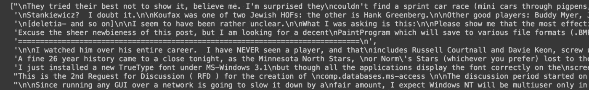
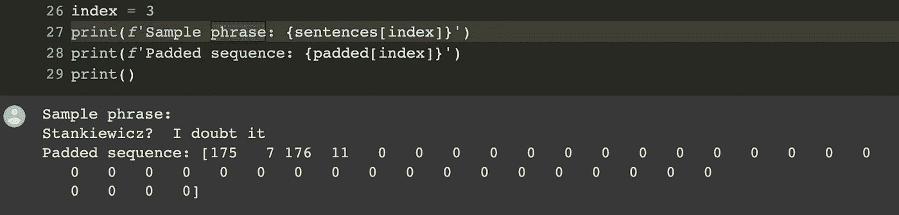

# 如何在 Tensorflow 中标记文本和填充序列

> 原文：<https://towardsdatascience.com/how-to-tokenize-and-pad-sequences-in-tensorflow-fcbbf2e8b3b5>

## *用于标记化和填充文本序列的现成模板*

由 [Bradyn Trollip](https://unsplash.com/es/@bradyn?utm_source=unsplash&utm_medium=referral&utm_content=creditCopyText) 在 [Unsplash](https://unsplash.com/s/visual/862f3a1f-89c2-45c9-b19e-39c58a023ad2?utm_source=unsplash&utm_medium=referral&utm_content=creditCopyText) 上拍摄的照片

在本文中，我们将了解如何提取填充并将其应用于令牌序列，以使用 Tensorflow 训练深度学习模型。

我在之前的一篇文章中已经谈到了这个主题，我在那里谈到了[如何将文本转换为深度学习任务的张量](https://medium.com/mlearning-ai/convert-texts-into-tensors-for-deep-learning-74b0cf48d416)，但在这种情况下，重点将是如何正确格式化 Tensorflow 的令牌序列。

这种方法对于为我们的模型提供统一长度的序列(事实上是填充的)令牌序列是必不可少的。让我们看看怎么做。

# 数据集

我们将使用 Sklearn 提供的数据集 *20newsgroups* ，快速访问大量文本数据。出于演示的目的，我将只使用 10 个文本的样本，但该示例可以扩展到任何数量的文本。

数据集的示例。图片作者。

我们不会对这些文本应用预处理，因为 Tensorflow 标记化过程会自动为我们删除标点符号。

# 什么是标记化？

标记化意味着把一个句子简化成构成它的符号。所以如果我们有一个像*这样的句子，“嗨，我叫安德鲁。”*它的标记化版本将只是["Hello "，" my "，" name "，" is "，" Andrew "，]. "].注意，默认情况下，标记化包括标点符号。

应用标记化是将我们的单词转换为机器学习模型可以处理的数值的第一步。

通常，应用*就足够了。split()* 在 Python 中对一个字符串执行简单的标记化。但是，有几种标记化方法可以应用。Tensorflow 为此提供了一个非常有趣的 API，允许您定制这种逻辑。我们很快就会看到。

# 什么是填充？

一旦句子被标记化，Tensorflow 将返回与每个标记相关联的数值。这个通常叫做 *word_index* ，是一个由 word 和 index 组成的字典，{word: index}。每个遇到的单词都有编号，该编号用于识别该单词。

**深度学习模型通常需要统一大小的输入**。这意味着不同长度的句子对我们的模型来说是有问题的。这就是填充发挥作用的地方。

我们来看两个句子及其索引序列(不包括标点符号):

*   嗨，我叫安德鲁:[43，3，56，6]
*   嗨，我是一名分析师，我在深度学习项目中使用 tensor flow:[43，11，9，34，2，22，15，4，5，8，19，10，26，27]

第一个(4 个元素)比第二个(14 个元素)短。如果我们以这种方式将序列输入到我们的模型中，会给我们带来一些误差。**因此，序列必须被标准化，以使它们具有相同的长度**。

对一个序列应用填充意味着使用一个预定义的数值(通常为 0) **使较短的序列达到与最大长度**的序列相同的长度。所以我们会有这个:

*   嗨，我叫安德鲁:[0，0，0，0，0，0，0，0，0，0，43，3，56，6]
*   嗨，我是一名分析师，我在深度学习项目中使用 tensor flow:[43，11，9，34，2，22，15，4，5，8，19，10，26，27]

现在两个序列长度相同。我们可以决定如何填充——是在序列之前还是之后插入零，直接使用 Tensorflow 的 *pad_sequences* 方法。

# 应用标记化和填充

现在，让我们在从数据语料库中提取句子后，将标记化和填充下面的代码应用于数据语料库。

应用于示例短语的标记化和填充。图片作者。

注意，代码中有 *post* 作为填充模式。这意味着在序列之后插入零，因此在标记值之后而不是之前拉伸向量。

以下是如何将标记化和填充应用于文本，以将其传递给 Tensorflow 上的神经网络。如果您有任何问题或顾虑，请留下评论，我一定会跟进。

下次见！👋