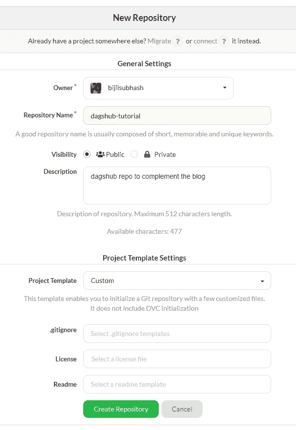
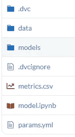
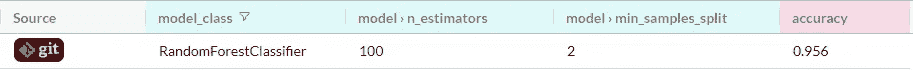
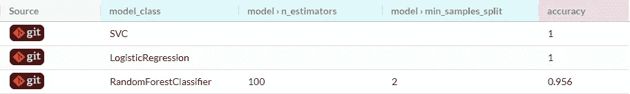

# 如何使用 DagsHub 跟踪机器学习实验

> 原文：<https://towardsdatascience.com/how-to-track-machine-learning-experiments-using-dagshub-6c3032f96232>

## 关于使用 DagsHub 通过实验跟踪增强机器学习模型训练管道的教程


资料来源:联合国人类住区规划署(斯科特·格雷厄姆)

# 目录

1.  动机
2.  我们如何跟踪机器学习实验？
3.  辅导的
4.  最后的想法

# 1.动机

所有的机器学习问题都是独特的。这就是为什么在建立机器学习模型时，没有一刀切的解决方案。

建立机器学习模型是一个耗时的过程，通常需要数百次迭代(实验)。每个实验都涉及筛选多个数据预处理步骤、模型架构和超参数调整，以期找到满足预期结果的理想配置。

如果你生活在一个不用担心花费在计算上的时间和金钱的世界，那么这就不是一个值得解决的问题。但这是不正确的，需要找到优化模型开发流程的方法。

一个显而易见的解决方案，一个在许多数据驱动的组织中实践的方案，是在适当的地方放置系统来跟踪实验。通过跟踪不同的配置及其结果，我们可以:

*   设计更好的实验，由以前实验的见解驱动
*   通过跟踪具有理想性能的配置来提高可重复性

在我们有在线学习的情况下，我们可以使用实验跟踪管道来捕捉来自概念漂移的模型退化的早期发作，允许我们将模型更好地推广到实时数据。

可以跟踪机器学习实验的系统的最终好处是提高生产率。

# 2.我们如何跟踪机器学习实验？

这里一个简单的解决方案是制作一个电子表格，并用它来跟踪实验。我可以想出许多原因来解释为什么这是低效的，主要是因为手动跟踪数百个参数很麻烦，用户很可能会出错和感到沮丧。

另一种选择是使用 Github，因为它毕竟是为版本控制而设计的。但是 Github 对于存储大量数据并不友好。这里的一个解决方法是使用 Git 大型文件系统(LFS)，但即使这样也显示出不是管理大数据的可行解决方案。我们可以使用数据版本控制(DVC)，这是一个 Python 库，有助于在 git 之外无缝存储数据和模型文件，同时保留几乎相同的用户体验，就好像它们存储在 git 中一样。然而，这需要设置云服务来存储数据，需要开发运维方面的大量专业知识。

如果我们可以使用一个平台，通过类似 Git 的命令行体验来实现这一切，那该有多好。

输入 DagsHub。

> DagsHub 是一个基于开源工具的 web 平台，针对数据科学进行了优化，面向开源社区。——[dagshub.com/about](https://dagshub.com/about)

换句话说，DagsHub 有一些[工具](https://dagshub.com/docs/)，如果你是一名数据科学家或机器学习实践者，它们可以让你的生活变得简单。深入研究每个 DagsHub 功能超出了本文的范围。我更感兴趣的是演示我们如何使用 DagsHub 来记录和可视化实验。更具体地说，这个博客旨在作为一个实践教程，补充 DagsHub [文档](https://dagshub.com/docs/reference/discovering_experiments/)，专注于如何通过实验跟踪优化机器学习模型构建管道。

# 3.辅导的

在本教程中，我们将使用 DagsHub logger 进行跟踪实验。这里的工作流程假设您对 git 和 sklearn 有基本的了解。我们将从 3.1 节和 3.2 节中的一些基本要求开始，然后在 3.3 节中演示如何使用 DagsHub 进行实验跟踪。

## 3.1 文件管理系统

使用 DagsHub 不需要特定的文件管理系统。我这样做只是为了创建一些连贯的东西，以便在整篇文章中容易理解。这样一来，让我们进入文件管理系统的结构，我们将在本文的其余部分使用它。

```
ª   model.ipynb
ª   
+---data
ª       
+---models
ª
```

在工作目录中，我们有 *model.ipynb* ，它具有生成不同模型的功能(稍后将详细介绍)。除此之外，我们在工作目录中还有两个文件夹，分别名为*数据*和*模型*。在*数据*中，我们将拥有将要使用的数据集，并且我们的*模型*文件夹是一个占位符，用于保存我们将在每次实验运行期间创建的各种模型的 pickle 文件。

## 3.2 实验管道

在本节中，我们将构建一个函数，它可以为我们的实验生成不同的模型。我们将使用的数据集是[鸢尾数据集](https://www.kaggle.com/datasets/uciml/iris)，该数据集根据物理特征将条目分类为三类鸢尾植物中的一类。下面显示的是我在实验管道中使用的函数。

上面的代码分为三个部分。

依赖项正在导入运行该函数所需的 Python 包。

```
import pandas as pd
import dagshub
from sklearn.model_selection import train_test_split
from sklearn.ensemble import RandomForestClassifier
from sklearn.linear_model import LogisticRegression
from sklearn import svm
from sklearn.metrics import accuracy_score
import pickle
```

记录模型参数的函数几乎没有活动部件。

首先使用 Pandas 读取数据，然后将数据集分割成各自的要素和标注。

```
#reading the data    
df = pd.read_csv('data\iris.csv')    
#splitting in features and labels    
X  = df[['SepalLengthCm','SepalWidthCm','PetalLengthCm']]    
y = df['Species']
```

然后数据集被分成训练和测试数据，其中总数据的 30%用于使用 [sklearn 的 test_train_split](https://scikit-learn.org/stable/modules/generated/sklearn.model_selection.train_test_split.html) 进行测试。

```
#test train split    
X_train, X_test, y_train, y_test = train_test_split(X, y, test_size=0.3, shuffle=True, random_state=42)
```

接下来，我们介绍 DagsHub 记录器，用于记录模型超参数和度量。在训练集上调用模型拟合函数，并使用 Python *pickle* 模块保存到 *models* 文件夹中。

```
#model defnition        
model = model_type(random_state=42)        
#log the model parameters        logger.log_hyperparams(model_class=type(model).__name__)        logger.log_hyperparams({'model': model.get_params()})        #training the model        
model.fit(X_train, y_train)
y_pred = rfc.predict(X_test)        
#log the model's performances        logger.log_metrics({f'accuracy':round(accuracy_score(y_test, y_pred),3)})        
#saving the model        
file_name = model_type.__name__ + '_model.sav'        pickle.dump(model, open('models/'+ file_name, 'wb'))
```

我们可以使用下面的命令调用这个函数。

```
#running an experiment
model_run(RandomForestClassifier)
```

如果一切正常，我们应该有 *metrics.csv* 、 *params.yml* 和一个*。在*型号*文件夹中保存*文件。下面是要验证的文件结构。

```
ª   model.ipynb
ª   metrics.csv
ª   params.yml
ª   
+---data
ª       iris.csv
ª       
+---models
ª       RandomForestClassifier_model.sav
```

## 3.3 使用 DagsHub 记录器进行实验跟踪

在我们开始将文件推送到 DagsHub 之前，我们需要对 DagsHub 上的文件跟踪方式有一些基本的了解。DagsHub 使用 git 和数据版本控制(DVC)来跟踪文件。DVC 允许我们在 DVC 远程存储中存储大量数据和模型。使用轻量级*跟踪存储在 DVC 远程存储器上的数据和模型。存储在 GitHub 中的 dvc* 文件。换句话说，*。dvc* 文件保存了与存储在 GitHub 之外的数据和模型相对应的元数据。通过使用 DagsHub，我们可以存储这两个*。dvc* 文件，以及相关的数据和模型放在一个地方。

DagsHub 的操作与 Github 非常相似，也就是说，您可以使用命令行来管理 DagsHub repo。在我们开始将文件推送到 DagsHub 之前，我们需要设置一个远程存储库，并在我们的工作文件夹中初始化 git 和 DVC。

要设置 DagsHub 存储库，请在 DagsHub [仪表板](https://dagshub.com/dashboard)上点击位于右上角的 create。


图片来自[https://dagshub.com/dashboard](https://dagshub.com/dashboard)

按照第页的说明创建存储库。除了“存储库名称”之外，您可以将大多数字段留空。



图片来自[https://dagshub.com/repo/create](https://dagshub.com/repo/create)

一旦建立了远程存储库，我们可以使用下面的命令在工作目录中初始化 git。

```
git init
git remote add origin https://dagshub.com/bijilsubhash/dagshub-tutorial.git
```

假设您已经使用 pip 安装了 DVC，我们可以通过几个额外的步骤来初始化 DVC，将 DagsHub 配置为 DVC 远程存储。

```
pip install dvc
dvc init
dvc remote add origin https://dagshub.com/bijilsubhash/dagshub-tutorial.dvc
dvc remote modify origin --local auth basic
dvc remote modify origin --local user bijilsubhash
dvc remote modify origin --local password your_token
```

上面的步骤将创建 DVC 配置文件，出于实验跟踪的目的，必须使用 git 进行跟踪。

```
git add .dvc .dvcignore
git commit -m 'dvc initialized'
git push -u origin master
```

接下来，我们可以将与我们最近的实验相关的文件推送到 git。

```
git add metrics.csv params.yml
git commit -m 'RandomForestClassifier'
git push -u origin master
```

我们可以继续将模型和数据文件添加到 Dagshub 上的 DVC 远程存储中

```
dvc add 'data/iris.csv' 'models/RandomForestClassifier_model.sav'
dvc push -r origin
```

将文件添加到 DVC 后，您会注意到几个*。dvc* 文件和*。git ignore*数据*和*模型*文件夹中的*文件。你也必须把它们推到 git。*。我们推送到 git 的 dvc* 文件作为元数据，映射到存储在 dvc 远程存储中的相应数据和模型。

```
git add 'data\iris.csv.dvc' 'models\RandomForestClassifier_model.sav.dvc' 'models\.gitignore' 'data\.gitignore'
git commit -m '.dvc and .gitignore'
git push -u origin master
```

如果您转到 Dagshub，您会注意到所有文件都已更新，并且在存储库中可用。



从 https://dagshub.com/bijilsubhash/dagshub-tutorial[获得的图像](https://dagshub.com/bijilsubhash/dagshub-tutorial)

同时，你会注意到左上角有一个“实验”标签，这是我们使用随机森林分类器的第一个实验。每行对应一个实验，列通常是该实验的超参数、度量或元数据。



图片来自[https://dagshub . com/bijilsubhash/dagshub-tutorial/experiments](https://dagshub.com/bijilsubhash/dagshub-tutorial/experiments)

您可以运行的实验数量没有限制。为了本教程的简洁，我将运行两个以上的模型(逻辑回归和支持向量机)。

下面是在运行另外两个模型并将它们推送到 DagsHub 之后，我们的工作目录中的文件结构。

```
ª   model.ipynb
ª   .dvcignore
ª   metrics.csv
ª   params.yml
ª   
+---data
ª       iris.csv
ª       .gitignore
ª       iris.csv.dvc
ª       
+---models
ª       RandomForestClassifier_model.sav
ª       .gitignore
ª       RandomForestClassifier_model.sav.dvc
ª       LogisticRegression_model.sav
ª       LogisticRegression_model.sav.dvc
ª       SVC_model.sav
ª       SVC_model.sav.dvc
```

如你所见，我们还有两个*。sav* 文件以及相关联的*。用于逻辑回归和支持向量机模型的 dvc* 文件。

在存储库中，在“实验”选项卡下，我们还可以注意到最近实验的另外两个条目。



图片来自[https://dagshub . com/bijilsubhash/dagshub-tutorial/experiments](https://dagshub.com/bijilsubhash/dagshub-tutorial/experiments)

在“实验”选项卡中，您可以开始研究(可视化、比较、标记等。)每个实验的更多细节，但我会留给你自己去探索。这里有一个详细的[文档](https://dagshub.com/docs/reference/discovering_experiments/)的链接，它概述了你可以在“实验”标签中找到的各种特性的功能。

最后，这里是本教程中使用的 DagsHub 资源库的链接，供您参考-[https://dagshub.com/bijilsubhash/dagshub-tutorial](https://dagshub.com/bijilsubhash/dagshub-tutorial)

# 4.最后的想法

在本文中，您将了解到使用 DagsHub 通过 git 和 DVC 进行实验跟踪的想法。虽然我们只限于 3 个实验，只有一个数据预处理管道，但您可以轻松地将此工作流扩展到数百个实验，使用多个版本的数据，所有这些都使用 DagsHub 进行无缝管理，使其成为构建机器学习模型时协作和提高生产力的理想工具。你可能已经注意到了，我们不得不分别推送 git 和 DVC，这可能看起来重复且容易出错。为了避免这个问题，我们可以使用 [FastDS](https://dagshub.com/pages/fds) ，但是这是另一天的主题。