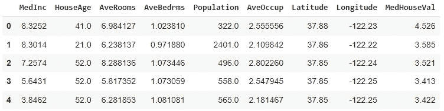
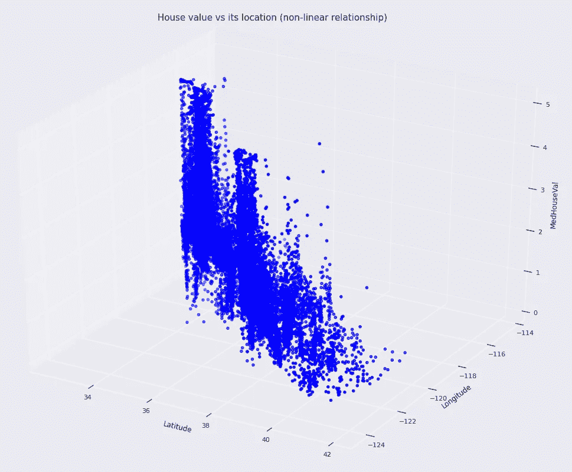
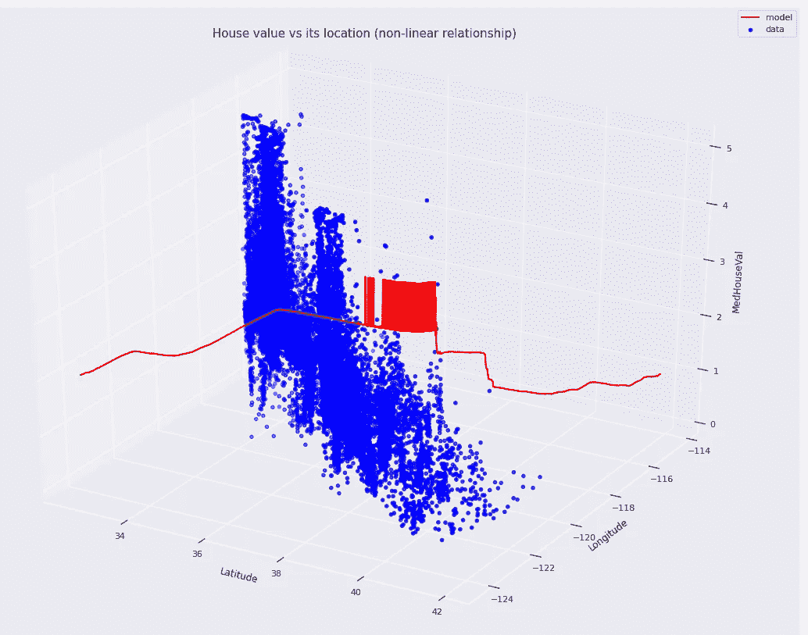
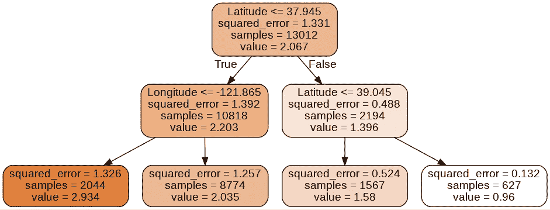
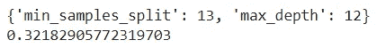
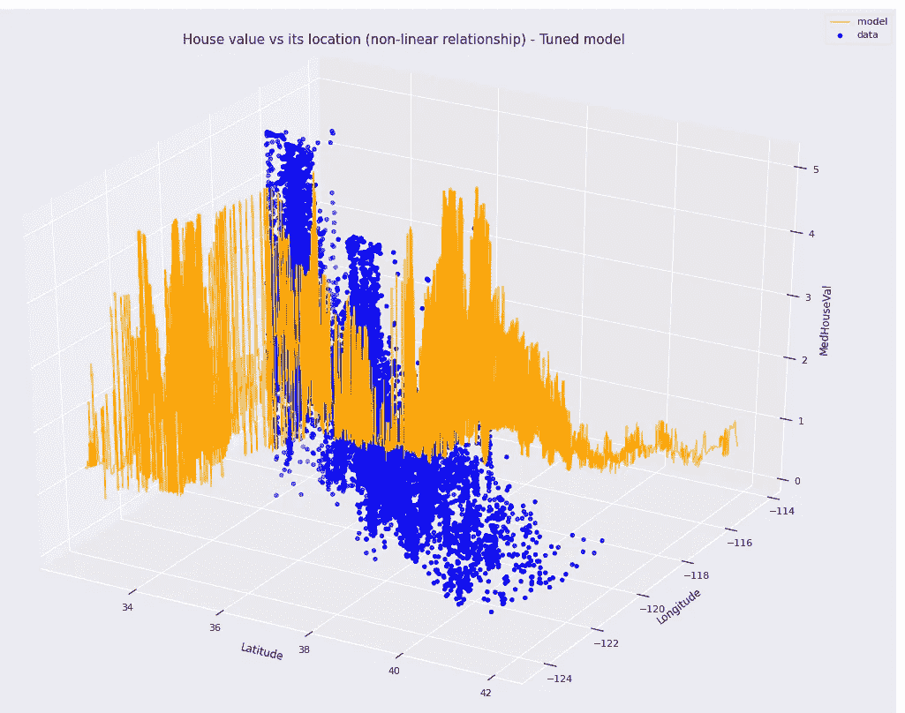
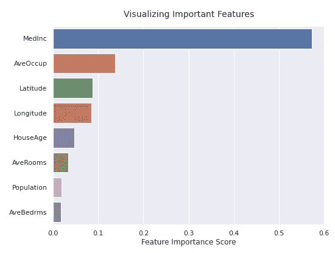

# 如何使用随机森林来定型回归模型

> 原文：<https://towardsdatascience.com/how-to-train-a-regression-model-using-a-random-forest-c1cf16288f6b>

## 对于复杂的非线性数据


图片来自 [Pixabay](https://pixabay.com/?utm_source=link-attribution&utm_medium=referral&utm_campaign=image&utm_content=1283976) 的[像素](https://pixabay.com/users/pexels-2286921/?utm_source=link-attribution&utm_medium=referral&utm_campaign=image&utm_content=1283976)

随机森林是一种监督机器学习算法，可用于回归和分类任务。快速回顾一下，回归模型预测连续值输出(例如价格、身高、平均收入)，而分类模型预测离散值输出(例如 0 级或 1 级，一种颜色-红、蓝、绿)。

随机森林是一种基于树的算法。它的基础学习器是决策树。因此，随机森林可以被视为决策树的集合(组)。以下是随机森林的一些优点。

*   随机森林对复杂的非线性数据建模非常有用。
*   使用随机森林时，我们不需要进行功能扩展。
*   它的设计是非参数化的，这意味着它只需要很少的数据假设。
*   正如我们前面所说的，它可以用于回归和分类任务。
*   我们可以很容易地想象随机森林中的单个决策树。阅读[这篇文章](/4-ways-to-visualize-individual-decision-trees-in-a-random-forest-7a9beda1d1b7)，看看如何做到这一点。
*   随机森林模型是一个白盒模型，这意味着我们可以很容易地解释它。通过使用树形图可视化单个树，我们可以很容易地显示模型如何获得特定类型的输出。
*   通过使用 RandomForestRegressor**feature _ importances _**属性可视化特性重要性，我们可以了解模型中最重要的特性。

我不打算解释随机森林的工作原理。今天，将更多地强调随机森林在建立回归模型中的实际应用。您将获得 Python 代码的实践经验。然而，如果你也想了解随机森林是如何在幕后工作的，你可以看看我写的下面这篇文章。也是今天帖子的先决条件。

[](/random-forests-an-ensemble-of-decision-trees-37a003084c6c) [## 随机森林——决策树的集合

### 这就是决策树组合成随机森林的方式

towardsdatascience.com](/random-forests-an-ensemble-of-decision-trees-37a003084c6c) 

# 关于我们使用的数据

我们将在流行的加州房价数据集上构建一个随机森林回归模型，该数据集包含从 1990 年美国人口普查中收集的数据。以下是数据集的一些有用细节。

*   **数据集来源:**你可以在这里下载数据集[。](https://www.kaggle.com/camnugent/california-housing-prices)
*   **数据集许可:**该数据集受 **CC0:公共领域**许可。你可以在这里找到关于那种执照[的更多信息。](https://creativecommons.org/publicdomain/zero/1.0/)
*   数据集参考: Pace，R. Kelley 和 Ronald Barry，稀疏空间自回归，统计和概率信，33(1997)291–297。
*   **数据集描述**:该数据集包含目标在内共 9 个变量。你可以在这里找到每个变量[的描述。](https://developers.google.com/machine-learning/crash-course/california-housing-data-description)

让我们看看整个数据集的概况。

```
import pandas as pddf = pd.read_csv('cali_housing.csv')
df.head()
```



**加州房价数据集的前几行**(图片由作者提供)

```
df.shape
```

这将返回(20640，9)。数据集有 20640 个观测值，包括目标在内共有 9 个变量。目标列是以$100，000 表示的“MedHouseVal”。

```
df.isnull().sum().sum()
```

这将返回 0。这意味着数据集中没有缺失值。

# 可视化我们的数据

并非数据集中的所有变量都用于我们的分析。我们很想知道房子的价值和它的位置之间的关系。房子的位置没有单一的变量。相反，我们使用数据集中的“纬度”和“经度”变量。它们标明了房屋的位置。房价是目标变量。我们使用“MedHouseVal”作为我们的目标变量。因此，我们的特征矩阵 X 包含“纬度”和“经度”变量的值，目标向量 Y 包含“MedHouseVal”变量的值。

```
X = df[['Latitude', 'Longitude']]
Y = df['MedHouseVal']
```

这个符号是机器学习用的。当我们可视化数据时，我们简单地将 3 个变量表示为 x、y 和 z。

```
x=df['Latitude']
y=df['Longitude']
z=df['MedHouseVal']
```

使用这三个变量，我们可以创建一个 3D 散点图，以查看房屋价值与其位置之间的关系。

**3D 散点图的 Python 代码**(等待加载)



**房屋价值与所在位置的关系**(图片由作者提供)

我们清楚地看到，这种关系是复杂的和非线性的。因此，随机森林对于建模这种类型的非线性关系非常有用。

# 构建基础模型

我们将首先创建 RandomForestRegressor()类的一个实例(模型),它在 Scikit-learn ensemble 子模块中可用。然后，我们用之前定义的 X 和 Y 来训练我们的模型。

在创建模型时，我们将为 RandomForestRegressor()类中最重要的超参数使用以下值。

*   **n_estimators=100** (集合中的树的数量)
*   **max_depth=2** (这定义了树的大小)
*   **min_samples_split=2**
*   **random_state=1**

有了这些价值观，我们就不能期待一个完美的模型。这是因为到目前为止我们还没有调优任何超参数。因此，上述值不是模型超参数的最佳值。这里，我们只创建一个基础模型，可以用来与调优后的模型进行比较(稍后会详细介绍)。

**基本 RandomForestRegressor 模型的 Python 代码**(等待加载)

# 可视化基础模型

让我们看看我们的模型是如何与数据相吻合的。

(等待加载代码)



**基模**(图片由作者提供)

正如你在散点图中看到的，我们的基本模型与数据不太吻合。这是因为我们还没有调整任何超参数。因此，有通过调整超参数来改进我们的模型的空间(稍后将详细介绍)。

# 想象森林中的一棵树

我们的基本随机森林包含 100 棵决策树(估计器)。我们可以使用下面的符号来访问每棵树。

```
rf.estimators_[index]
```

这里，索引是从零开始的。0 表示第一个决策树。

```
rf.estimators_[0] #First tree
```

现在，我们将可视化随机森林模型中的第一棵树。

**可视化随机森林中第一棵决策树的 Python 代码**(等待加载)



**随机森林中的第一棵决策树**(图片由作者提供)

因为我们已经使用了 **max_depth=2** ，树并不复杂。当您增加 **max_depth** 的值时，树将变得复杂，并且模型将倾向于过度拟合数据。

可视化这种类型的树的主要优点是我们可以用它来解释模型。换句话说，我们可以展示特定类型的输出是如何通过模型获得的。

# 调整模型的超参数

有几种用于调整机器学习模型的超参数的技术。在这里，我们使用一种叫做[随机搜索](/python-implementation-of-grid-search-and-random-search-for-hyperparameter-optimization-2d6a82ebf75c)和 [k 倍交叉验证](/k-fold-cross-validation-explained-in-plain-english-659e33c0bc0)的流行技术。

这里，我们考虑调整两个超参数。

*   **最大深度:**1–15(14 个不同的值)
*   **min _ samples _ split:**2–50**(48 个不同的值)**

我们的搜索空间是二维的。总共有 672 (14x48)种不同的超参数值组合。如果我们使用网格搜索进行超参数调优，则需要花费很多时间来完成执行过程。相反，我们使用随机搜索，只考虑随机选择的超参数组合的小样本。样本大小在 **n_iter** 中指定。这里我们用 **n_iter=10** 。

**超参数调整的 Python 代码**(等待加载)



**超参数的最佳值**(图片由作者提供)

# 使用最佳超参数值重建模型

让我们看看我们的模型是如何用最佳超参数值拟合数据的。为此，首先，我们需要构建相同的随机森林模型，但这次使用最佳超参数值。

**调优的 RandomForestRegressor 模型的 Python 代码**(等待加载)

# 可视化调整后的模型

现在，我们用调整后的模型创建散点图。

(等待加载代码)



**调模**(图片由作者提供)

正如您在散点图中看到的，这一次，我们调整后的模型与数据吻合得很好，也许可能过度拟合了！

# 可视化特征的重要性

在我们的分析中，我们没有使用加州房价数据集中的所有变量。由于我们对房屋位置如何影响房价感兴趣，因此我们在分析中只使用数据集中的“纬度”和“经度”变量。然而，数据集中的其他变量也会影响房价。

让我们看看我们在分析中使用的变量有多重要，以及其他变量的重要性。为此，我们通过在数据集中包含所有变量来再次创建随机森林模型。

**带所有变量的 RandomForestRegressor 模型的 Python 代码**(等待加载)

然后，我们将特征的重要性可视化。

**用于可视化随机森林模型特征重要性的 Python 代码**(等待加载)



**功能重要性**(图片由作者提供)

正如我们在条形图中看到的，我们之前选择的变量比其他一些变量更重要。然而，“MedInc”和“ave occupation”对模型最重要。意思是房子的价值受“MedInc”和“ave occupation”影响很大。因此，这两个变量也应该包含在我们的模型中。出于可视化的目的，我们只选择了两个特征(“纬度”和“经度”)进行分析。

# 摘要

我们获得的结果可能在以下因素上有很大差异。

*   **RandomForestRegressor()类的 random_state** 值
*   **随机状态**train _ test _ split()函数的值

基于我们为 **random_state** 、提供的值，最佳超参数值、RMSE 值、特征重要性可以显著变化。这是因为在创建树时以及在将数据集拆分为训练和测试拆分时所涉及的随机性。为 **random_state** 使用一个正整数值，以在不同的执行中获得静态结果。

今天的文章到此结束。如果你对此有任何疑问，请在评论区告诉我。我会尽快回答。

感谢阅读！

## 订阅我的电子邮件列表

订阅我的电子邮件列表，再也不会错过精彩的故事了。我一点击发布按钮，你就会在收件箱里收到每一篇文章。

[](https://rukshanpramoditha.medium.com/subscribe) [## 每当鲁克山·普拉莫迪塔发表文章时，就收到一封电子邮件。

### 每当鲁克山·普拉莫迪塔发表文章时，就收到一封电子邮件。通过注册，您将创建一个中等帐户，如果您没有…

rukshanpramoditha.medium.com](https://rukshanpramoditha.medium.com/subscribe) 

## 成为会员

如果你愿意的话，你可以注册成为会员，以获得我写的每一个故事的全部信息，我会收到你的一部分会员费。

[](https://rukshanpramoditha.medium.com/membership) [## 通过我的推荐链接加入 Medium

### 作为一个媒体会员，你的会员费的一部分会给你阅读的作家，你可以完全接触到每一个故事…

rukshanpramoditha.medium.com](https://rukshanpramoditha.medium.com/membership) 

下一篇文章再见！一如既往，祝大家学习愉快！

鲁克山·普拉莫蒂塔
2022–03–08