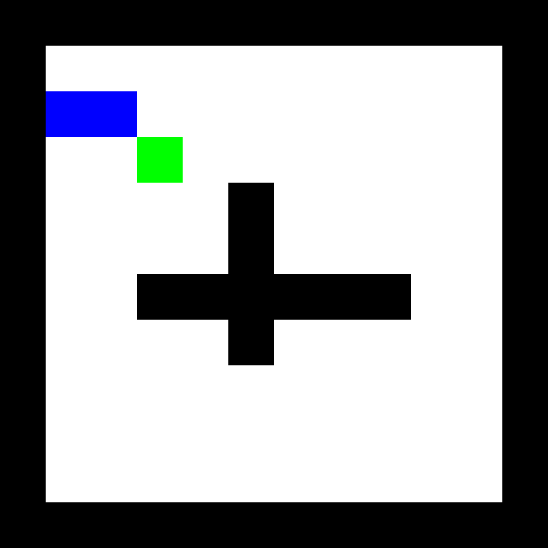
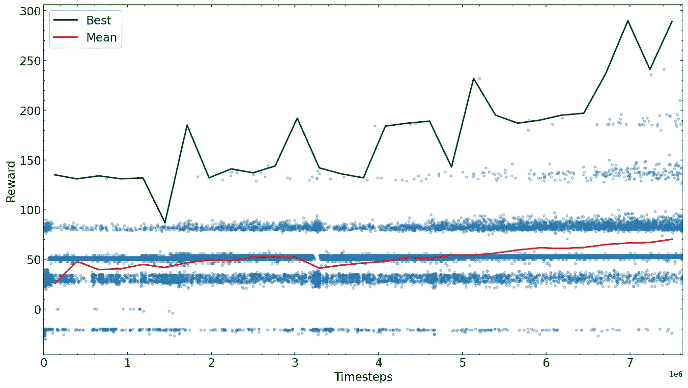

# 如何训练人工智能玩任何游戏

> 原文：<https://towardsdatascience.com/how-to-train-an-ai-to-play-any-game-f1489f3bc5c>

## 使用强化学习技术

> 这是一个关于如何使用强化学习训练人工智能玩任意视频游戏的简短指南。它一步一步地展示了如何设置您的自定义游戏环境，并利用[稳定基线 3](https://stable-baselines3.readthedocs.io/en/master/) 库来训练 AI。我想让这个指南易于访问，所以给出的代码没有完全优化。你可以在我的 [GitHub](https://github.com/guszejnovdavid/custom_game_reinforcement_learning/blob/main/custom_game_reinforcement_learning.ipynb) 上找到源码。

# 游戏人工智能的强化学习

不同于其*监督的*和*非监督的*对应物，强化学习(RL)不是关于我们的算法从静态数据集学习一些潜在的真理，而是与它的环境交互以最大化奖励函数(非常类似于动物在现实生活中如何用零食训练)。这使得 RL 可能是机器学习最有前途的领域之一，有望通过能够处理复杂任务(如驾驶汽车或控制机器人的运动)的人工智能来彻底改变我们的生活。RL 目前的一个应用是训练人工智能玩电脑游戏(参见 [DeepMind](https://deepmind.com/research) 中的一些例子)。

由于几个公开可用的强化学习包，现在即使是 Python 编程新手也可以为任意视频游戏训练 AI。然而，我们应该记住，随着游戏变得越来越复杂，训练所需的计算资源会迅速增加。在这个项目中，我们使用了[稳定基线 3](https://stable-baselines3.readthedocs.io/en/master/) ，这是一个标准化的库，它提供了基于 [PyTorch](https://pytorch.org/) 的 RL 算法的简单实现。

在开始本指南之前，您需要安装稳定基线 3 及其依赖项，详情请参见[官方安装指南](https://stable-baselines3.readthedocs.io/en/master/guide/install.html)。

# 设置我们的游戏环境

虽然稳定基线包有很多内置的游戏环境(例如，[雅达利游戏](https://medium.com/r?url=https%3A%2F%2Ftowardsdatascience.com%2Ftraining-rl-agents-in-stable-baselines3-is-easy-9d01be04c9db))，但本指南的目标是在任意游戏上训练 AI，例如我们自己设计的视频游戏。作为一个例子，我们将使用经典[蛇](https://en.wikipedia.org/wiki/Snake_(video_game_genre))的修改版本，我们在中间插入两个额外的墙壁。


我们的贪吃蛇游戏的初始设置；作者图片

因此，首先我们需要创建一个表示我们游戏的类，训练算法可以与之交互。我们可以通过 OpenAI Gym 基类`gym.env`的类继承来做到这一点。您可以在 [GitHub](https://github.com/guszejnovdavid/custom_game_reinforcement_learning/blob/main/custom_game_reinforcement_learning.ipynb) 上找到我们的 Snake 的详细代码，但是概括地说，自定义环境应该遵循以下格式:

```
class custom_game(gym.Env):
    def __init__(self, grid_size=12):
        """Define possible actions and observation data format"""
        ...
        self.action_space = ... #define possible actions
        self.observation_space = ... #format of observations def _get_obs(self):
        """Calculates the observations (input) from current state"""
        ...
        return observation #in format of self.observation_space def reset(self):
        """Resetting the environment (i.e., starting a new game)"""
        ....
        return self._get_obs()

    def step(self, action):
        """Evolve environment in response to action and calculate reward"""
        ...
        return  self._get_obs(), reward, done, info

    def render(self):
         """Optional, in case we want to render the current state"""
```

现在，让我们检查一下每个方法，并设置它们来玩我们的游戏。首先我们需要决定几件事:

*   玩家可能的动作有哪些(即`self.action_space`)？
*   我们如何为算法编码游戏的当前状态(即`self.observation_space`)？换句话说，玩家在玩游戏时“看到”了什么。
*   奖励方案是什么(即采取某项行动的`reward` 值)？

在接下来的部分，我们将详细讨论如何为我们的游戏设置这些。

## 行为空间

总的来说，我们应该努力使动作和观察空间尽可能的简单和小，这样可以大大加快训练的速度。对于贪吃蛇游戏，玩家每走一步，蛇只有三种选择:*直走*、*右转*和*左转*，我们可以用整数 0、1、2 来编码

```
self.action_space = spaces.Discrete(3)
```

## 了望处

对于观察，我们需要交流游戏的当前状态。一个简单的方法是将其表示为一个网格，其中每个像素的值表明它是*空*、*蛇*、*墙*还是*食物*。为了简单起见，在这个例子中我们将创建一个无符号整数网格(本质上是一张图片)，其中我们将每个像素的状态编码为 0: *空*，1: *蛇*，2: *墙*和 3: *食物*。然而，这个网格并没有向玩家提供游戏的完整状态，因为仅仅从一张图片来判断蛇的头部在哪里以及它往哪个方向走是不可能的。所以总的来说，我们的观察空间应该是这样的:

```
self.observation_space = gym.spaces.Dict(
            spaces={
                "position": gym.spaces.Box(low=0, high=(self.grid_size-1), shape=(2,), dtype=np.int32),
                "direction": gym.spaces.Box(low=-1, high=1, shape=(2,), dtype=np.int32),
                "grid": gym.spaces.Box(low = 0, high = 3, shape = (self.grid_size, self.grid_size), dtype=np.uint8),
            })
```

我们用两个 2D 向量来编码蛇的头部位置和它当前的方向。为了简单起见，我们将它们存储在一个字典中(`“position”`代表蛇头，`“direction”`代表蛇头，`“grid”` 代表玩家在屏幕上看到的图片)。注意，一般来说，更有效的是进一步编码观察空间，使得它由单个向量或矩阵来表示。最后我们设置了`_get_obs()`来将游戏的当前状态转换成上面的格式。

## 奖励计划

> 也许任何 RL 实践中最关键也是最不简单的部分就是设计一个好的奖励方案。选择一个“好”的方案会使训练速度加快很多，而选择一个“坏”的方案会阻止算法学会正确地玩游戏。

对于我们的贪吃蛇游戏，我们基本上期望我们的 AI 做两件事:1)吃食物 2)避免撞到墙壁或自身。

我们试试下面这个方案:吃东西 50 分，每走一步没撞墙没撞到蛇尾巴加 1 分。我们还定义了避免无限博弈的最大步骤数。在这种情况下，我们的 RL 算法将快速收敛到下面的解决方案。



因采取奖励措施而不碰壁而产生的解决方案；作者图片

如你所见，算法陷入了局部奖励最大值。一个更好的奖励方案是只奖励更接近食物的步骤。这里必须小心，因为蛇仍然只能学会绕圈，在接近食物时获得奖励，然后转身再回来。为了避免这种情况，我们还必须对远离食物的行为给予等价的惩罚，换句话说，我们需要确保闭环上的净回报为零。我们还需要引入对撞墙的惩罚，因为有些情况下，蛇只能通过撞墙来接近食物，我们不想奖励这种情况。

# 超参数

大多数 RL 算法相当复杂并且难以实现。幸运的是，稳定基线 3 已经实现了几个我们可以使用的最先进的算法。在这个具体的例子中，我们将使用[近似策略优化或简称 PPO](https://stable-baselines3.readthedocs.io/en/master/modules/ppo.html) 。虽然我们不需要知道算法如何工作的细节(如果感兴趣，请参见这个[解释视频](https://www.youtube.com/watch?v=5P7I-xPq8u8))，但我们需要对它的超参数是什么以及它们做什么有一个基本的了解。幸运的是，PPO 只有其中的几个(参见[这篇文章](https://medium.com/aureliantactics/ppo-hyperparameters-and-ranges-6fc2d29bccbe)中的完整指南)，我们将使用以下内容:

*   `learning_rate`:设置策略更新的步长，[与其他 RL 方案](https://en.wikipedia.org/wiki/Q-learning#Learning_rate)相同。将其设置得太高会阻止您的算法找到正确的解决方案，甚至会将策略推向永远无法恢复的方向。把它设置得太低没有这样的风险，但是它使训练花费更长的时间。一个常见的技巧是在训练期间使用调度器功能来调整它(例如，从高开始并减少)。
*   `gamma`:未来奖励的[折扣系数](https://en.wikipedia.org/wiki/Q-learning#Discount_factor)，介于 0(仅与即时奖励相关)和 1(未来奖励与即时奖励价值相同)之间。为了鼓励代理学习长期策略，最好将其保持在 0.9 以上。
*   `clip_range`:PPO 的一个重要特性，粗略地说，它设定了当我们更新我们的政策时，一个行动的概率不能改变超过一个因子`1+-clip_range`。这是为了确保我们不会在训练步骤之间戏剧性地改变政策。减少它有助于在以后的训练阶段对模型进行微调。
*   `ent_coef`:熵系数对过于确定的政策不利。本质上，它的值越高，就越鼓励算法探索不同的、非最优的行动，这可以帮助方案脱离局部回报最大值。

一般来说，从默认的超参数开始是值得的，因为这些参数被选择为适合大多数任务。有时将学习率设置为随着训练进度而降低是一个好主意，这样我们就可以看到较低的学习率是否可以防止停滞。此外，由于没有明确的方法来为任意问题(例如，定制游戏)设置这些参数，我们需要进行实验。幸运的是，stable-baselines3 允许我们在训练方法中添加回调函数，以评估训练中的模型并保存最佳模型(参见`[Monitor](https://stable-baselines3.readthedocs.io/en/master/common/monitor.html)`和`[EvalCallback](https://stable-baselines3.readthedocs.io/en/master/guide/callbacks.html?highlight=EvalCallback#evalcallback)`)。

# 培养

接下来的步骤是为一些预先确定的`N`步骤进行训练，然后亲眼看看算法是如何运行的，然后从性能最好的参数中重新开始潜在的新参数。我们在这里绘制了不同训练时间的奖励，要获得更高级的反馈，您可以使用 [TensorBoard](https://www.tensorflow.org/tensorboard) 。总的来说，我们希望游戏结束时的总奖励随着我们训练模型而增加。

以下是我在这个项目中发现的一些可能有帮助的观察结果:

*   很难估计一个问题需要多少个训练步骤，所以首先检查一下增加更多的训练步骤是否会提高回报是值得的。
*   制作一部关于人工智能如何玩游戏的电影是值得的，这样你就可以看到它设法学习了什么策略，你可以用它来调整奖励计划(例如，在我们的情况下，我们如何需要停止奖励步骤以避免无限循环)。
*   如果奖励最初增加，然后随着训练步数的增加而逐渐减少，那么`learning_rate` 很有可能过高。
*   奖励也可能停滞不前，这通常是算法陷入局部最大值的迹象。在我们的蛇问题中，当食物在墙的另一边，蛇靠近墙，然后无限期地停留在那里，因为远离食物会受到惩罚。在这些情况下，临时增加`ent_coef`允许算法探索并摆脱这个局部最大值。



初始训练阶段的奖励值；作者图片

经过足够多的步骤后，我们训练的算法收敛到某个奖励值。我们可以结束训练或者尝试微调参数，继续训练。请注意，达到最大可能奖励所需的训练步骤数量很大程度上取决于您的问题、奖励方案和超参数，因此在训练前花一些时间优化它们总是一个好主意。对于我们的例子，当人工智能变得相当擅长在迷宫中导航时，我们停止训练。


训练有素的 AI 玩蛇。它学会了寻找食物，学会了如何“摆动”以避免与自己相撞。它还需要学会避免困住自己，撞到尾巴。图片作者。

如果你有兴趣为你自己的游戏训练一个 AI，你可以修改我在这个例子中使用的代码( [GitHub](https://github.com/guszejnovdavid/custom_game_reinforcement_learning/blob/main/custom_game_reinforcement_learning.ipynb) )。