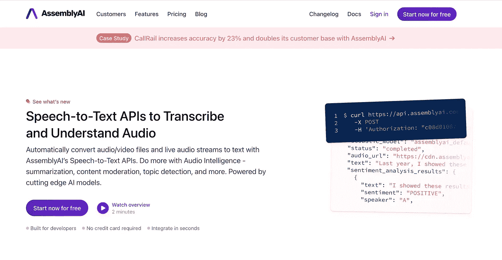
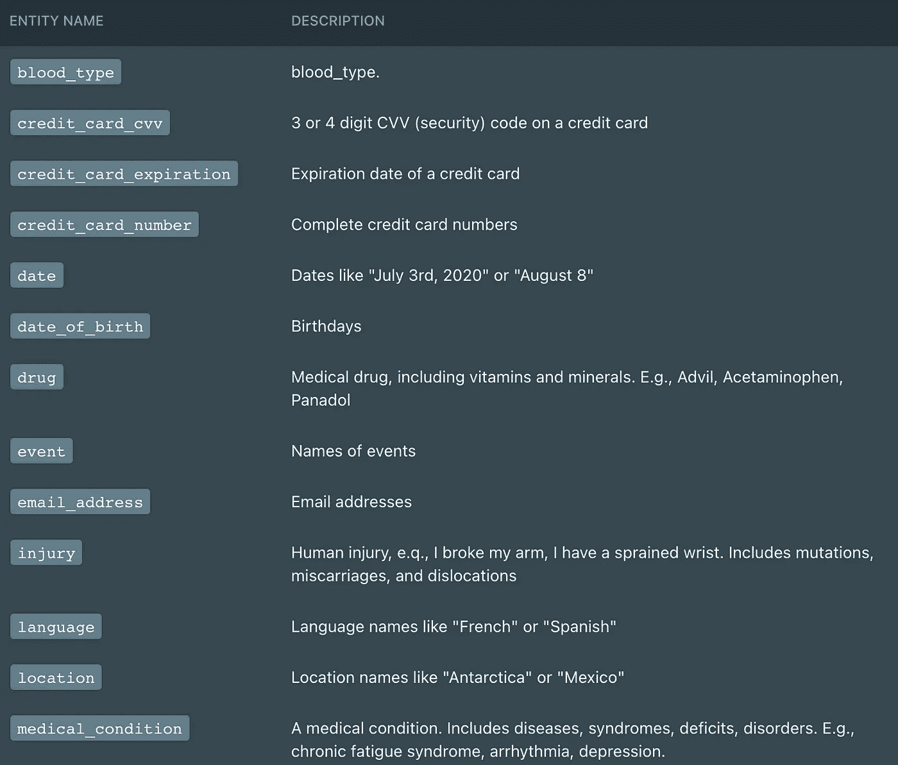
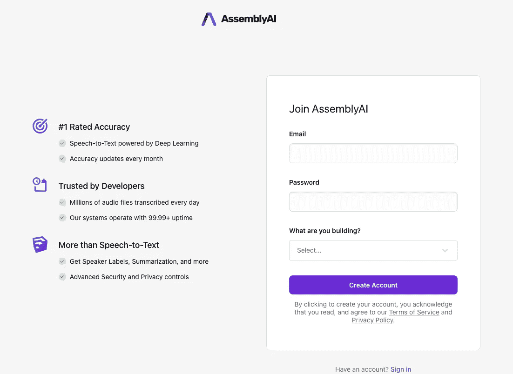
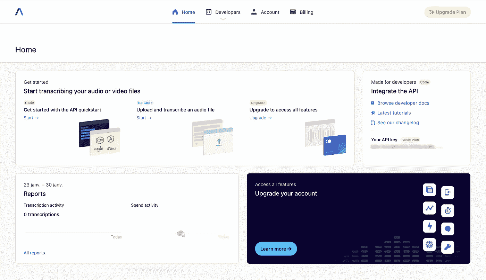
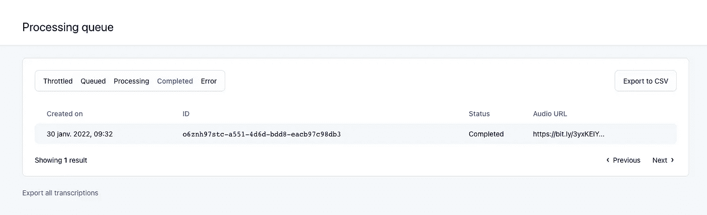
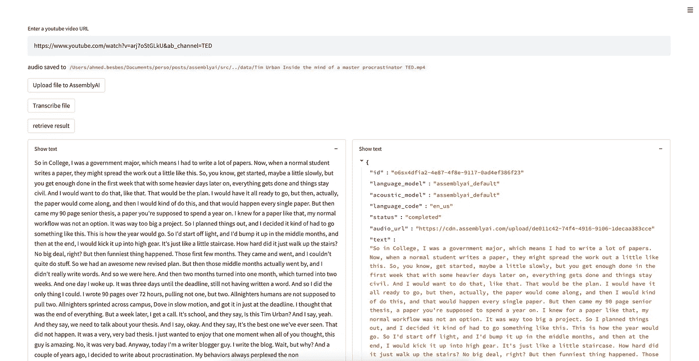

# 如何用 Python 和 AssemblyAI 转录和分析音频文件

> 原文：<https://towardsdatascience.com/how-to-transcribe-and-analyze-audio-files-with-python-and-assemblyai-22660dbf8e66>

# 如何用 Python 和 AssemblyAI 转录和分析音频文件

## 演示:将 Youtube 视频转换成摘要文本


詹姆斯·柯文在 [Unsplash](https://unsplash.com?utm_source=medium&utm_medium=referral) 上的照片

在从事机器学习项目时，我从未真正有机会试验音频文件。我唯一一次这样做是在一些 mp3 歌曲上尝试了 DeepSpeech 模式。

坦率地说，我对结果感到失望，并继续前进。

几周前，我开始了一个小型的个人项目，涉及语音到文本的部分。我需要尽快整合它，鉴于我在语音处理领域的经验有限，我没有时间训练一个模型。为此，我决定转向使用 API。

在对不同的解决方案进行基准测试时，我最终选择了 AssemblyAI。

> ***在这篇文章中，我将向你介绍 AssemblyAI，它做什么，它包含哪些核心功能，以及为什么我认为它是语音到文本的强大解决方案。
> 然后，我将向您展示一个简单的用例，其中我们将 AssemblyAI 集成到一个 Streamit 应用程序中，以转录 Youtube 视频。***

事不宜迟，我们来看看。🔍

# 1-什么是 AssemblyAI，它解决什么问题？

训练一个强大的语音到文本模型不仅仅是强大的资源和几天的训练。这是一项技术任务，除了深度学习之外，还结合了语言学和信号处理的精细知识。

如果你曾经在机器学习项目中处理过音频文件，你可能知道语音数据非常复杂:声音可能被破坏，可能有背景音乐或噪音，音量可能很低，多种声音可能会干扰，人们可能经常使用听不见的话语，如“嗯，嗯，嗯，嗯，嗯”或多次停止说话。有点烦人，不是吗？

将这些数据转录成有意义的文本并非易事。

[**AssemblyAI**](https://www.assemblyai.com/) 是一家致力于解决语音转文本问题的深度学习公司。它提供了最先进的语音转文本 API，具有接近人类的性能。



作者截图

该 API 既可以通过处理队列中的作业来异步调用，也可以通过在接收文件时直接转录文件来实时使用。

为了应对上述与语音相关的挑战，AssemblyAI 在核心转录引擎中包含了许多功能。你可以通过这个[链接](https://docs.assemblyai.com/core-transcription)查看。

以下是我个人觉得非常有用的一些功能。

*   **说话者二分化:**这是一种分离多个说话者的声音并给每个人赋予不同标签的能力。举个例子，你转录两个人之间的访谈，会有一个说话人 A 和一个说话人 B，每个人都会有对应的转录。
*   **双通道转录:**这是一个允许单独转录每个通道的功能。这在记录电话对话或缩放通话时非常有用。
*   **自定义词汇:**语音转文本模型虽然功能强大，但有时可能无法正确转录某些单词(首字母缩写词、名称或特定领域/技术术语)。为了解决这个问题，AssembyAI 包含了对自定义词汇表的支持。你只需要传递一个单词列表，模型就会在预测时将它们考虑在内。

除了很好地转录音频文件，AssemblyAI 还提供了一套基于人工智能的工具来更好地理解你的数据。通过在 HTTP 查询中切换布尔标志，您可以选择添加以下一个或多个功能:

*   **话题检测:**利用这一功能，AssemblyAI 能够提取音频中所谈到的关键话题。有 698 个不同的主题遵循 IAB 标准分类法。
    分类如下:

*   **情感分析:**这是在句子层面上执行的分类任务。它以一定的置信度预测正面、负面或中性。
*   **自动章节:**该功能提取时间编码的关键时刻，并为每个关键时刻生成摘要。这个功能非常有趣，可以突出演讲或视频中的重要部分。
*   **实体检测:**这是一个命名实体识别任务。AssemblyAI 不仅仅预测非常普通的*人*、*位置和组织*实体。它更进了一步，为其他实体提供支持，如信用卡号、药品或医疗条件。
    这是所有检测到的实体的完整列表。



检测到的实体列表—作者截屏

如果您有兴趣了解更多关于这些*音频智能功能*的信息，请查看此[链接](https://docs.assemblyai.com/audio-intelligence)。

# 2 —如何使用 AssemblyAI 转录音频文件？

在这一节中，我们将看到如何轻松地使用 AssemblyAI API 异步转录音频文件。我们将在另一个时间研究实时转录。

**→设置环境**

如果你是一名 Python 开发人员，我想你很可能是，开始使用 AssemblyAI 所需要做的就是简单地安装`requests`和`python-dotenv`库。

*   以 pythonic 的方式处理 HTTP 请求
*   `python_dotenv`允许你从。环境文件。将凭证从代码中分离出来通常是个好主意，这也是我们为什么要使用这个包的原因。

```
**pip install requests
pip install python-dotenv**
```

**→创建一个 AssemblyAI 账户**

若要开始使用 AssemblyAI，您必须创建一个帐户。你可以免费注册[，甚至不需要输入你的信用卡信息。免费计划提供每月 3 小时的使用限制和 5 小时的并发限制。查看此](https://app.assemblyai.com/signup)[链接](https://www.assemblyai.com/pricing)以了解有关 AssemblyAI 定价的更多信息。



作者截图

一旦你的帐户被创建，你将得到一个 API 令牌。**此令牌完全是个人的，不应与任何人共享。**



作者截图

我将在下面的代码中展示如何使用环境变量隐藏这个个人令牌。

**→开始使用 API 转录音频文件** assembly ai API 可以转录可通过 URL 访问的音频或视频文件。

如果你有一些音频文件，你想转录，有两种选择:

1-你上传你的数据到云上的某个地方(AWS S3，GCP 云存储，Azure Blob 存储，等等),并提供 URL 给 AssemblyAI。

一旦有了音频文件的 URL，转录请求就相当于一个 HTTP Post 请求，具有以下参数:

*   转录 API **端点**
*   一个 **JSON 有效负载**来提供音频 URL
*   一个**报头有效载荷**包括 API 密钥和`content-type`

在本例中，我们将转录以下音频文件:

用代码总结我们刚刚说过的内容:

下面是运行代码后获得的 JSON 响应。

在其他有用的参数中，它指示对应于该特定运行的转录`id`和指示处理队列状态的`status`键。

状态从`queued`开始，然后移动`processing`，最后移动`completed`。

您可以随时从[界面](https://app.assemblyai.com/processing-queue)查看加工队列。



用户截图

处理完成后，获取转录 id 并运行以下查询:

现在，您应该得到以下输出:

输出模式非常明确。以下是您应该关注的内容:

*   `text`键代表转录的文本
*   `words`键代表转录单词列表。这个列表的每个元素都是一个 JSON 对象，它包含转录单词的文本、相应的开始和结束时间(以毫秒为单位)以及预测的概率(也称为*置信度*得分)
*   `confidence`(在 0 和 1 之间)键表示算法在转录完整音频文件时的全局置信度

还有一些我们暂时忽略的参数。

**2 —你直接上传你的数据到 AssemblyAI 服务器并运行转录**

现在第二个选择:你的文件不在云上。

AssemblyAI 为您提供了在处理音频或视频文件之前将它们直接上传到服务器的可能性。这在用户在提交之前从麦克风录制音频文件的情况下非常方便。

要上传一个文件，推荐的方法是首先将它分成每个 5MB 的块，并将这些块放入一个生成器中，该生成器将作为数据有效负载传递给查询。

文件上传后，您将获得上传文件的 URL。

使用这个 URL，您可以按照上一节中的详细说明进行转录。

# 3-用例:将 Youtube 视频转换成经过分析的转录

在这一节中，我将向您展示如何将 AssemblyAI 嵌入到 Streamlit 应用程序中。



作者截图

*   首先，你必须建立你的环境。我将使用 pipenv 安装以下包:**请求**、 **streamlit** 、 **pytube、python-dotenv、**和**验证器。**

```
**cd assemblyai/
pipenv install requests streamlit pytube python-dotenv validators**
```

*   使用`API_KEY`键在项目文件夹中创建一个. env 文件:

```
**API_KEY=<YOU API KEY GOES HERE>**
```

*   我们从导入正确的包开始:

*   我们定义了一个从 Youtube URL 下载音频的函数:

*   我们定义了四个函数:一个读取音频文件，一个上传到 AssemblyAI，一个提交转录作业，一个获取转录输出。

*   最后，Streamlit 应用程序逻辑:

不要被这段代码吓到，它所做的如下:

*   它接收来自用户的 URL 输入，并在用 validators 库验证其模式时，pytube 模块下载音频文件并返回其路径
*   我们定义了三个按钮:第一个按钮触发对 AssemblyAI 的上传，将 upload_url 打印到屏幕上，并将其置于会话状态
*   第二个按钮提交转录作业，获取转录 id，并将其保存在会话状态中
*   第三个按钮根据转录 id 检索结果，并将其打印到屏幕上。

如果你有兴趣在本地运行这个应用，代码可以在我的 [repo](https://github.com/ahmedbesbes/assemblyai) 上找到。我会不断更新应用程序，所以不要犹豫，在未来检查它。

# 资源

文档和博客是了解 AssemblyAI 的最佳资源。看看他们！

*   https://www.assemblyai.com/
*   【https://docs.assemblyai.com/#introduction 
*   [https://www.assemblyai.com/blog](https://www.assemblyai.com/blog)

# 感谢阅读🙏

如果你已经做到这一步，我想感谢你的时间，并希望你已经了解了一些关于 AssemblyAI 的事情。

在接下来的帖子中，我们将更多地使用音频智能功能，并解决一些实际的用例。

今天就这些了。下次见！👋

# 新到中？您可以每月订阅 5 美元，并解锁各种主题的无限文章(技术、设计、创业……)您可以通过点击我的推荐[链接](https://ahmedbesbes.medium.com/membership)支持我

[](https://ahmedbesbes.medium.com/membership) [## 加入我的介绍链接媒体-艾哈迈德贝斯

### 作为一个媒体会员，你的会员费的一部分会给你阅读的作家，你可以完全接触到每一个故事…

ahmedbesbes.medium.com](https://ahmedbesbes.medium.com/membership) 

照片由[卡斯滕·怀恩吉尔特](https://unsplash.com/@karsten116?utm_source=medium&utm_medium=referral)在 [Unsplash](https://unsplash.com?utm_source=medium&utm_medium=referral) 上拍摄