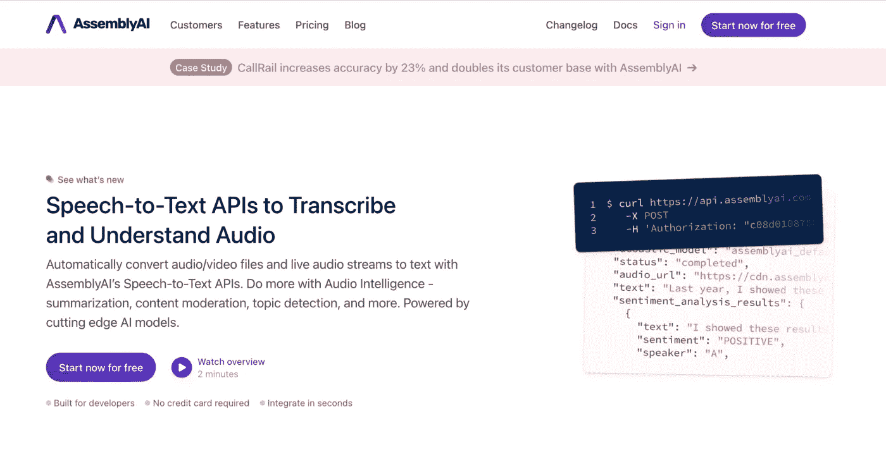

# 如何用 Python 实时转录音频数据流

> 原文：<https://towardsdatascience.com/how-to-transcribe-streams-of-audio-data-in-real-time-with-python-and-assemblyai-322da8b5b7c9>

## 一个开启全新应用世界的功能


由 [Unsplash](https://unsplash.com?utm_source=medium&utm_medium=referral) 上的 [Soundtrap](https://unsplash.com/@soundtrap?utm_source=medium&utm_medium=referral) 拍摄的照片

在我以前的博客文章中，我使用了 AssemblyAI 语音转文本 API。

我尝试了它的核心[转录](/how-to-transcribe-and-analyze-audio-files-with-python-and-assemblyai-22660dbf8e66)服务，并玩了一些很酷的人工智能功能:发现敏感话题的[内容审核](/how-to-moderate-audio-data-using-python-and-assemblyai-a5eab9910730)功能和提取每个音频片段中谈论的主题的[话题检测](/how-to-build-a-streamlit-app-to-extract-topics-from-youtube-videos-9c7aebbfab8e)功能。(我构建了一个 Streamlit 应用程序来展示最后一个功能如何应用于分析 Youtube 视频。你可以在这里查看[。该代码也可在](https://share.streamlit.io/ahmedbesbes/assemblyai/main/app.py) [Github](https://github.com/ahmedbesbes/assemblyai) 上获得。)

这些实验都是离线执行的，需要一些时间来生成输出。事实上，一旦您将音频文件发送到 AssemblyAI，转录作业就会提交到一个队列，一旦队列完成处理，您就可以检索转录本。就像那样，你必须等待。

但是，如果你能在 AssemblyAI 摄取你的音频数据**的同时转录它，会怎么样呢？**

这就是我们所说的**实时转录。**

> T ***他的帖子将带你了解使用 AssemblyAI 进行实时转录的过程。我们将首先用正确的依赖项设置环境，然后我们将在 Python 中创建异步函数来与 AssemblyAI 的 WebSocket 服务器通信。***

好的，让我们看看👀

# 👉设置您的帐户

实时转录是一项付费功能。为了能够使用它，你必须在 AssemblyAI 上创建一个账户并输入你的信用卡信息。



作者截图

你可以在这里了解更多关于定价的信息。

一旦你的帐户配置完毕，拿起你的 API 密匙，进入下一部分。

# 👉安装一些依赖项

因为我们要进行实时转录，所以我们需要从麦克风捕捉现场音频流，并立即将它们传递给 API。

首先，我们需要安装 PortAudio，这是一个跨平台、开源的音频 I/O 库，它为录制和/或播放声音提供了一个非常简单的 API。

如果你在 Mac OS 上，你可以使用[家酿](https://brew.sh/)软件包管理器来安装它

```
**brew install portaudio**
```

如果你使用的是不同的操作系统，你可能需要检查这个[链接](http://files.portaudio.com/download.html)。

然后，您需要安装为 PortAudio 提供绑定的 [PyAudio](http://people.csail.mit.edu/hubert/pyaudio/) Python 库。

```
**pip install pyaudio**
```

最后，您需要安装允许构建 websockets 服务器和客户端的 web sockets 库:这将帮助我们将音频流式传输到 AssemblyAI 并捕获实时转录。

```
**pip install websockets**
```

# 👉用 PyAudio 打开音频流

为了能够将音频流式传输到 AssemblyAI，我们首先需要用 PyAudio 打开一个音频流。

创建流需要一些参数:

*   每个缓冲区的帧数 **(3200)** 。缓冲区是任意数量的帧的块，用于将原始信号分成更小的片段。
*   音频格式: **(16 位)。**这代表每个样本的大小，即每个帧的大小。2 字节= 16 位，因此这大致说明了每个样本是如何编码的。
*   通道数: **(1)。**这是指要使用的音频流的数量。例如，现代计算机使用两个声道进行立体声输出:一个用于左扬声器，一个用于右扬声器。
*   采样率: **(16000)** 。这是每秒钟(或每单位时间)从连续信号中提取的帧数，以形成离散信号。

一旦流打开，它就能够捕获我们从麦克风记录的音频数据。

现在，我们需要将这个流连接到 AssemblyAI 的实时转录。服务。

为此，我们将打开一个 WebSocket 连接，以便能够同时发送和接收数据。我们需要这种特定类型的网络连接，因为这是 AssemblyAI 使用的。

两个函数将使用开放的 WebSocket 连接。

*   第一个函数以我们在创建 PyAudio 流时定义的速率发送输入音频数据。然后，它将数据转换为 base64，将其解码为字符串格式，并将其发送到 AssebmlyAI WebSocket 端点。

*   第二个函数不断地从 AssemblyAI 获取转录，并将其打印到屏幕上。

*— PS:如果你想知道* `*_ws*` *是什么，可以在最后查看完整的剧本。*

这两个功能同时运行。

为了等待它们执行，包装函数使用了`asyncio.gather`函数。

下面是包装函数的代码:

现在，为了让这个包装器函数异步运行，我们需要调用以下命令:

```
**asyncio.run(send_receive())**
```

# 👉完整脚本

总结一切，这是完整的脚本。注意，我已经使用 python-dotenv(像在以前的文章中一样)来读取 API 密钥。

# 👉演示！

这是实时转录的录音演示。

# 👉参考资料:

*   [https://towards data science . com/how-to-transcripte-and-analyze-audio-files-with-python-and-assembly ai-22660 dbf8e 66](/how-to-transcribe-and-analyze-audio-files-with-python-and-assemblyai-22660dbf8e66)
*   [https://towards data science . com/how-to-moderate-audio-data-using-python-and-assembly ai-a5eab 9910730](/how-to-moderate-audio-data-using-python-and-assemblyai-a5eab9910730)
*   [https://towards data science . com/how-to-build-a-streamlit-app-to-extract-topics-from-YouTube-videos-9c 7 aebbfab 8 e](/how-to-build-a-streamlit-app-to-extract-topics-from-youtube-videos-9c7aebbfab8e)
*   [https://web sockets . readthedocs . io/en/stable/intro/tutorial 1 . html](https://websockets.readthedocs.io/en/stable/intro/tutorial1.html)
*   [https://www.assemblyai.com/](https://www.assemblyai.com/)
*   [https://docs . assembly ai . com/walk throughs # real time-streaming-transcription](https://docs.assemblyai.com/walkthroughs#realtime-streaming-transcription)

# 感谢阅读🙏

这标志着 AssemblyAI 博客系列的结束。我希望它给了你一个很好的 API 和人工智能特性的概述，有助于理解脚本。

如果你有兴趣了解更多关于这个 API 的知识，你可以查看我以前的帖子和官方文档，或者使用我制作的 Streamlit 应用程序。

今天就这些了。以后的帖子再见！👋

# 新到中？您可以每月订阅 5 美元，并解锁各种主题的无限文章(技术、设计、创业……)您可以通过点击我的推荐[链接](https://ahmedbesbes.medium.com/membership)支持我

[](https://ahmedbesbes.medium.com/membership) [## 加入我的介绍链接媒体-艾哈迈德贝斯

### 作为一个媒体会员，你的会员费的一部分会给你阅读的作家，你可以完全接触到每一个故事…

ahmedbesbes.medium.com](https://ahmedbesbes.medium.com/membership) 

Joshua Fernandez 在 [Unsplash](https://unsplash.com?utm_source=medium&utm_medium=referral) 上的照片