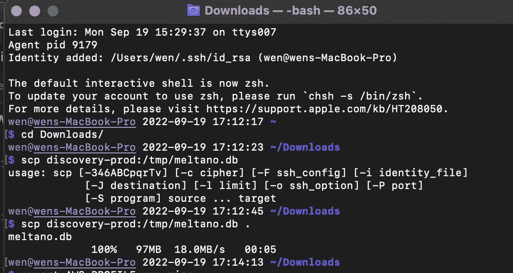
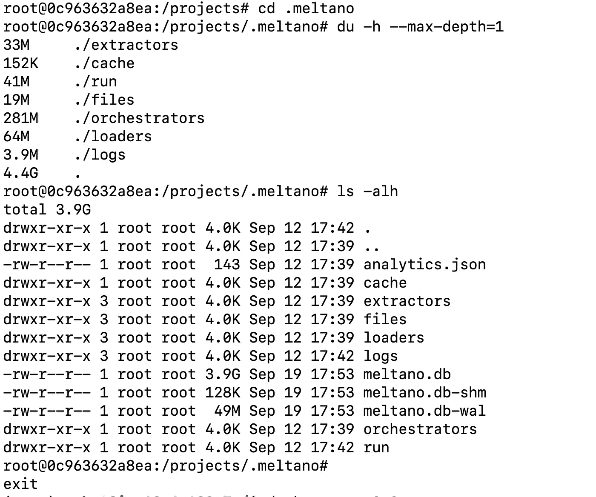

# 如何在生产、本地和 S3 之间传输文件

> 原文：<https://towardsdatascience.com/how-to-transfer-files-among-prod-local-and-s3-ce073a7cbe6b>

## 备份 Postgres、复制 docker 文件和在不同 AWS 配置文件之间切换的代码片段


照片由[以色列总统府](https://unsplash.com/@othentikisra?utm_source=medium&utm_medium=referral)在 [Unsplash](https://unsplash.com?utm_source=medium&utm_medium=referral) 上拍摄

数据科学家很少会收到如下请求:

1.  您能从生产机器上备份 stage 和本地 Postgres 数据库吗？
2.  你能从生产机器 docker 服务器上复制 X 文件并保存到本地机器上吗？
3.  为你的客户上传 X 文件到 AWS s3 怎么样？(提示:您可能有多个 AWS 概要文件)

如果你经历过类似的情况，但不知道如何处理，我希望我下面的代码片段可以帮助你恢复冷静和内心的平静。

# 如何:从生产计算机备份 stage 和本地 Postgres 数据库

在我们公司，我们只能 ssh 到 prod 机，而且 Postgres 数据库非常大。因此，以下是适合我们团队的解决方案:

*   **第 0 步**:在本地机器上安装`zstd`。`zstd`是一种压缩算法，可以帮助减小 Postgres `pg_dump`文件的大小。

```
# in your terminal
$ brew install zstd
```

*   **步骤 1** : ssh 到您的生产机器(如果您不确定如何 ssh 到您的生产机器，请向您的 DevOps 同事寻求帮助！)

```
$ ssh [alias for prod] 
$ pg_dump -T [table1] -c | zstd -T32 -19 -c > /tmp/prod.psql.zstd
```

上面的命令=“对除表 1 之外的所有表运行 pg_dump”。该命令压缩`pg_dump`文件并将其存储在生产机器的临时文件夹中。

*   **步骤 2** :将 zstd 输出下载到本地机器

打开一个新的终端，并`cd`到你想要保存文件的目录。例如`Downloads`:

```
$ cd Downloads/
$ scp discovery-prod:/tmp/prod.psql.zstd .
```

命令以一种超级干净的方式将文件从 prod 复制到你的本地！就像《哈利·波特》中的*幽灵*💎

*   第 3 步:用`zstd`文件
    备份您的本地或登台数据库确保在您的登台环境中删除数据库之前先与您的 DevOps 团队讨论。

```
# I feel pretty free to do so on my local machine$ dropdb discovery_db
$ createdb discovery_db
$ cat prod.psql.zstd | zstd -dc | psql discovery_db
```

# 如何:从生产机器 docker 服务器复制 X 文件，并将其保存到本地机器

嗯，类似于上面的过程，这里唯一的新东西是从一个特定的 docker 容器中抓取特定的文件。

```
# step 0: ssh to your production machine. 
$ ssh prod# step 1: show your docker container 
$ docker ps# step 2: copy a file under specific container ID
# Here I'm trying to copy a meltano.db file# step 3: copy file and store it in temp folder
$ docker cp [container_id]:/projects/.meltano/meltano.db /tmp/meltano.db
```

类似地，您可以打开一个新的终端并使用`scp`将`meltano.db`文件从 production temp 文件夹下载到您的本地机器。以下是截图:



额外提示:

*   你可以交替使用`docker container ls`和`docker ps`
*   Docker 容器文件夹可能会变得非常大，有时您可能希望删除旧的未使用的容器来释放空间。您可以这样做:

```
# Run both to stop and remove the folder$ docker stop [container_id]$ docker rm [container_id]
```

我想导出`meltano.db`的原因是因为我们注意到这个文件的大小以意想不到的速度增长。所以我们想导出这个文件以供进一步分析。下面是显示文件大小的另一个技巧:

*   `du -h --max-depth=1`:显示该目录下的文件
*   `ls -alh`:这将以人类可读的方式显示`.`下的文件及其大小。



# 如何:设置多个 AWS 概要文件并将文件上传到 s3

例如，我想配置两个配置文件:一个用于我的外部公司，另一个用于访问客户的公司。您需要预先获得两个概要文件的 AWS 访问密钥和秘密密钥。

```
# step0: check your default profile list
$ aws configure list# Configure my profile 1: wen_outside
$ aws configure --profile wen_outside
# follow the steps to filling the blanks
AWS Access Key ID [None]: [fill your info]
AWS Secret Access Key [None]: [fill your info]
Default region name [None]: [fill your info] # example: us-east-1 
Default output format [None]: json# Configure my profile 2: wen_client
$ aws configure --profile wen_client
# follow the steps to filling the blanks
AWS Access Key ID [None]: [fill your info]
AWS Secret Access Key [None]: [fill your info]
Default region name [None]: [fill your info] 
Default output format [None]: json# Now check to see your profile list
$ aws configure list-profiles
```

下一步是如何在配置文件之间切换:

```
# Switch to my outside profile
$ export AWS_DEFAULT_PROFILE=wen_outside
```

最后，假设我需要将`meltano.db`上传到我们客户的 s3:

```
# switch to my profile wen_client
$ export AWS_PROFILE=wen_client# from local to S3: for single file
$ aws s3 cp meltano.db [client's s3 directory]# from S3 to current directory
$ aws s3 cp [s3 directory] .# from local to S3: sync the whole folder "forClient"
$ aws s3 sync forClient [client's s3 directory]
```

# 摘要

*   和其他一些数据科学家一样，我也有类似的担心，与生产机器(通常是 Linus 和 Ubuntu 系统)交互可能会令人生畏。这些任务我做得不够频繁，以至于我建立了肌肉记忆。好消息是，如果您对此类代码片段保持良好的文档记录，这种担心是可以克服的。