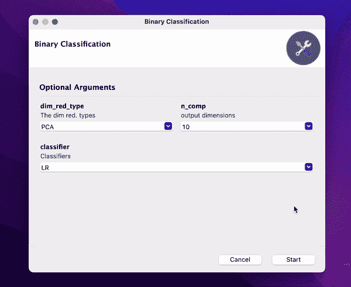

# 如何将你的命令行程序转换成用户友好的图形用户界面

> 原文：<https://towardsdatascience.com/how-to-transform-your-command-line-app-into-a-user-friendly-gui-98c207564324>

## Gooey 是一个 python 库，对于所有讨厌命令行的人来说是天赐之物


照片由[蒂姆·高](https://unsplash.com/@punttim?utm_source=unsplash&utm_medium=referral&utm_content=creditCopyText)在 [Unsplash](https://unsplash.com/s/photos/people-with-laptop?utm_source=unsplash&utm_medium=referral&utm_content=creditCopyText) 拍摄

在我的机器学习应用程序开发中，我大部分时间都使用命令行界面。但是我同意处理命令行并不容易，除非你投入大量的时间。或者有时候你只是不想被它困扰。

我最近偶然发现了这个叫做 [Gooey](https://github.com/chriskiehl/Gooey) 的 python 库，它使 ML 应用程序开发变得有趣，并且使用起来非常简单。让我来解释一下。

我写过一篇关于如何使用 ArgParse 库构建机器学习 app 进行实验的文章。这里可以查一下[。我使用了那篇文章中的相同代码，并将其转换成 GUI 版本。](/how-to-automate-and-simplify-your-machine-learning-experiment-workflow-2be19f4aaa6)

# 胶粘物

使用以下工具快速安装

```
pip install Gooey
```

现在，您所要做的只是将装饰器添加到您现有的 Python 应用程序中(用 argparse 库包装)。事情就是这么简单:

```
from gooey import Gooey[@Gooey](http://twitter.com/Gooey)      <--- all it takes! :)
def main():
  parser = ArgumentParser(...)
  # rest of code
```

在将装饰器添加到现有代码中之后，您可以将它变成一个用户友好的 GUI 应用程序。多酷啊！

# 示例代码

我将重用我以前文章中的相同代码。添加 Gooey decorator 后的 python 应用程序如下所示:

我对我的旧代码做了一些小的改动，比如添加了更多的 print 语句，但是唯一需要做的就是添加了 decorator 和 import 语句。

我们将要运行的 python 应用程序的快速描述—

这是一个二元分类任务，要求用户选择一种降维技术(以及输出维数)，然后选择 ML 分类器来训练模型。模型评估是在测试集上完成的(从整个数据中分层分割 30%)，使用准确度分数作为度量。我们打印准确性分数以及用户选择的参数。

让我们运行代码，看看它是否工作。

要运行 Python 应用程序`gooey_example.py`，只需在命令行中写入:

```
python gooey_example.py
```

您将看到以下 GUI:



Gooey Python 应用程序 GUI (Gif 由作者提供)

您有 3 个选项可供选择(以下拉选择框的形式)，并且可以运行 python 应用程序。瞧啊。应用程序按预期运行。

注意:我用 Macbook 来运行代码，所以我必须使用

```
pythonw gooey_example.py
```

除了 Gooey 库之外，我不得不安装下面的命令来代替前面的命令。

```
conda install -c conda-forge python.app
```

这对我来说并不简单，因为当我尝试运行 Python 应用程序时出现了一些错误。我可以通过安装`python.app`很容易地解决这些问题，而且运行得很好。

# 关于胶粘的思考

将 CLI 应用程序转换成 GUI 应用程序是一个很酷的想法。我真的很喜欢。但这对我没有多大用处，因为我通常构建 CLI 机器学习应用程序来执行多个实验并记录每个实验的工件(正如我在我以前的[文章](/how-to-automate-and-simplify-your-machine-learning-experiment-workflow-2be19f4aaa6)中谈到的)。

如果我向不精通机器学习和一般编码的客户解释该应用程序如何工作，GUI 应用程序会很有用。对于这样的人来说，GUI 将是一个很好的工具，可以用来探索应用程序是如何工作和运行的。

如果我可以在遍历所有参数组合时将这个 GUI 用作进度条，那将对我很有帮助。我仍然需要检查这个功能。

感谢阅读，干杯！

```
**Want to Connect?**Reach me at [LinkedIn](https://www.linkedin.com/in/rohithteja/), [Twitter](https://twitter.com/rohithtejam), [GitHub](https://github.com/rohithteja) or just [Buy Me A Coffee](https://www.buymeacoffee.com/rohithteja)!
```