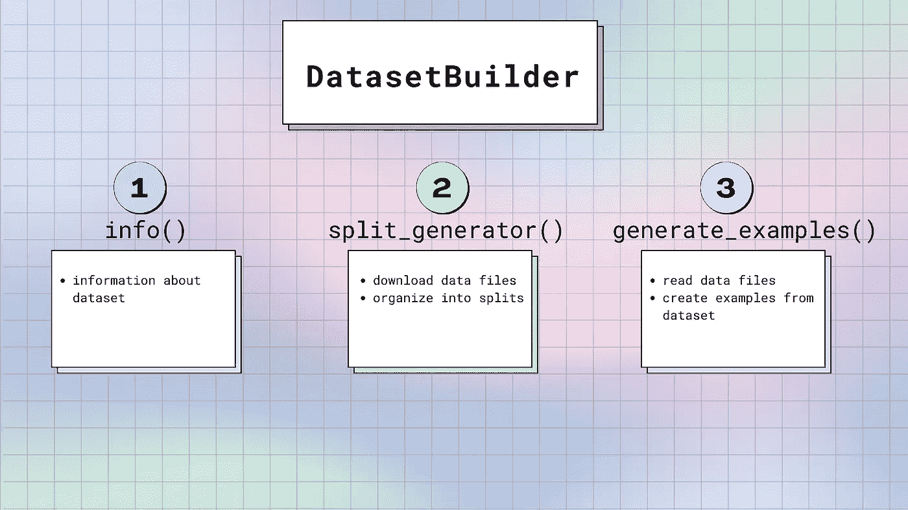
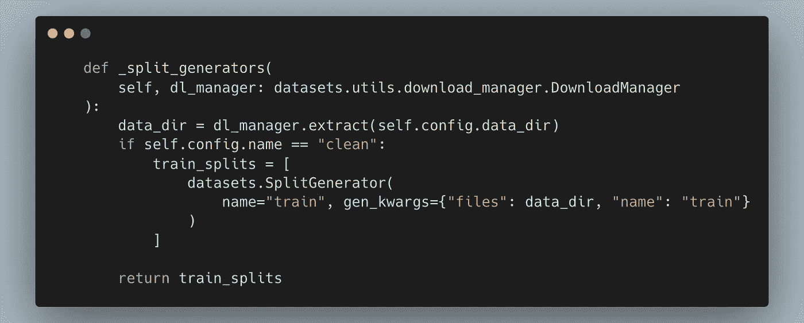
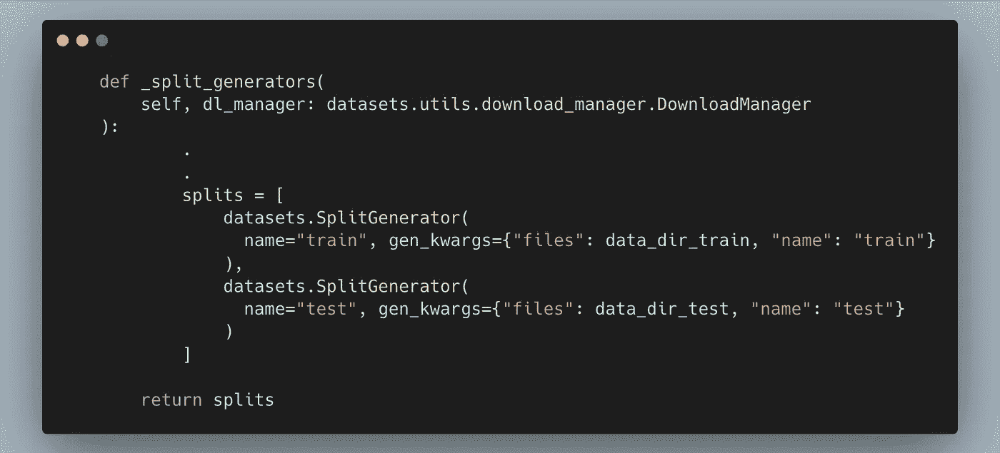
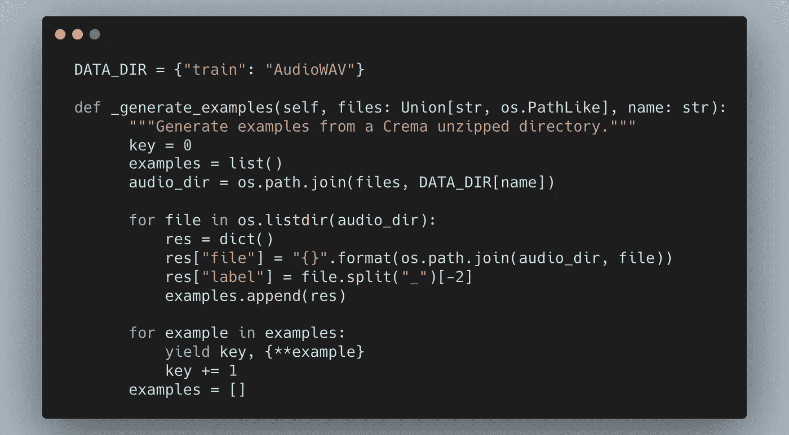

# 如何将本地(zip)数据转换成 Huggingface 数据集

> 原文：<https://towardsdatascience.com/how-to-turn-your-local-zip-data-into-a-huggingface-dataset-43f754c68f82>

## 拥抱面部数据集

## 在一行代码中快速加载数据集，用于训练深度学习模型

[](https://github.com/V-Sher/HF-Loading-Script) [## GitHub-V-Sher/HF-Loading-Script:如何为 HuggingFace 数据集编写自定义加载脚本

### 此时您不能执行该操作。您已使用另一个标签页或窗口登录。您已在另一个选项卡中注销，或者…

github.com](https://github.com/V-Sher/HF-Loading-Script) 

# 什么是拥抱脸🤗数据集？

如果你已经在深度学习领域工作了一段时间(或者即使你只是最近才开始钻研)，很有可能，你会遇到[hugging face](https://huggingface.co/)——一个开源的 ML 库，它是所有人工智能(预训练模型、数据集、推理 API、GPU/TPU 可扩展性、优化器等)的圣杯。

他们还有一个专门的图书馆—🤗D [数据集](https://huggingface.co/docs/datasets/index)用于轻松访问和共享自然语言处理(NLP)、计算机视觉和音频任务的数据集。

```
pip install datasets
```

这个库预装了 2500 多个数据集。您可以按如下方式检查列表:

```
from datasets import list_datasets
list_datasets()*** OUTPUT ****['acronym_identification',
 'ade_corpus_v2',
 'adversarial_qa',
 'aeslc',
 'afrikaans_ner_corpus',
 'ag_news',
 ...
]
```

要在当前的 python 脚本或 jupyter 笔记本中加载这些数据集，只需将数据集的名称传递给`load_dataset()`。例如，让我们用`asr`(自动语音识别)配置加载一个名为`superb`的流行音频数据集，并检查第一个音频文件。输出是具有六个特征的字典— `chapter_id`、`file`、`audio`、`id`、`speaker_id`和`text`。

```
from datasets import load_dataset
**dataset = load_dataset("superb", "asr")**
dataset[0]*** OUTPUT *** 
{'chapter_id': 1240,
 'file': 'path/to/file.flac',
 'audio': {
       'array': array([0., 0.003, -0.0002,..., dtype=float32),
       'path': 'path/to/file.flac',
       'sampling_rate': 16000
           }
 'id': '103-1240-0000',
 'speaker_id': 103,
 'text': 'CHAPTER ONE MISSUS RACHEL LYNDE IS SURPRISED MISSUS  RACHEL LYNDE '
 }
```

# 这篇文章是关于什么的？

我开始写这篇文章的主要原因之一是因为我想微调一个🤗在自定义音频数据集上使用[训练器 API](https://huggingface.co/docs/transformers/v4.21.3/en/main_classes/trainer#trainer) 的变压器模型(博客随后发布)。我遇到的大多数教程都在使用一个流行的数据集(如 [Superb](https://huggingface.co/datasets/superb) 、 [Librispeech](https://huggingface.co/datasets/librispeech_asr) 等)，这些数据集预装在库中，开箱即用。

想要使用 Kaggle 的 [Crema-D](https://www.kaggle.com/datasets/ejlok1/cremad) 音频数据集，我想——*如果我们也可以像上面一样用一行代码加载我们自己的定制数据，那不是很好吗？大致意思是:*

```
dataset = load_dataset("my_custom_dataset")
```

这正是我们在本教程中要学习的！因此，请点击[此链接](https://www.kaggle.com/datasets/ejlok1/cremad?resource=download)上的*下载*按钮，跟随本教程。您应该看到包含 Crema-D 音频文件的`archive.zip`开始下载。它包含 7k+音频文件，格式为`.wav`。

# 经历这些麻烦有什么好处吗？

创造的一个主要好处是🤗数据集是由箭头[支持的。换句话说，数据集缓存在磁盘上。需要时，它们直接从磁盘(提供快速查找)进行](https://huggingface.co/docs/datasets/about_arrow#what-is-arrow)[内存映射](https://en.wikipedia.org/wiki/Memory-mapped_file)，而不是加载到内存(即 RAM)中。正因为如此，内存相对较小的机器仍然可以使用 Huggingface 数据集 [*【源】*](https://huggingface.co/docs/datasets/about_arrow#memorymapping) 加载大型数据集。

# 好的，我被说服了，我们开始吧…

假设我们需要使用定制的本地 CremaD 数据集——这意味着它还不能使用`load_dataset()`开箱即用地加载，我们需要编写一个**加载脚本**来代替。我们上面看到的每个预装数据集在后端都有自己的加载脚本。[这里的](https://github.com/huggingface/datasets/blob/main/datasets/superb/superb.py)是针对`superb`数据集的。

> 加载脚本是一个`*.py*` python 脚本，我们将其作为输入传递给`*load_dataset()*`。(而不是预安装的数据集名称)。它包含有关列及其数据类型的信息，指定数据集的训练测试拆分，处理下载文件(如果需要)以及从数据集生成样本。
> 
> 加载脚本还有助于将**数据集代码**与**模型训练代码**解耦，以获得更好的可读性和模块化。

假设我们已经成功创建了上述脚本，那么我们应该能够如下加载数据集:

```
ds = load_dataset(
  dataset_config["LOADING_SCRIPT_FILES"],
  dataset_config["CONFIG_NAME"],
  *data_dir*=dataset_config["DATA_DIR"],
  *cache_dir*=dataset_config["CACHE_DIR"]
)
```

其中`dataset_config`是一个简单的字典，包含以下值:

```
dataset_config = {
  "LOADING_SCRIPT_FILES": path/to/loading/script.py,
  "CONFIG_NAME": "clean",
  "DATA_DIR": path/to/zip/file,
  "CACHE_DIR": path/to/cache/directory,
}
```

通过在调用`load_dataset()`时传递`data_dir`，我们告诉加载脚本在哪里寻找包含音频文件的目录。此外，设置一个`cache_dir`将允许我们在后续调用`load_dataset()`时重用数据集的缓存版本。

最后，我们将专注于构建一个名为`clean`的配置。但是，一个数据集内可以有多个配置。例如，在上面的`superb`示例中，我们使用特定的配置(即`asr`)加载数据集，但是它们还有五个其他配置— `ks`、`ic`、`si`、`sd`和`er`。

同样，对于本教程，除了拥有一个包含整个数据集的`clean`配置之外，我们还可以拥有第二个配置，比如说`small`，它可以是一个用于测试目的的精简数据集，或者第三个配置，比如说`fr`，它可以包含这个数据集的法语版本。(在本教程的最后，我将简要讨论如何在同一个加载脚本中定义多个配置)。

## 快速绕道

在我们开始为数据集(包含在一个 zip 文件中)编写定制加载脚本之前，我想指出如果我们处理🤗[来自简单数据格式](https://huggingface.co/docs/datasets/v1.11.0/loading_datasets.html#from-local-files)文件的数据集，如 csv、JSON 等。以下示例直接取自文档页面:

*   [csv](https://huggingface.co/docs/datasets/v1.11.0/loading_datasets.html#csv-files)

```
dataset = load_dataset(‘csv’, data_files=[‘my_file_1.csv’, ‘my_file_2.csv’])
```

*   [json](https://huggingface.co/docs/datasets/v1.11.0/loading_datasets.html#json-files)

```
dataset = load_dataset(‘json’, data_files=’my_file.json’)
```

*   [正文](https://huggingface.co/docs/datasets/v1.11.0/loading_datasets.html#text-files)

```
dataset = load_dataset(‘text’, data_files={‘train’: [‘my_text_1.txt’, ‘my_text_2.txt’], ‘test’: ‘my_test_file.txt’})
```

*   [python 字典](https://huggingface.co/docs/datasets/v1.11.0/loading_datasets.html#from-a-python-dictionary)

```
my_dict = {'id': [0, 1, 2], 'name': ['mary', 'bob', 'eve'], 'age': [24, 53, 19]}dataset = Dataset.from_dict(my_dict)
```

*   [熊猫数据帧](https://huggingface.co/docs/datasets/v1.11.0/loading_datasets.html#from-a-pandas-dataframe)

```
df = pd.DataFrame({"a": [1, 2, 3]})
dataset = Dataset.from_pandas(df)
```

## 编写自定义加载脚本

回到我们的定制加载脚本，让我们创建一个名为`crema.py`的新文件。这是任何新数据集的典型加载脚本:

图 1:使用 Huggingface 提供的空白[模板](https://github.com/huggingface/datasets/blob/main/templates/new_dataset_script.py)生成。

如您所见，有三个主要功能需要修改— `info()`、`split_generator()`和`generate_examples()`。让我们一个一个来看:



[来源](https://huggingface.co/docs/datasets/about_dataset_load):官方拥抱脸文档

## `1\. info()`

在该方法中要指定的三个最重要的属性是:

*   *描述* —包含数据集快速摘要的字符串对象。
*   *特性* —就像为数据集定义一个框架/元数据一样。也就是说，您希望为每个音频样本存储哪些特征？(还记得`superb`数据集如何为每个音频文件定义了六个特征)。
    对于我们的音频分类任务，我们只需要定义一个`file`和相应的`label`。
*   *主页—(可选)链接到数据集*的主页 URL。


需要考虑的事情很少:

*   每个列名及其类型统称为[特性的](https://huggingface.co/docs/datasets/v2.4.0/en/package_reference/main_classes#datasets.Features)🤗数据集。它采用了`dict[column_name, column_type]`的形式。
*   根据`column_type`，我们可以拥有
    — [数据集。值](https://huggingface.co/docs/datasets/v2.4.0/en/package_reference/main_classes#datasets.Value)(整数和字符串)、
    — [数据集。ClassLabel](https://huggingface.co/docs/datasets/v2.4.0/en/package_reference/main_classes#datasets.ClassLabel) (对于一组预定义的带有相应整数标签的类)，
    — [数据集。序列](https://huggingface.co/docs/datasets/v2.4.0/en/package_reference/main_classes#datasets.Sequence)特征(用于对象列表)。
    —[还有更多](https://huggingface.co/docs/datasets/v2.4.0/en/package_reference/main_classes#datasets.Features)。
*   在我们的代码中，为了简单起见，`file`和`label`都被定义为`string`类型的[值](https://huggingface.co/docs/datasets/v2.4.0/en/package_reference/main_classes#datasets.Value)特征。
    *注:除* `*string*` *外，其他数据类型包括*`*int32*`*`*bool*` *`*timestamp*`*等。查看完整列表* [*此处*](https://huggingface.co/docs/datasets/v2.4.0/en/package_reference/main_classes#datasets.Value) *。***
*   **除了`description`、`features`、`homepage`之外，你可以在[这里查看](https://huggingface.co/docs/datasets/v1.11.0/package_reference/main_classes.html#datasets.DatasetInfo)其他可以在`info()`中指定的属性，如版本号、supervised_keys、引用等。**

## **2.`split_generator()`**

**这是负责下载或检索数据文件的功能。这就是为什么在图 1 的函数定义中，[下载管理器](https://huggingface.co/docs/datasets/v1.1.1/_modules/datasets/utils/download_manager.html#DownloadManager)(即`[dl_manager](https://huggingface.co/docs/datasets/v1.1.1/_modules/datasets/utils/download_manager.html#DownloadManager)`)作为函数参数之一被传递。**

**[DownloadManager](https://huggingface.co/docs/datasets/v1.1.1/_modules/datasets/utils/download_manager.html#DownloadManager) 有一个名为`extract()`的预定义函数，负责解压我们的数据集并访问其中的音频文件。**

```
**def _split_generator(self, dl_manager):
    data_dir = **dl_manager.extract**(self.config.data_dir)
    .
    .
    .
    .**
```

***注意:如果您的 zip(或 tar)数据托管在 ftp 链接或 URL 上(例如，* [*这个*](http://www.openslr.org/resources/12/) *是当前存储* `*superb*` *数据集的地方)，您可以使用* `*dl_manager.download_and_extract()*` *来负责下载和解压缩文件。因为我们已经下载了。zip 文件本地，我们只需使用* `*extract()*` *解压文件即可。***

**该函数将数据目录的路径作为输入(即 *archive.zip* 位于 *)* 。记住，当调用`load_dataset()`时，我们将该路径作为`data_dir`参数传递，因此它将作为配置的一部分可用，并可通过`self.config.data_dir`访问。**

**`extract()`函数的输出是一个字符串，包含文件解压后的缓存目录的路径。例如，在我们的例子中，这将是:`/Audio-Classification-Medium /cache_crema/downloads/extracted/d088ccc5a5716.......`。在这个位置，你会发现一个新创建的名为`AudioWav`的文件夹，里面有我们所有的`.wav`音频文件。**

**最后，`split_generator()`还使用 [SplitGenerator](https://huggingface.co/docs/datasets/v2.4.0/en/package_reference/builder_classes#datasets.SplitGenerator) 通过拆分来组织数据。目前，我们只有一个 split，即由这个函数返回的`train_splits`，我们将这个函数的`name`指定为`train`。在这里，`gen_kwargs`指的是从这个数据集生成样本所需的关键字参数。它包含两个参数——`files`和`name`——接下来这两个参数都将被转发给`_generate_examples()`方法。**

***注:* `*gen_kwargs*` *内可以通过的没有限制。试试* `*gen_kwargs={"files": data_dir, "name": "train", "useless_arg": "helloworld"}*` *。不用说，在* `_generate_examples()` *中只包含您认为生成样本所需的 kwargs。***

****

***提示:将来，如果您有单独的数据集用于测试和验证分割，您可以创建更多的分割，如下所示:***

****

## **3.`generate_examples()`**

**如前所述，该方法将从`gen_kwargs`解包的所有东西作为参数，如`_split_generators`中给出的。在我们的例子中，这将是`files`和`name`:**

```
**def _generate_examples(self, files, name):
      .
      .
      .**
```

**该方法负责从音频数据集(使用`[yield](https://stackoverflow.com/questions/231767/what-does-the-yield-keyword-do)`)逐个生成(`key`，`example`)元组，其中`example`是包含音频文件和标签的键值对的字典。因为我们没有对标签的显式访问，我们需要使用`split()`从文件名中提取它们(例如:`1001_DFA_ANG_XX.wav`)。**

```
**file = 1001_DFA_ANG_XX.wavlabel = file**.split**("_")[-2]
print(label)**** OUTPUT ****
ANG**
```

***注:根据官方数据集* [*文档*](https://github.com/CheyneyComputerScience/CREMA-D#description) *，文件名包含有用的元数据(用* `*_*` *分隔)包括 speaker_id (1001)、句子 id (DFA)等。如果您想将它们作为数据集的一部分，请确保您更新了* `*info()*` *以为它们中的每一个创建新的要素，然后才能在* `*generate_examples()*` *中使用它们。***

**在我们生成一个示例之前，我们必须创建一个包含所有示例的*列表。让我们通过遍历`os.path.join(files, “AudioWav")`目录中的所有文件来实现这一点。***

***注 1:如果你想知道为什么我们需要上面的* `*os.path.join()*` *，记住* `*files*` *是缓存文件夹* `*./Audio-Classification-Medium /cache_crema/downloads/extracted/d088ccc5a5716.......*` *的路径——这里没有音频文件！在这个位置，一个新创建的* `*AudioWav*` *文件夹包含了需要的* `*.wav*` *音频文件。我花了几个小时调试这个！
后知后觉，我下次应该用* `*os.walk()*` *。***

****

***注 2:如果您有一个包含所有元数据(包括标签)的显式 csv/json 文件，那么* `*generate_examples()*` *的代码看起来会有点不同。不是遍历所有文件，而是需要(a)遍历 csv 文件中的行,( b)使用* `*.todict()*` *将每一行转换成一个字典——以创建* `*examples*` *列表。请看下面的虚拟片段:***

****最终代码为** `**crema.py**` **。****

**需要考虑的额外变化很少:**

*   ****在第 28 行**上，我们设置了一个类属性，即`DEFAULT_WRITER_BATCH_SIZE`，表示在将数据集写入箭头文件时，RAM 中可以保存多少个示例。对于图像、音频或视频等占用大量内存的数据，将它设置为一个较小的值(比如 256)很重要，这样可以避免 OOM 错误和迭代器阻塞的风险。如果我们不设置一个值， [Arrow 的默认批量大小(10000)被用于](https://github.com/huggingface/datasets/blob/401d4c4f9b9594cb6527c599c0e7a72ce1a0ea49/src/datasets/builder.py#L1150)，这对语音样本来说太大了。**
*   ****在第 29 行**上，我们已经使用[数据集定义了为该数据集提供的唯一配置，即`clean`。BuilderConfig](https://huggingface.co/docs/datasets/v2.4.0/en/package_reference/builder_classes#datasets.BuilderConfig) 是构建配置的基类。
    *(最后，我们将看到如何子类化*[*builder config*](https://huggingface.co/docs/datasets/v2.4.0/en/package_reference/builder_classes#datasets.BuilderConfig)*并添加我们自己的属性来定义多个配置)*。**

## ****恭喜，你现在已经准备好加载你的数据集了****

**打开新的 python 脚本或 jupyter 笔记本:**

```
**dataset_config = {
  "LOADING_SCRIPT_FILES": os.path.join(PROJECT_ROOT, "crema.py"),
  "CONFIG_NAME": "clean",
  "DATA_DIR": os.path.join(PROJECT_ROOT, "data/archive.zip"),
  "CACHE_DIR": os.path.join(PROJECT_ROOT, "cache_crema"),
}ds = load_dataset(
  dataset_config["LOADING_SCRIPT_FILES"],
  dataset_config["CONFIG_NAME"],
  *data_dir*=dataset_config["DATA_DIR"],
  *cache_dir*=dataset_config["CACHE_DIR"]
)print(ds)********* OUTPUT ********DatasetDict({
    train: Dataset({
        features: ['file', 'label'],
        num_rows: 7442
    })
})**
```

****

# **接下来呢？？**

**从现在开始，你可以选择使用这个数据集作为模型训练(这是我将在我的[下一个教程](https://medium.com/p/c2d516b41cd8)中做的)或者(如果你拥有数据集的所有权)将它上传到 hugging face[Dataset-Hub](https://huggingface.co/datasets)。说明可以在这里找到[。](https://huggingface.co/docs/datasets/share)**

**在结束之前，有必要讨论一些可以在数据加载步骤之后、模型训练步骤之前完成的事情。**

## **1.分为训练测试和开发组**

```
**# INTRODUCE TRAIN TEST VAL SPLITS*# 90% train, 10% test + validation*
train_testvalid = ds["train"].train_test_split(*shuffle*=True, *test_size*=0.1)*# Split the 10% test + valid in half test, half valid* test_valid = train_testvalid["test"].train_test_split(*test_size*=0.5)*# gather everything into a single DatasetDict*ds = DatasetDict({
     "train": train_testvalid["train"],
     "test": test_valid["test"],
     "val": test_valid["train"],
      }
)**
```

## **2.将原始音频文件转换为数组**

```
***# CONVERING RAW AUDIO TO ARRAYS*ds = ds.map( *lambda* *x*: {
        "array": librosa.load(*x*["file"],
         *sr*=16000,
         *mono*=False)[0]
          }
)**
```

## **3.将标签转换为 id**

```
**ds = ds.class_encode_column("label")**
```

## **4.为模拟运行选择数据集的子集**

```
**ds["train"] = ds["train"].select(range(50))**
```

***另外请记住，每个* `*map*` *函数，虽然第一次比较耗时，但是会缓存输出，所以在* `*model.train()*` *期间后续的* `*map*` *调用不会花那么多时间。***

# **奖励—在数据集中构建多个配置**

**在文章的开始，我提到我们将讨论允许多重(虚拟)配置的代码片段。为此，我们需要引入一个新的类——姑且称之为`CremaConfig`——它将是数据集的一个子类。 [BuilderConfig](https://huggingface.co/docs/datasets/v2.4.0/en/package_reference/builder_classes#datasets.BuilderConfig) 。在这个类中，我们定义了数据集的三个属性，包括`data_dir`、`url`和`citation`。**

**现在，不是像下面这样定义配置:**

```
**BUILDER_CONFIGS = [
**datasets.BuilderConfig**(name="clean", description="Train Set.")
]**
```

**我们现在可以构建`CremaConfig`类的实例来实例化多个配置。这允许我们灵活地指定名称、数据目录、url 等。每种配置。**

```
**BUILDER_CONFIGS = [
**CremaConfig**(*name*="clean", *description*="Train Set in English.", data_dir="path/to/english/dir", url="...", citation="..."),
**CremaConfig**(name="fr", description="Train Set in French.", data_dir="path/to/french/dir", url="...", citation="..."),
]**
```

# **结论**

**一个巨大的对已存在的大声喊出来🤗关于本主题的文档。我希望本教程能够将文档向前推进一步，过滤技术术语，并展示真实示例的实现！**

**一如既往，如果有更简单的方法来做/解释本文中提到的一些事情，一定要让我知道。一般来说，避免不请自来的破坏性/垃圾/敌意评论！**

**直到下一次✨**