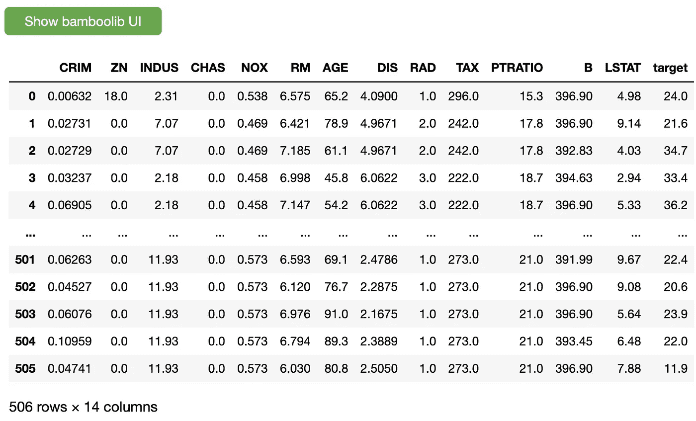
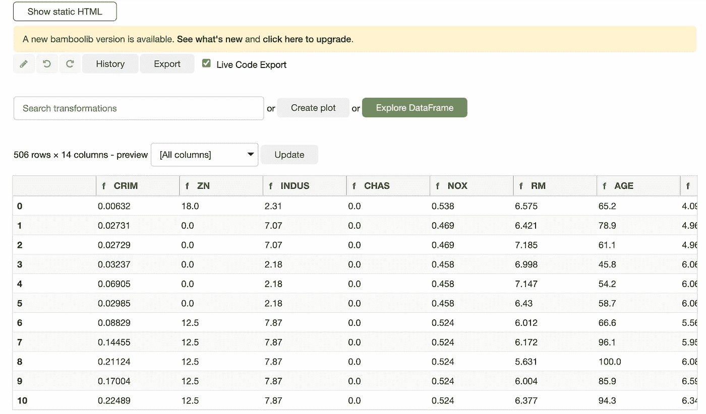
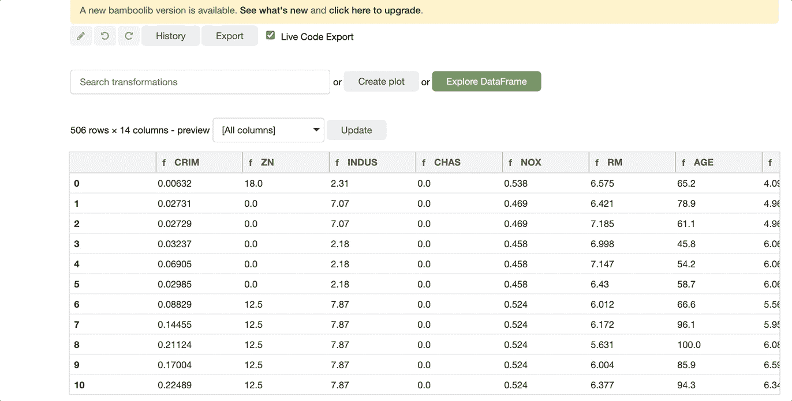
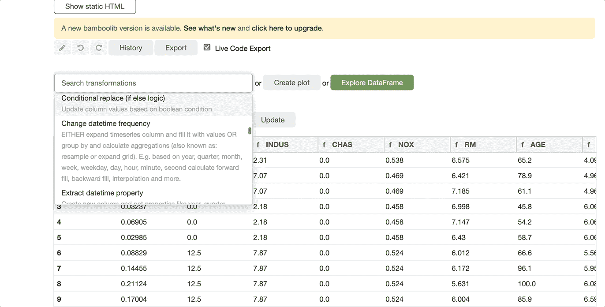
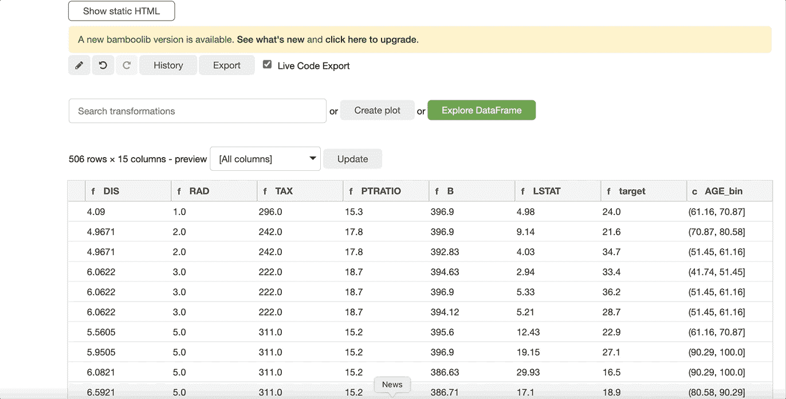
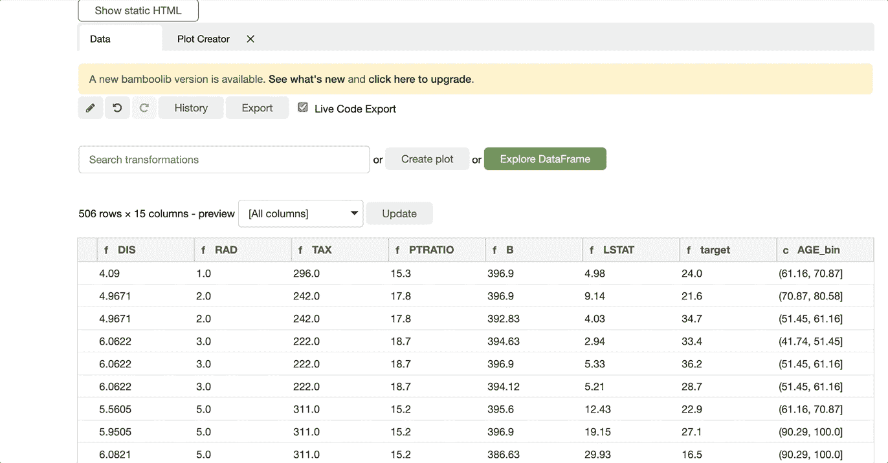
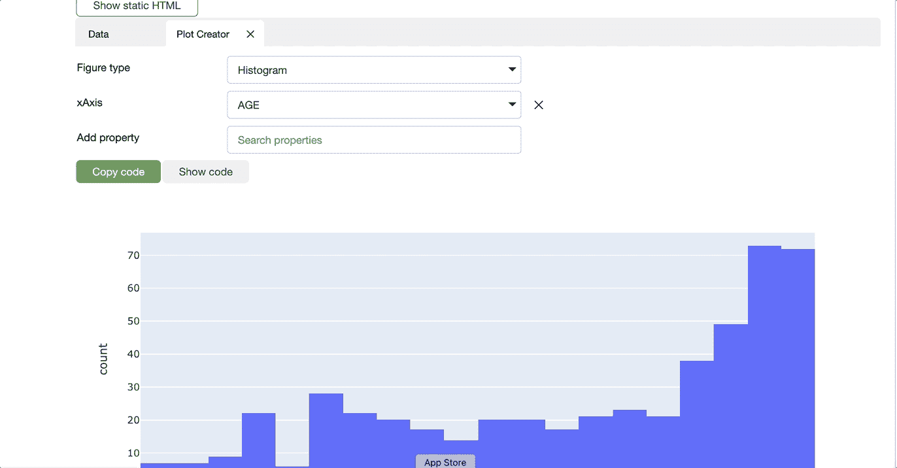

# 如何使用 Bamboolib 进行无代码数据分析

> 原文：<https://towardsdatascience.com/how-to-use-bamboolib-for-code-free-data-analysis-6cb5eae1dc37>

## 利用这个 pandas GUI 来加速您的数据探索过程


埃里克·巴布在 [Unsplash](https://unsplash.com/s/photos/bamboo?utm_source=unsplash&utm_medium=referral&utm_content=creditCopyText) 上拍摄的照片

数据争论和探索性数据分析是数据科学过程中一些最重要但被低估的任务。大多数数据科学家都熟悉 Pandas——这是一个 Python 库，已经成为数据操作和分析的瑞士军刀。

虽然 Pandas 有许多有用的函数，但使用 Pandas 执行复杂的数据转换通常需要搜索 Stackoverflow 或浏览 Pandas 文档页面，以找到要运行的正确函数。对于那些了解 Excel 但不精通 Python 的人来说，Pandas 也是一个障碍。如果有一种方法可以通过 GUI 访问熊猫的功能，那会怎么样？这就是 Bamboolib 发挥作用的地方。

**在本文中，我将演示如何使用一个基于 GUI 的 Python 库 Bamboolib 来加速 Pandas 数据分析过程。**

# 安装 Bamboolib

您可以使用以下命令安装 Bamboolib 和 pip:

```
pip install bamboolib
```

一旦安装了 Bamboolib，您将需要使用 Jupyter 来访问 UI，如本教程的其余部分所示。只需使用 Anaconda navigator 或您的终端启动 Jupyter，并打开一个笔记本进行跟踪。你可以在 [GitHub](https://github.com/AmolMavuduru/BamboolibTutorial/tree/master) 上找到本教程的[完整代码](https://github.com/AmolMavuduru/BamboolibTutorial/tree/master)。

# 导入库

在下面的代码中，我导入了 Bamboolib 以及 Numpy 和 Pandas 进行数据分析。

```
import bamboolib as bam
import numpy as np
import pandas as pd
```

# 读取数据和访问 GUI

出于本教程的目的，我将使用经典的波士顿住房数据集，该数据集可通过 Scikit-learn 的数据集模块获得。

```
from sklearn.datasets import load_bostonboston_data = load_boston()df = pd.DataFrame(columns=boston_data['feature_names'],
                  data=boston_data['data'])df['target'] = boston_data['target']
df
```

假设 Bamboolib 已经被导入，运行上面的代码将产生以下输出。



Pandas 输出带有显示 Bamboolib UI 的选项。

点击“显示 bamboolib UI”按钮后，将出现如下图所示的 Bamboolib UI。



Bamboolib 用户界面。

现在我们已经可以访问这个 UI 了，我们可以使用它来执行探索性的数据分析，并对我们的数据应用转换。

## 探索性数据分析

使用 Bamboolib 执行探索性数据分析(EDA)就像在 Bamboolib UI 中单击“Explore Dataframe”按钮一样简单。



用 Bamboolib 进行探索性数据分析。

如上面的 GIF 所示,“探索数据框架”按钮为我们提供了一个菜单，其中包含数据中每个要素的整体视图。选择一列后，我们可以访问以下选项卡:

*   **概述** —包含所选列的直方图和汇总统计信息。
*   **分类概述** —允许我们查看所选列中最常见的值以及这些值的累计计数。
*   **二元图** —允许我们根据数据集中的其他特征绘制所选列。
*   **预测值** —衡量其他特性预测所选列的值的能力。该选项卡对于检查特征和目标变量之间的关系很有用。

## 应用变换

Bamboolib 还有各种各样的转换，我们可以将这些转换应用于列，以便创建新的列。这个强大的特性允许您执行常见的 Pandas 转换，而无需编写任何代码！



宁滨时代专栏。

例如，在上面的 GIF 中，我演示了如何为 AGE 列创建一个带有 bin 的新列。Bamboolib 在用户界面中还有许多其他的转换，你可以在 [Bamboolib 文档页面](https://docs.bamboolib.8080labs.com/)上阅读更多关于它们的内容。

## 创建地块

Bamboolib 还使我们可以轻松地创建图表来可视化我们的数据。如上面的 GIF 所示，只需点击 create plot 按钮，就会打开一个下拉菜单，其中有各种各样的绘图选项。



创建年龄列值的直方图。

Bamboolib 中的 plot creator 菜单允许我们基本上创建如上所示的交互式 Plotly plots。如果您正在构建标准地块，此功能可以为您节省大量时间。

## 导出代码

Bamboolib 的另一个有用特性是导出代码的能力。此功能类似于在 Excel 中记录宏。只要选择了实时代码导出选项，您就可以导出所有转换的代码，如下面的 GIF 所示。



在 Bamboolib 中导出转换代码。

我们也可以通过导航到 plot creator 选项卡并简单地使用 Show Code 和 Copy Code 按钮来导出绘图的代码，如下所示。



在 Bamboolib 中导出地块代码。

请记住，这篇文章只是对 Bamboolib 的介绍，要了解这个库的其他一些令人惊奇的特性，请查看官方的 [Bamboolib 文档](https://docs.bamboolib.8080labs.com/)。

# 摘要

Bamboolib 是一个非常有用的库，它通过 GUI 让用户访问常用的 Pandas 功能，从而简化了数据分析和可视化过程。像往常一样，您可以在 [GitHub](https://github.com/AmolMavuduru/BamboolibTutorial/tree/master) 上访问本教程的代码。

# 加入我的邮件列表

加入我的[邮件列表](https://mailchi.mp/e8dd82679724/amols-data-science-blog)，获取我的数据科学内容的更新。当你[注册](https://mailchi.mp/e8dd82679724/amols-data-science-blog)时，你还会得到我免费的**解决机器学习问题的逐步指南**！也可以在 [Twitter](https://twitter.com/amolmavuduru1) 上关注我，了解内容更新。

当你这么做的时候，考虑加入媒体社区，阅读成千上万其他作家的文章。

# 来源

1.  8080 实验室， [Bamboolib 文档](https://docs.bamboolib.8080labs.com/)，(2021)。