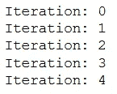
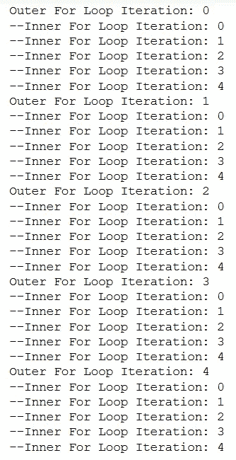
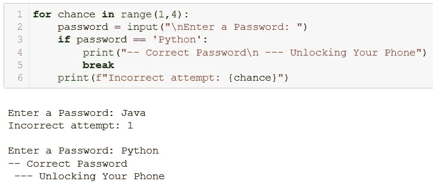
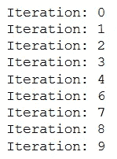
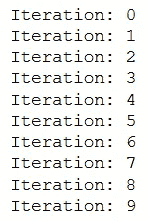
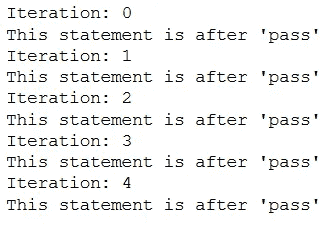
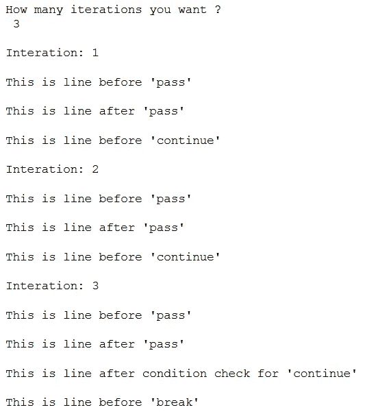

# Python 编程中如何使用 break、continue 和 pass

> 原文：<https://towardsdatascience.com/how-to-use-break-continue-and-pass-in-python-programming-9cd841763b3c>

## Python 编程

## 了解如何、何时以及为什么在 Python 中使用 break、continue 和 pass


[https://pix abay . com/photos/bulletin-board-stickies-post-it-3127287/](https://pixabay.com/photos/bulletin-board-stickies-post-it-3127287/)

**Python**——灵活——是自动化和高效完成重复任务的最佳解决方案！

在 Python ( *和其他编程语言也是*)中，循环的概念有助于遍历列表、元组、字符串、字典和集合。

循环迭代一段代码，直到测试表达式为假，但有时我们希望终止当前的迭代，甚至整个循环，而不检查测试表达式。

这可以通过使用几个关键字来实现，这些关键字可以用来改变循环的流程或执行。在 Python 中，这些关键字是— **中断、继续、通过**。💡

并且知道何时以及如何使用这些关键字来正确地控制你的循环流是很重要的！

因此，在本文中，我将讨论(通过示例)Python 中的何时-为什么-如何中断、继续和传递。

这些关键字背后的概念是相同的，与编程语言无关！

我们开始吧！

# Python 中的 break 语句

Python 中的`**break**`语句终止了包含它的循环。

举个例子，

```
for num in range(0,10):
    if num == 5:
        break
    print(f'Iteration: {num}')
```

上面的 for 循环生成输出，



作者图片

这里我们添加了`if`语句检查一个条件，当该条件为真时，程序流将进入 if 语句并执行`break`语句。

因此，for 循环一直执行到条件`num == 5`为真，当条件为真时，执行 break 语句终止`for`循环的流程。

更进一步，让我们在现有的 for 循环之外再添加一个`for`循环，如下所示。

```
for k in range(0,5):
    print(f'Outer For Loop Iteration: {k}')
    for num in range(0,10):
        if num == 5:
            break
        print(f'--Inner For Loop Iteration: {num}')
```

根据定义，当条件为真时，break 语句将终止包含它的 for 循环。



嵌套 for 循环| Image by Author 中的 break 语句

从上图中我们可以看到，对于外部 for 循环的每一次迭代，内部循环的流程都会在 5 次迭代后根据条件`num == 5`中断

因此，如果`break`语句在嵌套循环中(另一个循环中的*循环)，那么`break`语句将终止最里面的 ***循环*** 。🎯*

一个真实的例子是，使用密码解锁我们的智能手机。从技术上讲，手机解锁过程是一个`for`循环，不断要求输入密码。当输入正确的密码时，`**break**`语句被执行，`for`循环被终止！

下面是带代码的解释，



Python 中 break 语句的真实示例|作者图片

在上面的例子中，我认为 Python 是正确的密码。当条件`password == ‘Python’`变为*真*时，执行 **break** 语句，for 循环终止！

# Python 中的 continue 语句

`**continue**`语句用于仅在当前迭代中跳过循环中的剩余代码。

举个例子，让我们在上面的例子中使用 continue 而不是 break 语句。

```
for num in range(0,10):
    if num == 5:
        **continue**
    print(f'Iteration: {num}')
```



在 Python 中继续|作者图片

当条件`num == 5`为真时，执行`continue`语句。根据其定义，循环中的剩余代码仅在该迭代中被跳过。这就是为什么上面的输出中没有`Iteration: 5`的原因。

因此，`**continue**` 语句的工作方式与`break`语句相反，它不是终止循环，而是强制执行循环的下一次迭代。

# Python 中的 pass 语句

顾名思义，`**pass**`语句什么都不做。

当一个语句或条件需要出现在程序中，但我们不想执行任何命令或代码时，就使用它。

例如，用 pass 语句替换上面示例中的 break。

```
for num in range(0,10):
    if num == 5:
        **pass**
    print(f'Iteration: {num}')
```



按作者传入 Python |图像

正如我们在上面的输出中看到的，`pass`语句实际上什么也没做，因为`for`循环和其中的所有语句都被执行了！

`pass`语句通常在创建方法时使用，我们现在不想使用它。

> pass 语句用于**作为未来代码的占位符！！**

大多数时候，`pass`语句被替换为程序中其他有意义的命令或代码。

# 传递和继续之间的区别

当然，pass 和 continue 之间有很大的区别，它们是不可互换的。✅

> `continue`强制循环从下一次迭代开始，而`pass`表示“*这里没有要执行的代码*”，并将继续循环体的剩余部分。

下面是对这种差异的快速解释，

```
for num in range(0,5):
    pass
    print(f'Iteration: {num}')
    print("This statement is after 'pass'")
    continue
    print("This statement is after 'continue'")
```



继续并传入 Python 编程|作者图片

在上面的输出中，在`for` 循环的每次迭代中，前两条打印语句总是被执行，即使它们在`pass`语句之后。这意味着，`**pass**`什么也不做，循环的流程不会中断。

但是，`continue`语句之后的 print 语句没有被执行，因为关键字`**continue**`强制 for 循环开始下一次迭代。

总结一下，🚀

一个简单的例子将更有助于理解 Python 中的传递、继续和中断工作的方式！

如何在 Python 中使用 pass、continue 和 break | Gist by Author



Python 示例中的传递、继续和中断|作者图片

正如你在上面的输出中看到的，在`pass`之前和之后的所有东西总是被执行，表明关键字`pass`什么也不做。

另外，只执行`continue`关键字之前的行，表示`continue`总是强制 for 循环开始下一次迭代，不执行当前迭代中关键字`continue`之后的任何内容。

最后，执行`break`之前的行，for 循环的流程在第三次迭代时终止。这解释了`break` 语句是如何用来停止进程的。

我希望你觉得这篇文章很有趣，并且对你有用！

现在使用 [***我的链接***](https://medium.com/@17.rsuraj/membership) 只需 1 分钟即可成为**中等会员。当你这样做的时候，我会得到你的一小部分费用，你会得到一个无限制的访问权限😎敬所有关于 Medium 的文章！**

还有，如果你喜欢看这么惊艳的内容，欢迎随时加入我的 [***邮箱列表***](https://medium.com/subscribe/@17.rsuraj) 。

感谢您的阅读！