# 如何在数据可视化中使用调色板

> 原文：<https://towardsdatascience.com/how-to-use-color-palettes-for-your-data-visualization-ac4eaf3de37b>

## 数据可视化-教程-颜色

## Seaborn、Altair 和 ggplot2 (R)的分步调色板教程

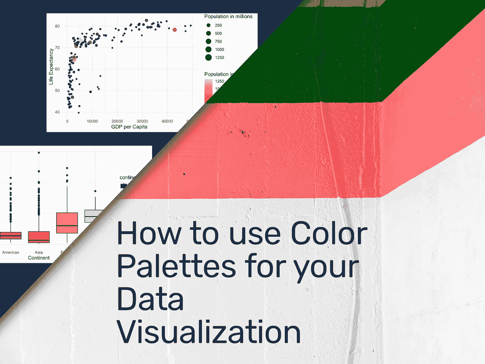

如何在 R 和 Python 中使用调色板——作者根据照片制作的图片 [Jason Leung](https://unsplash.com/@ninjason?utm_source=unsplash&utm_medium=referral&utm_content=creditCopyText)

# 介绍

我喜欢可视化数据。为此，我仔细研究了数据旁边的实用和令人愉快的颜色，以及适合任何数据可视化项目的图表。如果项目或客户没有确定颜色，我会花几个小时浏览和选择颜色。

当谈到选择完美的图形或颜色时，你可以倾向于你的艺术神经或尝试非常实际。或者介于两者之间。大多数情况下，不把你的图表设计得尽善尽美是不容易的。

在这篇文章中，我想分享我在寻找实用和精彩的调色板方面的资源，向您介绍一个适用于 R 和 Python 的调色板包，并向您展示如何将它应用于 ggplot2、Altair 和 Seaborn。请注意，我在这篇文章中使用术语“颜色”是为了让自己更容易理解，而实际上，我们需要区分色调、饱和度和亮度。

# 调色板

考虑在数据可视化中使用颜色有几个原因。

1.  **品牌识别**:你的读者应该自动识别公司或组织
2.  **可读性**:你的读者应该很容易区分数据可视化的不同部分。你想寻找高对比度的颜色，很容易区分开来。此外，记住我们感知颜色的方式不同。
3.  **编码含义**:如果你想把经常与特定颜色联系在一起的政党形象化。此外，如果你要可视化数值，考虑一个特殊的底纹，从低到高，从浅到深。反之亦然。

## 数据类型

使用调色板时，您还需要考虑要可视化的变量类型。对于**分类**变量，比如城市或国家名称，你需要一个离散的调色板。

对于**序数**变量，如客户评级或排名，选择编码低/高含义的调色板，如交通灯颜色红色、橙色和绿色。对于**数字**变量，如人口或价格，考虑一种带有渐增或渐减阴影的颜色。

调色板的类型；奥赫托的图像；来源: [Seaborn 文档](https://seaborn.pydata.org/tutorial/color_palettes.html)

## 资源

请考虑以下网站列表来找到您的调色板:

*   [https://colorhunt.co/](https://colorhunt.co/)
*   【https://coolors.co/ 号
*   【https://colorpalettes.net/ 
*   [https://www.canva.com/colors/color-palettes/](https://www.canva.com/colors/color-palettes/)
*   [https://color.adobe.com/de/create/color-wheel](https://color.adobe.com/de/create/color-wheel)
*   [https://mycolor.space/](https://mycolor.space/)
*   [http://colormind.io/](http://colormind.io/)

我最喜欢的**套装**由许多不同的调色板组成，是由 [BlakeRobMills](https://twitter.com/BlakeRobMills) 生产的 MetBrewer。

> 灵感来自纽约大都会艺术博物馆**的作品。所有的作品都来自不同的时期、地区和媒介。如果你对某一件有任何要求，请告诉我。**

**

*MetBrewer 的 Cross Color Palette，众多可用调色板之一；图片由开源项目[ [链接](https://github.com/BlakeRMills/MetBrewer/blob/main/PaletteImages/Cross.png)*

# *示例数据和图表*

## *Gapminder 软件包*

*我将使用由 [Gapminder](https://www.gapminder.org/) 提供的数据，或者更实际的，利用 Gapminder [R 包](https://cran.r-project.org/web/packages/gapminder/README.html)和 [python 包](https://pypi.org/project/gapminder/)。它包括两个分类变量:洲和国家，以及四个数值:年、预期寿命、人口和人均 GDP。*

*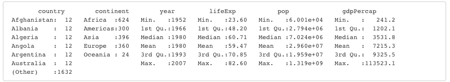*

*Gapminder 数据集概要；作者图片*

*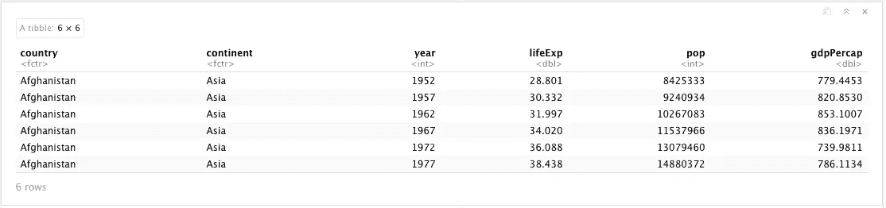*

*Gapminder 数据集的前六个条目；作者图片*

## *示例图表*

*为了应用调色板，我简要介绍了下面的图表。我用 r 编写了这些代码。您将在下面相应的章节中找到 python 代码。第一张图显示了人均国内生产总值和预期寿命这两个数值的分布情况。最后一个是箱线图，也显示了各大洲的人均 GDP 数据。*

*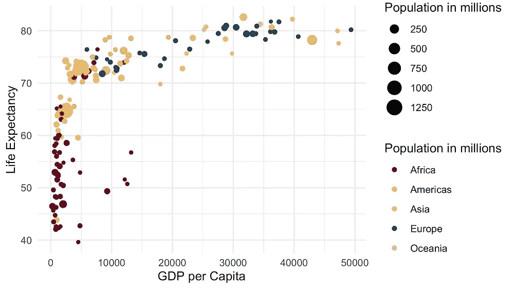***

*使用的图 Gapminder 数据集-作者提供的图像*

# *使用 ggplot2 应用调色板*

*首先，我们需要安装和加载所需的包。*

*然后以人均 GDP 为 x 轴，预期寿命为 y 轴，绘制点状图。我还将使用数字变量人口来控制每个点的大小。*

*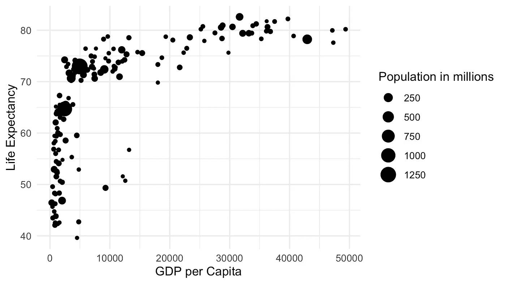*

*点图 01-人均国内生产总值预期寿命 Gapminder 数据集-图片由作者提供*

*为了在图中使用颜色，我将人口变量分配给颜色美学。因为我没有指定任何其他内容，所以 ggplot2 为这个数值变量选择了一个色谱(蓝色阴影)。*

*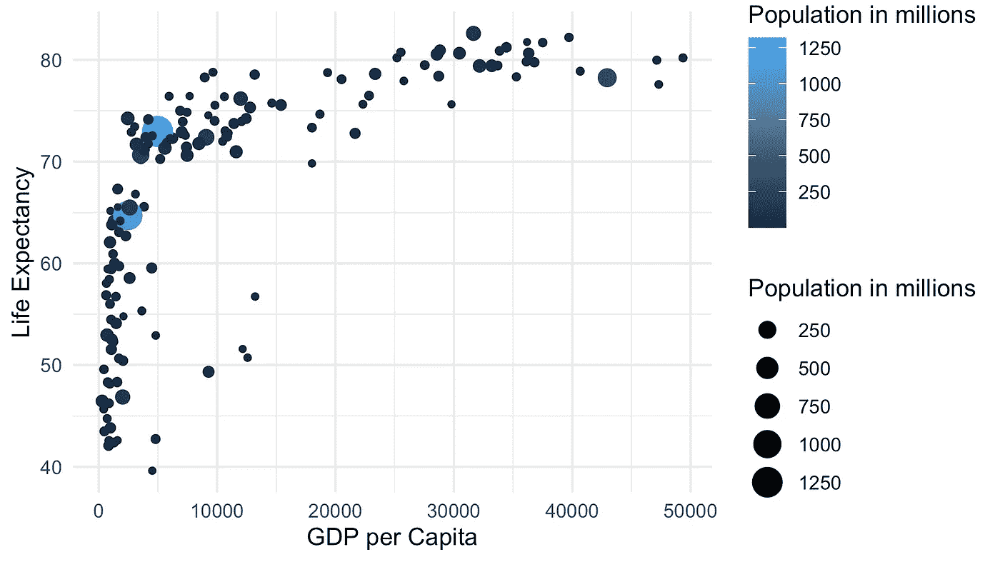*

*点图 02-人均国内生产总值预期寿命 Gapminder 数据集-图片由作者提供*

*为了控制色谱，我们需要引入色标。在下面的图中，我提供了一个十六进制颜色值的向量。如果你从上面提到的一个网站得到你的颜色，你会选择这个。*

*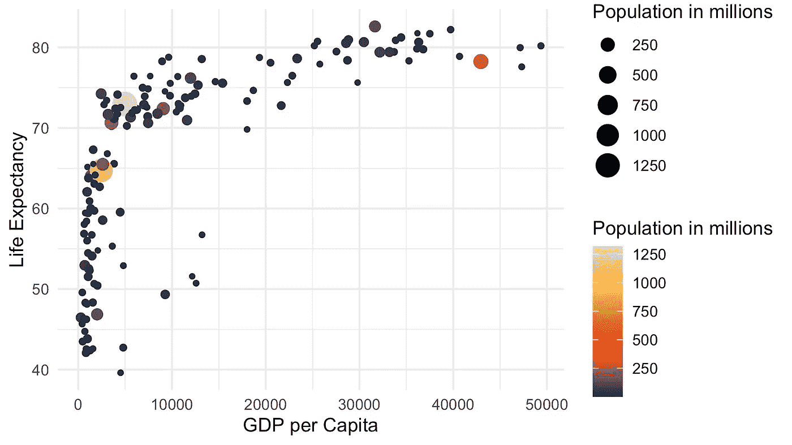*

*点图 03-人均国内生产总值预期寿命 Gapminder 数据集-图片由作者提供*

*为了应用 MetBrewer 调色板中的一个，用 MetBrewer 函数替换十六进制向量。在函数调用中，您提供调色板的名称，然后是几种颜色，并告诉它我们需要一个连续的调色板，因为它是一个数字变量。*

*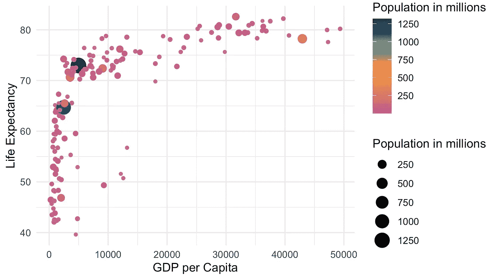*

*点状图 04-人均 GDP 预期寿命 Gapminder 数据集-图片由作者提供*

*你可能还想使用调色板**和非数字变量**。让我们假设我们想要将颜色应用于 Continent 变量。这意味着使用手动色标并提供 MetBrewer 调色板。*

*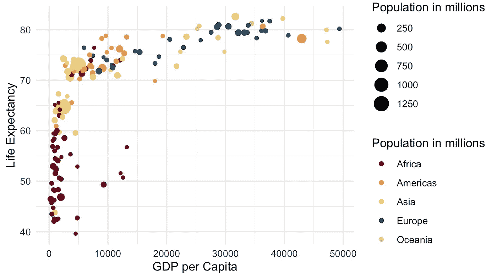*

*点图 05-人均国内生产总值预期寿命 Gapminder 数据集-图片由作者提供*

*请注意，如果要将颜色应用于填充美学而不是颜色美学，请考虑使用 scale_fill_manuel 函数而不是 scale_color_manuel 函数。这对于箱线图或条形图很有用。*

*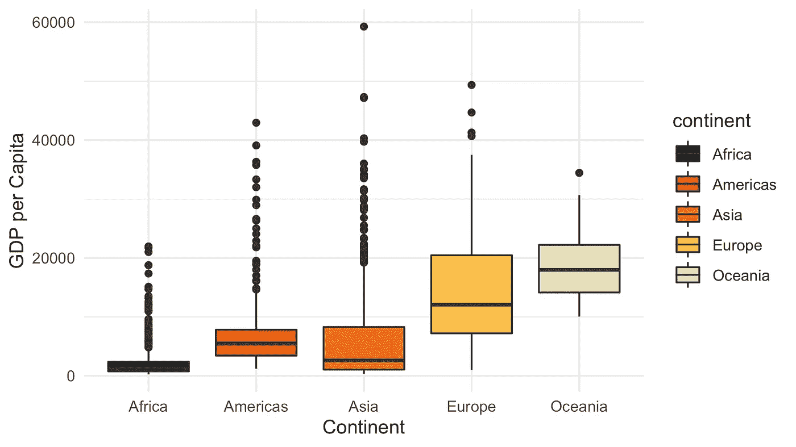*

*箱线图 06-人均国内生产总值预期寿命 Gapminder 数据集-图片由作者提供*

# *用 python-Altair 应用调色板*

*我使用方法链接编写 python 代码。这篇文章解释了这一点:“[蟒蛇/熊猫的完美管道](/the-flawless-pipes-of-python-pandas-30f3ee4dffc2)”。要安装 [MetBrewer](https://github.com/BlakeRMills/MetBrewer) 和 [Altair](https://altair-viz.github.io/getting_started/installation.html) ，我请参考他们各自的网站。*

*首先导入必要的库。*

*然后构建图表。请注意最后关于颜色的陈述。首先，我将颜色映射到人口变量。第二，我操纵传奇的标题。最后，我将刻度及其范围属性设置为一个 MetBrewer 调色板(即十字)。*

*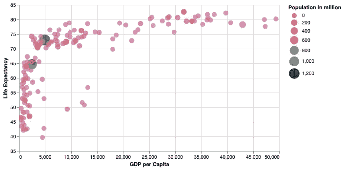*

*Altair Point Plot 01 人均 GDP 预期寿命 Gapminder 数据集-图片由作者提供*

*如果您想要将分类变量映射到颜色美学，只需更改颜色映射中的比例函数。*

*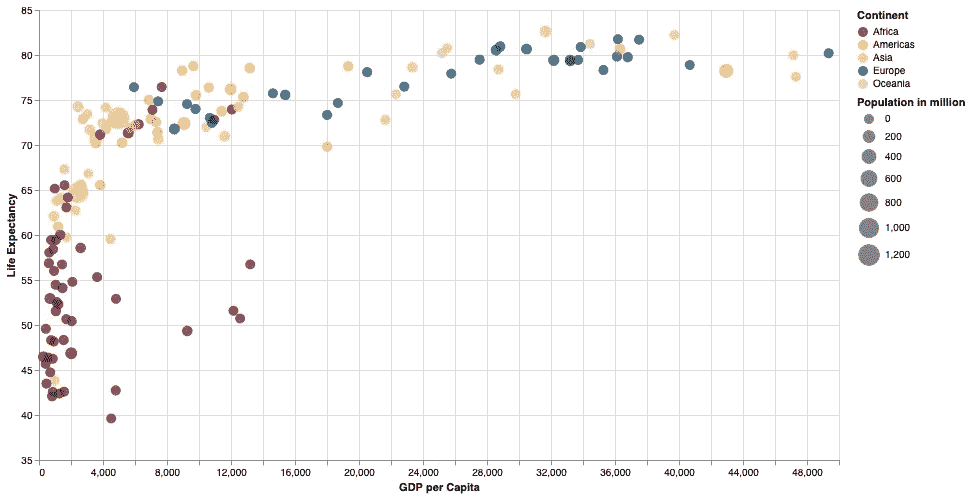*

*Altair Point Plot 02 人均 GDP 预期寿命 Gapminder 数据集-图片由作者提供*

*使用 Altair，您不需要像在 ggplot2 中那样区分颜色和填充。这是箱线图的例子。*

*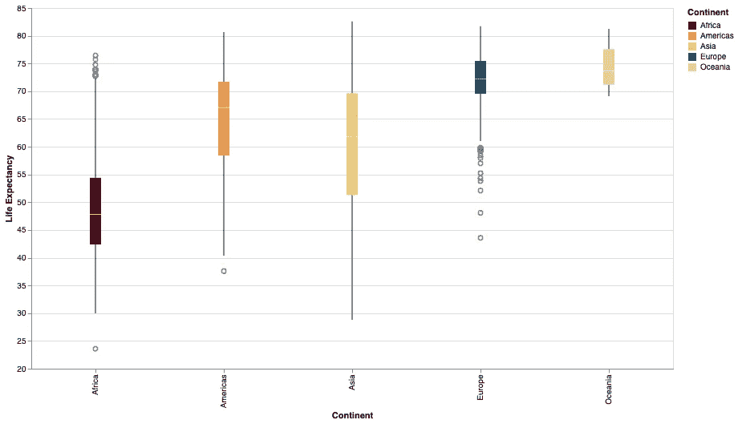*

*牛郎星方框图 03-人均国内生产总值预期寿命 Gapminder 数据集-图片由作者提供*

# *使用 python-Seaborn 应用调色板*

*Seaborn 是一个出色的 python dataviz 库，它提供了大量的颜色功能。阅读官方文章“[选择调色板](https://seaborn.pydata.org/tutorial/color_palettes.html)”了解更多信息。*

*首先，让我们导入必要的库。*

*然后构建图表。请注意我将调色板设置为 MetBrewer 调色板之一的第一个语句。由于 Seaborn 是在 matplotlib 的基础上构建的，我们进行了不止一次的函数调用来构建情节，即设置标签和图例文本。*

*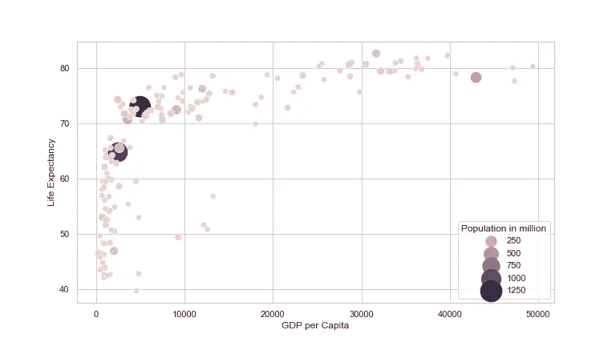*

*Seaborn Point Plot 01 人均 GDP 预期寿命 Gapminder 数据集-图片由作者提供*

*不幸的是，尽管使用了相同的调色板，我还是无法再现 Altair 或 ggplot2 中的调色板用法。下一个图显示了如何为大陆变量使用颜色。*

*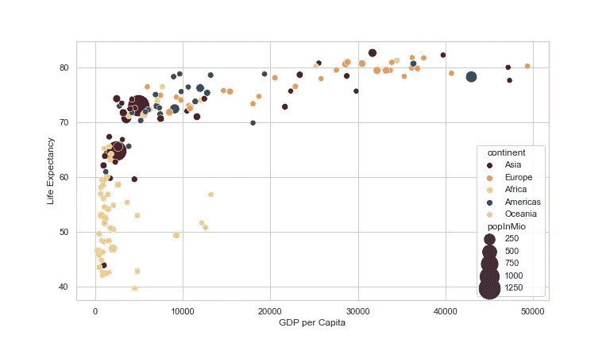*

*Seaborn Point Plot 02 人均 GDP 预期寿命 Gapminder 数据集-图片由作者提供*

*最后，关于 Seaborn 的箱线图的代码。我使用离散调色板来填充图中的方框。*

*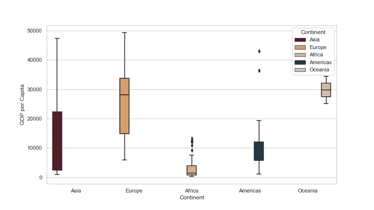*

*Seaborn Box Plot 03 人均国内生产总值预期寿命 Gapminder 数据集-图片由作者提供*

# *结论*

*在这篇文章中，我想分享我在寻找实用和精彩的调色板方面的资源，向您介绍一个适用于 R 和 Python 的调色板包，并向您展示如何将它应用于 ggplot2、Altair 和 Seaborn。*

> *请注意，我是一个仍在学习和努力提高的从业者。所以请给我留下你的想法和想法。*

*如果你想了解更多关于我的旅程，请考虑跟随我，或者如果你不是一个媒体成员，请考虑[加入这里](https://gscheithauer.medium.com/membership)。非常感谢。*

*格雷戈尔*