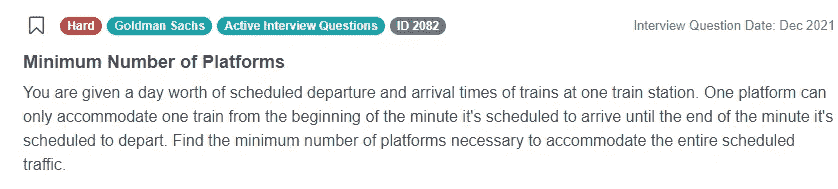
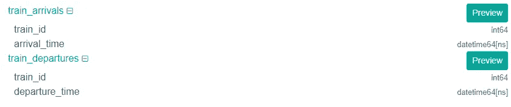
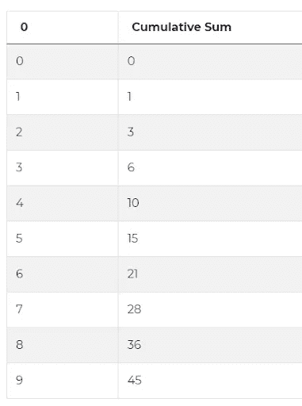
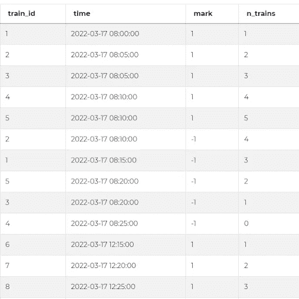

# 如何使用 cumsum()解决 Python 优化问题

> 原文：<https://towardsdatascience.com/how-to-use-cumsum-to-solve-python-optimization-questions-ab73f617a347>

来自高盛的这个非常有趣的 Python 面试问题是一个关于优化的数据科学面试问题大家庭的一个很好的例子。了解如何使用累加和运算符来解决此类问题。


作者在 [Canva](https://canva.com/) 上创建的图片

# Python 优化问题

**最小平台数**

这个问题的标题是最小站台数，它说我们在一个火车站有一天的列车预定出发和到达时间。还规定了一个站台只能容纳一辆列车，从它预定到达的时刻开始，直到它预定离开的时刻结束。然后，我们被要求找到容纳全部预定流量所需的最少站台数。



截图来自 [StrataScratch](https://platform.stratascratch.com/coding/2082-minimum-number-of-platforms?python=1&utm_source=blog&utm_medium=click&utm_campaign=medium)

问题链接:[https://platform . stratascratch . com/coding/2082-最小平台数](https://platform.stratascratch.com/coding/2082-minimum-number-of-platforms?python=1&utm_source=blog&utm_medium=click&utm_campaign=medium)

这是一个很难的问题，因为不容易计算出如何从列车时刻表中提取最少的站台数。由于数据分布在两个不同的表中，这就更加复杂了。关键问题是设计一个不仅正确，而且高效快速的解决方案——这是使用累积和可以帮助我们实现的。

# 了解您的数据

通过理解提供的数据来开始解决面试问题总是好的。在实际采访中，您通常只会看到表及其列的高级描述，因此更多的是了解数据的结构，而不是看到实际的记录。



截图来自 [StrataScratch](https://platform.stratascratch.com/coding/2082-minimum-number-of-platforms?python=1&utm_source=blog&utm_medium=click&utm_campaign=medium)

正如已经提到的，这个问题的数据分布在两个表中，但是让我们看看这里到底发生了什么。有两个非常简单的表，每个只有两列。第一个表表示火车到达，因此我们有每辆火车的 ID 和它到达我们车站的时间。类似地，第二个表表示火车出发，它再次具有火车的 ID 和象征出发时刻的时间。

这个问题指定了一个站台只能容纳一列火车，从它预定到达的时刻开始到它预定离开的时刻结束，所以我们可以假设两个表中的时间都是小时和分钟，就像我们从标准火车时刻表中所期望的那样。

# 使用累积和来解决这个 Python 优化问题

在开始编写代码之前，让我们看看可以采取什么方法来解决这个 Python 面试问题。实际上有多种可能的方法。由于这只是一天的数据，我们可以循环一天中的所有时间，虚拟模拟整个时间线，计算一天中每个时刻所需的平台数量，并最终选择最高值。另一个解决方案是遍历数据集两次，这样对于每一个训练，我们将得到一个与它重叠的所有其他训练的列表，并使用最大列表的大小作为答案。然而，这两种方法都过于复杂且计算昂贵。

在本文中，您将学习一个更短、更有效的解决方案，它可以使用累积和来解决这个问题和其他类似的优化问题。累积总和有时称为累计总和，是一种数学运算，对于一个数字序列，它返回另一个长度相同的序列，其中 k 值是原始序列中元素 1 到 k 的总和。

在 Python 中，累积和是一种操作，我们可以使用 Pandas 库中的函数 cumsum()将它应用于数据集。举个例子，下面的代码创建了一个空的 DataFrame，这就是我们在 Pandas 中所说的数据表，并使用一个 range 函数添加了一个填充了从 0 到 9 的值的列。

```
numbers = pd.DataFrame(range(10))
```

然后，我们可以创建一个新列，返回这个数字序列的累积和。这是通过对原始序列应用函数 cumsum()来实现的。

```
numbers[ 'Cumulative Sum' ] = numbers.cumsum() numbers
```



截图来自 [StrataScratch](https://platform.stratascratch.com/coding/2082-minimum-number-of-platforms?python=1&utm_source=blog&utm_medium=click&utm_campaign=medium)

原始序列的顺序非常重要，因为这也决定了在累积和中计算和的顺序。运行下面的代码，看看如果我们添加一个数字与之前相同但顺序相反的新列，并将累积和应用到这个新列会发生什么。

```
import pandas as pd

numbers = pd.DataFrame(range(10))
numbers['Cumulative Sum'] = numbers.cumsum()
numbers['reversed'] = list(reversed(range(10)))
numbers['Cumulative Sum 2'] = numbers['reversed'].cumsum()
numbers
```

更重要的是，当我们在原始序列中同时包含正值和负值时，累积和的结果将是一个既增加值又减少值的序列。将上面代码中的代码替换为以下 3 行代码，以查看输出:

```
numbers = pd.DataFrame([2,3,-5,3,-8,-2,7])
numbers['Cumulative Sum'] = numbers.cumsum()
numbers
```

这种情况在优化任务中非常有用，例如 Python 优化问题，每当我们需要分析随时间变化的数字时，无论是车站的列车数量还是公司的员工数量。

因此，我们可以用它来解决高盛的这个面试问题。但是在我们实际应用 cumsum()函数到数据集之前，我们需要创建一个新的列，作为累积和的基本序列。所以解决这个问题的第一步将是数据准备。

具体来说，我们可以用数字 1 标记所有到达的火车，用数字-1 标记所有离开的火车。由于到达和离开仍然在两个不同的表中，我们可以将一个表附加到另一个表的底部，以创建一个时间表。

至此，我们只剩下一长串到达和离开的火车。每一行代表一次到达或离开，并用值 1 或-1 标记。你能看出这些 1 和-1 值是如何帮助我们解决这个问题的吗？由于每个值 1 表示车站多了一列火车，每个值-1 表示少了一列火车，因此我们可以应用累积和来查看车站的火车数量在一天中的变化情况，并提取车站的最高火车数量。

但是在我们将 cumsum()函数应用于本专栏之前，还有一个问题需要解决。正如我所展示的，当使用累积和时，排序是非常重要的，所以让我们在继续之前对数据集进行排序。因为我们想知道数字是如何随时间变化的，所以我们需要使用 time 列按时间顺序对所有的到达和离开进行排序。

只有现在我们才能应用 cumsum()函数。再一次，累计总和将告诉我们，对于表中的每个时间戳，此时有多少列车在车站。从那里，提取解决方案变得微不足道。累计求和结果基本象征着需要多少平台。这个数字在一天中随着火车的到达和离开而波动。因此，为了找到平台的最小数量，我们只需要从累积和中选择最大值。

# 代码执行


作者在 [Canva](https://canva.com/) 上创建的图像

一旦我们定义了所有这些高级步骤，是时候将它们转换成 Python 代码了，该代码将实际返回这个最小数量的平台。第一步是用 1 标记到达，我们可以通过获取数据帧或表 train_arrivals 并在其中创建一个新列来实现，我们称之为“标记”。该列的每一行都需要有一个值 1，但是在 Python 中，它应该等于 1 就足够了。

```
train_arrivals['mark'] = 1
train_arrivals
```

一旦执行了这段代码，结果就会有一个新的列，其中填充了值 1——正如我们所预期的那样。接下来，我们可以做一件非常类似的事情，用-1 标记偏离。这一次，让我们以 train _ departures 数据帧为例，再次向它添加一列。该列的名称需要与 train_arrivals 中的名称相同，因为我们在那里使用了“marks ”,所以我们也需要在这里使用它。然后，再补充一句，这个应该等于-1 就够了。

```
train_departures['mark'] = -1
train_departures
```

在追加两个数据帧之前，我们需要确保两个数据帧中的所有列名都相同。除了具有不同名称的列 arrival_time 和 departure _ time 之外，几乎都是如此。因此，在继续之前，我们需要重命名这两列，使它们具有相同的名称。由于这些列仍然在两个不同的数据帧中，我们将需要两个类似的行来一次一个地更改它们的名称。为此，我们可以应用 Pandas rename()函数，在该函数中，我们需要指定我们希望专门处理列名。然后，我们可以使用您可能从 Python 字典中了解到的键-值语法，即当前名称 arrival_time 应该替换为另一个名称，比如“time”。然后可以应用相同的逻辑来更改 train _ departures 表中的列名。

```
train_arrivals = train_arrivals.rename(columns={ 'arrival_time' : 'time' }) train_departures = train_departures.rename(columns={ 'departure_time' : 'time' })
```

现在我们准备将一个表追加到另一个表中。这听起来可能很复杂，但实际上是一个简单的操作，从一个数据帧中取出行，然后将它们添加到另一个数据帧的底部。在 Python 中，我们可以像这样简单地使用 append()函数，指定函数外部的第一个数据帧和第二个数据帧作为它的参数。因为这将导致所有的到达和离开都在一个单一的数据帧中，让我们称之为“时刻表”。

```
*# Mark arrivals with 1s*
train_arrivals['mark'] = 1
*# Mark departures with -1s*
train_departures['mark'] = -1

*# Match column names in both DataFrames*
train_arrivals = train_arrivals.rename(columns={'arrival_time': 'time'})
train_departures = train_departures.rename(columns={'departure_time': 'time'})

*# Append one table to another*
timetable = train_arrivals.append(train_departures)
```

现在在我们的数据框架“时刻表”中，我们首先有所有的到达，然后是所有的离开。所以下一步是按时间顺序对事件进行排序。为此，我们可以使用 Pandas sort_values()函数。在括号内，我们可以指定我们希望按时间列和升序排序——这相当于从最早的时间到最近的时间，或者简单地说，按时间顺序。添加以下代码，查看行的顺序是如何变化的。

```
timetable = timetable.sort_values(by='time', ascending=True)
```

在这里，重要的是再提一件事。可能会出现一列火车同时到达和一列火车同时离开的情况。例如，这发生在 8:10。在这些情况下，我们需要确保这些事件的顺序也是正确的，否则，结果可能会不同。在这种情况下，问题是一个站台只能容纳一辆火车，从它预定到达的时刻开始，直到它预定离开的时刻结束。这就意味着我们可以想象到站的列车在 8:10:00 进站，出站的列车在 8:10:59 出站。

因此，在这种情况下，进站列车排应始终在出站列车排之前。为了反映这一点，我们可以修改我们的 sort_values()函数，按照时间和标记进行排序。但在我们的情况下实际上没有必要。这是因为之前我们将 train _ departures 数据帧附加到 train_arrivals 数据帧的底部，这样可以自动对出发前的到达进行排序。这就是为什么有时我们添加数据帧的顺序也很重要。

继续我们的解决方案，现在我们可以使用我们的秘密武器，将累积和应用于“标记”列。同样，在 Python 中，我们可以使用函数 cumsum()并将其应用于这样的列。我们可以将累积和的结果存储在一个新的列中，让我们称之为“n_trains ”,因为它代表了每次该数字变化时车站的列车数。

```
timetable['n_trains'] = timetable['mark'].cumsum() 
```



截图来自 [StrataScratch](https://platform.stratascratch.com/coding/2082-minimum-number-of-platforms?python=1&utm_source=blog&utm_medium=click&utm_campaign=medium)

当我们运行这段代码时，您可以看到带有累计和的新列。正如我们所预料的那样，每当一列火车到站时，这个总数就增加，而随着每一列火车的离开，这个总数就减少。这也显示了车站有多少趟列车。

因为根据问题，一个站台只能容纳一辆列车，所以处理该列车交通所需的最少站台数量将等于同时在车站的最多列车数量。或者换句话说，是 n_trains 列中的最大值。要提取它，我们可以简单地使用 max()函数，这是这个 Python 面试问题的完整解决方案和答案。

```
*# Mark arrivals with 1s*
train_arrivals['mark'] = 1
*# Mark departures with -1s*
train_departures['mark'] = -1

*# Match column names in both DataFrames*
train_arrivals = train_arrivals.rename(columns={'arrival_time': 'time'})
train_departures = train_departures.rename(columns={'departure_time': 'time'})

*# Append one table to another*
timetable = train_arrivals.append(train_departures)

*# Sort the events chronologically*
timetable = timetable.sort_values(by='time', ascending=True)

*# Calculate cumulative sum from 1 and -1 values*
timetable['n_trains'] = timetable['mark'].cumsum()

*# Select maximum value from cumulative sum*
result = max(timetable['n_trains'])
```

## 结论

在本文中，您可以学习如何使用累加和来解决 Python 中的优化问题。这只是这个问题的一种可能的解决方案，但是如上所述，还有其他的方法和解决方案。我们的建议是，通过构建问题的解决方案来练习回答面试问题，但总是试图想出其他解决问题的方法，也许你会想到一个更有效或更复杂的方法。还要记住，这个问题只是众多优化问题中的一个例子，许多优化问题都可以用类似的方式解决。

如果你想在亚马逊、谷歌、微软等顶级公司的数据科学面试中练习更多的 Python 问题。，查看我们在[*【30 强 Python 面试问答】*](https://www.stratascratch.com/blog/top-30-python-interview-questions-and-answers/?utm_source=blog&utm_medium=click&utm_campaign=medium) 上的帖子。

*最初发表于*[*【https://www.stratascratch.com】*](https://www.stratascratch.com/blog/how-to-use-cumsum-to-solve-python-optimization-questions/?utm_source=blog&utm_medium=click&utm_campaign=medium)*。*