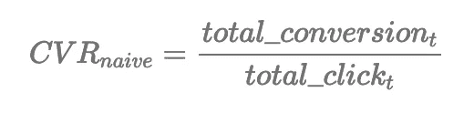
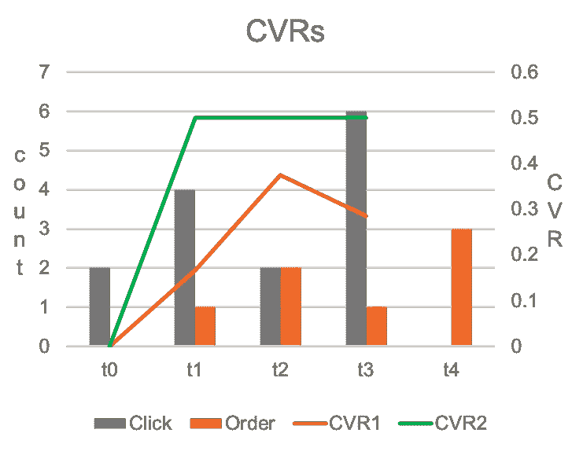
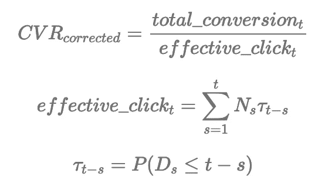
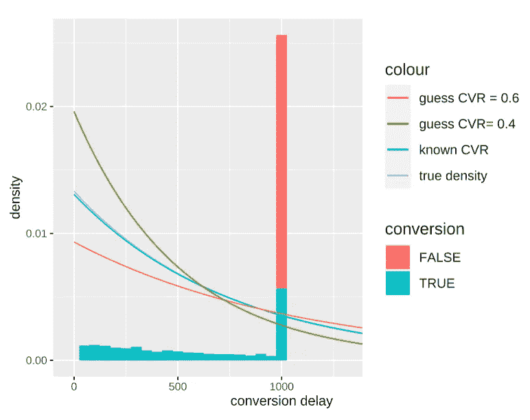
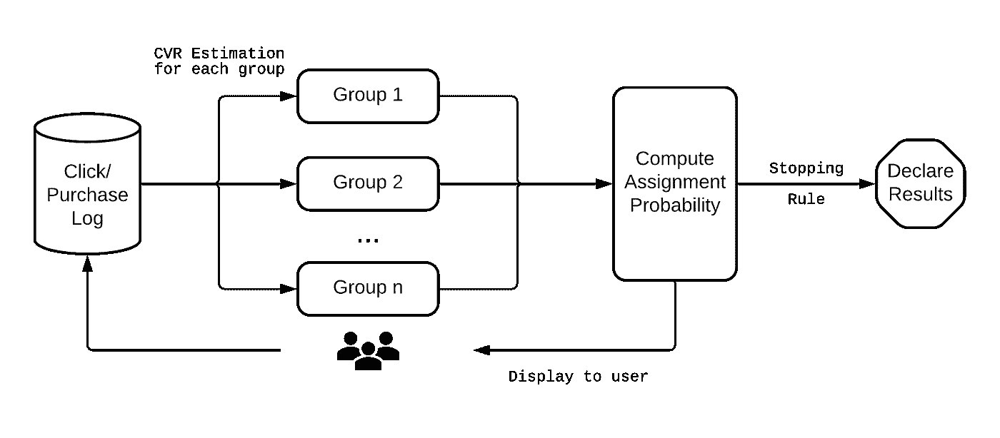
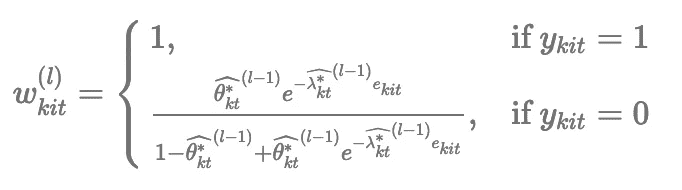
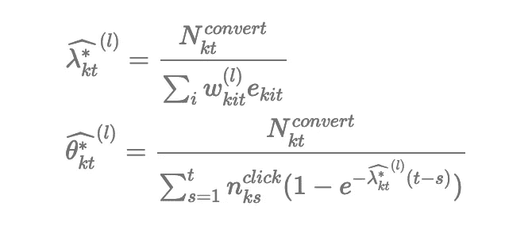
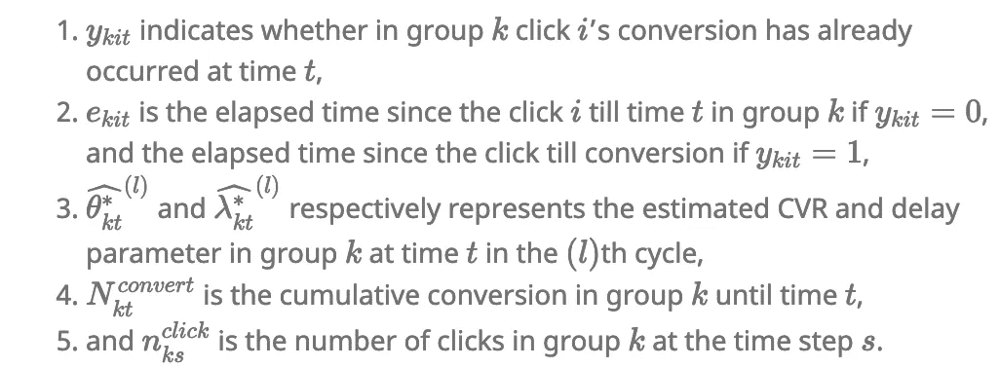
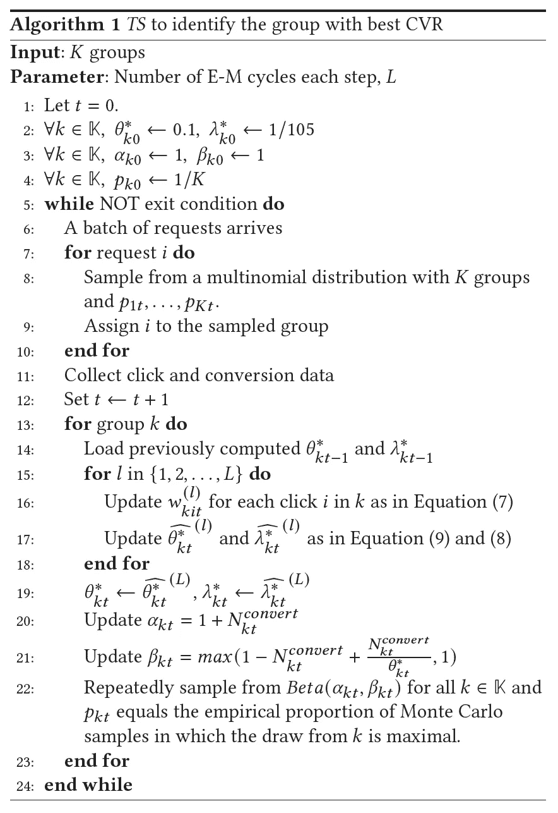

# 如何在多臂强盗实验中使用转化率(CVR)作为目标

> 原文：<https://towardsdatascience.com/how-to-use-cvr-as-an-objective-in-multi-armed-bandit-experiments-4dfd2ab48a24>

## 包含代码示例的分步指南

照片由 [Unsplash](https://unsplash.com?utm_source=medium&utm_medium=referral) 上的[米切尔·布茨](https://unsplash.com/@valeon?utm_source=medium&utm_medium=referral)拍摄

# **简介**

多臂土匪(MAB)已经成为一个越来越重要的实验工具，并已被广泛采用的行业巨头，如谷歌，Meta，网飞，领英等。进行有效的实验。然而，广泛使用的 MAB 测试设计要求感兴趣的目标提供即时反馈，以便更新每个变量的分配概率。这就是为什么你能找到的大多数运行 MAB 实验的教程可能都是以点击率(CTR)为目标的。

所以在这篇文章中，我想告诉你如何运行一个多臂土匪实验，为目标，采取重大延误，以实现如转换率(CVR)。

> 这篇文章引用了我在 2022 年网络大会上发表的论文

# **为什么要进行多臂强盗实验？**

假设你正在开展一项在线广告活动，并试图找到能给你的产品带来最高转化率的最佳平面设计，你将需要进行一项实验。

您可以运行一个经典的 A/B/n 测试，将固定比例的用户分配给竞争设计，然后在收集足够的数据后进行分析。然而，有两个常见的问题是 A/B/n 测试经常被批评的。当处理像 CVR 这样的延迟指标时，这些问题更加突出，因为完成实验需要更长的时间。

1.  大量的实验成本。因为 A/B/n 测试中的所有竞争处理都保证了样本大小的固定部分，所以即使是“糟糕”的处理也可能暴露给大量用户，这可能会对用户体验造成伤害。更长的实验意味着更大的实验成本。
2.  如果分析不正确，容易做出错误的决定。A/B/n 测试旨在仅在达到目标样本量时进行分析。但是缺乏经验和耐心的实验者往往倾向于在实验前偷看结果并做出决定，这可能导致错误的结论。更多讨论见[这篇博客](https://www.lucidchart.com/blog/the-fatal-flaw-of-ab-tests-peeking)。实验时间越长，出错的机会就越多。

我们的英雄来了，多臂强盗范式。在这种范式中，我们将我们的竞争广告设计视为许多不同的老虎机。每个老虎机都有自己的成功率(转化率)。我们想找到一个速度最好的老虎机，然后继续拉它的手臂。MAB 算法将提供一种原则性的方法，在整个实验中反复调整分配比，直到最佳处理接收到大部分样本。

MAB 的优势在于降低了实验的机会成本，而且不受窥视。

# 计算 CVR 的问题是

现在你可能会想，MAB 听起来不错，但 CVR 有什么特别之处呢？

转换率是行业中非常常见和重要的指标。但与点击率不同的是，转化信号很稀疏，而且往往有延迟。例如，电子商务网站用户可能在他们第一次开始浏览后的几个小时甚至几天都没有完成他们的订单。这种不确定的延误会给我们带来麻烦。

在本文中，我们遵循在线广告行业的标准，将 CVR 定义为导致转化(例如购买)的点击百分比。

## 天真的 CVR

这是业内人士通常使用的。这个 CVR 公式的问题是，在我们计算它的值的任何时候，我们都会错过所有被延迟且尚未观察到的转换。所以这个天真的 CVR 会低估真正的 CVR。

我们可以在下面的例子中看到这一点。

作者图片

在这个简单的实验中，我们模拟了真实 CVR 等于 0.5 的情况，并假设所有转换在点击后总是延迟 1 小时。显然，在实践中，转换延迟不会这么简单，但本例中的逻辑同样适用。

例如，为了计算 t2 时的简单 CVR，我们需要将所有橙色条作为分子相加，将所有灰色条作为分母相加。计算出的原始 CVR 由图中的红线表示。显然，它低估了真正的 CVR。

下面的代码创建了一个更通用的模拟器。它产生具有指数延迟分布的转换，并跟踪转换随时间的可观测性。这个模拟器以后可以用来测试我们的 Bandit 代码。

## 纠正 CVR

在上面的例子中，纠正低估的一种方法是在计算 t2 的 CVR 时，只使用 t0 和 t1 的灰条作为分母。然后，修正的 CVR 估计等于 0.5，这是潜在的事实。

这种补救措施能够奏效的原因是，我们知道在 t2 的点击没有任何机会在 t2 产生转化(它们相应的转化只能在 1 小时后观察到)。所以 t2 时的那些点击不应该包括在分母中。图中的绿线是使用这种思想计算的，并且恢复了 t0 之后的真实 CVR。

这种方法可以推广到更复杂的情况，其中延迟是随机的，并遵循一般的延迟分布(其 CDF 表示为τ)

简单来说，我们要对点击进行重新加权来计算有效点击，一次点击的权重是基于从点击到现在观察到其转化的概率。最近点击越多，权重越低。

如果延迟分布已知，这个公式可以证明是一个无偏估计量。

## 估计延迟分布的挑战

实际上，我们不知道真实的延迟分布是什么。在本节中，我们将讨论估计延迟分布的挑战。

在实验过程中，观察到的延迟是右删失的。这意味着，如果我们绘制转换延迟直方图，我们无法观察到超过某个阈值的延迟。就像下面的例子，

作者图片

本例中，我们试图估算 t=1000 时的延迟分布，只能观察到小于 1000 的转换延迟。

当延迟等于 1000 时，图中有一个尖峰。那些是还没有转化的点击。这些点击有两种可能的结果。要么它们将在未来转换，意味着具有大于 1000 的延迟；或者它们永远不会导致转换，相当于有一个无限长的延迟。图中的红色阴影标记了这些未转换。

我们只对估计蓝色样本的延迟分布感兴趣。如果红色部分可以排除，估计相对容易做(这是标准的生存分析)。不幸的是，在实验过程中，没有办法区分这两种可能性，除非我们知道真正的最终 CVR。

但是最终的 CVR 是我们想要估计的。我们兜了一圈回来了！

# 如何和 CVR 一起管理 MAB

作者图片

我们提出的系统的概述已在上面介绍过了。有两个与算法相关的主要组件。第一个部分将点击和转换日志作为输入，并估计实验中每个处理组的 CVRs。第二组件基于来自第一组件的所有估计的 CVR 来计算分配概率。如果不满足停止规则，将根据分配概率向用户显示新广告。然后重复该过程。

## CVR 估计

在第一部分中，我们使用[期望最大化](https://en.wikipedia.org/wiki/Expectation%E2%80%93maximization_algorithm)方法来获得每个实验组的 CVR 估计值。

首先，我们假设延迟分布是指数分布的，对于每个实验组 k 由λk 参数化。

对于每个组 k，收集组 k 中的所有点击。首先计算 I 跟随的每个点击的权重

然后更新估计值

在哪里

在每个时间步长 t，我们将上面定义的 E-M 计算迭代几个周期，以确保得到的估计是稳定的。设 L 代表循环总数。然后保存每个时间步长的最终估计，并用作下一个时间步长的先验，即

下面的代码提供了该过程的一个示例实现。每个 Arm 类对应于上面描述的一个组，负责获取相关的日志数据，并获得λ和θ的估计值。

## 汤普森取样

一旦我们得到每个组的估计 CVR，我们就可以使用 Thompson 抽样来计算分配概率。

为了使用 Thompson 抽样，我们需要知道估计 CVR 的分布。因为从 EM 过程中得到它不是微不足道的，所以我们采用启发式方法来假设每个组 k 的 CVR

在时间 t 遵循β分布，β(αkt，βkt)。参数更新如下:

简单来说，βkt 等于有效点击次数+ 1。

一个组的分配概率是该组提供最高期望 CVR 的后验概率。我们使用蒙特卡罗模拟来计算这些值。

αkt 和βkt 更新和β采样的代码嵌入在上面的 Arm 类中。通过调用每个分支的`draw_beta_sample`方法，我们可以如下计算分配概率。

下图总结了指数分布延迟方法的整个过程。

作者图片

# 结论

这就是了。现在你可以开始用 CVR 度规运行你的多臂强盗实验了。这篇文章是基于我们的论文[延迟二进制反馈的适应性实验](https://arxiv.org/pdf/2202.00846.pdf)而写的。如果您想假设除指数分布之外的延迟分布，或者使用其他类型的延迟反馈，您可以在本文中找到更多讨论。对于本文中显示的完整代码，您可以在这里找到它们[。](https://gist.github.com/znwang25/490545dbe762dcfdae5329b2e2fa120d#file-everything_in_a_file-py)