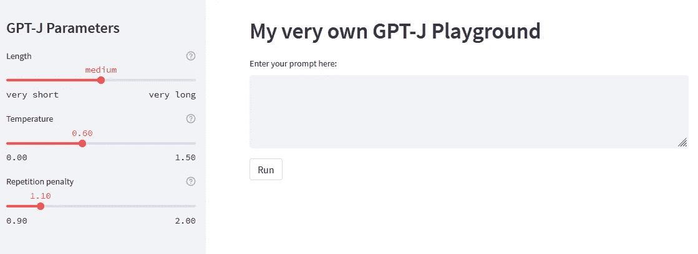
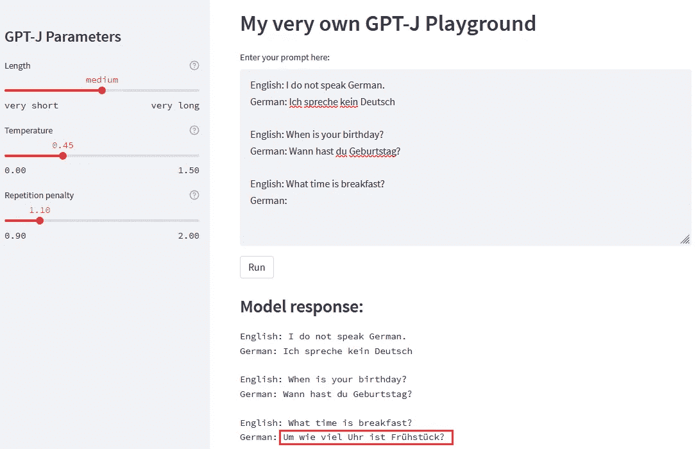
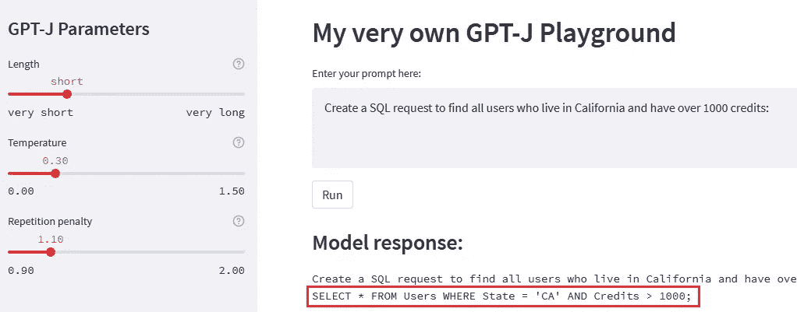
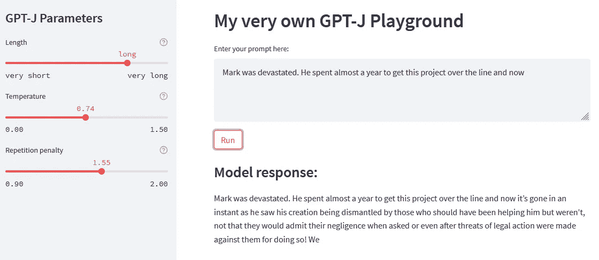

# 如何使用 GPT J 为(几乎)任何自然语言处理任务

> 原文：<https://towardsdatascience.com/how-to-use-gpt-j-for-almost-any-nlp-task-cb3ca8ff5826>

## 提示工程以及它如何与文本生成模型一起使用

马库斯·温克勒在 [Unsplash](https://unsplash.com?utm_source=medium&utm_medium=referral) 上的照片

# 这是怎么回事？

在[之前的一篇博文](/how-to-build-your-own-gpt-j-playground-733f4f1246e5)中，我们看了看如何使用 [Streamlit](https://streamlit.io/) 、[拥抱脸](https://huggingface.co/)和[亚马逊 SageMaker](https://aws.amazon.com/sagemaker/) 来建立我们自己的 GPT-J 游乐场。有了这个平台，我们现在可以开始试验模型并生成一些文本，这很有趣。但是最终我们希望模型能够真正执行 NLP 任务，比如翻译、分类等等。在这篇博文中，我们将看看如何使用 GPT-J 模型的不同参数和特定提示来实现这一点。

这篇博文将建立在[上一篇博文](/how-to-build-your-own-gpt-j-playground-733f4f1246e5)和这篇 [Github repo](https://github.com/marshmellow77/gptj-playground) 的基础上，假设你已经建立了自己的 GPT J 游乐场。这篇博文的代码可以在同一个 Github repo 中的一个单独的分支[中找到。](https://github.com/marshmellow77/gptj-playground/tree/prompt-engineering)

# 添加参数控制

在我们开始快速工程之前，我们应该添加一些参数，用这些参数我们可以在一定程度上控制模型的行为。一篇详细描述这些参数的博文可以在[这里](https://huggingface.co/blog/how-to-generate)找到。在本教程中，我们将只介绍其中的三个:响应长度，温度和重复惩罚。响应长度是显而易见的——它控制模型的响应时间。温度是衡量模型创造性的一个标准——温度越高，模型的反应就越“有创造性”。重复惩罚也是不言自明的——该值越高，模型对重复单词的惩罚就越多。

让我们在我们的 Streamlit 应用程序中创建一个侧栏，它将允许我们在 UI 中控制这些参数的值:

现在，这些控件将出现在用户界面的侧边栏中:

作者图片

我们还需要确保在调用模型端点时，通过将这些参数的值合并到有效负载中，将它们传递给模型:

现在我们已经将这些参数添加到了我们的应用程序中，我们可以开始尝试不同的提示。

# 快速工程

让我们先来看看[维基百科对提示工程](https://en.wikipedia.org/wiki/Prompt_engineering)的定义:

> 提示工程是人工智能，尤其是自然语言处理(NLP)中的一个概念。在 prompt 工程中，任务的描述被嵌入在输入中，例如，作为一个问题，而不是被隐含地给出。

这意味着我们可以创建一些文本作为模型的输入，告诉模型要执行哪个任务。让我们看一些例子。

## 分类

让我们从一个相对“简单”的任务开始，文本分类:

作者图片

在本例中，我们明确说明了任务(将食物与国家相匹配),并提供了几个示例。这被称为少量学习，因为模型能够从这些例子中学习任务是什么(除了任务语句之外)。

我们选择了低温和低重复惩罚，因为我们不希望这个模型对这个任务太有创造性。我们还将响应长度保持在中等，因此模型继续使用列表。大多数情况下，这将是有趣的，但不可取的，因为我们希望模型分类一个特定的文本(“鱼和薯条”)。这可以通过一点后处理来弥补，即在换行后删除所有内容。

## 翻译

文本生成模型对于翻译任务也表现良好，只要该模型已经被训练成多种语言。让我们省略明确的任务陈述，只提供几个例子:

作者图片

首先，对于那些不熟悉德语的人来说，这是一个正确的翻译(准确地说，是几种可能的正确翻译之一)。因此，该模型甚至能够在没有明确说明的情况下识别任务。我们再次将温度和重复惩罚的值保持得相当低。例如，为温度选择一个较高的值会使模型有点太有创意。值为 0.6 时，会产生以下翻译:“嗯，什么是更好的？”(“它什么时候做啤酒？”).话说回来，这可能是德语中的一个常见问题；)

## SQL 生成

让我们把事情变得更难一点，不提供任何例子。相反，我们只是直接告诉模型该做什么:

作者图片

这种技术被称为零镜头学习，因为我们不提供例子，仍然期望模型理解任务。在这种情况下，它实际上工作得很好，而且，总的来说，文本生成模型在没有任何例子可以学习的情况下表现得惊人地好。

我们再次为温度和重复代价选择了较低的值，因为 SQL 查询具有固定的结构，因此我们不希望模型太有创造性。

## 自由文本生成

你可能已经注意到，到目前为止，我们并没有太多地使用参数控制:温度和重复惩罚都保持在较低的水平。这是因为我们希望建模来完成特定的任务，所以我们实际上不希望它太有创造性。让我们尝试一个不同的用例，我们希望模型更有创造性。

作者图片

在这种情况下，我们希望将温度至少提高到中等，因为我们希望模型更有创意。在这样做的时候，我们也经常发现模型经常使用相同的单词，所以我们也增加了重复惩罚。根据我们希望模型产生的文本类型，这些值可以进一步增加。

# 结论

在本教程中，我们开始尝试各种提示来完成 NLP 任务，如分类、翻译等。然而，到目前为止，我们只是触及了表面:我们还可以尝试更多的任务，比如总结、生成电子邮件回复等。我们还可以在应用程序中包含更多的参数来控制模型的行为，如 Top-P，beam search 等。

我发现试验这些文本生成模型非常有趣，我希望你现在也能在关注这篇博文并建立这个 GPT-J 游乐场之后做同样的事情。