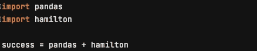

# 如何在 5 分钟内将汉密尔顿用于熊猫

> 原文：<https://towardsdatascience.com/how-to-use-hamilton-with-pandas-in-5-minutes-89f63e5af8f5>



这个帖子的感悟(非真实代码)。图片作者。

汉密尔顿是一个开源的、声明性的 Python 数据流微框架。在这篇文章中，我将尝试快速解释它是什么以及如何在熊猫身上使用它；阅读这篇文章不会花费你超过五分钟的时间。关于背景故事和更长的介绍，我们邀请你阅读这篇 [TDS 帖子](/functions-dags-introducing-hamilton-a-microframework-for-dataframe-generation-more-8e34b84efc1d)。

# 什么是汉密尔顿？

Hamilton 是一种自以为是的编写 python 数据转换函数的方式。它迫使两件事:

1.  您编写声明性的 python 函数来封装您的数据转换逻辑。
2.  从运行时逻辑中分离出转换逻辑。

## 这到底是什么意思？

对于上面的第(1)点，不要编写操作数据帧的 Pandas 代码，它看起来像这样:

```
df['age_mean'] = df['age'].mean()
df['age_zero_mean'] = df['age'] - df['age_mean']
df['age_std_dev'] = df['age'].std()
df['age_zero_mean_unit_variance'] = df['age_zero_mean'] / df['age_std_dev']
```

你应该这样写:

```
# a_function_module.py
def age_mean(age: pd.Series) -> float:
    *"""Average of age"""* return age.mean()

def age_zero_mean(age: pd.Series**,** age_mean: float) -> pd.Series:
    *"""Zero mean of age"""* return age - age_mean

def age_std_dev(age: pd.Series) -> pd.Series:
    *"""Standard deviation of age."""* return age.std()

def age_zero_mean_unit_variance(age_zero_mean: pd.Series**,** age_std_dev: pd.Series) -> pd.Series:
    *"""Zero mean unit variance value of age"""* return age_zero_mean / age_std_dev
```

没有要操作的中心 dataframe 对象。相反，你在“专栏”中思考，并且只思考你需要表达什么来创建一个特定的专栏。

更具体地说，函数使用*函数名*声明它们输出的内容，并使用*函数参数*声明它们需要的输入内容。计算的逻辑完全包含在函数中，这就是我们所说的封装。函数名很重要，因为它映射到您可以*请求*输出的内容。

*记住函数如何映射到 Pandas 数据帧的一个快速方法是，函数名映射到列，函数参数映射到其他列或其他输入。*

对于第(2)点，您的变换函数位于 python 模块中，该模块独立于用于获取数据帧的脚本。也就是说，要实际计算上述内容，您需要编写一个如下所示的文件:

```
import pandas as pd
from hamilton import driverimport a_function_module # where your transforms live

dr = driver.Driver({'age': pd.Series([...])}**,** a_function_module)# Here we're only requesting two outputs, but you could additionally 
# request `age_mean`, `age_zero_mean`, `age_std_dev` ...
df = dr.execute(['age', 'age_zero_mean_unit_variance'])
```

这迫使你遵循一个被称为解耦的软件工程原则。解耦对于数据工作来说是一个好主意，因为这意味着你的转换函数不关心你如何加载或获取数据，它们只关心计算。这意味着在其他上下文中重用您的 Hamilton 数据转换函数非常、非常、容易——而且不会影响任何人。

## 使用汉密尔顿的好处

无需深究细节，只要仔细想想就会明白，以下是汉密尔顿做事方式带来的一些好处:

1.  所有 Hamilton 数据转换函数都是 100%单元可测试的。函数的声明性意味着传递测试数据非常容易！
2.  所有汉密尔顿数据转换函数都是 100%文档友好的。每个功能都有一个有目的的位置来放置文档。想象一个拥有良好文档的数据工程/科学代码库😲？！
3.  可重用的转换代码。因为从一开始就存在强制解耦，这意味着作为用户，您用自己的转换函数来管理 python 模块。因为它们驻留在模块中，所以很容易在其他上下文中重用这些代码，无论是用于不同的“驱动程序”脚本，还是简单地用作库。
4.  代码基础一致性。根据以上几点，用 Hamilton 编写的特征工程代码库看起来非常标准化，因此易于维护和保养。

# 我如何使用汉密尔顿？

## 第一步。安装汉密尔顿

要开始安装 Hamilton:

`pip install sf-hamilton`

如果你正在使用笔记本环境，请看这篇关于[如何在笔记本](/how-to-iterate-with-hamilton-in-a-notebook-8ec0f85851ed)上使用 Hamilton 的文章。

## 第二步。编写您的 python 转换

创建一个 python 文件，例如 my_module.py，并用您的转换函数填充它。记住*函数名*映射到您*可以*作为输出请求的列，并且*函数参数*映射到其他列，或者您在运行时提供的输入。

```
import pandas as pd

def age_mean(age: pd.Series) -> float:
    *"""Average of age"""* return age.mean()

def age_zero_mean(age: pd.Series**,** age_mean: float) -> pd.Series:
    *"""Zero mean of age"""* return age - age_mean

def age_std_dev(age: pd.Series) -> pd.Series:
    *"""Standard deviation of age."""* return age.std()

def age_zero_mean_unit_variance(age_zero_mean: pd.Series**,** age_std_dev: pd.Series) -> pd.Series:
    *"""Zero mean unit variance value of age"""* return age_zero_mean / age_std_dev
```

## 第三步。编写一个“驱动程序”脚本，将所有东西整合在一起

创建一个 python 文件，例如 my_driver.py。

```
import pandas as pd
from hamilton import driver
import my_module

dr = driver.Driver({'age': pd.Series([...])}**,** my_module)
# execute() returns a dataframe by default
df = dr.execute(['age_zero_mean_unit_variance'])

# do something with the dataframe
```

## 第四步。运行“驱动程序”脚本

`python my_driver.py`是运行一切所需的一切！

如果你正在使用一个编排/调度系统，比如 airflow、metaflow、kubeflow pipelines、prefect 等。您可以将驱动程序脚本的内容放入要执行的 ETL 的“步骤”中。

# 你可以用汉密尔顿做的其他事情

因为这是一个快速的帖子，我们不打算在这里深入细节。但是，为了激起您的兴趣，在使用 Pandas 时，汉密尔顿为您提供了以下开箱即用的功能:

1.  扩展到“大数据”规模，因为 Hamilton 几乎免费支持 Dask、Pandas on Spark 和 Ray。参见汉密尔顿[示例文件夹](https://github.com/stitchfix/hamilton/tree/main/examples)中的代码& [这里有一些文档](https://hamilton-docs.gitbook.io/docs/extensions)。
2.  数据血统。你可以把计算的步骤形象化，并且很容易地用哈密尔顿问你的图的问题。尝试使用`dr.visualize_execution(...).`
3.  修饰功能的能力，例如有条件地包括基于配置的功能。不要用`if else`语句(例如`if region == 'US'`)来点缀你的代码，相反，你可以通过用`@config.when`来装饰一个函数来捕捉这种逻辑。这只是用 Hamilton 提供功能和额外能力的几个装饰者之一。更多信息请见我们的[文档](https://hamilton-docs.gitbook.io/docs/reference/api-reference/available-decorators)。
4.  汉密尔顿的用途不仅限于熊猫。您可以使用它来创建 numpy 矩阵、scikit-learn 模型、任何 python 对象等。！查看[我们的示例文件夹](https://github.com/stitchfix/hamilton/tree/main/examples)了解想法。

# 最后

感谢你阅读这篇文章。我们很乐意帮助您成功使用汉密尔顿。欢迎在我们的 [github 知识库](https://github.com/stitchfix/hamilton)中留下问题/评论(我们也很喜欢⭐️！)，或者加入我们的 [slack 服务器](https://join.slack.com/t/hamilton-opensource/shared_invite/zt-1bjs72asx-wcUTgH7q7QX1igiQ5bbdcg)寻求帮助，或者提供建议/改进。

## 您可能感兴趣的其他汉密尔顿帖子:

*   [如何在笔记本环境中使用 Hamilton](/how-to-iterate-with-hamilton-in-a-notebook-8ec0f85851ed)
*   [一般背景故事&汉密尔顿简介](/functions-dags-introducing-hamilton-a-microframework-for-dataframe-generation-more-8e34b84efc1d)