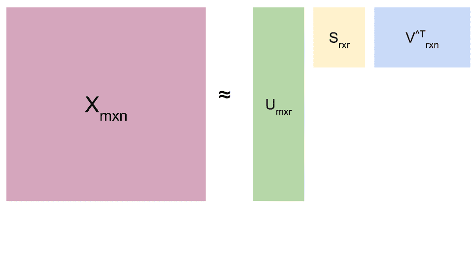
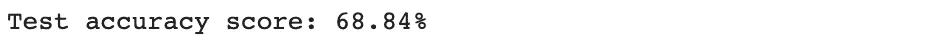

# 如何利用潜在语义分析对文档进行分类

> 原文：<https://towardsdatascience.com/how-to-use-latent-semantic-analysis-to-classify-documents-1af717e7ee52>

塔玛拉·加克在 [Unsplash](https://unsplash.com/s/photos/documents?utm_source=unsplash&utm_medium=referral&utm_content=creditCopyText) 上的照片

## 自然语言处理

## 学习一个有用的工具来克服分析文本的挑战

孩子们在地板上坐成一圈。

“扁帽子上有一个数字和一个标签，上面写着鹦鹉和煎饼”——一个孩子尖叫道

每个孩子都开始笑。

“不，不，是那只黑猫在桌子下面，它吃胡萝卜和煎饼”——另一个孩子回答道

我这才意识到他们在玩[电话](https://en.wikipedia.org/wiki/Chinese_whispers)(在阿根廷我们称之为坏电话)。

人类的交流是复杂的，主要是因为每个人表达自己的方式不同。我们可以说同一种语言，但使用不同的俚语、词汇或表达来传达相同的信息。此外，我们可以用同一个词表达两种完全相反的意思。

书面语言并不简单。除了一词多义、同义词和词汇问题，人们经常忽略标点符号，拼错或缩写单词。尽管如此，大多数人还是能理解书面或口头语言。

对于机器来说，识别这些元素并不是一件容易的事情。用表格形式表示这些特征并不容易。这就是为什么分析文本比分析结构化数据更难。

自然语言处理(NLP)提供了帮助理解文本的句法和语义的工具。NLP 允许数据科学家解决语言中的歧义。它还有助于将非结构化文本转换为结构化数据，以用于多种应用，如语音识别或情感分析。

文档分类是文本挖掘领域的一个典型问题。它的使用案例从情感分析、垃圾邮件检测到社交网络文档的高级结构化表示。

文档分类根据文档的底层结构将文档组织成组。它主要依赖于将纯文本转换成结构化数据。

# 潜在语义分析

我们来分析一下以下对某酒店的评价:

*   这家酒店非常棒，在炎热的日子里，我免费喝了很多饮料。
*   *设施非常棒，他们在游泳池免费提供饮料*。

我们可能会注意到**饮料**和**饮料**有相同的意思；他们是 T4 的同义词。同样， **served** 有两个不同的意思:有用和提供；是**多义**的一个例子。

我们可能会理解不同或相似之处。但是对于机器学习算法来说，同义词和多义词可能是一个问题。

一种解决方案是组合具有相同含义的单词，或者在语义上相连并描述一个主题的单词。

这个潜在变量或维度代表了所有这些。这就是**潜在语义分析(LSA)** 中“潜在”的含义。

LSA 是一种无监督的算法，它涉及到将一组非结构化文本转换成结构化数据。

LSA 通过使用奇异值分解找到这些潜在变量，并转换原始数据。

此外，它还是一种降维算法，因为转换后的数据比原始数据小。

## 单一向量分解

简而言之，LSA 是将 SVD 应用于表示术语和文档之间关系的矩阵(术语-文档矩阵)。

我们可以认为每个术语定义一个输入维度，每个文档指定一个样本。

奇异值分解是一种矩阵分解的方法。使用这种方法，可以将一个矩阵分解成如下所示的三个矩阵。

根据奇异值分解分解原始矩阵。

我们来解释一下上图。

*   *X* 是文档术语矩阵。它包含 m 个文档(行)中 n 个唯一单词(列)的频率。这个矩阵大约是三个矩阵的乘积:转置的 U、S 和 V。这里，r 维表示主题的数量。
*   u 是文档-主题矩阵。为了创建这个矩阵，SVD 找到 XXT 的特征向量，并将它们放入它的列中。这个操作留给 U 包含左奇异向量的列。
*   s 是具有奇异值的对角矩阵，奇异值是来自 XXT 或 XTX 的特征值的平方根。奇异值按降序排列。
*   最后，V 是字嵌入矩阵。在这种情况下，SVD 找到 XTX 的特征向量，并将它们放入它的列中，给 V 留下右奇异向量的行。

这里我们可以看到*奇异值分解*中的**分解**的含义。

因此，SVD 按照信息量递减的顺序对每个新维度进行排序。这意味着第一个维度比第二个维度承载更多的信息，以此类推。

它还将稀疏的文档术语矩阵转换成密集的文档主题矩阵。你可以使用这个矩阵，通过几个机器学习模型对文档进行分类。

## 文档分类

如前所述，LSA 将创建一个文件的矢量表示。然后，我们可以计算这些向量之间的距离。确定它们的相似性。并通过确定它们属于哪个主题来对文档进行分类。

如果主题是已知的，文档分类将需要标记的数据来训练模型。

另一方面，使用未标记数据和聚类方法可以识别文档组。

现在，让我们看看 LSA 的行动。

我们将使用一个流行的数据集进行文档分类: [*20 个新闻组*](https://www.kaggle.com/datasets/crawford/20-newsgroups) ，新闻组文档的集合。

Scikit learn 提供了一个函数来从该数据集加载文件名和数据:`fetch_20newsgroups`。

加载数据集后，需要删除电子邮件地址、网站和号码。

下一步是执行**术语频率-逆文档频率** ( [Tfidf](https://en.wikipedia.org/wiki/Tf%E2%80%93idf) )。这种技术从一组文档(或语料库)中确定一个单词在文档中的重要性。TF–IDF 值随着单词在文档中出现的次数成比例增加。然后根据语料库中包含该单词的文档数量进行偏移。这个调整是为了处理一般情况下有些词出现频率比较高的情况*。*

该操作将允许我们删除停用词，过滤出现太频繁(40%的文档)或不太频繁的术语，将单词转换为小写，并对结果单词向量进行归一化。

现在，是时候应用 LSA 或者换句话说，`TruncatedSVD`它的 python [实现](https://scikit-learn.org/stable/modules/generated/sklearn.decomposition.TruncatedSVD.html?highlight=truncatedsvd#sklearn.decomposition.TruncatedSVD)。我们需要将组件的数量设置为 20。它是数据集文档中陈述的主题数量。

最后，我们应该选择一种分类算法，并使用 LSA 数据集对其进行训练。我们会选择支持向量机。该算法的一些特点，如计算的可扩展性和易于实现，使其非常适合应用于文档分类。

现在，我们可以通过转换测试数据集并使用训练好的模型预测主题来测试模型。

准确率在 **~69%** ，有一定的提升空间。

## 优点和局限性

在过去的几年中，NLP 方法的使用已经广泛传播。LSA 也不例外，这是由于它的好处。

在 LSA，概念和它们相关的文档被一致地表示。此外，LSA 分析有助于恢复原文的语义结构和维度。

文档词汇往往很大，因此噪音是常见的。LSA 帮助对数据进行去噪处理。

但是 LSA 有一些局限性。最大的缺点之一是向量需要大量的存储和计算能力。对于长文档，LSA 需要大量的计算时间，降低了效率。

总之，LSA 是高效且易于实现的，在使用小数据时能给出好的结果。但是,**计算量很大**,而且很难事先确定主题。

我们可以使用一些方法来改进文档分类，比如使用替代的或修改的 SVD 计算方法，或者尝试其他的降维算法。

**一些资源**

1.  *懒程序员*。Python 中的自然语言处理:垃圾邮件检测、情感分析、潜在语义分析和文章旋转的主数据科学和机器学习(Python 中的机器学习)。
2.  [潜在语义分析&Python 中的情感分析](/latent-semantic-analysis-sentiment-classification-with-python-5f657346f6a3)。走向数据科学
3.  Hava1 O，Skrbek M 和 Kordik P. [用于文档分类的上下文潜在语义网络](https://www.scitepress.org/Papers/2012/41093/41093.pdf)。