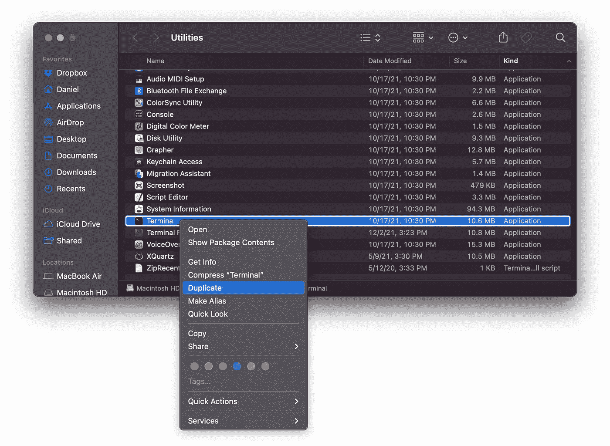
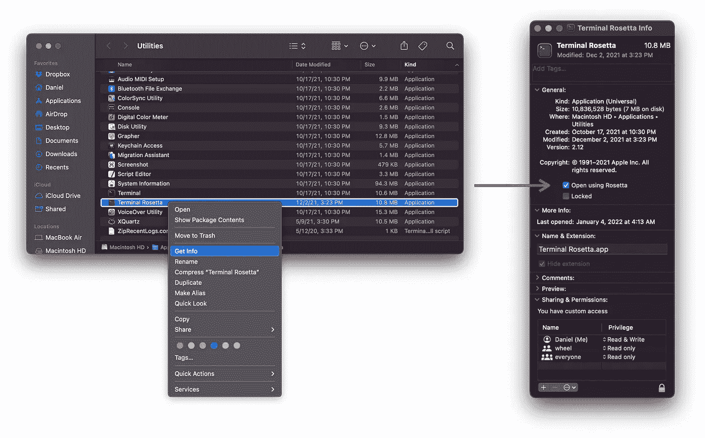

# 如何在苹果硅 M1 Mac 上管理多个 Python 版本

> 原文：<https://towardsdatascience.com/how-to-use-manage-multiple-python-versions-on-an-apple-silicon-m1-mac-d69ee6ed0250>

## 安装 ARM64 和 x86 Python 版本，并使用 pyenv 在它们之间无缝切换


尼克·里克特在 [Unsplash](https://unsplash.com?utm_source=medium&utm_medium=referral) 上的照片

*本文介绍如何使用 pyenv 管理 ARM64 和 x86 Python 环境。如果你更喜欢环境管理的康达，请看* [*我的另一篇文章*](https://medium.com/p/1e29cb3bad12) *。*

你可能永远不会在你的所有项目中使用同一个版本的 Python。一方面，Python 是一种活跃的语言，你会想要利用最新的特性( [Python 3.10](https://docs.python.org/3/whatsnew/3.10.html) 最近发布了！).另一方面，当您升级已安装的 Python 版本时，您不希望破坏所有的旧代码。作为一名数据科学家，我经常遇到这种情况——我经常需要重新运行旧的分析或项目，因此我需要一种方法在我的机器上支持多个 Python 版本。

这就是版本管理的用武之地，我的首选工具是 [pyenv](https://github.com/pyenv/pyenv) 。使用 pyenv，您可以在您的机器上安装多个 Python 版本**并在它们之间轻松切换。**

*注:本文面向 Mac 用户，尤其是 Apple Silicon Mac 用户。Linux 用户可能会从 pyenv 教程中受益，但是 Windows 用户就没那么幸运了——pyenv 没有正式支持 Windows。*

# 使用 pyenv 安装 Python 版本

使用 pyenv 安装和管理多个版本的 Python 真的很容易。参见[文档](https://github.com/pyenv/pyenv)了解全部细节，但这里有安装任何版本 Python 的简单说明:

## 1.安装自制软件

家酿是一个 MacOS 的软件包管理器。它允许你安装各种有用的工具。要安装它，请遵循这里的简单说明。

## 2.安装和配置 pyenv

pyenv 是一个 Python 版本管理工具。它允许您安装多个版本的 Python，并在它们之间轻松切换。

要安装，请遵循以下说明(或参见官方 GitHub 库上的完整安装说明):

1.  使用 brew 安装:`brew install pyenv`
2.  将下面几行添加到~/中。zprofile 和~/。zshrc(或者~/。bash_profile 和~/。bashrc 如果你还在用 bash):

```
##### ~/.zprofile #####
eval "$(pyenv init --path)" ##### ~/.zshrc #####
if command -v pyenv 1>/dev/null 2>&1; then
    eval "$(pyenv init -)"
fi
```

然后退出 shell 会话，并启动一个新的会话以使更改生效。您已经成功安装了 pyenv！

## 3.安装 Python 版本

用 pyenv 安装 Python 很容易。例如，要安装 Python 3.9.7，您可以运行`pyenv install 3.9.7`(使用`pyenv install -l`显示可安装的版本列表)。要激活环境，运行`pyenv global 3.9.7`(使其成为所有地方的默认版本)或`pyenv local 3.9.7`(使*仅*当前目录使用该版本)。

# 苹果硅苹果电脑的其他挑战

上述步骤几乎总是足够了。然而，在较新的苹果电脑上(就我个人而言，[我用的是 M1 MacBook Air](https://medium.com/towards-data-science/why-i-chose-the-macbook-air-over-the-macbook-pro-as-a-data-scientist-9207f309db0c) )，你可能会在安装某些软件包时遇到问题。当苹果从英特尔芯片转到他们内部的苹果硅芯片时，他们从 x86 架构变成了 ARM64 架构。这在很大程度上是一件好事——你在日常使用中会注意到的唯一区别是，新芯片比旧芯片更快、更高效。

不幸的是，您可能偶尔会遇到包兼容性问题。苹果的 ARM64 架构尚不支持一些 Python 包——例如，我在使用 ortools 包时就遇到了这个问题。您将在安装期间得到错误，并且您将不能在您的代码中使用这个包。最终，当开发人员为他们的包添加 ARM64 支持时，这个问题应该会消失，但与此同时，您必须找到另一个解决方案。

幸运的是，有一个短期的解决方案:**你可以在 Apple Silicon Mac 上安装 x86 架构的 Python。更好的是，您仍然可以使用 pyenv 来管理您的环境。**

# 使用 Rosetta 和 pyenv 的 x86 环境

***如果你需要使用只在 x86 架构上工作的包，只需要遵循这些步骤。首先尝试前面的步骤，只有在遇到软件包安装问题时才到这里来。否则，您会牺牲性能而没有任何好处。***

## 1.安装 Rosetta

Rosetta 是一种软件，允许苹果硅 MAC 运行为基于英特尔的 MAC 设计的应用程序。如果你需要使用一个版本的 Python 用于 x86 架构，你将需要 Rosetta。

要安装 Rosetta，请在您的终端中运行以下命令:

```
softwareupdate --install-rosetta
```

然后按照提示同意许可协议并运行安装。

## 2.创建一个 Rosetta 终端

现在我们需要一种使用 Rosetta 运行命令的方法。首先，复制终端 app。导航到/应用程序/实用工具并复制终端:



作者截图。

然后将新副本重命名为类似“罗塞塔终端”的名称。接下来，右键单击新终端，单击“获取信息”并选中“使用 Rosetta 打开”框:



作者截图。

现在，您可以使用这个新的终端来执行使用 Rosetta 和 x86 架构的命令。将它用于剩余的步骤。

## 3.安装自制软件

遵循这里的简单说明。和在 ARM64 架构上安装 Homebrew 完全一样，只是会自动安装到不同的位置。

## 4.安装 pyenv

如果你已经在上面安装了它，那就万事俱备了。否则，请遵循“使用 pyenv 安装 Python 版本”说明中的步骤 2。

## 5.修改。zshrc

我们已经安装了我们需要的一切。现在我们需要一种方法来告诉我们的机器使用 brew 和 pyenv 的 x86 版本。我的首选方法是将下面几行代码添加到。zshrc(或者。bashrc)文件:

```
##### ~/.zshrc ###### rosetta terminal setup
if [ $(arch) = "i386" ]; then
    alias brew86="/usr/local/bin/brew"
    alias pyenv86="arch -x86_64 pyenv"
fi
```

命令识别我们是否正在运行一个 Rosetta 终端。`brew86`别名调用 x86 位置的 brew 版本(ARM64 位置为`/opt/homebrew/bin`)。`pyenv86`别名在 x86 架构下执行 pyenv。

例如，你现在可以从你的罗塞塔终端呼叫`brew86 install ...`或`pyenv86 install ...`。

## 5.安装 pyenv-alias 插件(可选)

默认情况下，pyenv 不允许您为 Python 版本提供自定义名称。如果您希望在 ARM64 和 x86 架构下安装相同的 Python 版本，这可能是一个问题。pyenv-alias 插件解决了这个问题。遵循此处的安装说明[。](https://github.com/s1341/pyenv-alias)

## 6.使用 pyenv 创建您的 x86 环境

您终于可以安装 x86 Python 版本了！在您的 Rosetta 终端中，只需运行`pyenv86 install x.x.x`(用真实的 Python 版本代替`x.x.x`)。如果您在上一步中安装了 pyenv-alias 插件，我建议您在 x86 环境中添加一个别名。比如`VERSION_ALIAS="x.x.x_x86" pyenv86 install x.x.x`。

现在，当您运行`pyenv versions`时，您将看到所有的 ARM64 和 x86 Python 版本。当您在项目中遇到包兼容性问题时，您可以很容易地切换到 x86 环境。

# 结论

如果你有一台 Apple Silicon Mac，有一天你可能会遇到软件包安装问题，但是本文中的步骤提供了一个无缝的解决方法(嗯，就像你将要得到的一样接近无缝)。最终，在开发人员有足够的时间将 ARM64 支持添加到他们的包中后，这些步骤可能会过时，但对于一些利基包来说，这可能需要几年时间。同时，我希望这篇文章能为您节省一些故障排除时间！

Python 版本管理可能很棘手。就个人而言，我喜欢 pyenv 的简单。还有其他解决方案([如 conda](https://medium.com/p/1e29cb3bad12) )，但在我看来 pyenv 是最容易使用的。如果你有另一个你更喜欢的工具，我很乐意听听它！

[成为媒体会员](https://medium.com/@djcunningham0/membership)访问成千上万作家的故事！