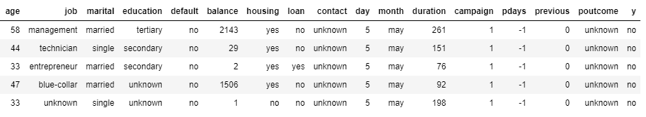
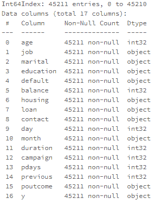
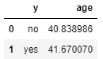
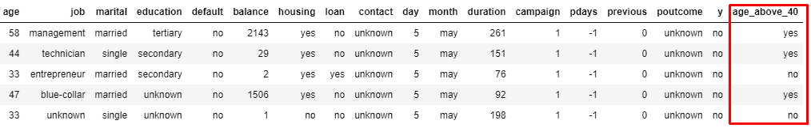
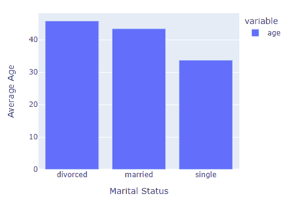
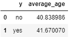

# 如何利用熊猫进行大数据

> 原文：<https://towardsdatascience.com/how-to-use-pandas-for-big-data-50650945b5c6>

## 通过 Spark 上的 Pandas 运行分布式工作负载


图片来自 [Pixabay](https://pixabay.com/illustrations/background-show-graphic-art-panda-3330215/)

# 动机

由于其直观的数据结构和丰富的 API，Pandas 已经成为数据科学家和分析师事实上的 python 库。Pandas 使用内存计算，这使它成为中小型数据集的理想选择。然而，由于内存不足的错误，Pandas 处理大数据集的能力是有限的。熊猫的替代品有很多，其中之一就是阿帕奇 Spark。

Apache Spark 是一个开源的分布式计算引擎，用于处理和分析大量数据，方法是在集群之间分发数据并并行处理数据。虽然 Pyspark(python 中的 Apache Spark 接口)非常适合繁重的数据工作负载，但是学习新的 Pyspark 语法并将代码从 Pandas 重构到 py Spark 可能会很乏味。

幸运的是随着 [Spark 3.2 更新](https://databricks.com/blog/2021/10/04/pandas-api-on-upcoming-apache-spark-3-2.html)，我们现在可以在 Spark 上运行熊猫 API 了。这允许我们在 Spark 中利用分布式处理的能力，同时使用 Pandas 中熟悉的语法。让我们来看一个例子，看看它是如何处理来自 UCI 数据库[1]的银行营销数据集的。代码在 [Databricks 社区版](https://databricks.com/try-databricks)运行时版本 10.2ML 上执行

# 例子

为了使用本地熊猫，我们通常会以下列方式进口熊猫

```
import pandas as pd
```

要在 Pyspark 中使用 Pandas API，我们只需进行以下导入，其他一切都是一样的。

```
import pyspark.pandas as ps
```

**读取 CSV 文件**

得到的数据帧是 Pyspark Pandas 数据帧。

```
df = ps.read_csv('/FileStore/tables/bank_full.csv')type(df)
>> pyspark.pandas.frame.DataFrame
```

**检查数据帧**

该数据与一家葡萄牙银行机构的直接营销活动(电话)相关。分类的目标是预测客户是否会认购定期存款(变量 y)。

```
df.head()
```



作者图片

**查看栏目信息**

```
df.info()
```



作者图片

**分组依据和聚合**

通过目标变量(y)找出平均年龄

```
df.groupby('y', as_index = False).agg({'age':'mean'}).sort_values('age')
```



作者图片

**应用 Lambda 函数**

让我们创建一个指示器列来指示客户的年龄是否超过 40 岁。我们可以通过使用 Pandas `.apply`和`lambda`函数对 age 列应用 lambda 函数来实现这一点。

```
df['age_above_40'] = df['age'].apply(lambda x: 'yes' if x > 40 else 'no')
```



作者图片

**绘图**

我们还可以用熊猫`.plot`功能绘制图表。图表是用 Plotly 绘制的，我们可以使用 Plotly 的`.update_layout`来调整图表属性。

```
fig = df.groupby('marital').agg({'age':'mean'}).plot.bar()
fig.update_layout(xaxis_title = 'Marital Status', yaxis_title = 'Average Age', width = 500, height = 400)
```



作者图片

**用 SQL 查询数据帧**

Pyspark Pandas DataFrame 也可以用 SQL 查询。这是本土熊猫所没有的。

```
ps.sql("SELECT y, mean(age) AS average_age FROM {df} GROUP BY y")
```



作者图片

**从 Spark Pandas 转换到 Pyspark DataFrame**

我们也可以选择在 Pyspark 中工作，将 Pyspark Pandas 数据帧转换成 Pyspark 数据帧。

```
spark_df = df.to_spark()type(spark_df)
>> pyspark.sql.dataframe.DataFrame
```

**从 Pyspark 数据帧转换到 Pyspark 熊猫数据帧**

```
psdf = spark_df.to_pandas_on_spark()type(psdf)
>>pyspark.pandas.frame.DataFrame
```

# 结论

我们看了如何在 Spark 上使用 Pandas API，它帮助我们使用熟悉的 Pandas 语法以分布式方式处理大数据集。Apache Spark 只是 Pandas 在 Python 中处理大数据集的众多替代品之一。查看这篇关于熊猫处理大数据集的其他[替代品的文章。](https://medium.com/@edwin.tan/8-alternatives-to-pandas-for-processing-large-datasets-928fc927b08c)

# 参考

[1]来自 [UCI 知识库](https://archive-beta.ics.uci.edu/ml/datasets/bank+marketing)的数据集。由 4.0 在 CC 下授权。c .萨卡尔&金尤美·卡斯特洛创建的数据集。

[加入 Medium](https://medium.com/@edwin.tan/membership) 阅读更多这样的故事。