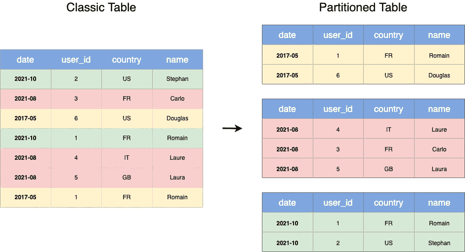
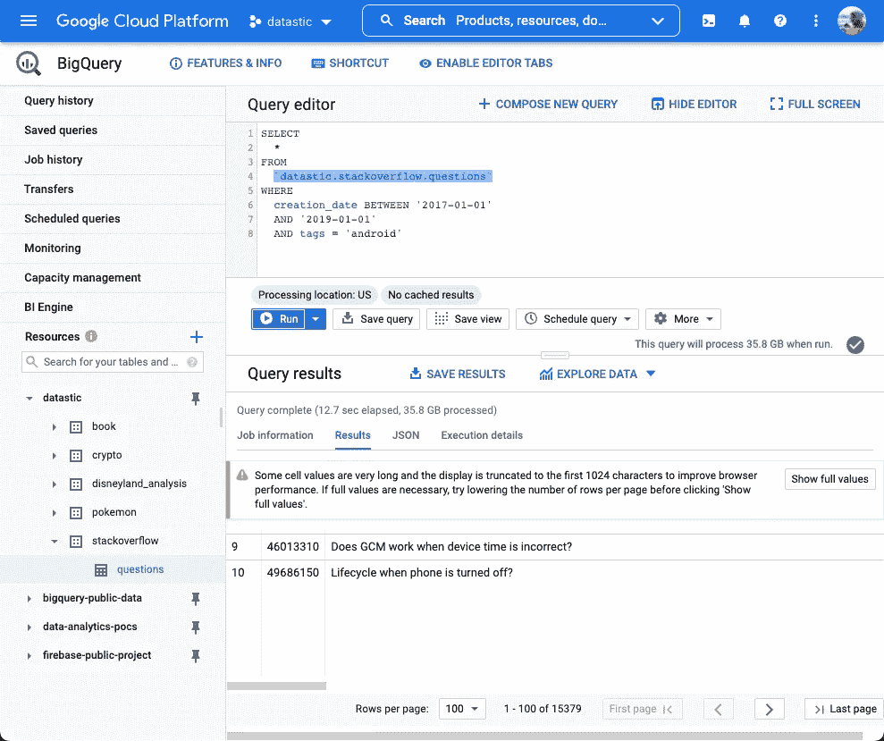
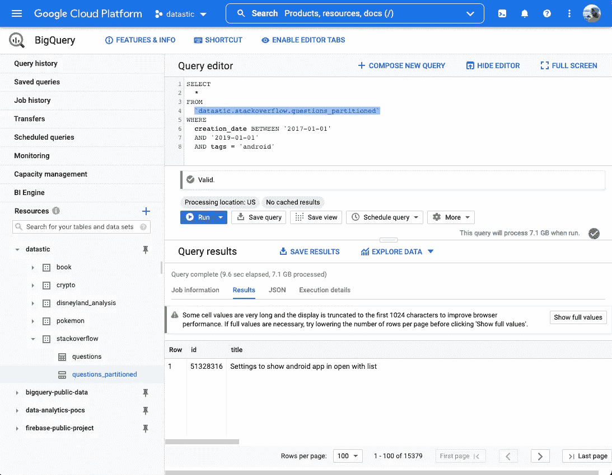
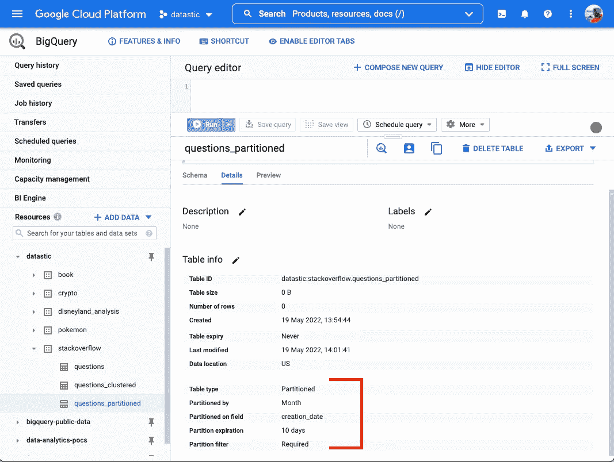
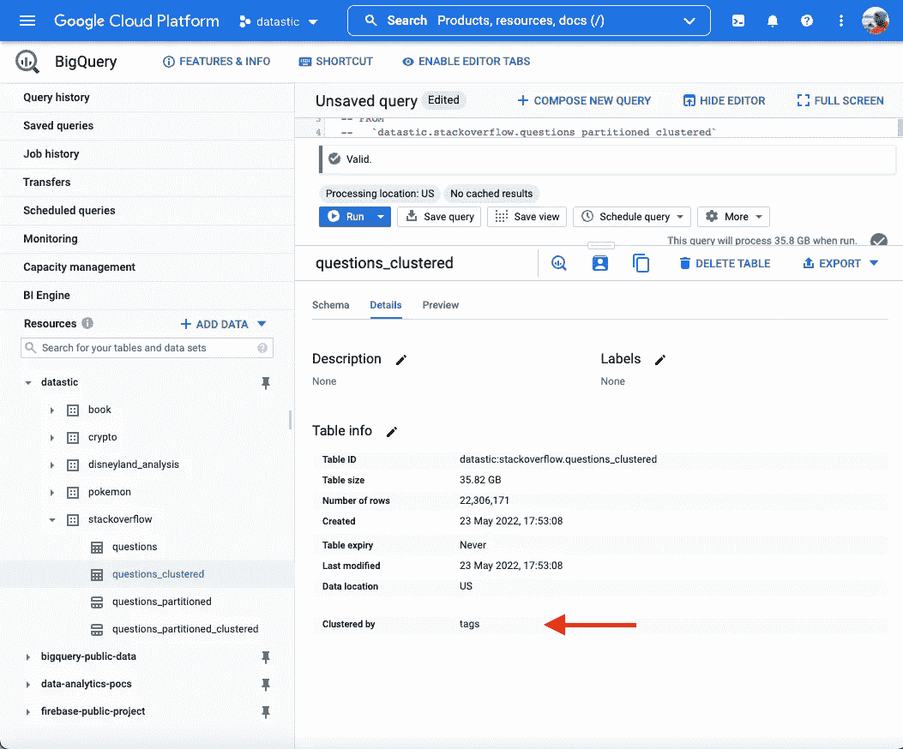
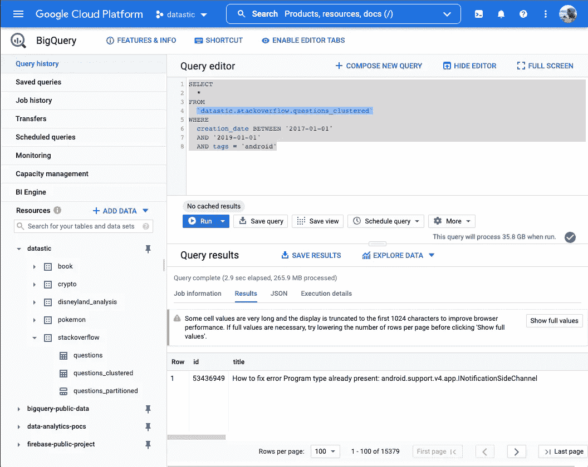
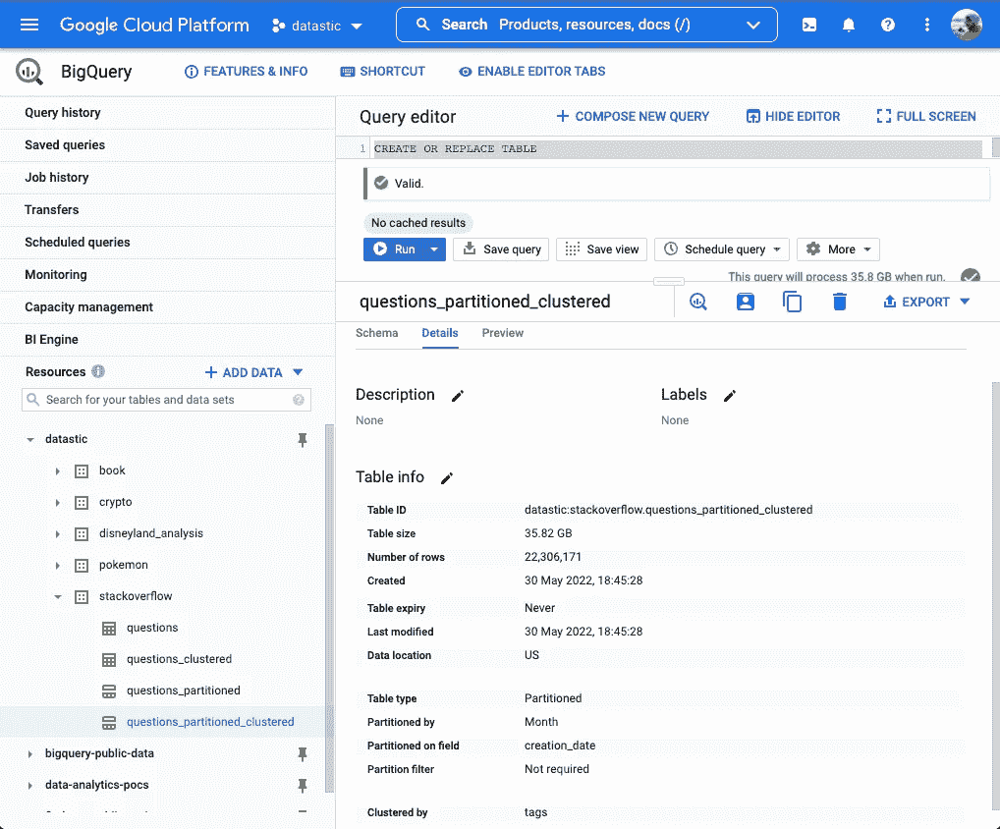
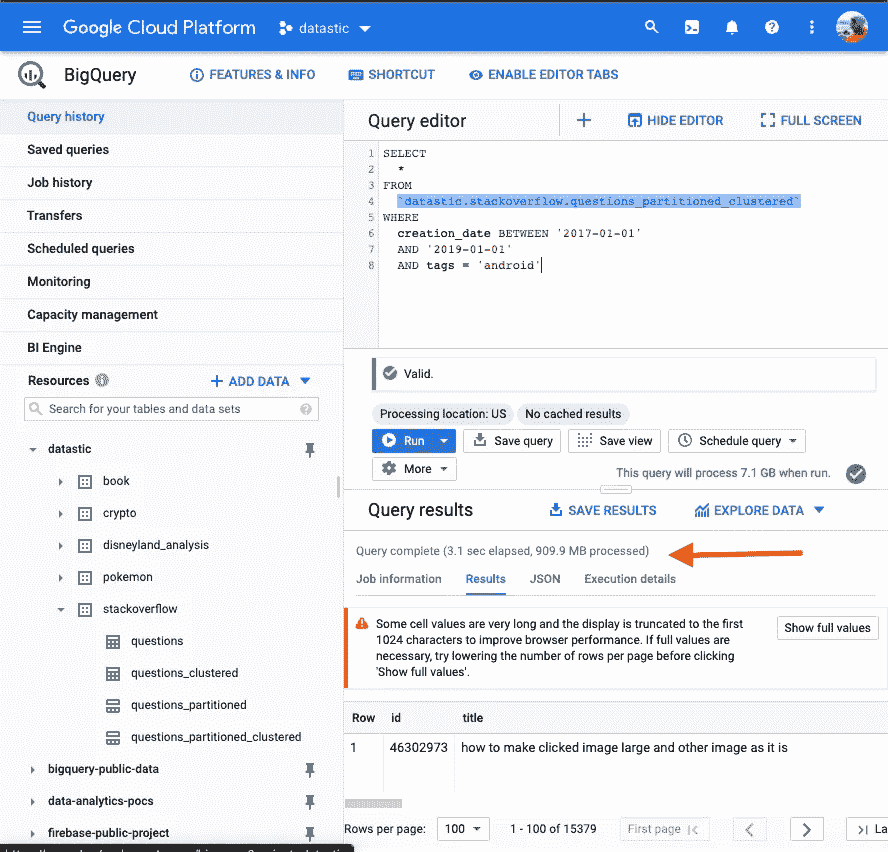

# 如何使用 SQL 在 BigQuery 中使用分区和集群

> 原文：<https://towardsdatascience.com/how-to-use-partitions-and-clusters-in-bigquery-using-sql-ccf84c89dd65>

## 优化成本，加快查询速度

让·格柏在 Unsplash[上的照片](https://unsplash.com?utm_source=medium&utm_medium=referral)

# 什么是分区和集群？

分区和集群是两种非常有效的技术，可以最小化查询成本和提高性能(使用更少的资源，同时提高速度)。

> 这些技术背后的思想是限制运行查询时需要读取的数据量。

从本质上讲，我们不需要通读表中的每一条记录，而是读取其中的一小部分。

如果您不确定是使用分区还是集群，我仍然建议同时设置两者，因为这将提供速度和成本优势。你可以单独使用这两种技术**或者结合使用**来获得最佳效果。

## 划分

**表分区**是一种将大表分割成小表的技术。

下面是一个将经典表转换为按日期分区的表的示例。

分区如何将数据分成不同的块(图片由[作者](https://romaingranger.medium.com/)提供)

BigQuery 将在物理级别上分别存储不同的分区(这意味着数据将存储在不同的服务器上)。

当您对表进行分区，然后执行查询时，也是 BigQuery 决定访问哪个分区，并最小化必须读取的数据。

您可以基于一个列创建一个分区表，也称为**分区键**。在 BigQuery 中，可以使用不同的键对表进行分区:

*   **时间单位列**:基于时间值(如时间戳或日期)对表进行分区。
*   **摄取时间**:当 BigQuery 摄取数据时，根据时间戳对表进行分区。
*   **整数范围**:根据数字对表进行分区。

BigQuery 对每个表有 4000 个分区的限制。

## 我们的起始桌

对于我们的实验，我们有一个名为`stackoverflow.question`的表，它是 **35GB 大的**，有**2200 万行**。

在进行任何分区或集群之前，我们需要一个经典表上的速度(我们的查询需要运行多长时间)和容量(读取了多少数据)基准。

下面的查询，我们称之为我们的**基本查询**，将用于比较性能。

用于评估分区和聚类技术性能的基本查询

经典表的处理字节和执行时间(图片由[作者](https://romaingranger.medium.com/)提供)

禁用缓存结果后，我们用了**12.7 秒**来运行我们的查询，我们扫描了 **35GB 的数据。**在这种情况下，我们必须扫描表中的所有行，包括所有的标签和日期。

## 对表进行分区的一个具体例子

我们将使用时间单位列(在我们的例子中是日期列)进行分区。

现在让我们使用我们的`creation_date`列作为键来创建一个分区表:

从初始的经典表创建一个分区表

我们没有按天分区，而是用`DATE_TRUNC(creation_date,MONTH)`将创建日期转换为月份。我们这样做是因为它减少了该表所需的分区数量。

如果我们尝试按天分区，BigQuery 会返回一个错误:

> 查询生成的分区太多，允许 4000 个，查询至少生成 4967 个分区

让我们再次运行我们的**基本查询**，但是这次使用我们的分区表。

已分区表的已处理字节数和执行时间(图片由[作者](https://romaingranger.medium.com/)提供)

我们花了**9.7 秒**来运行这个查询，而只扫描了 **7.1GB 的数据**。我们不能提高这么多的速度，但扫描的数据量少了很多，导致更便宜的查询。

*   ****partition _ expiration _ days**:big query 在到期时删除分区中的数据。这意味着超过此处指定天数的分区中的数据将被删除。**
*   ****require _ partition _ filter**:用户不在你的分区键上过滤(WHERE 子句)就无法查询。**

**从我们最初的经典表创建一个分区表，并添加一些选项**

**您始终可以通过修改表格来更改选项的值。**

**用新值更新分区表中的选项**

**关于选项和分区(以及集群)的所有信息都可以在您的表的细节部分找到。**

****

**当前表的分区细节(图片由[作者](https://romaingranger.medium.com/)提供)**

## **簇**

**集群将允许 BigQuery 将相似的数据放在一起，从而允许查询扫描更少的数据。**

**下面是一个将经典表转换为按名称聚集的表的示例。**

****

**聚类如何将数据分成不同的块(图片由[作者](https://romaingranger.medium.com/)提供)**

**根据您为集群选择的列中的值，BigQuery 将自动对这些值进行排序，并决定如何将它们存储在最佳存储块中。**

**集群最适合具有高基数的值，这意味着列具有各种可能的值，例如**电子邮件、用户 id、名称、产品类别等……****

**BigQuery 允许对多个列进行集群，并且可以对不同的数据类型(字符串、日期、数字等)进行集群**

**BigQuery 对每个表有 4 个集群列的限制。**

## **聚集一个表的具体例子**

**我们将使用字符串值(在我们的例子中是 StackOverflow 表中的`tags`列)进行聚类。**

**要创建一个集群表，步骤与分区相同，但是语法将使用一个`CLUSTER BY`子句。**

**从初始的经典表创建一个聚集表**

**我们现在可以验证我们的表是基于包含在`tags`列中的值进行聚类的。**

****

**细节部分将显示哪些字段用于聚类(图片由[作者](https://romaingranger.medium.com/)提供)**

**为了评估性能，我们现在使用聚集表运行与以前相同的查询。**

****

**集群表的处理字节和执行时间(图片由[作者](https://romaingranger.medium.com/)提供)**

**运行这个查询花费了我们 **2.9 秒**，我们必须扫描 **265.9MB** **的数据**。在这种情况下，速度提高了，需要扫描的数据量大大减少。**

**在这种情况下，查询验证器(绿色标签表示“该查询将处理 35.8GB”)是不正确的。当使用聚簇表时，这个估计并不精确，将给出一个上限值。**

## ****划分+聚类****

**我们现在可以很容易地结合这两种技术来优化更多。**

**下面是一个将经典表转换成表**的例子，表**按名称**聚集，表**按日期**分区。****

****

****分区和聚类如何结合**将数据分成不同的块(图片由[作者](https://romaingranger.medium.com/)提供)**

**如您所见，它与分区表非常相似，只是现在当每个分区中的值相似时，它们会被排序。**

**现在要创建一个使用这两种技术的表，就像在创建表时编写这两个子句一样简单。**

**从我们最初的经典表创建一个**集群和分区的**表**

**我们可以在表细节中观察到，该表同时使用了分区和集群。**

****

**细节部分将显示哪些字段用于**聚类和划分**(图片由[作者](https://romaingranger.medium.com/)提供)**

**为了再次分析性能，我们执行与之前相同的查询，但是这次我们使用最近生成的表，该表同时使用了**集群和**分区。**

****

**一个**分区+集群**表的处理字节和执行时间(图片由[作者](https://romaingranger.medium.com/)提供)**

**运行这个查询花费了我们 **3.1 秒**，并且只扫描了 **909.9MB 的数据**。这与我们看到的两种独立技术相当，现在这两种技术被结合起来以提高速度和成本。这里，它花费了几乎相同的时间，但是处理了更多的数据(因为使用了分区，BigQuery 将不得不查看数据的几个部分，从而导致比我们只扫描一个集群分区时扫描更多的数据)。**

**一般来说，结合并实现这两种技术是一个很好的实践。当您使用 cron 作业或通过流从外部源接收数据时，按照接收时间进行分区可能会很有意思。**

**与其他数据仓库系统一样，当新数据进入时，BigQuery 将自动执行自动重新聚类，并且不需要额外的成本。**

**我希望这篇文章对您有用，并且您现在能够在您的项目中创建和实现集群和分区了！**

## **额外资源**

**资料来源于 Google 云平台关于**分区表的文档。****

**  

来源于关于**集群表的 Google 云平台文档。**

 **