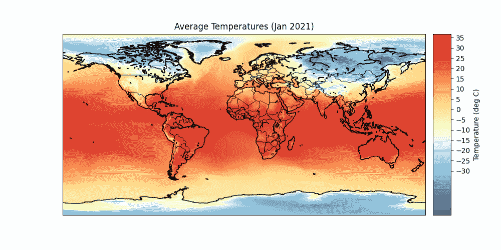
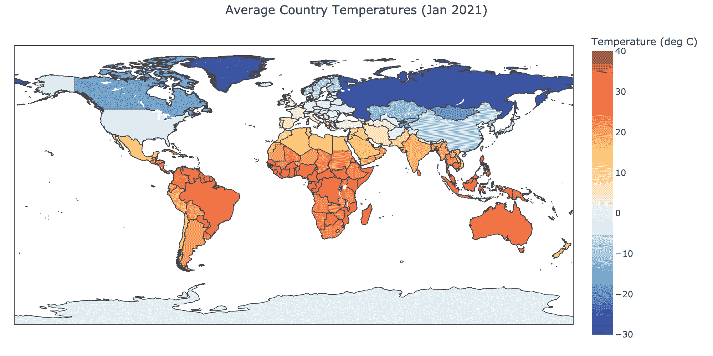
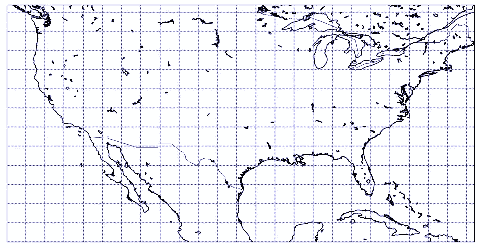
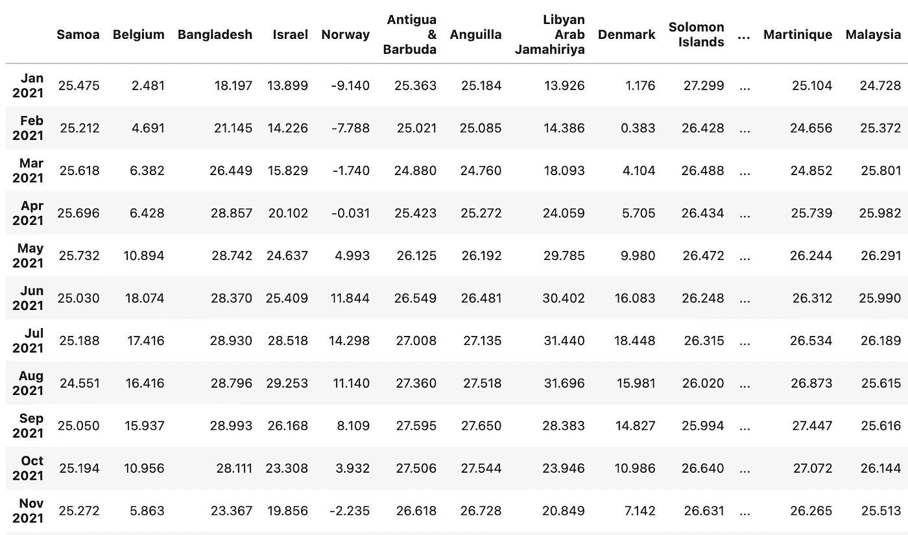
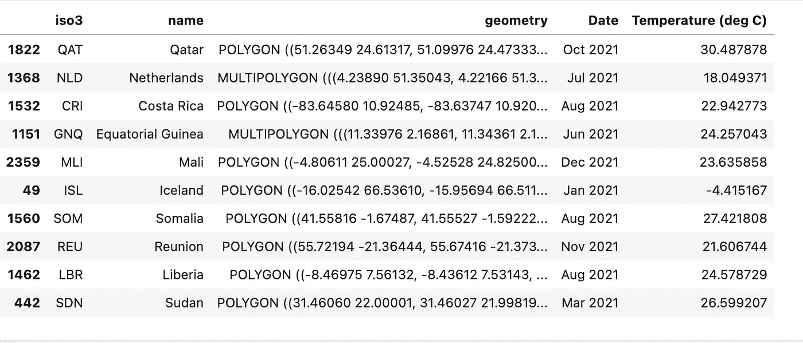
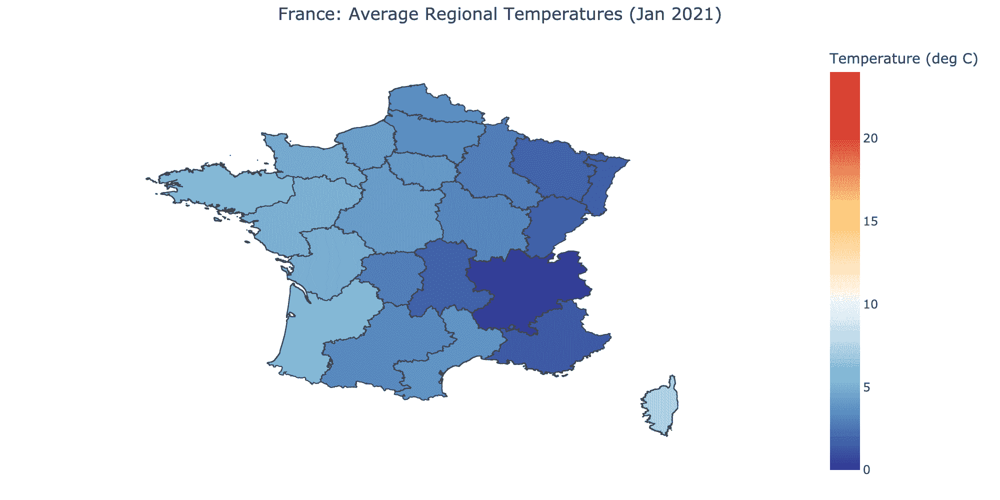

# 如何使用 Python 获取地球上任何地方的温度

> 原文：<https://towardsdatascience.com/how-to-use-python-to-obtain-the-temperature-of-any-place-on-earth-b92aae44b831>

## 解释使用 Python 中的 shapefiles 裁剪网格化 NetCDF 数据的过程的教程


美国宇航局在 [Unsplash](https://unsplash.com/s/photos/earth?utm_source=unsplash&utm_medium=referral&utm_content=creditCopyText) 拍摄的照片

答假设您对 NetCDF 数据格式有基本的了解(如果没有，您可以在这里查看我关于 NetCDF 的介绍文章)，在这篇文章中，我将展示计算和可视化地区温度的不同方法。为此，我们将使用 shapefile。 [Shapefile](https://en.wikipedia.org/wiki/Shapefile) 是一种数据格式，利用点、线和多边形等矢量特征来表示地球上的不同区域(如国家、城市、湖泊等)。

# 等高线和等高线

我用的是哥白尼免费下载的 NetCDF 数据(这个[链接](https://cds.climate.copernicus.eu/cdsapp#!/dataset/reanalysis-era5-single-levels?tab=form)上的‘2m 温度’)。[哥白尼](https://en.wikipedia.org/wiki/Copernicus_Programme)是一个由欧盟及其机构管理的地球监测项目。他们提供了一个名为[气候数据存储](https://cds.climate.copernicus.eu/#!/home)的 API 来下载与任何气候变量相关的任何数据。

使用 NetCDF 数据，我们可以简单地绘制如下所示的等值线图:



等高线图(作者 GIF)

我用所有 12 个月的等高线图制作了这张 GIF 图，并固定了彩条的范围。我们可以计算每个国家的平均温度，然后将其可视化为 [choropleth](https://en.wikipedia.org/wiki/Choropleth_map#:~:text=A%20choropleth%20map%20(from%20Greek,each%20area%2C%20such%20as%20population) 地图，而不是将其可视化为等高线。

choropleth 地图可视化如下所示:



Choropleth 地图(GIF 由作者提供)

在这两种情况下，较冷的地方和较热的地方可以用蓝色和红色清楚地区分。choropleth 地图使用整个国家的平均值，因此，其表示与等值线地图略有不同。不同地图的使用取决于不同的用例。

使用 NetCDF 数据和 shapefiles 导出 choropleth 图的想法很有趣，因为它可以在任何级别和任何分辨率下完成。例如，我们可以制作一张地图来比较不同的国家，一个国家中不同的州，甚至是不同的城市。



Shapefile 上的网格点(作者提供照片)

上图显示了放置在一个地区(美国及其邻国)的一堆网格点。为了计算平均温度，我们收集了位于美国境内的所有点(例如),然后简单地取所有点的平均值。

以下 python 库用于此目的:

1.  Xarray —读取和操作 NetCDF 文件。
2.  Geopandas 读取 shapefiles
3.  Rioxarray 和 Shapely 裁剪/收集多边形内部的网格点。
4.  底图，Plotly 进行可视化。

使这一切成为可能的关键是 NetCDF 数据中温度值的插值。

# 插入文字

这也称为空间或地理空间插值。插值是使用采样值估计未采样区域的值的过程。

NetCDF 数据在纬度和经度之间等间距网格化。我用来绘制等高线图的数据在网格的两个方向上的分辨率都是 0.25。一度大约是 100 公里，所以我们可以说我们的分辨率是 25 公里。换句话说，我们在 X 和 Y 方向上每隔 25 公里有一个温度值。

如果我们有一个足够大的区域，我们会看到一个或多个温度值位于该区域的边界内。在我使用的 NetCDF 数据的情况下，我们希望该区域大于 25 km，至少在一个轴上，在该区域内有一个温度值。

如果该地区是一个大国，如印度、美国、中国等，这就简单了。如果国家很小，比如梵蒂冈、摩纳哥和太平洋岛屿，那就很棘手了。在绘制等高线图时，我不得不忽略一些较小的国家，因为不可能计算这些国家的平均温度。

使用插值，我们可以改变这个分辨率(增加或减少)。一种流行的方法是使用线性插值。Xarray 有一个叫做`.interp_like()`的方法，使得插值更容易。

在上面的代码中，我使用线性插值技术将 NetCDF 数据的分辨率从 0.25 转换为 0.05。与示例不同，您还可以使用全边界(纬度为-90 至 90，经度为-180 至 180)对整个数据集进行插值。

# 在 shapefile 上剪辑

为了裁剪或收集国家边界内的网格点，我们可以使用下面的代码。

世界行政边界形状文件可以在这里[下载。](https://public.opendatasoft.com/explore/dataset/world-administrative-boundaries/export/)

`t2m.rio.clip(data.geometry.apply(mapping), data.crs)`是我们裁剪网格点的代码部分。代码的扩展只是对所有温度值进行平均。如此复杂的过程只用几行代码就完成了。

每当国家边界对于网格来说太短时，就会出现错误。这些国家将被添加到列表中，并从 shapefile 数据框中移除。它们不会被用于可视化。如果您想包含所有内容，那么您可以使用更高的分辨率，例如 0.01(网格点相距 1 km)。



显示每月平均国家温度的数据框(df_temp)

# 等值区域图

由于我们有每个国家 12 个月的温度值，我们可以创建 12 个 choropleth 图，并轻松地将它们组合成 GIF。

首先，我们需要将形状文件和温度数据框合并成一个。然后，我们创建一个循环并保存所有 12 个 choropleth 图像，这些图像稍后将用于制作 GIF。

下面是创建 choropleth 地图和 GIF 的代码:

`geo`数据帧是这样的。我只保留了必要的列，并从 shapefile 中删除了其余的列。



追加和熔化 DFs 后的数据帧(geo)

使用相同的代码，这是我为法国制作的 choropleth 地图 GIF:



法国 Choropleth 地图(作者 GIF)

很酷，不是吗？

# 结论

NetCDF 数据足够强大，可以处理气候数据科学，并生成一些看起来很酷的 choropleth 图或等高线图。这个想法也可以扩展到其他气候变量。地图和用例会根据您考虑的变量而变化。

感谢阅读，干杯！

```
**Want to Connect?** You can reach me on [LinkedIn](https://www.linkedin.com/in/rohithteja/), [Twitter](https://twitter.com/rohithtejam), [GitHub](https://github.com/rohithteja) or my [Website](https://rohithteja.github.io/).
```