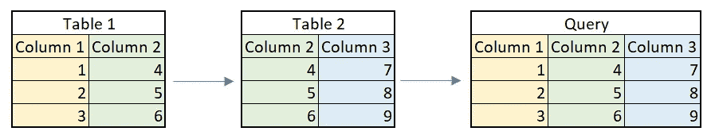
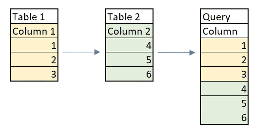
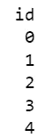
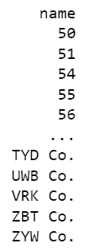
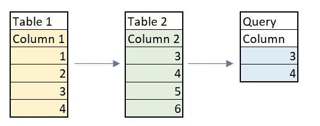
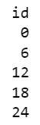
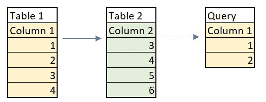
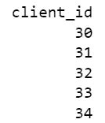

# 如何在 SQL 中使用集合运算

> 原文：<https://towardsdatascience.com/how-to-use-set-operations-in-sql-53d57c4f7b77>

## 了解并集、交集和例外运算符


雷纳多·凯文在 [Unsplash](https://unsplash.com?utm_source=medium&utm_medium=referral) 上的照片

数据专业人员通常需要从多个来源收集信息。虽然[连接](https://en.wikipedia.org/wiki/Join_(SQL))的概念被广泛教授，并经常出现在面试问题中，但它们的近亲[集合运算符](https://en.wikipedia.org/wiki/Set_operations_(SQL))却不经常受到同样的关注。

这两种方法都从多个来源收集数据，可以是子查询表。联接将结果作为新列返回，并要求表之间有一个公共列。



连接的结果查询将添加新数据作为列。图由作者制作。

相比之下，集合运算符将结果作为新行返回，不一定需要表中的任何公共行。



集合运算符的结果查询将添加新数据作为行。图由作者制作。

集合运算符包括 UNION (ALL)、INTERSECT 和 EXCEPT/MINUS。为了演示如何使用它们，将使用两个表生成一个样本数据集:clients 和 transactions。客户端表将简单地列出一个客户端 ID 和它们的名称。交易表将包括交易 ID、相应的客户 ID 和交易值。

```
CREATE TABLE clients(
    id INTEGER PRIMARY KEY,
    name CHAR(255)
);CREATE TABLE transactions(
    id INTEGER PRIMARY KEY,
    client_id INTEGER,
    value INTEGER
);
```

# UNION 运算符

在形式数学中，[并](https://en.wikipedia.org/wiki/Union_(set_theory))是两个集合的完全组合。类似地，在 SQL 中， [UNION](https://www.w3schools.com/sql/sql_union.asp) 操作符组合两个 SELECT 语句的结果，并删除任何重复的结果。

```
SELECT *column_1* FROM *source_1*UNIONSELECT *column_2* FROM *source_2;*
```

union 操作符的语法非常简单。第一行代码给出了一个 SELECT 语句，从一个源中提取一列，这个源可以是一个表，也可以是一个子查询。第二行提供了 UNION 运算符。第三行列出了要与第一个语句合并的下一个 SELECT 语句。

请注意，两个 SELECT 语句必须包含相同数量的列。

```
SELECT id FROM clients
UNION
SELECT client_id FROM transactions;
```

在一个简单的例子中，上面的查询返回 clients 表中的所有 id 以及 transaction 表中列出的所有客户端 id。默认情况下，UNION 运算符将删除两个 SELECT 语句之间的任何重复项。



包含所有 id 的一列

若要包含重复项，可以改用 UNION ALL 运算符。它使用完全相同的语法，可以在与 UNION 运算符相同的上下文中使用。

```
SELECT id FROM clients
UNION ALL
SELECT client_id FROM transactions;
```

请注意，UNION 操作符与所有其他集合操作符一样，不需要 select 列之间的正式关系。出于实用性考虑，选择了 id，但是在 UNION 中可以用于在同一列中返回客户名称和事务值。

```
SELECT name FROM clients
UNION
SELECT value FROM transactions;
```

虽然这是有效的语法，但结果的值是可疑的:



交易值和客户端名称都显示在同一(截断的)列中。

集合操作符组合信息而不考虑关系或缺乏关系的能力为它们提供了很大程度的灵活性，特别是在那些设计不良或维护混乱的数据库中。不幸的是，同样的灵活性也允许无意义的结果。

# 交集运算符

可以预见的是， [INTERSECT](https://www.geeksforgeeks.org/sql-intersect-clause/) 操作符在数据相交的地方连接行。换句话说，它只组合两个查询共有的数据。



该查询只返回 3 和 4，因为它们在两个表中是相同的。图由作者制作。

INTERSECT 运算符的语法与 UNION 运算符完全相同。

```
SELECT *column_1* FROM *source_1*INTERSECTSELECT *column_2* FROM *source_2*
```

像前面一样，第一行和第三行专用于将要组合的 SELECT 语句。在它们之间，INTERSECT 运算符连接它们。

```
SELECT id FROM clients
WHERE id % 2 = 0INTERSECTSELECT client_id FROM transactions
WHERE client_id % 3 = 0;
```

在上面的示例中，第一个 SELECT 语句查询 clients 表中所有能被 2 整除的 id。然后，INTERSECT 操作符将它与第二个 SELECT 语句结合起来，后者从 transactions 表中提取所有可被 3 整除的客户 id。

因此，该查询将返回所有可被 6 整除的客户端 id，因为所有可被 6 整除的数字也可被 2 和 3 整除。



所有 6 的倍数的 id

# EXCEPT 运算符

当 INTERSECT 查询两个源之间的公共数据时，EXCEPT 运算符返回一个源独有的数据。值得注意的是，有些数据库不接受 EXCEPT 关键字，而是使用 MINUS。这两者没有区别，因为它们都具有相同的功能。



该查询返回 1 和 2，因为它们对于表 1 是唯一的。图由作者制作。

EXCEPT 的语法与其他集合运算符完全一样。

```
SELECT *column_1* FROM *table_1*EXCEPTSELECT *column_2* FROM *table_2*;
```

或者，使用减号关键字:

```
SELECT *column_1* FROM *table_1*MINUSSELECT *column_2* FROM *table_2*;
```

举一个具体的例子，可以编写一个简单的查询来确定哪些客户 id 出现在事务表中，而没有出现在客户表中。在理想情况下，事务表中的客户机 ID 不会不出现在客户机表中，但是有时糟糕或仓促的设计选择加上糟糕的维护也会产生类似的结果。

因此，编写一个快速查询来确定哪些客户机 id 需要添加到 clients 表中，这将证明是非常有益的。

```
SELECT client_id FROM transactions
EXCEPT
SELECT id from clients;
```

第一个 SELECT 语句查询事务表中的所有客户机 id，但是 EXCEPT 语句强制它排除第二个 SELECT 语句，后者提取 clients 表中已经存在的所有 id。



事务中的所有客户端 id，但不在客户端中

然后，结果提供了一个需要添加到 clients 表中的所有客户机 id 的列表(以及与数据库管理员关于实施表间关系的对话)。

# 结论

尽管集合运算符的使用频率不如联接，但它仍然可以通过向结果中添加行来连接数据。忽略数据源之间的任何关系，它们在编写查询时提供了无与伦比的灵活性。由于有大量的用例，它们是 SQL 中不被重视的部分。