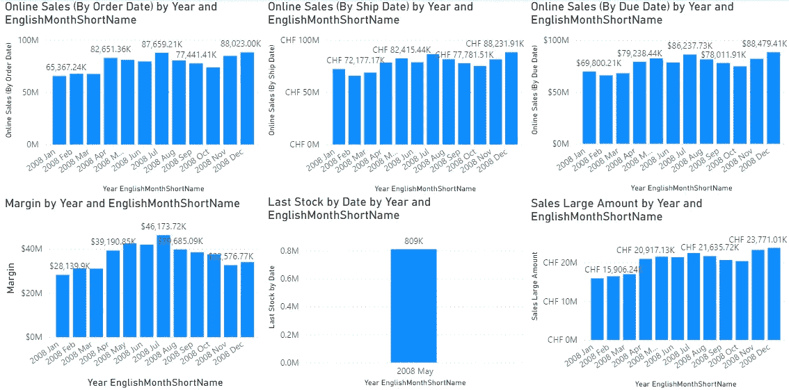
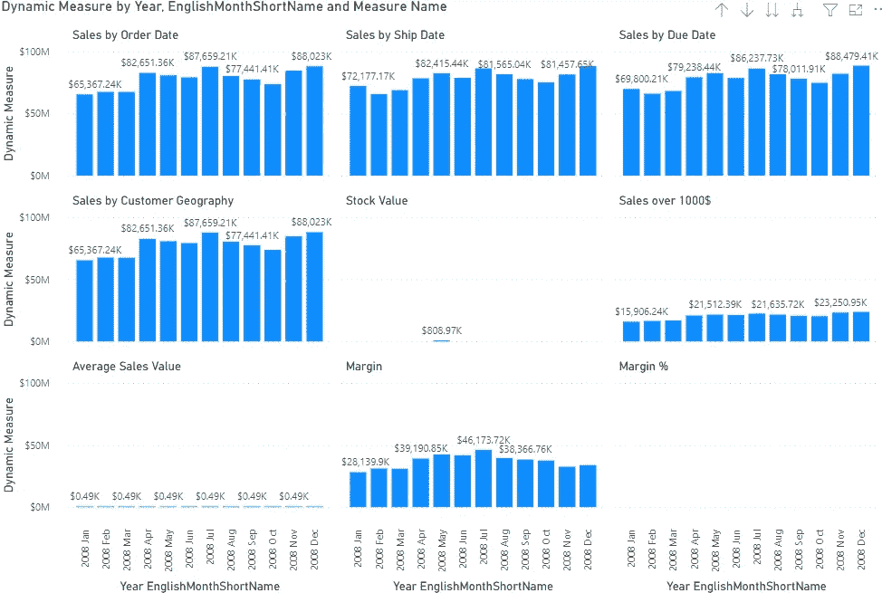
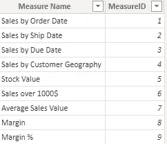
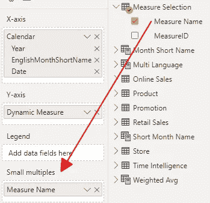
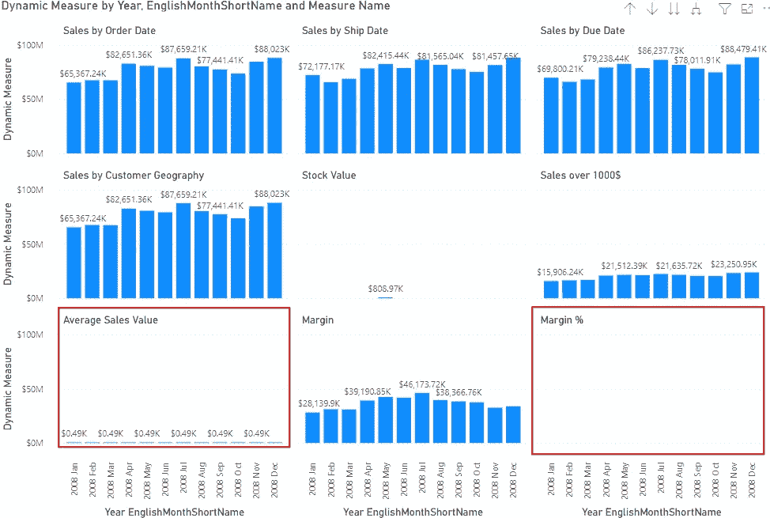
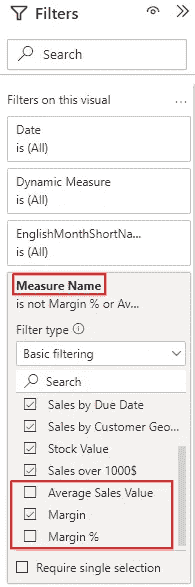
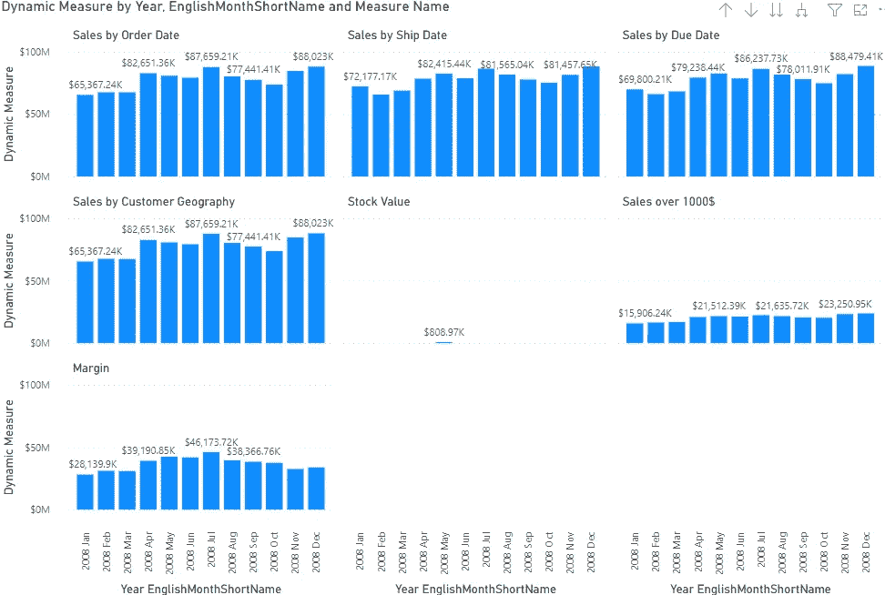
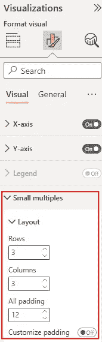
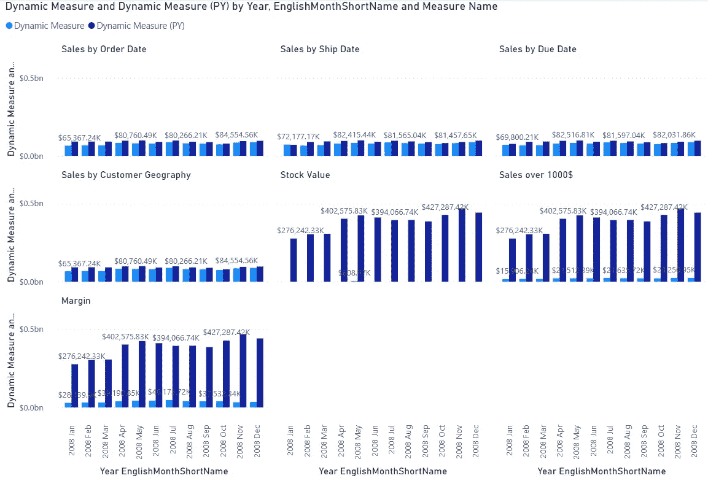
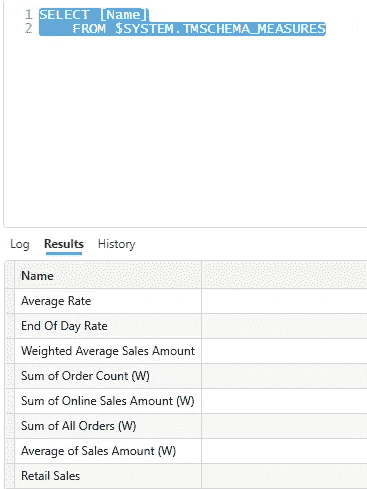

# 如何在 Power BI 中使用小倍数来显示多个度量值

> 原文：<https://towardsdatascience.com/how-to-use-small-multiples-in-power-bi-to-show-multiple-measures-afb21a1ec10d>

## 假设您想用相同的轴显示不同的度量，例如，地理的时间。在这里，我向您展示如何在一个视图中实现这一点。


[Justus Menke](https://unsplash.com/@justusmenke?utm_source=medium&utm_medium=referral) 在 [Unsplash](https://unsplash.com?utm_source=medium&utm_medium=referral) 上拍摄的照片

# 介绍

假设您有许多度量，并且您希望并排查看它们，所有度量都使用相同的轴，例如，日期、地理、产品类别等。

您需要添加一个视觉效果并添加第一个度量值。然后复制此视觉效果，更改度量，并在报告页面的可用空间内对齐它们，使它们看起来完全相同。

它可能看起来像这样:



图 1——具有不同度量的多种视觉效果(由作者提供)

好吧，我们可以调整外观，使它看起来更好，在上面的例子，但这都是额外的工作，我不想在这里涵盖。

参见我关于信息设计的文章:

[](https://medium.com/cloud-workers/three-simple-rules-for-information-design-52db54864b47) [## 信息设计的三个简单规则

### 我们知道那些花哨多彩的报道。现在，让我们探讨一下为什么这些都是不好的例子，以及我们如何能做得更好。

medium.com](https://medium.com/cloud-workers/three-simple-rules-for-information-design-52db54864b47) 

因为我们是有效率的，而不是懒惰的，我们想以更好的方式做这件事。

能够使用[小倍数](https://learn.microsoft.com/en-us/power-bi/visuals/power-bi-visualization-small-multiples)在一个视图中显示多个度量值，如下图所示，是不是很酷？



图 2 —小多次波的视觉效果(作者提供的图片)

让我们深入探讨一下如何实现这一解决方案。

# 履行

我们首先需要一个表，其中包含我们希望在目标视图中显示的所有度量。

如下图所示的表格:



图 3 —测量选择表(作者提供的图)

我通过 Power BI Desktop 中的输入数据功能添加了这个表。
新表格不需要与任何其他表格有任何关系，因为它仅用于引用所需的测量。

我手工添加了 MeasureID 列。

现在，我需要一个度量来检查在当前过滤器上下文中选择了哪个 MeasureID，并选择正确的度量。

该度量可能如下所示:

```
Dynamic Measure =
IF ( HASONEVALUE(‘Measure Selection’[MeasureID])
    ,SWITCH(MIN(‘Measure Selection’[MeasureID])
        ,1, [Online Sales (By Order Date)]
        ,2, [Online Sales (By Ship Date)]
        ,3, [Online Sales (By Due Date)]
        ,4, [Online Sales (By Customer)]
        ,5, [Last Stock by Date Var 2]
        ,6, [Sales Large Amount_2]
        ,7, [Weighted Average Sales Amount]
        ,8, [Margin]
        ,9, FORMAT([Margin %], “Percentage”)
        ,[Retail Sales]
    )
    ,[Retail Sales]
)
```

首先，我必须检查当前过滤器上下文中是否只有一个 MeasureID。我用 [IF()](https://dax.guide/if/) 和 [HASONEVALUE()](https://dax.guide/hasonevalue/) 函数来实现这一点。

如果在实际的筛选器上下文中存在多个值，那么我将跳到 If()的 ELSE 分支，并显示[零售]度量值。在我的例子中，我将这个度量定义为我的“默认度量”来显示。

如果只为 MeasureID 选择了一个值，我可以检查它并显示相应的度量。

现在，我可以将列度量值名称作为一个小倍数添加到目标视图中:



图 4 —将度量选择列作为小倍数添加(作者提供的图)

# 改善和配置视觉效果

现在，你可以看到这样的画面:



图 5 —结果非常小或单元不匹配的视觉效果(作者提供的图片)

红色标记区域显示的测量值要么非常小，要么以百分比形式计算。这两个措施在这里不是很有用。

我们可以做些什么来消除这些结果:

1.  我们可以从添加到视觉的度量中移除这些度量
2.  我们可以操作过滤器设置来移除它们，而不改变测量:



图 6——排除不可用度量的过滤器设置(由作者提供)

现在，结果可能是这样的:



图 7 —排除测量后的结果(作者提供的数据)

最后，我们可以通过更改格式选项来改变小倍数的外观:



图 8 —配置小倍数(作者提供的数字)

在这里，我们可以改变列和行的数量来设置我们需要它。

我们可以为小倍数之间的填充设置一个值，或者我们可以启用自定义填充并根据需要设置行和列的填充。

# 添加更多度量

现在，假设我们想要查看实际值和前一年的值。

首先，我们必须为所有基本度量创建上一年的(PY)度量。

假设我们希望对以下度量执行此操作:

*   在线销售(按订单日期)
*   在线销售(按发货日期)
*   在线销售(截止日期)
*   在线销售(按客户)
*   零售

我为它们中的每一个创建了 PY 度量，并且创建了一个如上所示的度量:

```
Dynamic Measure (PY) =
IF ( HASONEVALUE(‘Measure Selection’[MeasureID])
    ,SWITCH(MIN(‘Measure Selection’[MeasureID])
        ,1, [Online Sales (By Order Date) PY]
        ,2, [Online Sales (By Ship Date) PY]
        ,3, [Online Sales (By Due Date) PY]
        ,4, [Online Sales (By Customer) PY]
        ,[Retail Sales PY]
    )
    ,[Retail Sales PY]
)
```

将这个度量添加到视觉效果后，我得到了需要的结果:



图 9 —前一年测量的结果(作者提供的数据)

现在你可以玩你的幻想来扩展你的解决方案。

# 构建度量列表

构建这样一个解决方案的一个挑战是管理您的度量。

通常，您的模型不是静态的，而是随着进一步的度量不断扩展，您希望将这些度量集成到您的动态度量中。

幸运的是，我们可以使用 DAX Studio 和 Analysis Services 动态管理视图来获得所有度量的完整列表:

```
SELECT [Name]
    FROM $SYSTEM.TMSCHEMA_MEASURES
```

以下查询返回所有度量值的列表:



图 10 —获得 DAX Studio 中的度量列表(由作者提供)

现在，您可以将列表复制到 Excel 中，并添加索引列。此后，可以将新表复制到度量选择表中。使用 Excel，您甚至可以通过简单的公式从表中生成 DAX 度量值。

然后您可以将生成的度量复制到数据模型中。

# 结论

Power BI 中的小倍数是增加报告中信息密度的一个很好的功能。

通常，我们以小倍数的形式添加属性，以便按维度元素拆分数据。

这里显示的方法有助于创新地在一个视图中显示多个度量。


里卡多·安南达尔在 [Unsplash](https://unsplash.com?utm_source=medium&utm_medium=referral) 上拍摄的照片

更积极的一点是，您不需要尝试同步度量之间的图表缩放，因为这是自动完成的。

在这一点上，天空是极限，您可以使用小倍数功能以多种方式提高您的报告能力。

# 参考

小倍数特性的微软文档:[在 Power BI 中创建小倍数— Power BI |微软学习](https://learn.microsoft.com/en-us/power-bi/visuals/power-bi-visualization-small-multiples)

SSAS 动态管理视图的参考文档:[Analysis Services | Microsoft Learn 中的动态管理视图(dmv)](https://learn.microsoft.com/en-us/analysis-services/instances/use-dynamic-management-views-dmvs-to-monitor-analysis-services?view=asallproducts-allversions)

我使用 Contoso 样本数据集，就像我以前的文章一样。你可以从微软[这里](https://www.microsoft.com/en-us/download/details.aspx?id=18279)免费下载 ContosoRetailDW 数据集。

Contoso 数据可以在 MIT 许可下自由使用，如这里的[所述](https://github.com/microsoft/Power-BI-Embedded-Contoso-Sales-Demo)。

[](https://medium.com/@salvatorecagliari/membership) [## 通过我的推荐链接加入 Medium-Salvatore Cagliari

### 阅读萨尔瓦托勒·卡利亚里的每一个故事(以及媒体上成千上万的其他作家)。您的会员费直接…

medium.com](https://medium.com/@salvatorecagliari/membership)