# 下一次数据科学面试的 SQL 聚合函数

> 原文：<https://towardsdatascience.com/how-to-use-sql-aggregate-functions-92f7244a07cb>

## 基础知识回归| SQL 初学者基础知识

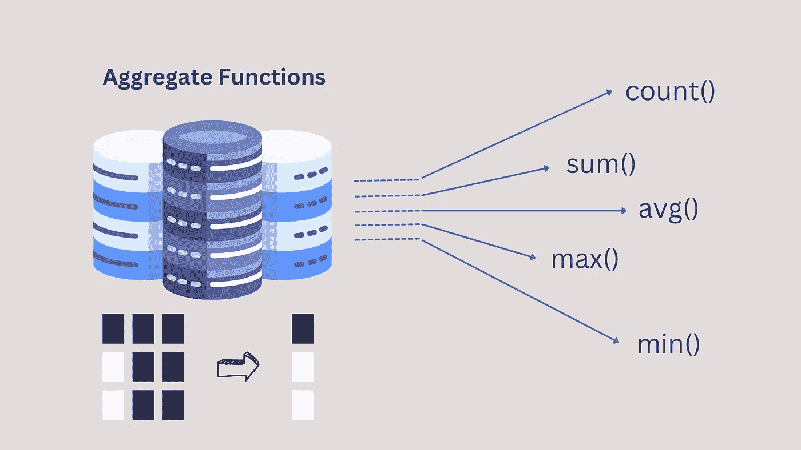

作者图片，创建于 [canva](https://www.canva.com)

在企业的不同层级；我们经常依赖报告或可视化仪表板形式的数据来完成日常任务；比方说，对于审计和法规遵从性(内部和外部)，做出决策，衡量成功与否，或者甚至支持一个新业务想法的假设(开发一个新想法)

不管你有什么数据，也不管你存储或维护数据的效率如何。事实上，您需要知道基本的编码来实际检索数据，也就是您的数据有任何价值的时候。

了解基本的 SQL 并不是真正的火箭科学，但它是游戏规则的改变者。如果团队中的每个人都熟练掌握基本的数据检索编码，这将增强整个团队的能力，并减少琐碎任务的依赖性，从而快速做出决策。

SQL 中的聚合函数非常强大，是日常分析中最常用的函数；比如，哪个产品的总收入最高，每个季度的总销售额等等。下面是最常见的聚合函数的快速回顾。

## 什么是 SQL 聚合函数？

SQL 聚合函数对一组值执行计算并返回一个值。嗯，大多数时候！当通过子句与 *GROUP 配对时，它为每个组返回单个值。聚合函数大多是 [*确定性函数*](https://docs.microsoft.com/en-us/sql/relational-databases/user-defined-functions/deterministic-and-nondeterministic-functions?view=sql-server-ver15) 。*

一旦我们看完本文中的例子，这一切都有意义了。

这里，我使用[**classic models**](https://www.mysqltutorial.org/mysql-sample-database.aspx)MySQL 示例数据库进行演示，它保存了一家汽车零售商的业务数据。下面是 ER 图，以便快速理解，

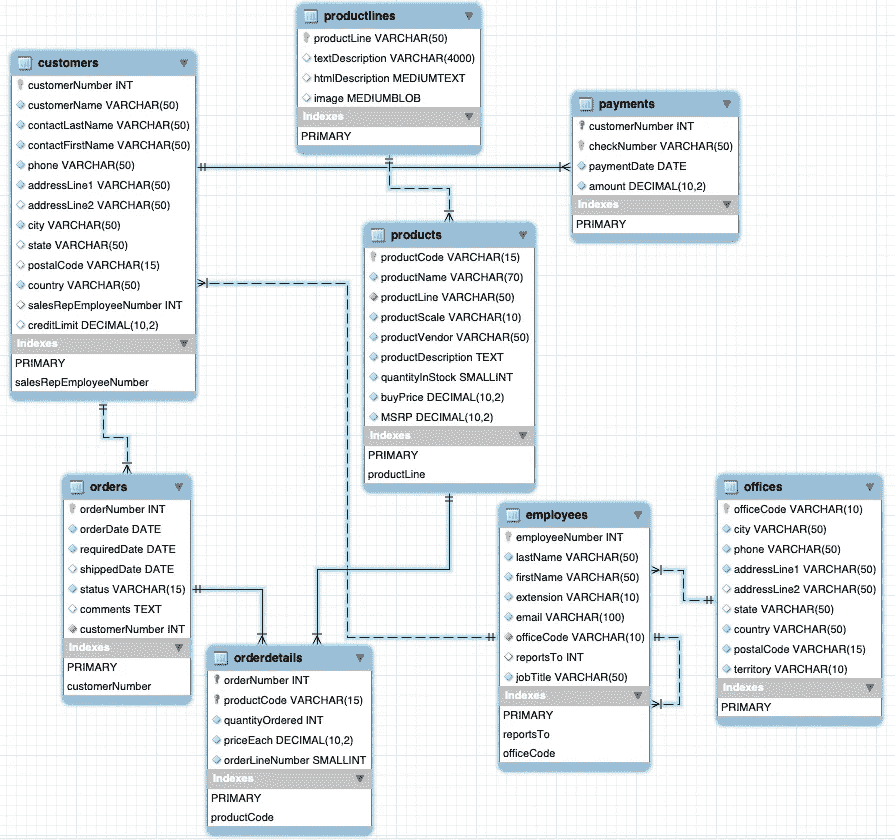

作者图片

📌**侧注**

*GROUP BY* 子句通常与聚合函数一起使用，按一列或多列对结果集进行分组。(基本上是将相似的数据组织成组)

*ORDER BY* 子句用于按升序或降序对结果集进行排序。默认情况下，它是按升序排列的。一起使用时， *GROUP BY* 子句总是在 *ORDER BY* 子句之前。

*有*子句与*相似，其中*子句有一些不同。它只能用于属于 GROUP BY 子句或聚合函数的*列。我写了一篇关于 SQL 中过滤子句的详细文章，可以在这里随意参考，*

[](/commonly-asked-interview-question-where-vs-having-vs-qualify-1445a1d15902) [## 常见的面试问题:vs 在哪里有资格

### 基础知识回归| SQL 初学者基础知识

towardsdatascience.com](/commonly-asked-interview-question-where-vs-having-vs-qualify-1445a1d15902) 

*DISTINCT* 子句用于过滤掉重复项，只提供结果集中唯一的值。

最常见的聚合函数有:

## **伯爵()**

*‘计数’*这个词的一般意思是确定某物的总数。


作者图片，创建于 [canva](https://www.canva.com)

类似地，在 SQL *中，COUNT()* 返回非空记录或与指定条件表达式匹配的记录的数量。 *COUNT()* 在不使用 *OVER* 和 *ORDER BY* 子句的情况下为确定性函数，在使用 *OVER* 和 *ORDER BY* 子句的情况下为非确定性函数。 *COUNT()* 的常用语法是，

> *计数(【全部|不同】表达式)*

让我们快速查询表 *OFFICES* ，它保存了世界各地销售办事处的数据，

```
#offices
SELECT * FROM CLASSICMODELS.OFFICES LIMIT 10;
```

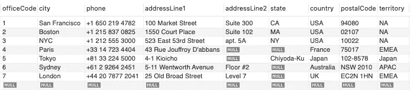

作者图片

让我们从简单的开始；我们需要统计在世界各地拥有办公场所的不同城市的总数，

```
#cities that have sales offices.
SELECT DISTINCT
    COUNT(DISTINCT CITY) AS TOTAL_OFFICES
FROM 
    CLASSICMODELS.OFFICES;
```


作者图片

现在，让我们尝试查询每个国家的办事处数量，

```
#total number of sales offices in each country.
SELECT
    COUNTRY,
    COUNT(DISTINCT CITY) AS TOTAL_OFFICES
FROM 
    CLASSICMODELS.OFFICES
GROUP BY COUNTRY
ORDER BY COUNTRY DESC;
```

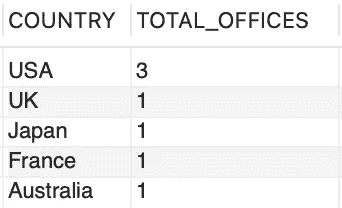

作者图片

第一个查询简单地提供了世界各地办事处的总数，而在第二个查询中，我们根据国家对结果集进行分组，并使用 *ORDER BY* 子句对结果集进行排序。两个结果集中的办公室总数保持不变，都是 7；唯一的区别是第二个结果集计数被分成不同的组。

*COUNT()* 可以有几种不同的用法；这里有一些简单的例子，

*   *COUNT(*)* 返回表格中记录/行的总数，包括重复值和空值。

```
SELECT COUNT(*) FROM CLASSICMODELS.OFFICES;
```

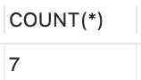

作者图片

*   *COUNT(1)，* 1 是非空表达式，因此类似于 *COUNT(*)* 。

```
SELECT COUNT(1) FROM CLASSICMODELS.OFFICES;
```

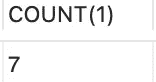

作者图片

*   *COUNT(column_name)* 从特定的 *column_name* 返回非空的记录数。

```
SELECT COUNT(COUNTRY) FROM CLASSICMODELS.OFFICES;
```

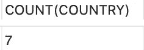

作者图片

*   *COUNT(DISTINCT column _ name)*从 *column_name* 返回非空且唯一的记录数。

```
SELECT COUNT(DISTINCT COUNTRY) FROM CLASSICMODELS.OFFICES;
```

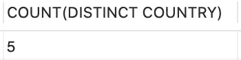

作者图片

*   *COUNT(x THEN y ELSE z END 的情况)*返回满足条件的行数。

```
#USA office locations
SELECT 
    COUNT(CASE WHEN COUNTRY='USA' THEN CITY ELSE NULL END) AS USA_OFFICE_LOCATIONS
FROM 
    CLASSICMODELS.OFFICES;
```

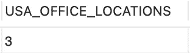

作者图片

*   *COUNT IF* 是 *COUNT()* 的另一个扩展，它返回匹配条件表达式的记录数。

```
#country wise count of office locations
SELECT 
    COUNT(IF(COUNTRY = 'USA', 1, NULL)) AS 'USA',
    COUNT(IF(COUNTRY = 'UK', 1, NULL)) AS 'UK',
    COUNT(IF(COUNTRY = 'Japan', 1, NULL)) AS 'Japan'
FROM
    CLASSICMODELS.OFFICES;
```

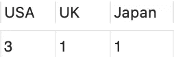

作者图片

## **SUM( )**

在数学中，求和/总和是一系列数字的相加。类似地，在 SQL 中， *SUM()* 返回所选集中所有非空值的总和。

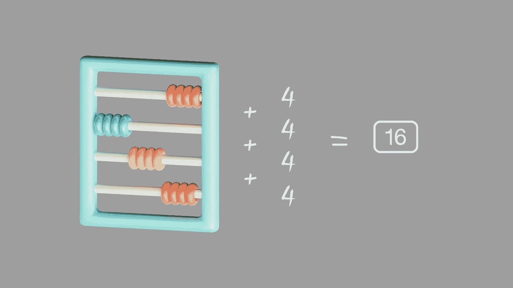

作者图片，创建于 [canva](https://www.canva.com)

语法是，

> *SUM(【所有|不同】表达式)*

新手有时候会分不清 *SUM()* 和*COUNT()*；但是请记住，他们两个是非常不同的。 *COUNT()* 返回列中非空记录/行的总数，而 *SUM()* 返回该列中所有值的总和。

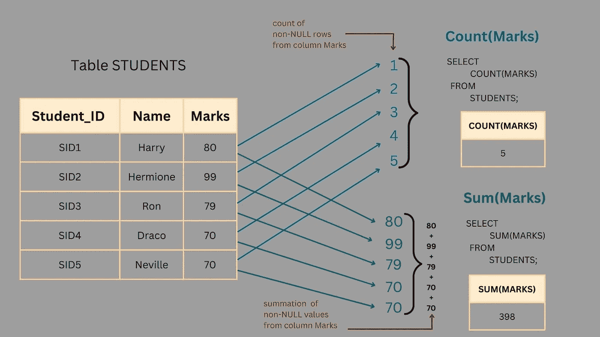

作者图片，创建于 [canva](https://www.canva.com)

表*产品*保存了一系列可用产品的数据，

```
#products
SELECT * FROM CLASSICMODELS.PRODUCTS LIMIT 10;
```

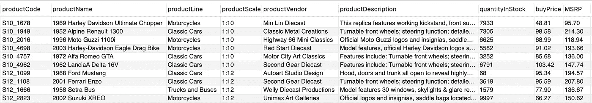

作者图片

比方说，我们需要库存中当前产品总量的信息，

```
#total quantity available in stock
SELECT 
    SUM(QUANTITYINSTOCK) as TOTAL_QUANTITY_IN_STOCK
FROM
    CLASSICMODELS.PRODUCTS;
```

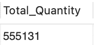

作者图片

在商业中，这些信息没有多大用处。现在让我们尝试查询每条*生产线*的当前总库存数量，并按降序对结果集进行排序。

```
#total quantity currently in stock for each productline grouped by productline
SELECT
    PRODUCTLINE,
    SUM(QUANTITYINSTOCK) AS TOTAL_IN_STOCK
FROM 
    CLASSICMODELS.PRODUCTS
GROUP BY PRODUCTLINE      
ORDER BY TOTAL_IN_STOCK DESC;
```

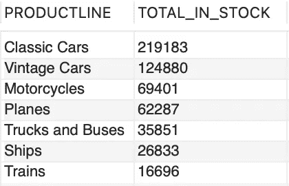

作者图片

让我们做一些快速销售分析。表 *ORDERDETAILS* 中的样本数据为:

```
#orderdetails
SELECT * FROM CLASSICMODELS.ORDERDETAILS LIMIT 10;
```

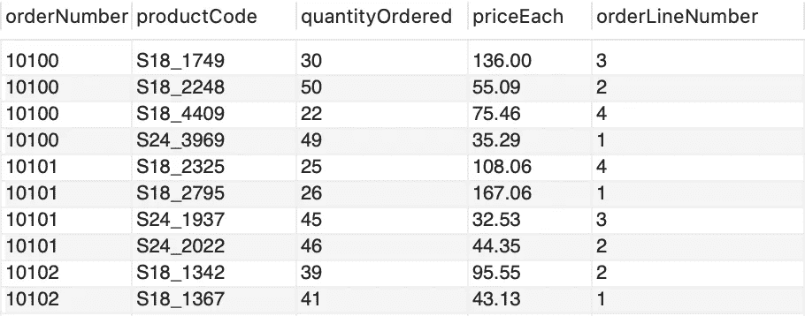

作者图片

比方说，我们需要知道每个订单的总销售额，按降序排列，

```
#total sales for each order placed
SELECT 
    ORDERNUMBER,
    SUM(QUANTITYORDERED * PRICEEACH) AS TOTAL_SALES
FROM 
    CLASSICMODELS.ORDERDETAILS
GROUP BY ORDERNUMBER
ORDER BY TOTAL_SALES DESC;
```

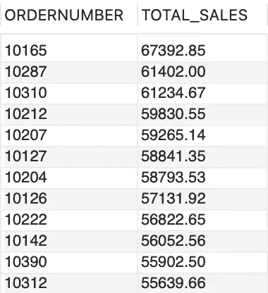

作者图片

出于演示目的，我限制了上述查询的结果集。现在，这个结果集也给出了销售额最高的*订单号*的概念。您可以从这里获取*订单号*，并进一步分析该订单中包含哪些产品、数量是多少、买方是谁、订单是何时下的、装运状态等。

如果所选集合的所有值都为空值，SUM() 将返回空值*。*

## ***AVG( )***

*在数学中，平均值的计算方法是将一系列数字相加，然后除以这些数字的个数。*

*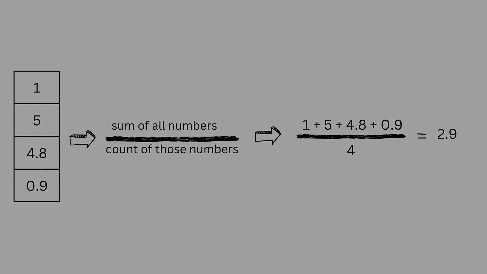*

*作者图片，创建于 [canva](https://www.canva.com)*

*同样， *AVG()* 返回所选集合的平均值，*空值*被忽略。常见的语法是，*

> **AVG**

*继续*产品*表，现在让我们找出平均购买价格。*

**

*作者图片*

```
*#average buy price
SELECT
    AVG(BUYPRICE) AS AVERAGE_BUYPRICE
FROM
    CLASSICMODELS.PRODUCTS;*
```

*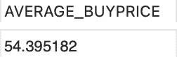*

*作者图片*

*现在让我们对每条*生产线*进行分析，*

```
*#average buy price for each product line
SELECT
    PRODUCTLINE,
    AVG(BUYPRICE) AS AVERAGE_BUYPRICE
FROM
    CLASSICMODELS.PRODUCTS
GROUP BY PRODUCTLINE;*
```

*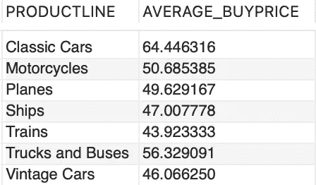*

*作者图片*

*稍加修饰，将 *AVG(BUYPRICE)作为 AVERAGE_BUYPRICE* 替换为*格式(AVG(BUYPRICE)，2)作为 AVERAGE_BUYPRICE* ，结果集将为，*

*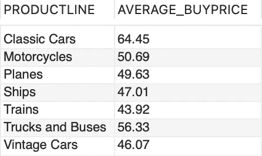*

*作者图片*

## *最大( )，最小( )*

*嗯！这个是简单的一个，顾名思义； *MAX()* 返回所选集合中的最高或最大非空值，而 *MIN()* 返回所选集合中的最低或最小非空值。*

*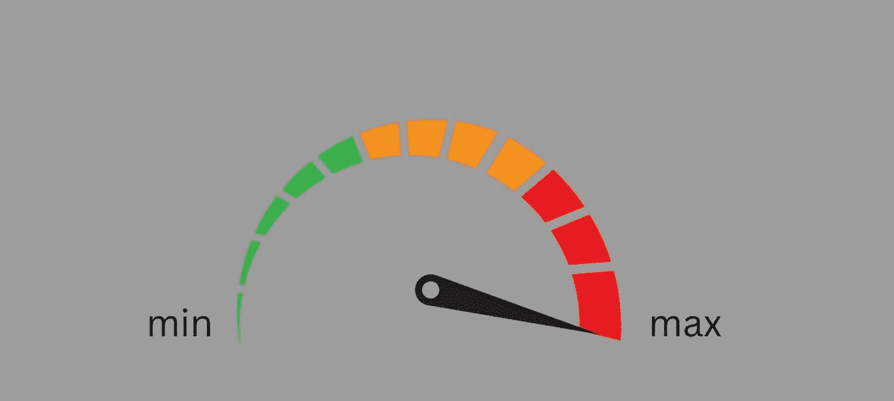*

*作者图片，创建于 [canva](https://www.canva.com)*

```
*#maximum buy price
SELECT 
    MAX(BUYPRICE) AS MAXIMUM_BUYPRICE
FROM
   CLASSICMODELS.PRODUCTS;*
```

*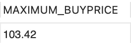*

*作者图片*

```
*#minimum buy price
SELECT 
    MIN(BUYPRICE) AS MAXIMUM_BUYPRICE
FROM
    CLASSICMODELS.PRODUCTS;*
```

*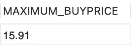*

*作者图片*

# *结论*

*撰写本文的想法是简单快速地回顾一下 SQL 聚合函数的基础知识。关于这些还有更多值得探索的地方，下面是一些入门资源，*

*   *[MySQL 样本数据库](https://www.mysqltutorial.org/mysql-sample-database.aspx)*
*   *[MySQL 官方文档](https://dev.mysql.com/doc/refman/8.0/en/aggregate-functions.html)*
*   *[聚合函数简介](https://www.mysqltutorial.org/mysql-aggregate-functions.aspx)*
*   *[Hackerrank](https://www.hackerrank.com) 或 [Leetcode](https://leetcode.com) 练习基础/中级/高级 SQL 聚合问题。*

*快乐学习！*