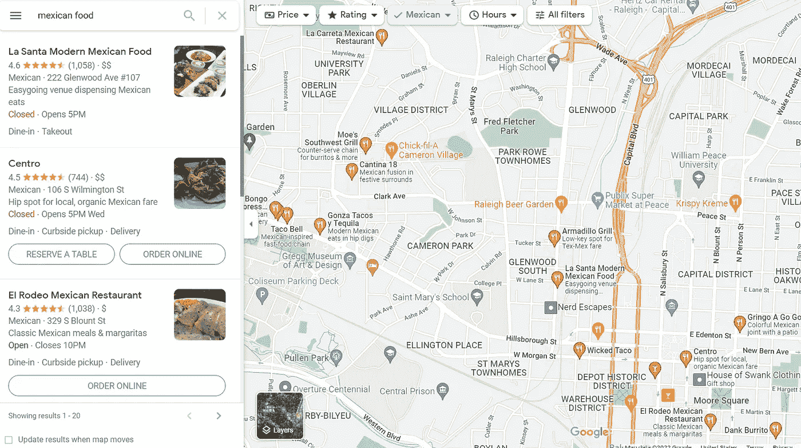
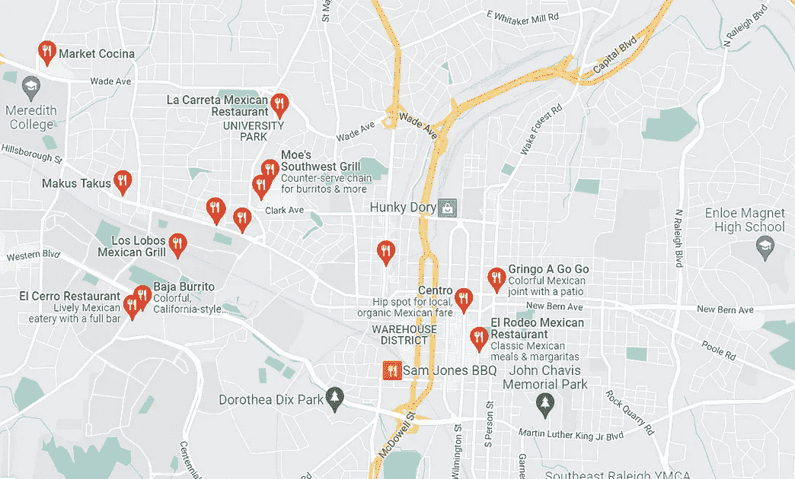
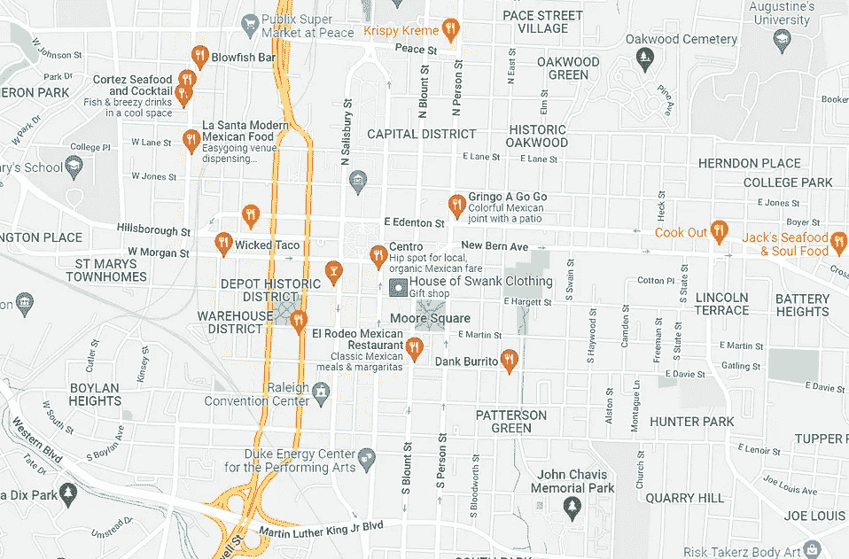
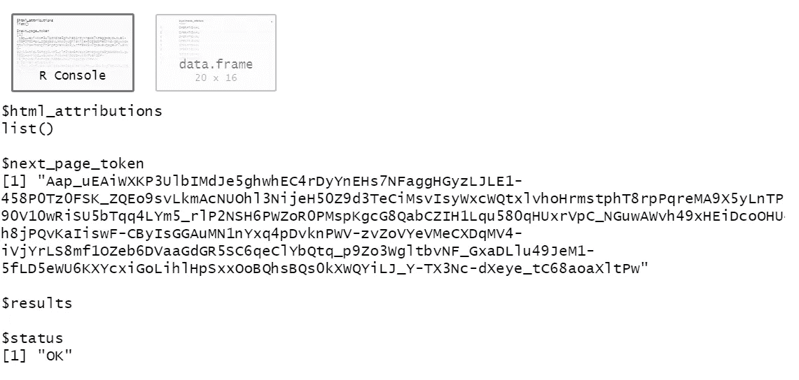
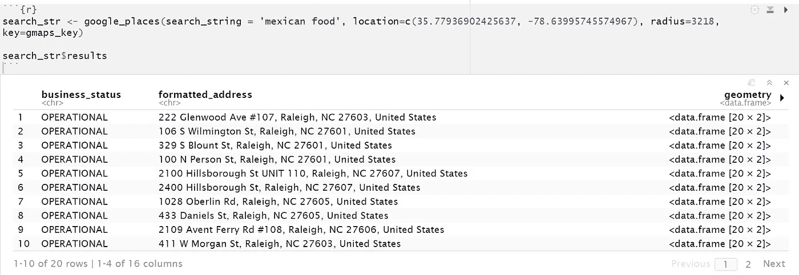
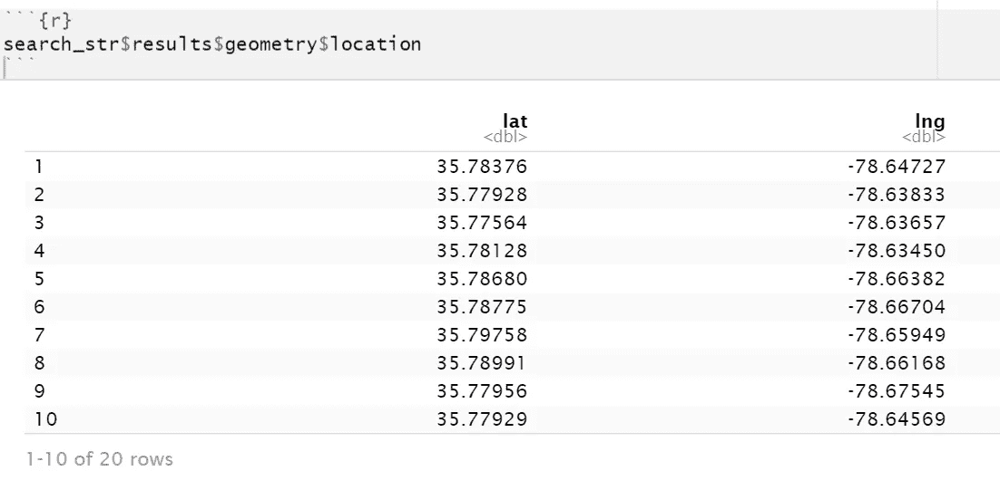

# 如何在 R 中使用 Google Maps Places API

> 原文：<https://towardsdatascience.com/how-to-use-the-google-maps-places-api-in-r-33f2b705b2c>

## 使用 R 中的 2 行代码解锁兴趣点数据


照片由[亨利·佩克斯](https://unsplash.com/@hjkp?utm_source=medium&utm_medium=referral)在 [Unsplash](https://unsplash.com?utm_source=medium&utm_medium=referral) 上拍摄

当我了解到 [Google Maps Places API](https://developers.google.com/maps/documentation/places/web-service/overview) 时，我对该 API 所展现的可能性感到兴奋，但作为一名非软件开发人员试图破译该文档时却感到困惑。所以，我[写了一篇文章](/how-to-use-the-google-places-api-for-location-analysis-and-more-17e48f8f25b1)给面临同样挑战的其他人一步一步地介绍如何在 Python 中使用它。

我在文章中提到代码可以很容易地过渡到 R，但就此打住。我最近发现自己在使用 R，结果发现 R 中 API 的实现甚至比 Python 更容易。

# 什么是谷歌地图位置应用编程接口？

简而言之，谷歌地图位置 API 是一种在搜索谷歌地图时获取信息的方式。如果我想在北卡罗来纳州罗利市中心找到墨西哥食物，我会在谷歌地图上搜索，看看会弹出什么。Places API 是一种以编程方式获取弹出结果的方法。



在谷歌地图上搜索北卡罗来纳州罗利的墨西哥食物；作者图片

不过，需要注意的一点是，结果**不会返回视图**中的所有结果。考虑屏幕上的结果如何根据地图的中心点和缩放半径而变化。



具有两个缩放级别的相同搜索的示例。请注意，在左侧，地图右下方只有 4 个位置，但在右侧图像中，放大后同一区域有 10 个位置。您的缩放级别会影响您的结果，就像在 API 调用中一样。

谷歌根据搜索结果的相关性、位置、付费广告等提供了一些样本。很容易以为只要输入一个很广的搜索半径就能得到所有结果，但没有这种运气。另外，每次搜索最多只能有 60 个结果。

因此，在使用 API 时，搜索要有针对性和针对性。

# 如何使用谷歌地图位置应用编程接口

除了以一种易于使用的格式准备数据之外， [googleway R 包](https://www.rdocumentation.org/packages/googleway/versions/2.7.6)*极大地简化了访问地点(和其他 Google 地图)API 的过程。*

*用`install.packages('googleway')`安装软件包，用`library(googleway)`加载软件包。*

*要使用这个包和任何谷歌 API，你需要建立一个谷歌云账户并生成一个 API 密钥。[以下是如何操作的说明](https://developers.google.com/maps/documentation/places/web-service/cloud-setup)。你将每月获得 200 美元的免费积分，用于地图相关的 API 计费，这相当于大约 11，750 次搜索，所以你必须非常努力才能超过免费限额。*

*当您有了 API 密匙后，您就可以用短短两行代码访问兴趣点数据了:*

*第 1 行:使用`google_places`函数调用 API 并保存结果*

*第 2 行:访问搜索结果*

*为了最有效地工作，`[google_places](https://www.rdocumentation.org/packages/googleway/versions/2.7.6/topics/google_places)` [函数](https://www.rdocumentation.org/packages/googleway/versions/2.7.6/topics/google_places)接受搜索字符串、位置、半径和 API 键。*

```
*google_places(search_string = 'mexican food', location=c(35.77936902425637, -78.63995745574967), radius=3218, key=gmaps_key)*
```

*   *`search_string`就是我们想要执行的搜索。*
*   *`location`是我们搜索的中心点(这里是罗利市中心)的纬度和经度，作为向量输入。我通常只需在谷歌地图中右键单击我想搜索的地方，它就会生成坐标作为第一个菜单结果。*
*   *`radius`是我们要搜索的距离**米。在这里，我把 2 英里换算成了 3218 米***
*   *`key`是 API 键。我已经把它保存为一个单独的变量，`gmaps_key`，但是如果你只进行一次搜索，你可以直接输入它(用引号括起来)。*

*当您运行代码时，您会看到 R Studio 中弹出了两个框。第一个是“回复”页面，第二个是结果。*

*响应页面为您提供了`next_page_token`(稍后将详细介绍)、您的请求的状态(“OK”表示可以运行，否则会有问题)，以及您的结果。*

**

*上述搜索的响应页面示例；作者图片*

*要访问数据，要么在第二个弹出窗口中单击数据框，要么—假设您已经保存了搜索—通过运行`variable_name$results`来访问它。我已经将结果保存到变量`search_str`中，所以我用`search_str$results`调用结果。*

**

*仅访问结果的数据框的示例*

*数据框将为您提供每个地方的丰富信息，包括地址、经纬度坐标、价格水平、星级、评级数量、类别等。其中有些是现成的，有些你需要多写一点代码才能访问。*

*例如，要获取纬度和经度坐标，您需要访问上面几何行中每个值内的数据框，然后访问位置内的数据框。使用代码`variable_name$results$geometry$location`访问坐标。*

**

*如果要将它们绑定回原始数据框，只需运行代码:*

```
*variable_name$results %>%
 cbind(., variable_name$results$geometry$location)*
```

*这会将纬度和经度作为列添加到您的搜索结果中。同样，如果您想要访问这些类型，可以对`types`列使用美元符号来访问这些信息。*

*你可能已经注意到只有 20 个结果，即使我说它返回 60 个。这可能意味着总共只有 20 个结果，但通常这意味着其他事情。*

*每个 API 调用最多返回 20 个结果，一个搜索最多可以返回 60 个位置。这实际上意味着，要访问所有 60 个结果，您需要对 API 执行 3 次调用。我上面提到的`next_page_token`就是我们如何访问接下来的(最多)20 个结果。*

*为此，使用相同的搜索标准运行另一个搜索，但是这次向函数添加一个参数`page_token`。*

```
*google_places(search_string = 'mexican food', location=c(35.77936902425637, -78.63995745574967), radius=3218, key=gmaps_key, **page_token = search_str$next_page_token**)*
```

*`page_token`是告诉谷歌在搜索中返回接下来的 20 个结果，而不是前 20 个。如果已经保存了初始搜索，可以通过调用`variable_name$next_page_token`直接添加`next_page_token`。*

*如果您想返回最后 20 个结果(第 40-60 位)，您可以从第二次搜索中访问`next_page_token`，并将其插入到`page_token`参数中。*

*如果没有`next_page_token`，那么要么(1)没有比已经显示的更多的结果，要么(2)你已经用完了 60 个结果。*

# *其他需要知道的事情*

*需要进行几次搜索才能掌握 API 如何返回结果，但是有了 200 美元的免费积分，我鼓励您尽早测试和学习。*

*较小的搜索半径会给你更多的信心，所有你想要的结果都会显示出来，但是如果你试图在一个更大的区域寻找，你将不得不执行更多的搜索。这将需要一些迭代来找到适合您的用例的折衷。(如果这一点令人困惑，可以在谷歌地图上进行几次测试搜索，看看结果会随着你的缩放级别发生什么变化。API 以同样的方式工作-一些结果会出现，另一些不会，但是在更大的放大级别，您的精度将会提高。)*

*请务必了解[服务条款](https://cloud.google.com/maps-platform/terms?_ga=2.158359481.2074227224.1650310661-1121356209.1649083124)如何影响您的用例，尤其是关于数据的许可和使用。*

*googleway R 包比 google_places 功能有更多的功能。如果您想进行地理编码、查找点与点之间的距离、获取方向或更多，这是您的最佳选择。*

*我怎么强调开发者使访问 Google Places APIs 的过程变得多么容易都不为过，而且更容易的访问释放了更多有趣的用例和应用。*

**想谈谈更多的位置分析？* [*在 LinkedIn 上跟我联系*](http://www.linkedin.com/in/jordanbean) *。**