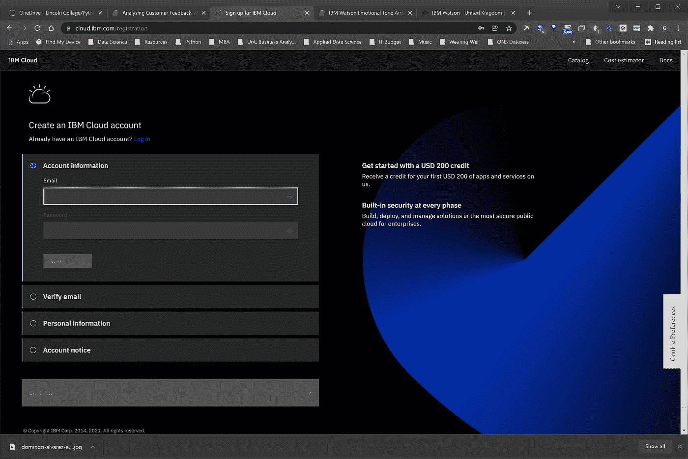
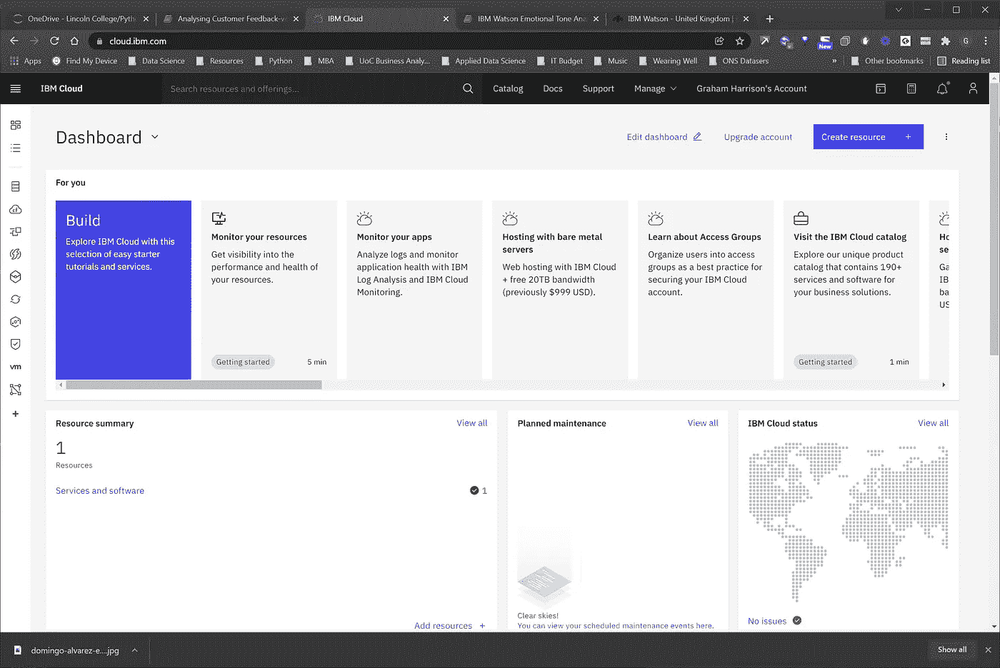
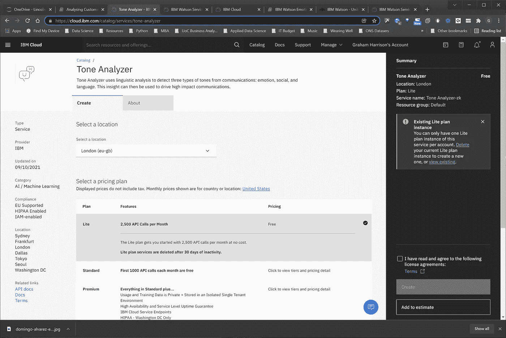
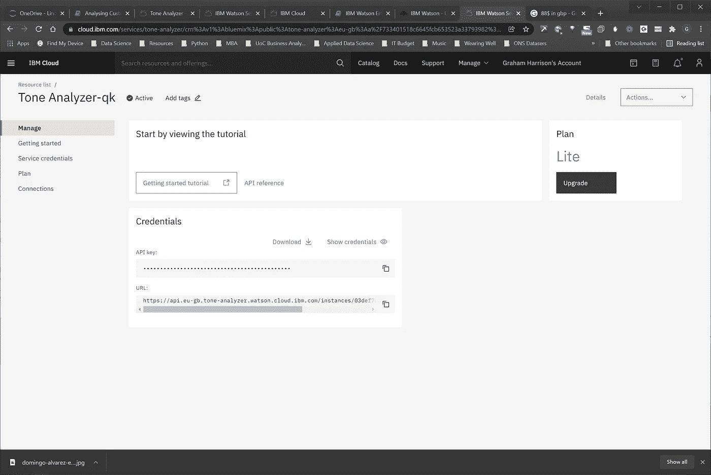
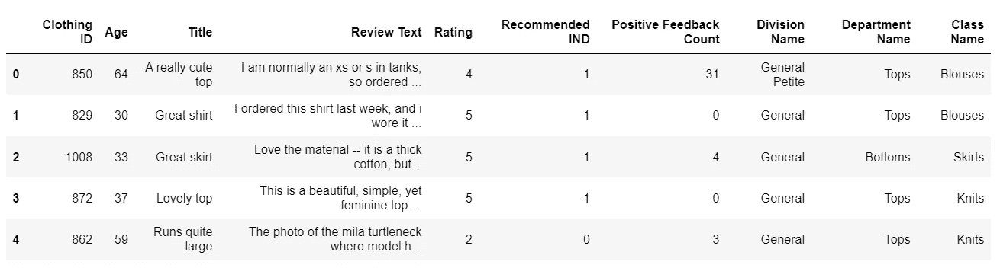
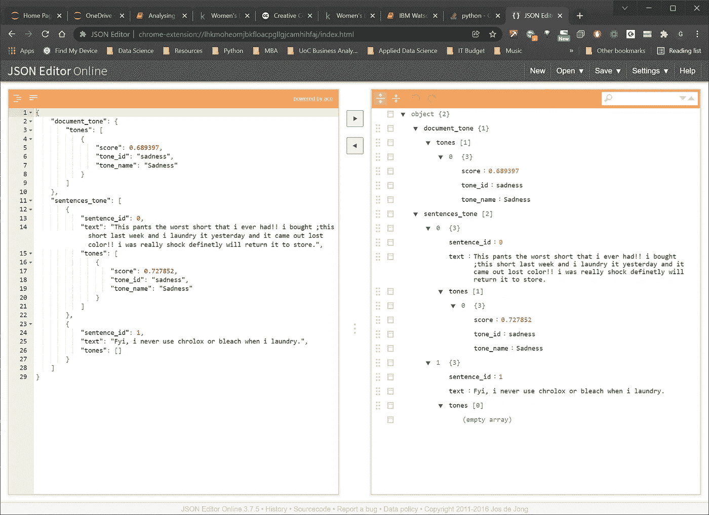
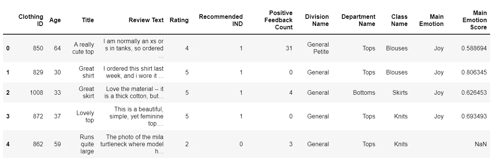
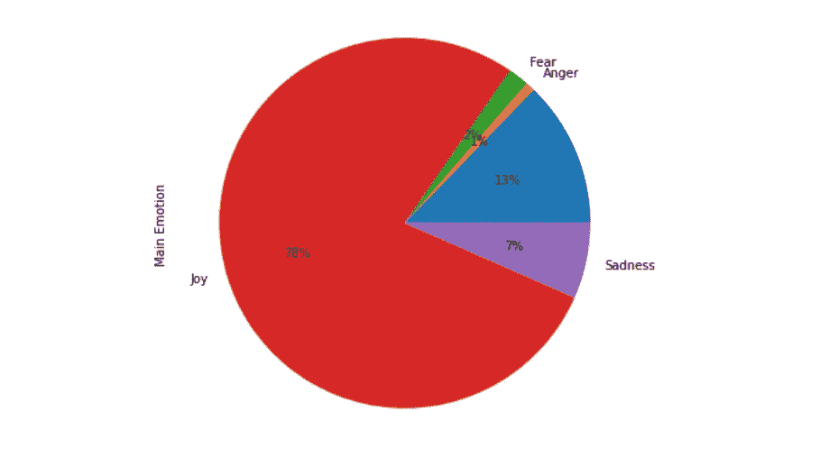

# 如何使用 IBM Watson Tone Analyzer 在 Python 中执行情感情绪分析

> 原文：<https://towardsdatascience.com/how-to-use-the-ibm-watson-tone-analyzer-to-perform-emotional-sentiment-analysis-in-python-d1d4ad022d0b>

## 如何使用 IBM Watson 人工智能平台来预测客户在撰写产品评论或提供自由文本反馈时的情绪


在 [Unsplash](https://unsplash.com/s/photos/emotions?utm_source=unsplash&utm_medium=referral&utm_content=creditCopyText) 上由 [Domingo Alvarez E](https://unsplash.com/@domingoalvarze?utm_source=unsplash&utm_medium=referral&utm_content=creditCopyText) 拍照

# 介绍

一个常见的用例是以自由文本的形式收集客户反馈，然后分析这些反馈，将客户的意见转化为产品和服务的改进。

执行这种类型的分析的一种方法是获取自由文本并对其执行一些特征工程，使得定性的自由文本获得更多的定量特征。

例如，如果你知道顾客是喜是怒是悲等等。当他们撰写反馈时，这将提供对客户观点的有用见解，然后可用于将数据开发为信息、情报和知识，从而导致洞察力驱动的行动和改进的业务成果。

IBM Watson 是“IBM 的业务就绪型工具、应用和解决方案组合，旨在降低人工智能采用的成本和障碍，同时优化人工智能的成果和负责任的使用”([https://www.ibm.com/uk-en/watson](https://www.ibm.com/uk-en/watson))。

“音调分析器”使文本的情感分析能够直接嵌入到用 Python(或其他语言)编写的机器学习应用程序中，并且有免费的定价计划可用于测试和开发目的。

# 入门指南

在您开始使用 IBM Watson 情感语调分析器之前，您需要注册一个帐户，并创建一个 URL 和 API 密钥…

## 1.创建 IBM Watson 帐户

首先导航到 https://cloud.ibm.com/login 的，然后点击“创建账户”。您将看到一个创建账户的屏幕，如下所示-



作者图片

一旦您成功注册并登录，您将看到以下 IBM Watson 仪表板



作者图片

## 2.为音调分析器创建一个定价计划

IBM Watson studio 环境可能很难导航，所以最好的开始方式是点击“搜索资源和产品”,然后输入“音调分析器”。这将提供一个链接，链接到音调分析仪定价计划页面，如下所示



作者图片

“Lite”计划每月免费提供 2500 个 API 调用，但你必须继续使用它，否则它会被删除，这没什么大不了的，除非你必须创建一个新的 API 密钥，如果它已被删除。

如果您每月需要 2，500 个以上的 API 调用，您可以转到标准计划，即每个 API 调用 0.0088 美元，相当于 10，000 个调用 88 美元(约 65 美元)。

## 3.生成 API 密钥和 URL

一旦您创建了一个 Lite 计划，您可以通过点击屏幕右侧工具栏上的“查看现有”链接，从该页面导航到该计划，进入下一步，您将在该步骤中创建您的 API 密钥…



作者图片

上面的屏幕截图显示了一个现有的 API 密钥——为了开始使用该服务，您需要复制密钥和 URL。如果您尚未创建密钥，此页面上会有一个创建密钥的按钮。

仔细记下您的 API 密钥和 URL，您已经设置好了 IBM Watson 帐户、音调分析器计划和 API 密钥，您可以进入下一阶段，我们将使用该服务执行一些情绪音调分析…

# 获取一些数据

## 1.选择数据集

接下来我们需要一些测试数据来测试 IBM Watson Emotion Tone Analyser，我已经从 ka ggle([https://www . ka ggle . com/nica potato/women-ecommerce-clothing-reviews](https://www.kaggle.com/nicapotato/womens-ecommerce-clothing-reviews))选择了一个 23000 条女性电子商务服装评论的数据集。

这个数据集非常适合开发和测试围绕客户反馈和文本分析的解决方案，它是在“CC0:公共领域”许可下获得许可的，这意味着“你可以复制、修改、分发和执行这项工作，即使是出于商业目的，都无需请求许可”(见[https://creativecommons.org/publicdomain/zero/1.0/](https://creativecommons.org/publicdomain/zero/1.0/))。

## 2.加载数据集

让我们从读入数据开始，执行一些有限的数据清理、特征工程和样本选择-



作者图片

注意，IBM Watson 的 Lite 计划被限制为每月 2500 次 API 调用，因此`df_reviews.sample`将限制 API 被调用的次数并保持在计划内。

# 配置和准备 IBM Watson 音调分析器

## 1.安装 IBM Watson 库

您将需要使用 pip 或 conda 安装库…

```
pip install ibm-watson
```

我发现，在我一直使用的一些功能被弃用后，我必须使用以下命令手动选择版本升级…

```
pip install --upgrade "ibm-watson>=4.5.0"
```

## 2.初始化 IBM Watson

接下来，我们需要使用 API 密钥和 URL 进行身份验证，并启动音调分析器。我们还需要小心保持 API 密匙的私密性，我发现一个很好的方法是将 URL 和 API 密匙保存在一个名为`config.py`的单独文件中，并从 github 中排除这个文件，这样其他人就无法找到细节。

## 2.1 指示 GitHub 排除配置文件

使用文本编辑器在 GitHub 项目的根目录下创建一个名为`.gitignore`的文件，并在第一行输入`config.py`。

## 2.2 创建一个 config.py 文件并添加常量

用您的详细信息替换 XXX

```
IBM_WATSON_URL = "https://api.eu-gb.tone-analyzer.watson.cloud.ibm.com/instances/XXXXXXXXXXXXXXXXXXXXXXXXXXXXXXXXXXXX"
IBM_WATSON_API_KEY = "XXXXXXXXXXXXXXXXXXXXXXXXXXXXXXXXXXXXXXXXXXXX"
```

## 2.3 验证和连接

# 使用 IBM Watson 音调分析仪预测和可视化情绪

基本的方法是使用`apply`和一个`lambda`函数为每行数据调用一次 API，稍微复杂一点的是，我们希望在`DataFrame` ( `Main Emotion`和`Main Emotion Score`)中设置两列的值。

在两个列中设置值的 Python 语法并不明显，stackoverflow 上的这个线程在解决这个问题时是非常宝贵的。

## 1.编写一个帮助器函数来调用单行的 API

需要注意的几点是-

*   IBM Watson tone analyser 可以返回不同类别的音调，但是出于分析的目的，我们只对使用`EMOTIONAL_TONES`列表中的值过滤的情感感兴趣。
*   每个返回的音调都有一个名称和一个分数，因此代码存储最高分数的情感音调名称和值。
*   `return pd.Series...`是使用 pandas `apply`和一个`lambda`函数设置两列中的值所需的语法。

为了充分理解代码，有必要看一下 json 输出是如何针对单个 API 调用进行构造的



作者图片

我已经使用了[谷歌 Chrome JSON 编辑器应用](https://chrome.google.com/webstore/detail/json-editor/lhkmoheomjbkfloacpgllgjcamhihfaj?hl=en)来查看输出，但还有其他选项可用，例如 Visual Studio Code Json 编辑器扩展。

您可以从编辑器中看到，每个句子都有一种语气，整个文本都有一种由代码提取的语气。这里只显示了一个音调，但是更复杂的文本将导致返回多个音调，混合了情感和非情感。提供的代码处理 API 返回的所有数据组合。

## 2.调用助手函数

现在剩下的就是为数据集中的每一行调用 helpder 函数，并根据`get_emotion`函数为每一行返回的值同时设置两个特性的值..



作者图片

## 3.保存结果

为了避免多次调用 API 而耗尽每月限额，我们将把结果保存到 Excel 电子表格中…

## 4.可视化结果

最后，这里用一个饼状图展示了主要的客户情绪…



作者图片

# 结论

我们已经了解了如何向 IBM Watson 注册一个帐户，然后创建一个免费计划，每月向音调(情感)分析器调用 2500 次 API。

我们还开发了 Python 代码，将情感预测应用于公共许可数据集，然后存储和可视化结果。

如果我们将这种方法应用于女性电子商务服装评论数据集中的所有 23，000 个数据点，成本将为 202 美元(~ 149 美元)，代码运行将需要大约 4 个小时。

总之，IBM Watson Tone Analyzer 是为中小型数据集预测客户情绪的一种有效且经济的方法，但处理时间和成本可能会妨碍它在大数据上的使用。

然而，IBM Watson 引擎已经使用 1000 个数据点中的 100 个进行了训练，因此它是一个有效的预测器，因此这种方法可以潜在地用于更大数据集中的数据样本，如本例中所做的那样，以对群体数据中的模式进行预测。

# 感谢您的阅读！

如果你喜欢读这篇文章，为什么不看看我在 https://grahamharrison-86487.medium.com/的其他文章呢？此外，我很乐意听到您对这篇文章、我的任何其他文章或任何与数据科学和数据分析相关的内容的看法。

如果你想联系我讨论这些话题，请在 LinkedIn 上找我—【https://www.linkedin.com/in/grahamharrison1 或者发电子邮件到[ghar rison @ Lincoln college . AC . uk](mailto:GHarrison@lincolncollege.ac.uk)。

如果你想通过订阅来支持作者和世界上成千上万为文章写作做出贡献的人，请使用这个链接——[https://grahamharrison-86487.medium.com/membership](https://grahamharrison-86487.medium.com/membership)(注意:如果你使用这个链接注册，作者将收到一定比例的费用)。