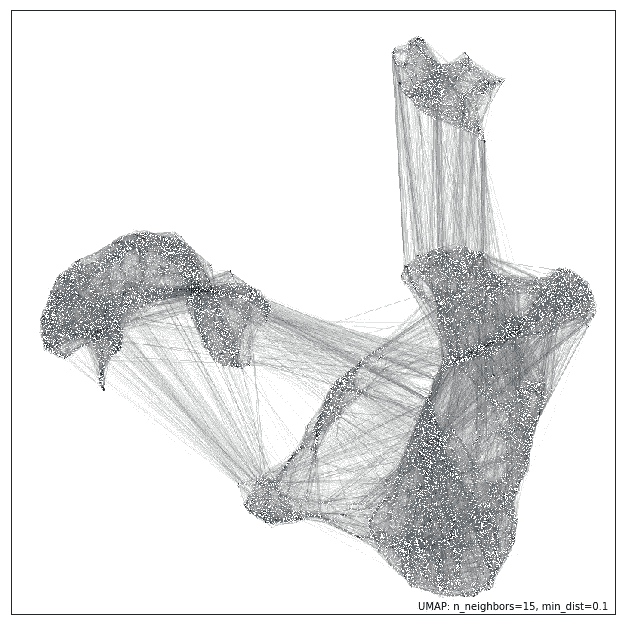
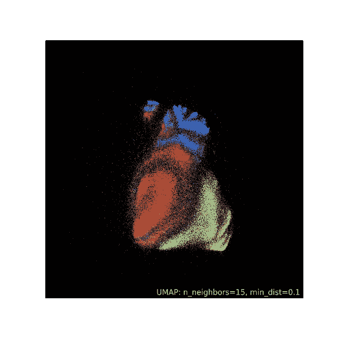
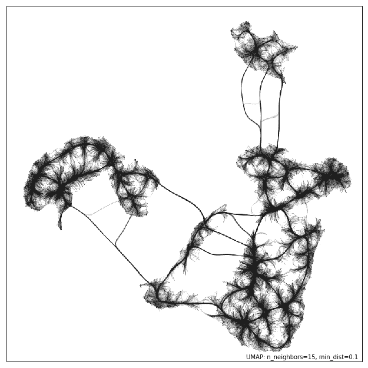
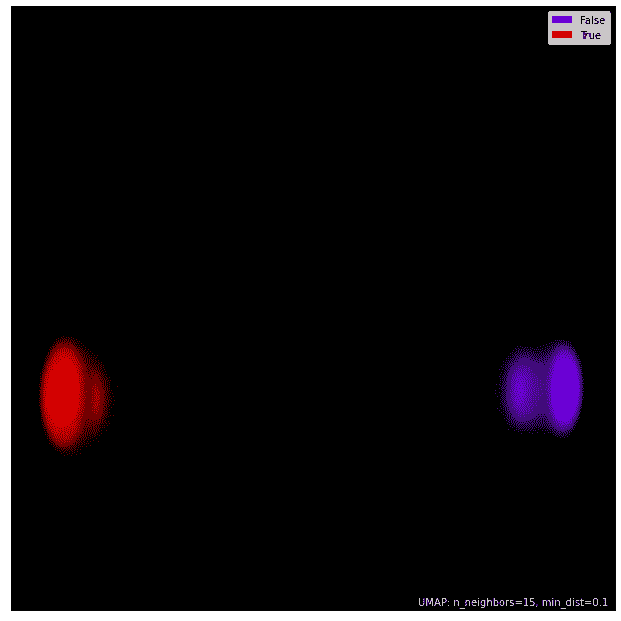
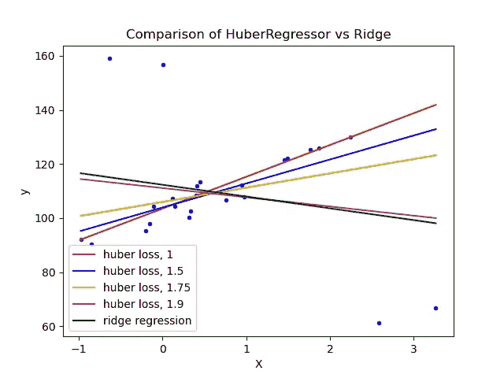

# 如何使用 UMAP 进行更快更有效的异常检测

> 原文：<https://towardsdatascience.com/how-to-use-umap-for-much-faster-and-effective-outlier-detection-e4608f336915>

## 让我们抓住那些高维离群值

照片由[乔·耶稣](https://www.pexels.com/photo/selective-focus-photo-of-a-red-tulip-flower-2480072/)拍摄

# 介绍

我们都使用过这些简单的技术——绘制散点图或 KDE，离组最远的数据点是异常值。现在，告诉我——如果你要在比如说 100 维的数据集中发现异常值，你会如何使用这些方法？马上，视觉异常检测方法是不可能的。

因此，像局部离群因子或隔离森林这样的奇特机器学习算法浮现在脑海中，它们对高维数据中的离群点是有效的。

但是使用 ML 方法检测异常值有很多注意事项。一种称为椭圆包络的技术使用协方差估计，但假设数据是正态分布的(这种情况很少发生)。局部离群因子比隔离森林快得多，但精度较低。

那么，在处理如此常见的大规模、百万行数据集时，我们如何才能在离群点检测的速度和准确性方面表现出色呢？这就是 UMAP 的用武之地。

<https://ibexorigin.medium.com/membership>  

获得由强大的 AI-Alpha 信号选择和总结的最佳和最新的 ML 和 AI 论文:

<https://alphasignal.ai/?referrer=Bex>  

# 什么是 UMAP？

UMAP(Uniform Manifold Approximation & Projection)是 2018 年推出的一种降维算法。它结合了 PCA 和 tSNE 的最佳功能，可以快速扩展到大型数据集，并在速度上与 PCA 竞争，并且比 tSNE 更有效、更美观地将数据投影到低维空间:

作者图片和 UMAP 文档

UMAP python 包有一个熟悉的 Scikit-learn API。下面是将 [Kaggle TPS 九月竞赛](https://www.kaggle.com/c/tabular-playground-series-sep-2021/data)数据投影到 2D 的示例代码:

UMAP 的设计使得无论你将数据投影到哪个维度，它都尽可能地保留了变量和拓扑结构。但是这和异常检测有什么关系呢？

好吧，因为我们知道 UMAP 即使在较低的维度上也能保留数据集的所有特性和属性，我们可以使用它首先将数据投影到一个较低的空间，然后使用任何其他异常值检测算法更快！在接下来的章节中，我们将使用上面的 TPS 九月数据来看一个例子。

> 如果你想更多地了解 UMAP 及其令人敬畏的特色，我在以前的一篇文章中已经深入地讨论过了:

</beginners-guide-to-umap-for-reducing-dimensionality-and-visualizing-100-dimensional-datasets-ff5590fb17be>  

# 用纯隔离林设置基线

在我们继续之前，让我们建立一个基准性能。首先，我们将为基准拟合一个 CatBoostClassifier:

我们的 ROC AUC 值为 0.784。现在，让我们在输入缺失数据后，将隔离森林估计量用于数据:

尽管功能强大，隔离林只有几个参数需要调整。最重要的是`n_estimators`，控制要建的树数。考虑到数据集的大小，我们将其设置为 3000。

等待大约 50 分钟后，我们发现隔离林在数据中发现了 2270 个异常值。让我们从训练数据中删除这些值，并再次拟合分类器:

我们的性能略有下降，但这并不意味着我们要停止寻找异常值的努力。此时，我们并不真正知道这~2200 个数据点是否都是数据中的异常值。我们也不知道我们是否用足够的树木建造了隔离林。最糟糕的是，我们不能再次尝试这个实验，因为它太耗时了。

这就是为什么我们将开始玩聪明。

# 结合隔离森林的 UMAP 离群点检测

在我们发现 2270 个异常值后，我们没有仔细检查它们是否是真正的异常值。传统的可视化方法不起作用，所以让我们先尝试将数据投影到 2D，然后绘制一个散点图:

作者图片

我们可以立即看到离两个不同集群最远的单个点(它们以小尺寸显示，因为我们没有调整 UMAP 参数)。我们可以放心地将这些点归类为异常值，并相信我们从隔离林中获得的结果。

现在，我们将把 UMAP 和隔离森林结合起来。为了尽可能最大限度地保留，我们将数据投影到 5 个维度。然后，我们将只安装 500 棵树的隔离林，因为这次我们的功能要少得多:

整个转换和异常值检测只需三分之一的时间。但令人惊讶的是，这一次，Isolation Forest 在 95 万个异常值中发现了大约 16.3 万个异常值。我们在犯错误吗？让我们在删除这些异常值后，通过再次拟合分类器来进行检查:

3000 棵树似乎不足以发现数据中的所有异常值。我们看到，即使在放弃 160，000 次观察后，我们仍然得到相同的结果。

# 摘要

是的，在从数据集中移除异常值后，我们没有获得显著的分数提高。事实上，就实用性而言，你可以说我们所有的努力完全是浪费。

然而，本文的目的是向您展示，当结合像 UMAP 这样的强大的降维技术时，离群点检测将变得更加节省时间/资源。如您所见，我们在隔离林中用更少的资源实现了更好的性能。

离群值是 ML 世界中一个真实而严重的问题。您今天学到的技术一定会让您在面对如下场景时受益匪浅，尤其是当您的数据是海量和高维数据时:

**图片来自 Sklearn 文档**

您可以从 [UMAP 文档](https://umap-learn.readthedocs.io/en/latest/outliers.html)中了解更多关于本文中的技术，其中包括一个使用 digits 数据的很棒的例子。

感谢您的阅读！

<https://ibexorigin.medium.com/membership>  <https://ibexorigin.medium.com/subscribe>  

## 阅读更多来自我的故事…

</comprehensive-guide-to-deploying-any-ml-model-as-apis-with-python-and-aws-lambda-b441d257f1ec> [## 使用 Python 和 AWS Lambda 将任何 ML 模型部署为 API 的综合指南

towardsdatascience.com](/comprehensive-guide-to-deploying-any-ml-model-as-apis-with-python-and-aws-lambda-b441d257f1ec) </25-advanced-pandas-functions-people-are-using-without-telling-you-b65fa442f0f4>  </forget-roadmaps-here-is-how-to-dominate-the-data-science-stack-blazingly-fast-a49e62f2bcf>  </25-numpy-treasures-buried-in-the-docs-waiting-to-be-found-60d8e17931cd>  <https://ibexorigin.medium.com/28-weekly-machine-learning-tricks-and-resources-that-are-pure-gems-1-8e5259a93c94> 