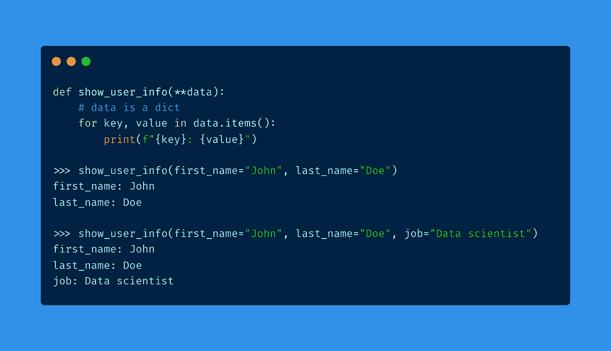

# 如何在 Python 函数中使用可变数量的参数

> 原文：<https://towardsdatascience.com/how-to-use-variable-number-of-arguments-in-python-functions-d3a49a9b7db6>

# 如何在 Python 函数中使用可变数量的参数

## 一个关于*args 和**kwargs 的小故事



作者制作的图像

在本文中，我们将学习*args 和**kwargs，这两个特殊的 Python 符号，您可能以前在一些函数签名中遇到过。

> ***他们做什么？它们解决什么问题？您如何使用它们来提高代码的灵活性？***

我们将回答这些问题。📚

# Python 函数中可变数量的参数

这个标题有点像剧透: ***args** 和 ****kwargs** 允许您向函数传递可变数量的参数。但我们会谈到这一点。

现在，让我们看看一些具有这种灵活性的流行函数，并考虑一下您如何也能从中受益。

如果您熟悉 Python 编程语言，您可能知道以下两个函数:

**1 —** 出了名的内置`**print**`功能:

顾名思义，这个函数将数据打印到标准输出中。但是你知道它也可以接受任意数量的参数(来打印)吗？

```
**print("hello")
# hello****print("hello", "there")
# hello there****print("I", "have", 5, "dollars")
# I have 5 dollars****print("a", 2, [1, 2, 3])
# a 2 [1, 2, 3]**...
```

**2—**`**os**`模块的`**join**`功能:

这个函数连接文件系统上任意数量的路径。同样，它接受可变数量的路径作为参数。

```
**import os****path1 = os.path.join("/")
path2 = os.path.join("/", "Users")
path3 = os.path.join("/", "Users", "Library")****# ...**
```

使用接受可变数量参数的函数可能非常有用:这提供了很大的灵活性，并减少了函数签名中的混乱。此外，它没有对所需参数的数量做任何假设，这在多种情况下可能是合适的。

在很多情况下，你需要使用一个参数个数可变的函数。

让我们举一个例子:假设您想要构建一个计算数值聚合(平均值、总和、乘法等)的函数。)超过一些数字。
为简单起见，考虑**乘法**(这同样适用于其他聚合)。

如果你想定义一个将两个数相乘的函数，你可以简单地这样做:

```
**def multiply_numbers(n1, n2):
    product = n1 + n2
    return product**
```

这很好，但是把三个数相乘怎么样？还是四个？还是万一呢？

您可以想到的一个自然的解决方案是将所有数字放在一个列表中，并将其传递给函数:

```
**def multiply_numbers(list_of_numbers):
    product = 1
    for number in list_of_numbers:
        product *= number
    return product**
```

虽然这种解决方案可行，但是如果您不预先知道列表中的所有元素，它可能会有点不方便，也不太灵活。此外，它强迫你创建一个看起来不必要的列表对象。

# 用*args 传递非关键字参数

***args:** 你可能以前在函数中见过这个奇怪的参数，但你从来不知道它是怎么回事。

嗯，在函数中使用*args 是 Python 判断这个函数将:

1.  接受任意数量的参数
2.  将收到的参数打包到一个名为 args 的**元组**中。注意 **args** 只是一个名字，你可以用任何你想要的东西来代替。(我们将在下面看到一个例子)

我们来扔点代码把事情说清楚。

让我们定义一个函数，它将参数打包在一个 args 变量中，并将这个变量打印到控制台。没什么特别的。

```
**def my_awesome_function(*args):
   # do awesome job!
   print(args)**
```

如果我们传递任意数量的参数:

```
**my_awesome_function(1, 2, 3)
(1, 2, 3)****my_awesome_function(1, 2, 3, 4)
(1, 2, 3, 4)**
```

我们会清楚地看到，它们确实都被打包在一个元组中。

即使我们没有通过任何论证，

```
**my_awesome_function()
()**
```

我们仍然得到一个(空的)元组。

这可能会让一些人有点畏缩，但是您甚至可以打包不同类型的多个参数。

```
**my_awesome_function(1, "2", [1, 2])
(1, "2", [1, 2])**
```

*运算符是做什么的？
这是一个拆包符。它出现在一个 iterable(例如一个列表或一个元组)之前，它真正做的是将它的元素作为函数的参数展开。它基本上是一种符号，其中:

```
**my_awesome_function(1, 2, 3)**
```

相当于:

```
**my_awesome_function(*[1, 2, 3])**
```

现在，回到我们之前关于乘法的例子，我们可以通过打包重写函数。

```
**def multiply_numbers(*numbers):
    product = 1
    for number in numbers:
        product *= number
    return product**
```

这个函数现在可以接收任意数量的参数，即使您有一个数字列表，您仍然可以使用它:这就是解包的用处。

```
**multiply_numbers(*large_list)**
```

# 用**kwargs 传递关键字参数

**首先，什么是关键词论点？**

当您定义如下所示的函数时:

```
**def sum_numbers(a, b):
    return a + b**
```

您可以用两种不同的方式调用它，或者通过

1-传递位置参数

```
**sum_numbers(1, 2)**
```

2-或传递关键字(或命名)参数

```
**sum_numbers(a=1, b=2)**
```

正如您所料，Python 也有自己传递可变长度关键字参数(或命名参数)的方式:这是通过使用 ****kwargs** 符号来实现的。

使用**kwargs 时，传递给函数的所有关键字参数都打包在一个字典中。正如您所料，这个字典变量叫做 kwargs。

让我们看一个利用 ****kwargs 的小例子。**一个简单的例子，接受关键字参数并打印它们的键值对。

```
**def show_user_info(**data):
    # data is a dict
    for key, value in data.items():
        print(f"{key}: {value}")****>>> show_user_info(name="Ahmed")
name: Ahmed****>>> show_user_info(name="Ahmed", job="data scientist")
name: Ahmed
job: data scientist**
```

# 使用*args 和**kwargs

现在您已经理解了这两种符号的基础，有一些适用于它们的特定规则:

*   您可以在位置参数中使用*args。在这种情况下，*args 必须在末尾

```
**def my_function(a, b, *args):
    # do magic stuff**
```

*   如果我们在前面的例子中添加一个带有默认值的位置参数，这个参数必须在最后

```
**def my_function(a, b, *args, c=2)
    # do more magic stuff**
```

*   您可以将 ***args** 与 ****kwargs** 组合起来，甚至可以添加带有默认值的位置参数。在这种情况下，顺序是: ***args** 、带有默认值的位置参数、 ****kwargs**

```
**def my_function(a, b, *args, c=2, **kwargs):
   # make Harry Potter cry**
```

# 结论

让我们结束它。

*   ***args** 和 ****kwargs** 允许你拥有可变长度的参数
*   ***args** 允许您传递可变数量的非关键字参数，这些参数被打包到一个元组中
*   ****kwargs** 允许您传递可变数量的关键字参数，这些参数被打包到一个字典中
*   ***args** 和 ****kwargs** 让你的代码更加灵活
*   *args 和**kwargs 可以与位置参数组合在一起

# 资源

如果您有兴趣更深入地研究*args 和**kwargs 主题，您可以查看以下资源:

*   [https://stack overflow . com/questions/33542959/why-use-packed-args-kwargs-inst-of-passing-list-dict](https://stackoverflow.com/questions/33542959/why-use-packed-args-kwargs-instead-of-passing-list-dict)
*   [https://www.pythontutorial.net/python-basics/python-args/](https://www.pythontutorial.net/python-basics/python-args/)
*   [https://trey hunner . com/2018/04/keyword-arguments-in-python/# What _ are _ keyword _ arguments](https://treyhunner.com/2018/04/keyword-arguments-in-python/#What_are_keyword_arguments)？
*   [https://towards data science . com/10-examples-to-master-args-and-kwargs-in-python-6f1e 8 cc 30749](/10-examples-to-master-args-and-kwargs-in-python-6f1e8cc30749)

# 感谢阅读🙏

同样，如果你已经做到了这一步，我想感谢你的时间，并希望你已经学到了一些有用的东西，使你的代码更干净，更灵活。

今天就这些了。下次见！👋

# 新到中？您可以每月订阅 5 美元，并解锁无限的文章— [单击此处。](https://ahmedbesbes.medium.com/membership)


亚历山德拉·诺维兹卡娅在 [Unsplash](https://unsplash.com?utm_source=medium&utm_medium=referral) 上的照片