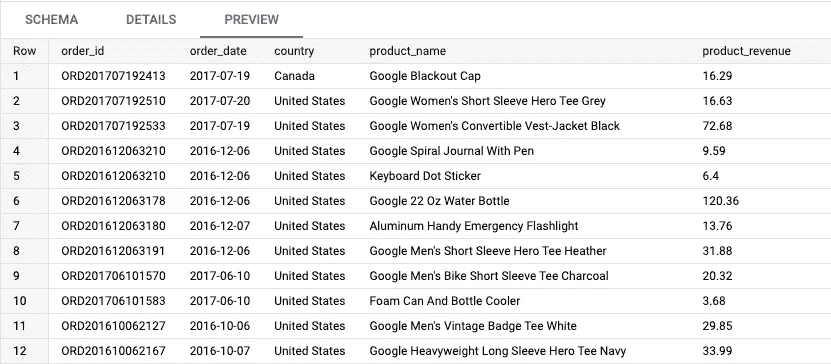

# 如何使用 SQL 在 BigQuery 中使用变量—第 1 部分

> 原文：<https://towardsdatascience.com/how-to-use-variables-in-bigquery-using-sql-part-1-a10aa99d8802>

## 通过 WITH 子句使用参数和变量向灵活性和可重用性迈进了一步

黑屏由[大卫·舒尔茨](https://unsplash.com/@davidschultz?utm_source=unsplash&utm_medium=referral&utm_content=creditCopyText)在 [Unsplash](https://unsplash.com/photos/SrewPUfo2c0)

## 什么是变量，为什么它们有用？

**变量**也被称为 ***参数*** *。*它们可以在 SQL 中用于设置或声明值。

> 变量存储您提供给它们的一个或多个值，然后可以在查询中的任何地方使用。

通常在代码开始时设置，它们在以下情况下很有用:

*   **您不希望在几个地方更改相同的值，因为您的查询有多行代码**
*   **您希望在不影响代码逻辑的情况下轻松更改该值**
*   **您希望减少查询的长度和复杂性**

变量可以通过命令行或使用 BigQuery API 在 Python 等其他语言中使用。但是在本文中，我们将关注如何在 SQL 查询中使用它。

在 BigQuery 中，我们有两种使用变量的方法:

*   使用带有子句的
*   **使用 BigQuery **程序语言****

**在这篇名为“第一部分”的文章中，我们将只讨论 WITH 子句。**

**如果想了解更多关于过程语言(类似于脚本语言)的知识，可以参考 BigQuery 文档。**

**<https://cloud.google.com/bigquery/docs/reference/standard-sql/procedural-language>  

作为一个相关主题(但不完全与本文相关)，您可能也对使用存储过程感兴趣，它也可以利用过程语言。

<https://cloud.google.com/bigquery/docs/procedures>  

# 使用 WITH 子句的变量

我们从一个基本数据表开始，它包括日期、国家、产品名称和与每个订单相关的收入。

我们的基本数据表。(图片由[作者](https://romaingranger.medium.com/)提供)

## 试验单个值(手动)

在第一个例子中，我们希望获得所有收入大于等于 250 美元的产品。

在“主查询”部分，我们使用逗号作为**，在`FROM`子句中调用我们的表(*基表*和*变量*)之后，能够使用我们的过滤子句**中的值，而无需任何连接**。**

但是，我明白你的意思，你是对的:我们本可以避免使用`WITH`子句，而只使用`WHERE`子句中的值。

但是，如您所见，这是将该值放在查询顶部的方便位置。让我们看一个稍微复杂一点的例子，有不止一个变量，查询两个表而不是一个。

## 尝试多个值(手动)

我们现在有了多个变量，我们把它们写在一个数组中(我们直接`UNNEST`来获得所有的值作为单独的行)。我们还有两个表，`base_table`和`base_table_2`，它们重用同一个过滤变量。

在这种情况下，在保存变量的`WITH`子句中添加、更改或删除值会更快。

另一个技巧是，如果您想要组合多个值，可以使用一个组合了`ARRAY`和`STRUCT`类型的格式。

保存我们的变量的子句现在有两个字段**与**价格**和**产品名称** t 相关。它可以在过滤器中使用，与我们前面的示例相同。**

既然我们已经看到了如何使用手动值，**让我们看看如何使它们动态，**基于从另一个表中计算出的值，或者基于在接收新数据时会改变的数据。

## 尝试单一值(动态)

从我们的基表开始，我们希望找到每件产品的收入**是平均产品收入**的三倍的所有行。

我们的`WITH`子句将返回 **144.2** ，这是使用我们的基表上的平均产品收入乘以 3 动态计算的。请注意，您可以使用**任何您想要的数据集**，并且当使用新数据执行该查询时，该值可能会改变。

## 尝试列表(手动)

本着同样的精神，你也可以使用项目清单。假设我们希望**在我们的基表中过滤特定的项目名称**。

用数组创建的手动列表

您也可以在`WITH`子句中使用`UNION ALL`编写相同的查询。但是我发现数组写起来更快。

使用 UNION ALL 创建的手动列表

## 尝试列表(动态)

我们希望所有包含“谷歌”一词的产品。我们可以在变量语句中使用`LIKE`语法获得所有这些值。

## 试验日期(手动)

对于日期，手动添加需要将数据类型转换为`DATE`类型(或者在查询中使用的`TIMESTAMP`或`DATETIME`)。

## 试验日期(动态)

我们希望使用另一个数据集的数据(在我们的例子中是`base_table_2`)来获得一个动态范围，以便在我们的主 SQL 语句中进行过滤。

## 几句结束语

本文通过几个例子演示了在`WITH`子句中使用变量的技巧。我们将在“第 2 部分”中讨论 BigQuery **过程语言**(也称为脚本语法)。

正如我们所见，`WITH`子句可能非常有用，但它并不总是理想的:它增加了更多的代码行，您可能需要修改数据类型(就像手动日期示例中一样)，BigQuery 为声明和设置变量提供了更简单的语法(使用`DECLARE`和`SET`子句)。

我希望这将有所帮助，并让我知道你是否想看到更多的例子！**