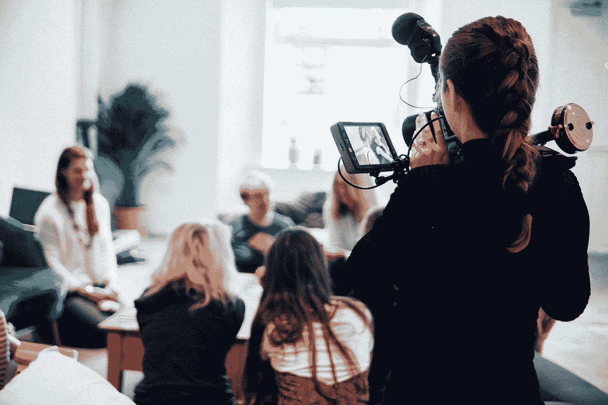
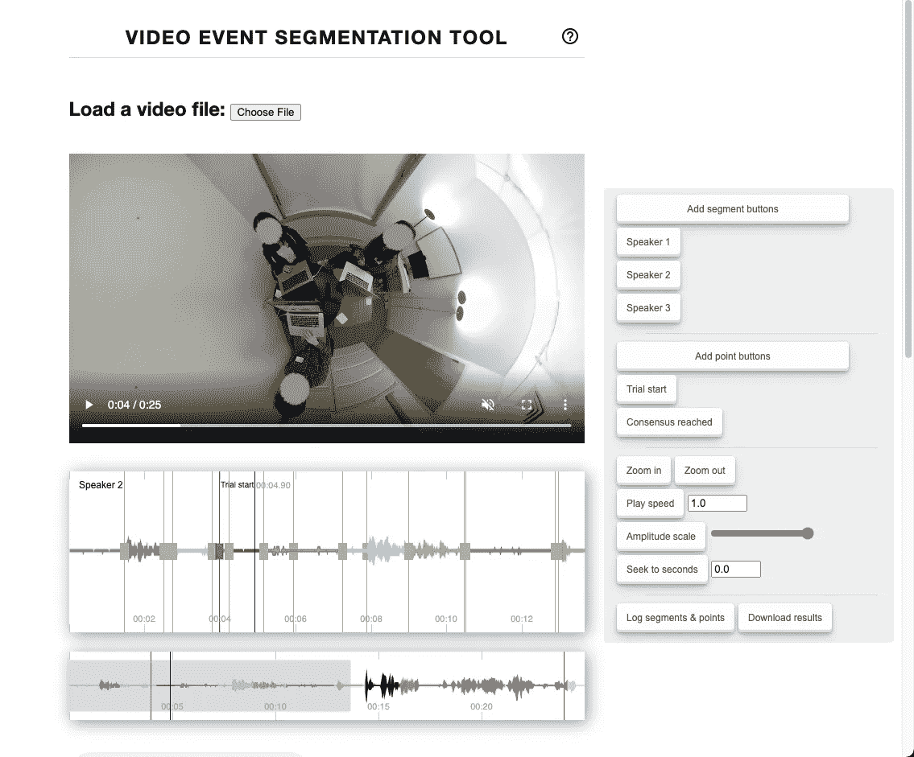
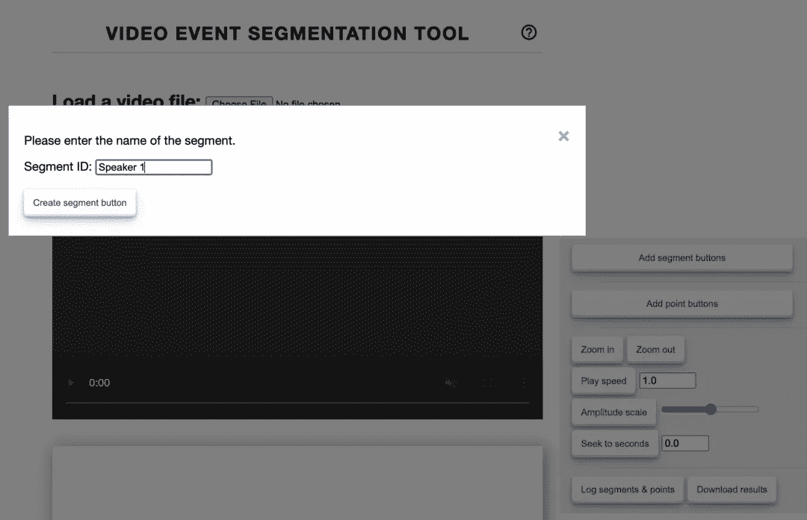

# 如何使用 VEST:一个免费的在线视频剪辑分割工具

> 原文：<https://towardsdatascience.com/how-to-use-vest-a-free-online-tool-for-segmenting-video-clips-a6ec50e29971>

## 实践教程

# 如何使用 VEST:一个免费的在线视频剪辑分割工具

## 使用这款视频事件分割工具对您的视频片段进行定性编码，推动您的 ML 研究

香草熊电影公司在 [Unsplash](https://unsplash.com?utm_source=medium&utm_medium=referral) 拍摄的照片

分析人类和动物行为的视频记录已经成为跨学科研究人员的有力工具。

近年来，计算机视觉和机器学习的进步极大地促进了自动化视频分析(例如，[对象检测](https://pjreddie.com/darknet/yolo/)、[面部表情](/how-to-extract-facial-expressions-head-pose-and-gaze-from-any-youtube-video-2aa6590c2bb6)、[姿势](https://github.com/MVIG-SJTU/AlphaPose))。然而，仍然需要人工输入来识别和标记新的事件类别、交互或现象，以分析和训练新的模型。

作为一名社会心理学研究者，我花了很多时间分析社会互动的视频记录。然而，我从未对可用于标记和分割事件的视频工具感到满意(例如 [ELAN](https://archive.mpi.nl/tla/elan) )。许多工具是专有的，需要复杂的安装，并且难以使用([工具列表](https://en.wikipedia.org/wiki/Computer-assisted_qualitative_data_analysis_software))。

经过多年的搜索，我终于建立了自己的视频事件分割工具(背心),这是免费的，开源的，可定制的，易于使用。下面是如何使用 VEST 进行自己研究的教程。

# 如何使用背心

## 1.找到工具

可通过您的网络浏览器(如 Chrome、Safari、Edge)在线访问 VEST。你所要做的就是导航到[https://jinhyuncheong.com/vest/vest.html](https://jinhyuncheong.com/vest/vest.html)，你马上就有了这个工具(截图如下)。

视频事件分割工具(VEST)正在发挥作用。工具包括一个视频播放器，音频波形可视化，和右边的控制面板。图片作者。

## 2.加载您的视频

加载网站后，使用`Choose file`按钮加载视频。VEST 在幕后使用 [Web Audio API](https://www.w3.org/TR/webaudio/) 和 audio BBC 的 [peaks.js](https://github.com/bbc/peaks.js) 来可视化您视频中的音频波形。这种可视化有助于您更准确地识别事件的开始和结束。

## 3.设置您的细分标签

加载视频后，您可以使用`Add segment buttons`为感兴趣的事件添加标签。此按钮将要求您写出活动的名称。例如，如果您只是在不同的说话者说话时进行分段，这可能是`Speaker 1`(见左下图)。单击“提交”后，您会看到屏幕右侧的控制面板中出现一个带有事件标签的按钮(右下图)。

现在，您可以播放视频，并在需要标记该片段时单击 Speaker 1 按钮。添加段后，您可以微调开始和停止时间。

(左)添加事件分段按钮。(右)在控制面板上增加了按钮。作者图片。

## 4.保存您的注释

一旦你完成了视频编码，你可以使用控制面板上的`Download results`按钮将结果下载到一个标准的 json 文件中。

您可以将数据文件加载到任何分析语言中(例如 R、Python)。下面是一个 Python 示例:

## 常见问题

1.  **波形太小。**使用`Amplitude scale`增加波形的大小。您也可以使用`Zoom in`或`Zoom out`按钮来调整可视化波形的时间宽度。
2.  **我的音频无法加载。**从视频中提取音频可能需要几秒钟才能显示出来。自然，较长的视频需要较长的时间来提取音频。如果还是看不出来，请开一期[的](https://github.com/jcheong0428/vest/issues)。
3.  **我有一个很长的视频，怎么办？** VEST 没有后端服务器。这意味着如果你关闭浏览器，所有的进程都将丢失。因此，我强烈建议您在处理长视频时经常保存。
4.  **如何定制工具？** VEST 是开源的，所以你可以在[https://github.com/jcheong0428/vest](https://github.com/jcheong0428/vest)访问源代码。您可以克隆存储库，并根据需要进行任何修改，在本地运行网页。
5.  **我想对工具**给出反馈。我很想得到您对如何改进该工具的反馈。请注意，该工具是非常基础的，因此它灵活且易于使用。尽管如此，欢迎通过[项目库](https://github.com/jcheong0428/vest/issues)或 [Twitter](https://twitter.com/intent/tweet?screen_name=jcheong0428) 提出任何建议或错误报告。

我希望你在下一个视频分析项目中发现 VEST 有用。期待所有未来将要建立的很酷的新分析和机器学习模型！

简单回顾一下，在这里使用视频事件分割工具:[https://jinhyuncheong.com/vest/vest.html](https://jinhyuncheong.com/vest/vest.html)

这里是储存库:

<https://github.com/jcheong0428/vest> 