# 如何使用维基百科作为数据来源

> 原文：<https://towardsdatascience.com/how-to-use-wikipedia-as-a-data-source-3dfea29e6539>

## 如何通过寻找英超最佳球队将维基百科的信息载入熊猫


温布利体育场(我想)——由[米奇·罗森](https://unsplash.com/@focusmitch?utm_source=medium&utm_medium=referral)在 [Unsplash](https://unsplash.com?utm_source=medium&utm_medium=referral) 上拍摄的照片

维基百科是一个有用信息的宝库，但维基百科页面上的数据是供人们阅读的，因此不一定是以一种易于编程访问的形式。

但是通过使用 Pandas `read_html()`函数，然后进行一些清理和处理，我们可以使用维基百科表格中的数据进行有用的分析。

我们要解决一个简单的问题:英格兰最好的足球队是哪支？是曼联(可能是最有名的)，阿森纳，利物浦，切尔西？还是完全不同的团队？

当然，这是一个非常主观的判断，但我们将通过分析几个维基百科页面的数据来试图找到某种答案，[英超联赛](https://en.wikipedia.org/wiki/Premier_League#2021%E2%80%9322_season)(顶级球队参加的英格兰足球联赛)和[2020-21 英超联赛](https://en.wikipedia.org/wiki/2020%E2%80%9321_Premier_League#League_table)。第一页给了我们一些关于球队的历史数据，第二页记录了 2020-21 赛季的结果。

维基百科内容的使用受[知识共享署名-类似共享许可 3.0](https://en.wikipedia.org/wiki/Wikipedia:Text_of_Creative_Commons_Attribution-ShareAlike_3.0_Unported_License) 的管辖(参见下面的注释)，这意味着只要我们给出适当的署名，我们就可以自由使用它，并且我们可以在类似的许可下复制、分发和衍生原始作品的其他作品。

我们将使用的第一个表主要包含历史数据，而第二个表包含最近一季的结果。我们将看一看每一个团队，看看我们是否能找出一个团队是否明显比其他团队更好。

我将在 Jupyter 笔记本上开发程序代码，该笔记本将在我的 Github repo 中提供(见注释)。如果你想继续，那么把每个代码块放入笔记本的一个新单元中。

和往常一样，起点是导入库——或者在本例中只导入一个库。

```
import pandas as pd
```

## 获取数据

现在我们需要一些数据。正如我所说的，我们将从英超联赛页面中读取表格，所以我们复制 url 并使用`read_html()`创建一个熊猫数据帧。

这个函数将读取它在页面上找到的所有 HTML 表，并返回一个数据帧列表。Pandas 文档建议您可能需要过滤结果，因为一个页面上可能有许多表格。我们通过设置`match`参数来实现这一点。这告诉该函数只下载包含该字符串的表。

我们对列出 2020-21 年英超联赛中 20 家足球俱乐部的表格感兴趣，因为这为我们提供了当前顶级俱乐部的列表和一些关于它们的历史数据。该表的第二列包含单词“Position ”,因此我们将使用它作为过滤器。

```
url = "https://en.wikipedia.org/wiki/Premier_League"
infotable = pd.read_html(url, match = "Position")
infotable[0].head()
```

上面的代码返回了一个表格列表。我们感兴趣的是列表中的第一个——索引为 0 的那个——我们显示结果数据帧的头部。

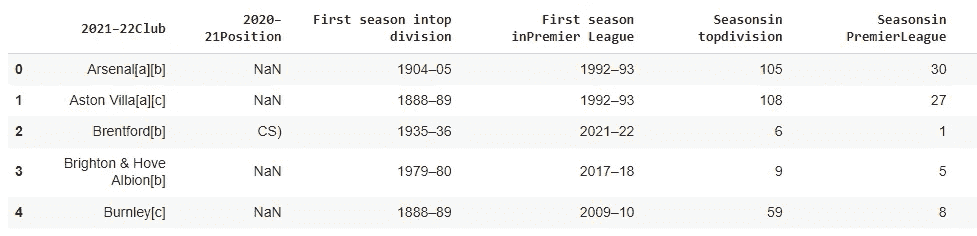

图片由作者提供，数据来源:维基百科 CC BY-SA 3.0(见注 1)

如您所见，列“2020–21 position”似乎没有被正确解析。它应该包含一个显示联盟位置的字符串，例如第一、第二、第十等。解析器可能感到困惑，因为列中的每个值都以数字开头，所以它试图解释为数字。

我们并不是对这个专栏特别感兴趣，但是值得停下来看一看，因为它突出了解析器的潜在问题以及我们可以做些什么来修复它。

问题在于默认的“lxml”解析器，它很快，但我们可以使用一个更慢但更准确的解析器，即“bs4”(beautiful soup)解析器。让我们试试这个替代方案，看看我们会得到什么结果:

```
infotable = pd.read_html(url, match = "Position", flavor = 'bs4')
infotable = infotable[0]
infotable.head()
```

在这段代码中，我们更改了解析器，结果确实更加准确。

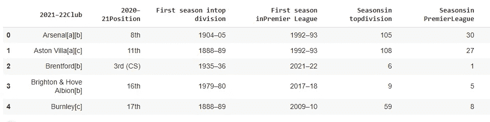

图片由作者提供，数据来源:维基百科 CC BY-SA 3.0(见注 1)

如果你运行这段代码，你可能不会注意到执行速度的不同。虽然，根据 Pandas 文档,‘bs4’解析器与‘lxml’相比非常慢，但是对于维基百科上相对较小的表，性能上的差异可能可以忽略不计。但是‘bs4’解析器给出的结果更接近原始结果。

## 细化数据框架

我只想从这张表上得到一点信息。这些日期可能很有趣，但与我寻找最佳团队的目标并不相关。

浏览维基百科的原始表格，我决定使用其中的三列:俱乐部名称，他们在顶级联赛(目前是英超联赛，但之前是甲级联赛)的赛季数，以及他们赢得联赛的次数。

下面是创建新数据帧并复制相关列的代码:

```
infotable2 = pd.DataFrame()
infotable2['Club'] = infotable['2021–22Club']
infotable2['No-of-Seasons'] = infotable['Seasonsin topdivision']
infotable2['Titles'] = infotable['Topdivisiontitles']
```

这是结果表——团队按字母顺序排列:

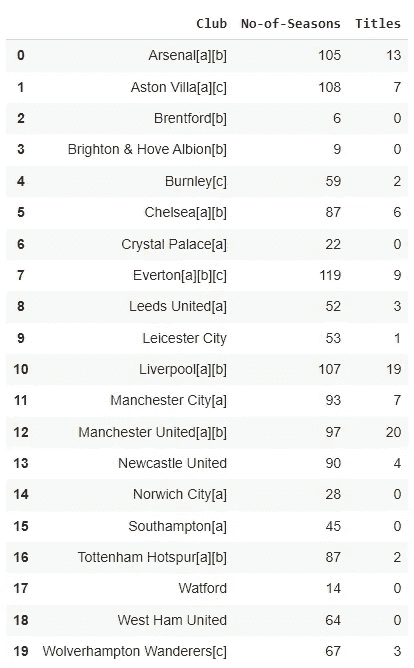

图片由作者提供，数据来源:维基百科 CC BY-SA 3.0(见注 1)

但是仍然有一些问题需要解决。最初的桌子是给人看的，不是给机器看的。

## 提取更多数据

第一个数据列包含俱乐部名称，但附加到该名称的是括号中的字母，表示维基百科页面中表格下方的注释。注[a]意味着该队是超级联赛的创始成员。[b]表示他们从未被降级到较低的联赛,[c]表示该队是 1988 年开始的原始足球联赛的成员之一。

人类读者可以很容易地理解这一点，但是在试图以编程方式分析数据时，在一列中包含多个数据项是没有用的。

我将在这里做出一些判断，我的观点是，一支球队从未降级到较低的级别是一个重要的事实，因为它多年来表现出了一致性。然而，一支球队是最初的足球联赛或更现代的英超联赛的创始成员，这一事实只表明他们在特定时刻的成就，因此并不特别相关。

我想提取一个球队从未降级的事实，但忽略其他注释，所以下面我创建了一个新的列来显示这一点。

```
infotable2['Never relegated'] = 
      infotable2['Club'].str.contains('[b]')
```

这段代码主要是在 Club 列中查找字符串“[b]”，并返回`True`或`False.`这个值然后被记录在新列中。

然后我删除了俱乐部一栏中的参考资料，按照一支球队在顶级联赛中的时间长度对数据进行排序，并显示出前 10 名。

```
infotable2['Club'] = 
      infotable2['Club'].replace('\[.\]','',regex=True)infotable2.sort_values('No-of-Seasons', ascending=False).head(10)
```

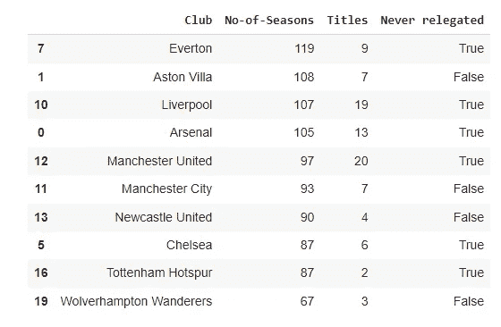

图片由作者提供，数据来源:维基百科 CC BY-SA 3.0(见注 1)

埃弗顿是在顶级联赛中时间最长的球队，其次是阿斯顿维拉。这可能会让现代足球爱好者感到惊讶，因为尽管他们有许多忠实的支持者，但这两支球队目前都不被视为顶级球队。

现在，让我们通过查看从未降级到低级别联赛的球队来进一步过滤数据框架，并根据他们在顶级联赛中的赛季数对他们进行排序。

```
infotable2[infotable2['Never relegated']==True]
        .sort_values('No-of-Seasons', ascending=False)
```

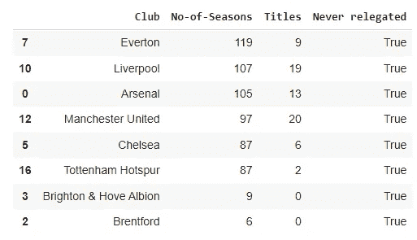

图片由作者提供，数据来源:维基百科 CC BY-SA 3.0(见注 1)

我们可以从这里看到，虽然没有一家俱乐部降级，但在布伦特福德的情况下，这是因为他们最近才升级，而且他们和布莱顿以及霍夫阿尔比恩相比，在顶级联赛中的时间很短。

因此，基于这些年来的一贯表现，我们也将从表格中删除最后两个，并创建一个新的数据框架`candidates`，其中包含前六名球队。我们可以删除`Never relgated`列，因为这对所有人都适用。我们将把`No-of-seasons`和`Titles`列转换成整数。

```
candidates = infotable2[infotable2['Never relegated'] == True]
        .sort_values('No-of-Seasons', ascending = False)[:6]candidates = candidates.drop(columns = ['Never relegated'])candidates['No-of-Seasons'] =
        candidates['No-of-Seasons'].astype('int64')candidates['Titles'] = candidates['Titles'].astype('int64')
```

我们最新的表格现在看起来像这样:

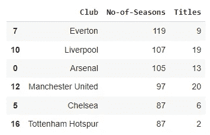

图片由作者提供，数据来源:维基百科 CC BY-SA 3.0(见注 1)

让我们制作这个表格的条形图:

```
candidates.plot.bar(x = 'Club')
```

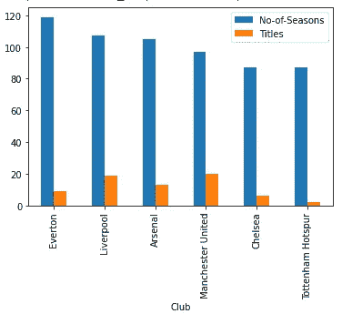

现在我们要列出一个 3 人小组的候选名单——前三名。

```
candidates = candidates.sort_values('Titles', ascending = False)[:3]
```

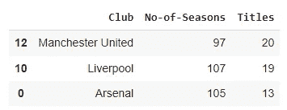

图片由作者提供，数据来源:维基百科 CC BY-SA 3.0(见注 1)

所以这里我们有英格兰足球历史上表现最好的三支球队。

我们暂时把它放在那里，看看当前的情况。

# 2020-21 年排行榜

我们现在要下载另一张表格——2020-21 赛季的最终排名表。

我们做的和以前一样，这一次使用匹配字符串“Pos”。这使得我们的排名表成为返回的表中的第二个表(即索引为 1 的表)。

```
url="https://en.wikipedia.org/wiki/2020%E2%80%9321_Premier_League"
leaguetable = pd.read_html(url,match="Pos")
leaguetable = leaguetable[1]
```

这就是了。


图片由作者提供，数据来源:维基百科 CC BY-SA 3.0(见注 1)

幸运的是，这里没有太多的编辑工作要做，我们可以直接从这个表格中绘制一些条形图，展示 20 个团队的成功。这是三个条形图的代码，代表每支球队的进球数，他们对他们的进球数，以及他们比赛的结果。

```
# Goals scored by team
leaguetable.plot.bar(x = 'Team',
                     y = 'GF',
                     title = 'Goals scored',
                     legend = False,
                     figsize = (15,5));# Goals scored against team
leaguetable.plot.bar(x = 'Team',
                     y = 'GA',
                     title='Goals against',
                     legend=False,
                     figsize=(15,5));# Match results - win/lose/draw
leaguetable.plot.bar(x = 'Team',
                     y=['W','D','L'],
                     stacked=True,
                     title='Match Results',
                     legend=False,
                     figsize = (15,5))
                     .legend(['Win','Draw','Lose'],
                              loc='lower center');
```

这是图表。

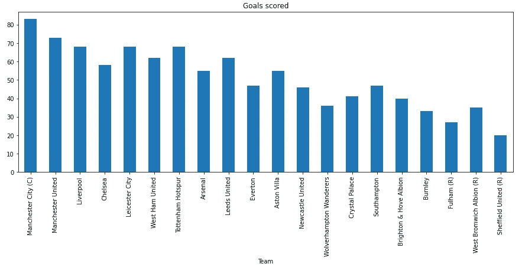

图片由作者提供，数据来源:维基百科 CC BY-SA 3.0(见注 1)

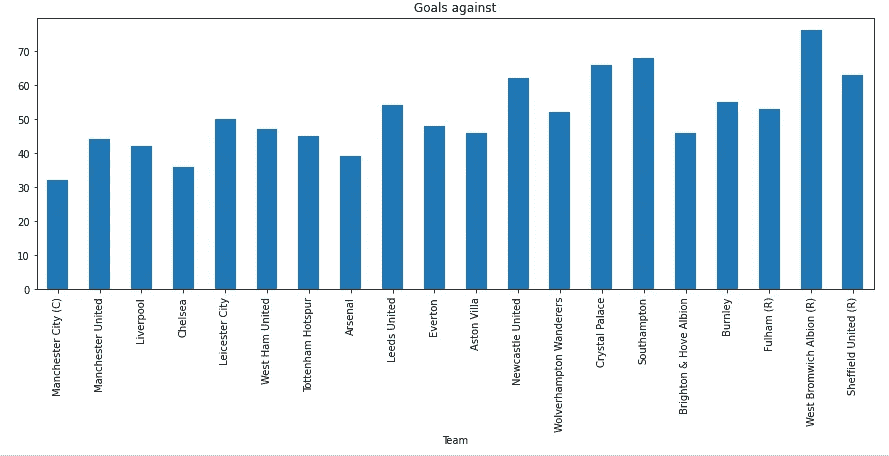

图片由作者提供，数据来源:维基百科 CC BY-SA 3.0(见注 1)


图片由作者提供，数据来源:维基百科 CC BY-SA 3.0(见注 1)

现在，让我们用最佳团队的前三名候选人列表来过滤该表。

```
leagueCandidates = leaguetable[leaguetable['Team']
       .isin(list(candidates['Club']))]
```

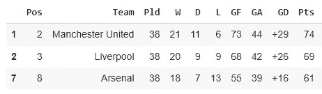

图片由作者提供，数据来源:维基百科 CC BY-SA 3.0(见注 1)

我们将再次绘制这些图表。

```
leagueCandidates.plot.bar(x='Team',
                          y='GF',
                          title='Goals scored',
                          legend=False);leagueCandidates.plot.bar(x='Team',
                          y='GA',
                          title='Goals against',
                          legend=False);leagueCandidates.plot.bar(x='Team',
                          y=['W','D','L'],
                          stacked=True,
                          title='Match Results',
                          legend=False,)
                          .legend(['Win','Draw','Lose'],
                          loc='lower center');
```

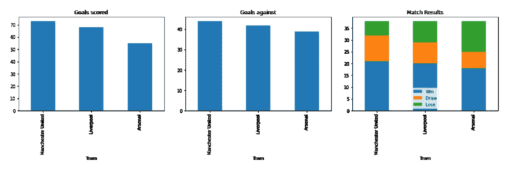

图片由作者提供，数据来源:维基百科 CC BY-SA 3.0(见注 1)

从这里我们可以看到我们的短名单上的球队都表现很好，他们赢得了大部分比赛，进了很多球。然而，在这个列表中名列前茅的是曼联:他们比其他球队赢得了更多的比赛，进了更多的球——他们也比其他球队进了更多的球，但进球越多，比赛就越有趣，对吗？

## 结果呢

所以，考虑到过去和现在的表现，我们选择的最佳球队是曼联。

除了如果你住在伦敦，你会非常清楚最好的球队实际上是阿森纳…或者切尔西。另一方面，如果你是曼彻斯特人，那么你可能会认为我们的发现完全合理，当然，除非你是曼城的支持者。如果你来自利物浦，那么每个人都知道利物浦是最好的球队——除了那些认为埃弗顿永远是冠军的人。

但这真的不是这个练习的目的。

我们所做的是使用 Pandas `read_html()`函数直接从维基百科中读取数据，我们已经研究了选择快速解析器或较慢(但可能更准确)解析器的方法。我们已经清理和处理了这些数据，并将其与维基百科中的其他数据结合起来。最终，我们得出了一个结果，这个结果不会改变任何人对他们最喜爱的足球俱乐部的看法——但重点是过程而不是结果。

一如既往，感谢阅读。我希望你觉得这很有趣，并会通过我的 Github 页面上的链接来查看代码(或者在下面的**注释**中看到 Github 回购的链接)。

[](https://alanjones2.github.io) [## AlanJones:编码、科学和技术

### 使用 Streamlit、Plotly、Python 和 Flask 为 web 构建数据可视化应用程序。适用于…的文章、教程和应用程序

alanjones2.github.io](https://alanjones2.github.io) 

如果你对我的其他文章感兴趣，你可以在 Medium 上浏览我的简介，或者在[我的网站](https://alanjones2.github.io/)上看到它们。你也可以订阅我的时事通讯， [Technofile](https://technofile.substack.com/) ，获得新文章的通知。

[](https://technofile.substack.com) [## 技术文件

### 技术、科学、数据科学和编码。点击阅读阿兰·琼斯的技术文件，这是一个子堆栈出版物，包含…

technofile.substack.com](https://technofile.substack.com) 

## 笔记

[1]本文中的所有数据都是从以下维基百科页面下载和/或获得的:

*   英超联赛(2022 年 4 月 24 日访问)
*   [2020–21 英超联赛](https://en.wikipedia.org/wiki/2020%E2%80%9321_Premier_League#League_table)(2022 年 4 月 24 日访问)

所有数据都在[知识共享署名-相似分享许可 3.0](https://en.wikipedia.org/wiki/Wikipedia:Text_of_Creative_Commons_Attribution-ShareAlike_3.0_Unported_License) 下使用

[2]所有图形和代码都是作者创建的，包含所有代码的笔记本可以在我的 [Github 资源库](https://github.com/alanjones2/Alan-Jones-article-code/tree/master/Wikitable)中找到。