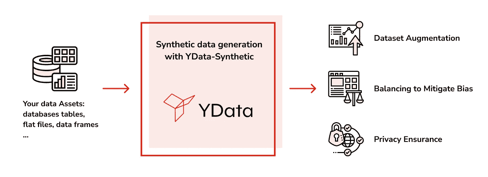
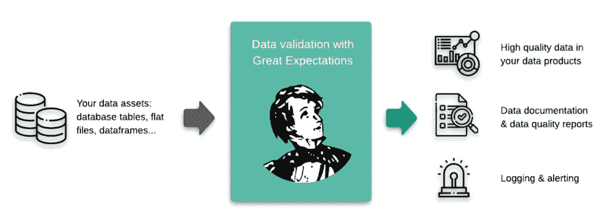
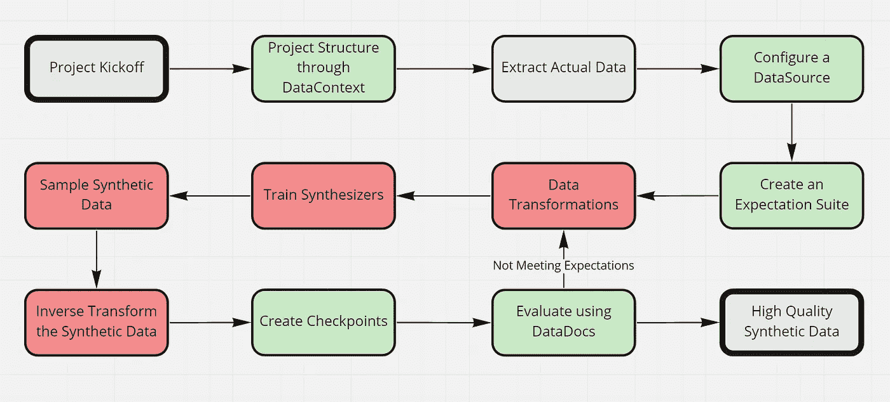
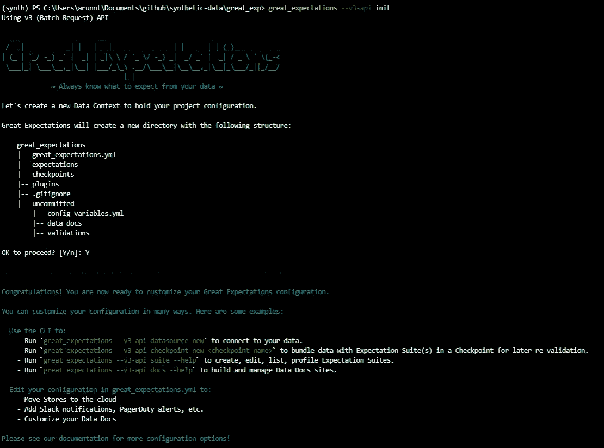
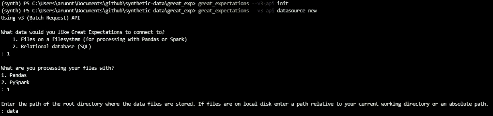

# 如何验证合成数据的质量

> 原文：<https://towardsdatascience.com/how-to-validate-the-quality-of-your-synthetic-data-34503eba6da>

# 如何验证合成数据的质量

## 关于如何将 ydata-synthetic 与 great expectations 结合起来的教程


由 [Unsplash](https://unsplash.com?utm_source=medium&utm_medium=referral) 上的 [Pietro Jeng](https://unsplash.com/@pietrozj?utm_source=medium&utm_medium=referral) 拍摄

随着机器学习算法和编码框架的快速[进化](https://www.stateof.ai/)，高质量数据的缺乏才是 AI 行业真正的瓶颈。

[VentureBeat](https://venturebeat.com/2019/07/19/why-do-87-of-data-science-projects-never-make-it-into-production/)的 Transform 2019 预测，87%的人工智能项目永远无法投入生产。根据 2017 年哈佛商业评论[的一项研究](https://hbr.org/2017/09/only-3-of-companies-data-meets-basic-quality-standards)，只有 3%的公司数据符合基本质量标准。

如果你在人工智能行业工作，这不会让你感到惊讶——我们都有第一手的经验。幸运的是，我们已经看到了由吴恩达开创的范式转变，从以模型为中心的方法转变为以数据为中心的方法。

如果使用得当，[合成数据就是这样一种元素](https://medium.com/ydata-ai/synthetic-data-1cd0ba907609)，可以帮助实现以数据为中心的方法。合成数据是人工生成的数据，不是从现实世界的事件中收集的。它复制实际数据的统计成分，不包含任何可识别的信息，确保个人隐私。[我们针对合成数据 ydata-synthetic 的开源库](https://github.com/ydataai/ydata-synthetic)只专注于此。我们的用户普遍关心的一个问题是，我们如何确保合成数据符合原始数据的所有质量标准？与保留原始数据的统计属性一样，确保原始数据遵循严格的数据质量标准也是至关重要的。

幸运的是，我们在 [Great Expectations](https://greatexpectations.io/) 的朋友已经建立并开源了一个他们称之为共享、开放的数据质量标准的框架。当您的数据团队调整框架时，您就知道新数据会带来什么。

在本文中，我们将带您了解一个端到端的用例，在这个用例中，您使用原始数据来训练一个合成数据的模型，使用 Great Expectations 库根据原始数据验证合成数据的质量标准。

# 将 YData Synthetic 和 Great Expectations 结合在一起

YData Synthetic 是一个开源的合成数据引擎。使用不同种类的[生成对抗网络(GANS)](https://medium.com/ydata-ai/generating-synthetic-tabular-data-with-gans-part-1-866705a77302) ，引擎学习原始数据的模式和统计属性。它可以创建与原始数据相似的合成数据的[无限样本。](/how-to-generate-synthetic-tabular-data-bcde7c28038a)



用 [ydata-synthetic](https://github.com/ydataai/ydata-synthetic/) 生成合成数据。(图片由作者提供)

远大前程是一个工具，用于[验证](https://docs.greatexpectations.io/docs/reference/core_concepts#expectations)、[记录](https://docs.greatexpectations.io/docs/reference/core_concepts#data-docs)、[分析](https://docs.greatexpectations.io/docs/reference/core_concepts#profiling)您的数据，以保持质量并改善团队之间的沟通。它允许用户基于良好的数据样本创建“期望”,并使用这些期望来验证新数据是否符合数据质量标准。



带着[巨大期望](https://docs.greatexpectations.io/docs/guides/expectations/contributing/how_to_contribute_a_new_expectation_to_great_expectations/)的数据验证。(作者截图)

当然，在本文的范围内，我们保持了简单的介绍，还有更多关于这些库的内容，正如我们所说的，它们正在发展。这个想法是:两个图书馆都在朝着同一个目标努力，在不同的战线上提供大规模的高质量数据。

# 10 步指南:如何在你的下一个项目中同时使用这两种工具



综合项目流程图。绿色是远大前程，红色是 YData 合成。(图片由作者提供)

在本指南中，我们选择了一个用例示例[“信用卡欺诈数据集——综合少数类。”](https://colab.research.google.com/github/ydataai/ydata-synthetic/blob/master/examples/regular/gan_example.ipynb)我们旨在合成具有高度不平衡性的信用卡欺诈数据集的少数类。

不平衡的类数据是构建模型时的常见问题，为少数类生成合成数据有助于开发更准确的模型。但是，我们需要确保新生成的数据点保持与原始少数民族类数据点相同的质量标准。

我们将通过使用 YData Synthetic 生成合成数据并通过 Great Expectations 进行验证来解决这个问题。

在我们开始之前，为了跟随教程，我们建议您创建一个虚拟环境，并通过在您的终端上运行以下命令来 pip 安装 ydata-synthetic 和 great_expectations。

```
pip install ydata-synthetic great-expectations
```

现在您已经准备好了环境，让我们开始吧。如果你想一步一步地跟随我们，你可以[从 ydata-synthetic GitHub 下载资料](https://github.com/ydataai/ydata-synthetic/blob/dev/examples/regular/integrate_great_expectations.ipynb)。

## 步骤 1:通过数据上下文设置项目结构

在很大程度上，您的数据环境管理项目配置。有多种方法可以创建数据上下文；然而，最简单的方法是使用安装 great_expectations 包时附带的 CLI。

打开您的终端，导航到项目目录并键入以下内容:

```
great_expectations init
```

按回车键完成数据上下文的创建，仅此而已。



设置数据上下文。(作者截图)

如果你对修改后的项目结构感兴趣，这里有一段 GE 文档的摘录:

*   great_expectations.yml 包含您的部署的主要配置。
*   `expectations/`目录将您所有的期望存储为 JSON 文件。如果您想将它们存储在其他地方，可以在以后进行更改。
*   `plugins/`目录保存您作为部署的一部分开发的任何定制插件的代码。
*   `uncommitted/`目录包含了不应该存在于版本控制中的文件。它配置了一个. gitignore 来从版本控制中排除它的所有内容。

## 步骤 2:下载/提取我们用来创建合成数据的实际数据集

我们可以从 Kaggle 下载我们在这个例子中使用的数据。如果您检查这些类，您会注意到“欺诈”类比“非欺诈”类少得多，这是现实生活中的情况。

因此，我们可以仅提取欺诈类数据点，并将其视为实际数据集。我们的目标是创建类似欺诈事件的合成数据点。

## 步骤 3:配置数据源以连接我们的数据

在很大程度上，数据源通过管理配置和提供一致的、跨平台的 API 来引用数据，从而简化了连接。

让我们配置第一个数据源:一个到 repo 中提供的数据目录的连接。相反，这甚至可以是一个数据库连接等等。

```
great_expectations datasource new
```



创建新的数据源。(作者截图)

如上图所示，你会看到不同的选项。选择文件系统上的文件(用 Pandas 或 Spark 处理)和 Pandas。最后，输入目录为`data`(这里有我们的实际数据)。

一旦你输入了详细信息，一个 jupyter 笔记本就会打开。这正是 Great Expectations 赋予模板化代码的方式，这有助于我们通过一些代码更改来创建期望。

让我们将数据源名称改为更具体的名称。

编辑第二个代码单元格如下:`datasource_name = "data__dir"`

然后执行笔记本中的所有单元格来保存新的数据源。如果成功，最后一个单元格将打印所有数据源的列表，包括您刚刚创建的数据源。

## 步骤 4:使用内置的 Great Expectations profiler 创建一个期望套件

预期只不过是一个关于数据的可证伪的、可证实的陈述。期望提供了一种谈论数据特征和数据质量的语言——人对人，人对机器，机器对机器。

这里的想法是，我们假设实际数据具有我们想要合成的数据的理想质量，因此我们使用实际数据来创建一组期望，稍后我们可以使用这些期望来评估我们的合成数据。

CLI 将帮助创建我们的第一个期望套件。套房只是期望的集合。我们可以使用内置的分析器自动生成一个名为`creditcard.quality`的期望套件

在您的终端中键入以下内容:

```
great_expectations suite new
```

再次选择如上图所示的选项。我们使用自动分析器创建期望，并将其指向实际的数据集。

另一个 jupyter 笔记本将再次打开，其中包含用于创建新的期望套件的样板代码。代码相当标准；但是，请注意，所有列都被添加到第二个单元格中被忽略列的列表中。我们希望验证示例中的每一列；因此，我们应该从 ignored_columns 列表中删除这些列。

执行笔记本将创建一个针对实际信用卡欺诈数据集的预期套件。

## 步骤 5:转换真实数据用于建模

现在我们已经创建了期望套件，我们将焦点转移回创建合成数据。

在训练 GAN 之前，我们遵循标准的数据转换流程。我们正在应用 PowerTransformation —使数据分布更像高斯分布。

请随意尝试更多预处理步骤，因为这会产生更好的结果。

## 步骤 6:训练合成器并创建模型

既然我们已经对数据进行了预处理，那么是时候让我们先进的 ydata-synthetic GAN 模型发挥作用了。

对于这个例子，我们训练一种 GAN，称为 [WGAN-GP](https://arxiv.org/abs/1704.00028) ，它提供了急需的训练稳定性。

## 步骤 7:从合成器采样合成数据

既然我们已经建立了模型，现在是时候通过添加噪声来采样所需的数据了。这一步的美妙之处在于，您可以根据需要不断生成数据。当您想要生成可共享和可销售的不同数据副本时，这一步非常有用。

在我们的例子中，我们生成与实际数据相同数量的样本。

```
# use the same shape as the real data
synthetic_fraud = synthesizer.sample(492)
```

## 步骤 8:逆变换数据以获得原始格式

这里我们注意到，生成的合成数据仍然是变换后的形式，需要逆变换为原始结构。

```
synthetic_data = inverse_transform(synthetic_fraud , preprocessor)
```

## 步骤 9:创建一个新的检查点，根据真实数据验证合成数据

对于 Great Expectations 的常规用法，验证数据的最佳方式是使用检查点。检查点将成批数据与相应的期望套件捆绑在一起进行验证。

从终端运行以下命令:

```
great_expectations checkpoint new my_new_checkpoint
```

这将再次打开一个 Jupyter 笔记本，允许您完成我们的检查点的配置。编辑 data_asset_name，将我们要验证的数据引用到我们在步骤 8 中编写的文件名中。确保 expectation_suite_name 与我们在步骤 4 中创建的相同。

完成后，继续执行笔记本中的所有单元格。

## 步骤 10:使用数据文档评估合成数据

如果您一直这样做，您应该已经创建了一个新的检查点来验证合成数据。最后一步是取消 checkpoint 记事本的最后一个单元格的注释并执行它。

这将打开一个名为数据文档的 HTML 页面。我们可以检查数据文档中最近的检查点，并看到预期已经失败。通过单击检查点运行，我们可以得到一个详细的报告，显示哪些列的哪些期望失败了。

基于此输入，我们可以执行以下任一操作:

*   回到我们的数据转换步骤，修改转换，改变合成器或优化参数，以获得更好的合成数据。
*   回到期望套件，编辑一些不重要的期望(可能是针对特定的列)。是的——期望是可定制的，下面是你如何做到这一点的[。](https://docs.greatexpectations.io/docs/guides/expectations/creating_custom_expectations/how_to_create_custom_expectations)

# 结论

在本教程中，我们已经成功地演示了 ydata-synthetic 和 great expectations 的用法。

介绍了一个 10 步指南，从配置数据上下文到使用数据文档评估合成数据。我们相信集成这两个库可以帮助数据科学家释放合成数据的力量和数据质量。

您可以在我们的 [GitHub 资源库](https://github.com/ydataai/ydata-synthetic)中找到本文使用的所有代码。你不会想错过他们 YouTube 频道上《远大前程》的信息丰富的[研讨会系列](https://www.youtube.com/c/GreatExpectationsData)。

还有问题吗？[合成数据社区](http://slack.ydata.ai/)和我们在[远大前程](https://greatexpectationstalk.slack.com/join/shared_invite/zt-sugx45gn-SFe_ucDBbfi0FZC0mRNm_A#/shared-invite/email)的朋友们总是愿意提供帮助。加入 slack 社区，与其他用户合作，并直接向我们的开发人员提问！

[*法比亚娜*](https://www.linkedin.com/in/fabiana-clemente/) *是 CDO*[*y data*](https://ydata.ai/?utm_source=medium&utm_medium=signature&utm_campaign=blog)*。*

**用改进的数据加速 AI。**

[*YData 为数据科学团队提供首个数据开发平台。*](https://ydata.ai/?utm_source=medium&utm_medium=signature&utm_campaign=blog)