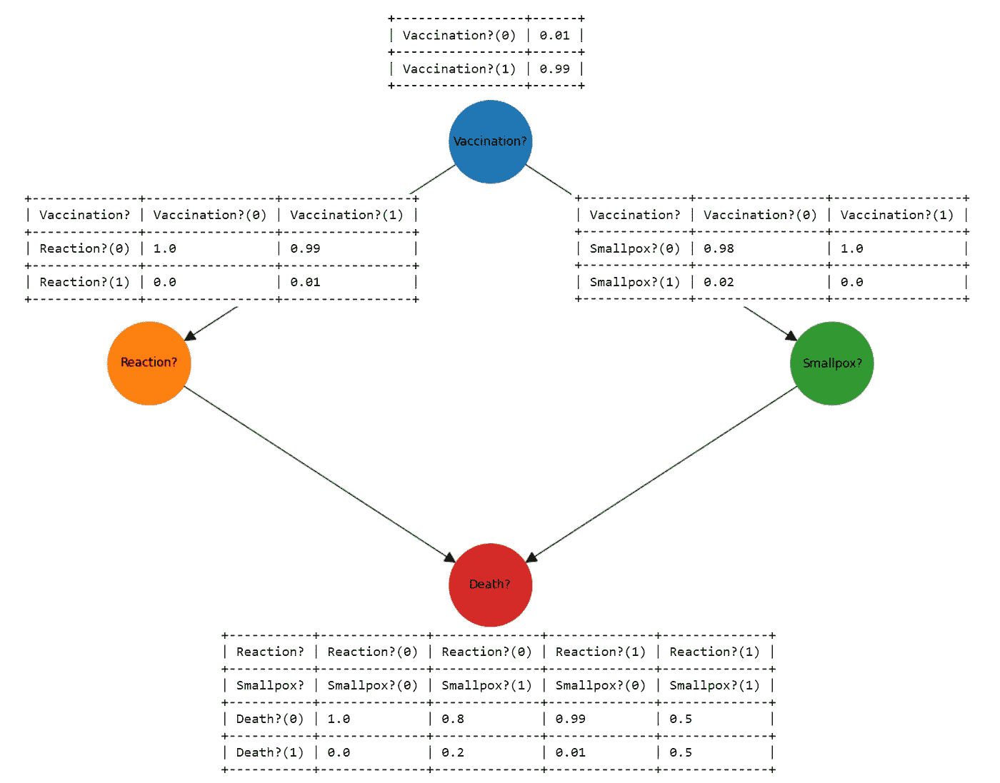
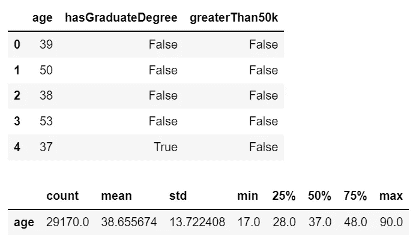
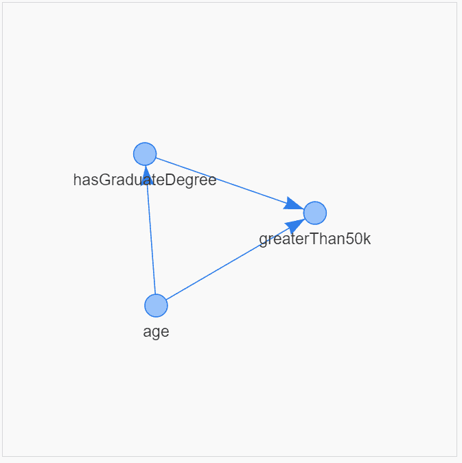
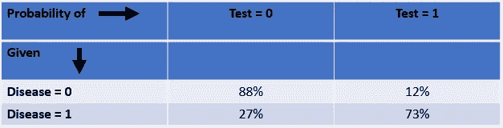
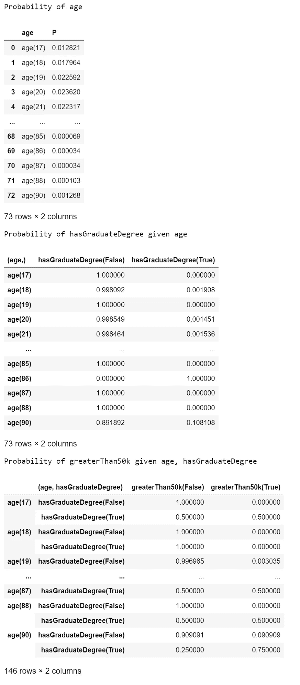

# 如何用直观的条件概率表可视化因果推理模型

> 原文：<https://towardsdatascience.com/how-to-visualise-causal-inference-models-with-intuitive-conditional-probability-tables-a1104d75fa43>

## 如何在一行 Python 代码中生成直观和全面的条件概率表来可视化和理解因果推理模型


艾米丽·莫特在 [Unsplash](https://unsplash.com/s/photos/question-mark?utm_source=unsplash&utm_medium=referral&utm_content=creditCopyText) 上的照片

## 背景

因果推理目前是一个热门话题，但现有的各种库可能会因不一致的文档和示例而变得复杂，并且大多数可用的文章和帖子都专注于因果推理的特定方面，而没有涵盖数据科学家需要知道的所有事情。

这促使我撰写了一系列文章，其中最新的一篇深入探讨了“条件概率表”以及如何以直观且有意义的格式轻松生成它们。

## 你将学到什么

> 到本文结束时，您将能够只用一行 Python 代码就生成视觉上丰富的条件概率表，并且您将能够完全访问源代码和文档！

在我们深入 CPT 观想之前，请考虑…

[通过我的推荐链接](https://grahamharrison-86487.medium.com/membership)加入 Medium(如果你使用这个链接注册，我将收取一定比例的费用)。

每当我发表新故事时，订阅一封免费电子邮件。

[快速浏览我之前的文章](https://grahamharrison-86487.medium.com/)。

[下载我的免费战略数据驱动决策框架](https://relentless-originator-3199.ck.page/5f4857fd12)。

访问我的数据科学网站— [数据博客](https://www.the-data-blog.co.uk/)。

…如果你对因果推理感兴趣，这是本系列的其他文章-

</how-to-generate-synthetic-data-for-any-causal-inference-project-in-less-than-10-lines-of-code-158688a89349>  </a-simple-explanation-of-causal-inference-in-python-357509506f31>  </how-to-visualise-causal-inference-models-with-interactive-directed-acyclic-graphs-8dd648a64915>  

# 因果推理模型的快速复习

因果推理模型包括两个关键部分-

1.  描述什么导致什么的“有向无环图”(DAG)，有时称为因果推断图。
2.  描述从一个节点移动到另一个节点的概率的一组“条件概率表”(CPT)。

下面的例子展示了因果推理模型中的两个部分是如何协同工作的(单元格中的数字是概率)。



作者图片

我的上一篇文章([https://towards data science . com/how-to-visualize-causal-inference-models-with-interactive-directed-acyclic-graphs-8dd 648 a 64915](/how-to-visualise-causal-inference-models-with-interactive-directed-acyclic-graphs-8dd648a64915))讨论了 DAG 的可视化，本文的其余部分将展示如何以一种视觉丰富和直观的方式生成 CPT。

## 入门指南

让我们从选择一些数据来建模开始。

我选择的数据与拥有研究生学位对工资的影响有关，这些数据是从 https://archive.ics.uci.edu/ml/datasets/census+income 的 UCI 机器学习库获得的，该库可以免费使用，并附有说明(参见参考资料部分)。



作者图片

## 构建因果模型

我选择使用`pgmpy`库([https://pgmpy.org/](https://pgmpy.org/))构建一个因果模型，如下所示...

将因果关系和结构形象化是非常有用的。要获得`dag_tools.py`的全部细节和源代码，请阅读我的文章“[如何用交互式有向无环图可视化因果推理模型](/how-to-visualise-causal-inference-models-with-interactive-directed-acyclic-graphs-8dd648a64915)”。



作者图片

建立模型的最后一步是如下拟合数据

## 条件概率表

使用`pgmpy`库中的本地功能来快速浏览 CPT 是非常容易的...

```
+---------+-------------+
| age(17) | 0.0128214   |
+---------+-------------+
| age(18) | 0.0179637   |
+---------+-------------+
| age(19) | 0.0225917   |
+---------+-------------+
| age(20) | 0.0236202   |
+---------+-------------+
| age(21) | 0.0223174   |
+---------+-------------+
| age(22) | 0.0234145   |
+---------+-------------+
| age(23) | 0.0264313   |
+---------+-------------+
...
+---------+-------------+
| age(88) | 0.000102845 |
+---------+-------------+
| age(90) | 0.00126843  |
+---------+-------------+
+--------------------------+-----+---------+---------------------+
| age                      | ... | age(88) | age(90)             |
+--------------------------+-----+---------+---------------------+
| hasGraduateDegree(False) | ... | 1.0     | 0.8918918918918919  |
+--------------------------+-----+---------+---------------------+
| hasGraduateDegree(True)  | ... | 0.0     | 0.10810810810810811 |
+--------------------------+-----+---------+---------------------+
+-----------------------+-----+-------------------------+
| age                   | ... | age(90)                 |
+-----------------------+-----+-------------------------+
| hasGraduateDegree     | ... | hasGraduateDegree(True) |
+-----------------------+-----+-------------------------+
| greaterThan50k(False) | ... | 0.25                    |
+-----------------------+-----+-------------------------+
| greaterThan50k(True)  | ... | 0.75                    |
+-----------------------+-----+-------------------------+
```

…但是输出很不理想！

1.  代表`age`概率的 CPT 垂直展开(因为年龄有许多阶段，17 到 90 岁之间的每个年龄有一个阶段)
2.  `hasGraduateDegree`概率的 CPT 甚至更糟。因为这个表是水平展开的，`pgmpy`已经截断了年龄为 17 - 87 的所有列，只在显示中留下年龄为 88 和 90 的列。这可能适合单元格中的表格，但由此产生的截断使得无法理解正在发生的事情。
3.  `greaterThan50k`的 CPT 存在与`hasGraduateDegree`相同的问题。
4.  CPT 的`pgmpy`输出的最后一个问题是它们“上下颠倒”。如果你是朱迪亚·珀尔的读者，他已经出版了许多关于因果关系的开创性著作(包括“为什么之书”)，你会读到一些例子，珀尔用“概率”表示列，用“给定”条件表示行...



作者图片

<https://www.amazon.co.uk/Book-Why-Science-Cause-Effect/dp/0141982411>  

## 一个更好的解决方案…

所有这些问题使得很难想象因果模型中发生了什么，这导致缺乏理解，进而导致无法使用这些模型为客户解决现实世界中的问题。

所以`pgmpy`不直观的输出让我开发了自己的`cpt_tools`库来解决所有问题(下面提供了完整源代码的链接)。

让我们看看使用`cpt_tools`生成的输出...



作者图片

这在来自`cpt_tools`库的一行 Python 代码中看起来更好！

表格以 pandas 数据帧的形式返回，并针对 Y 轴(行)进行截断，以在可读性和空间利用率之间实现最佳折衷。

如果你想看到没有水平截断的整个 CPT，只需改变 pandas `display.max_rows`参数，然后使用`cpt_tools.display_cpt`如下-

## 源代码

完整的源代码可以在这里找到-

[https://gist . github . com/grahamharrison 68/1187 c53d 078 C3 c 899 b 534852 Fe 8 EDF 9 c](https://gist.github.com/grahamharrison68/1187c53d078c3c899b534852fe8edf9c)

…文档可在此处找到-

[https://raw . git hack . com/grahamharrison 68/Public-Github/master/Causal % 20 inference/files/CPT _ tools . html](https://raw.githack.com/grahamharrison68/Public-Github/master/Causal%20Inference/files/cpt_tools.html)

如果你决定下载并使用 cpt_tools 或 dag_tools 代码，如果你能考虑给我买杯咖啡就太好了

[](https://ko-fi.com/grahamharrison)

作者图片

[](https://ko-fi.com/grahamharrison)

最后，如果你想把笔记本中的所有代码和数据放在一个地方，请点击这个链接…

[https://Github . com/grahamharrison 68/Public-Github/tree/master/Causal % 20 推论](https://github.com/grahamharrison68/Public-Github/tree/master/Causal%20Inference)

## 结论

因果推理是数据科学工具包中的一个很好的工具，但是要使用因果推理来解决业务问题，您需要能够可视化有向无环图和条件概率表。

`pgmpy`库全面且易于使用，但是可视化模型的功能可以从扩展和改进中受益。

本文展示了如何在一行 Python 代码中以视觉上强大、直观且易于理解的方式可视化条件概率表。

如果你喜欢这篇文章，请考虑…

[通过我的推荐链接](https://grahamharrison-86487.medium.com/membership)加入 Medium(如果你使用此链接注册，我将收取一定比例的费用)。

<https://grahamharrison-86487.medium.com/membership>  

[每当我发表新故事](https://grahamharrison-86487.medium.com/subscribe)时，订阅一封免费电子邮件。

[快速浏览我之前的文章](https://grahamharrison-86487.medium.com/)。

[下载我的免费战略数据驱动决策框架](https://relentless-originator-3199.ck.page/5f4857fd12)。

访问我的数据科学网站— [数据博客](https://www.the-data-blog.co.uk/)。

[](https://www.the-data-blog.co.uk/)

作者图片

## 参考

Dua d .和 Graff c .(2019 年)。http://archive.ics.uci.edu/ml 的 UCI 机器学习库。加州欧文:加州大学信息与计算机科学学院。