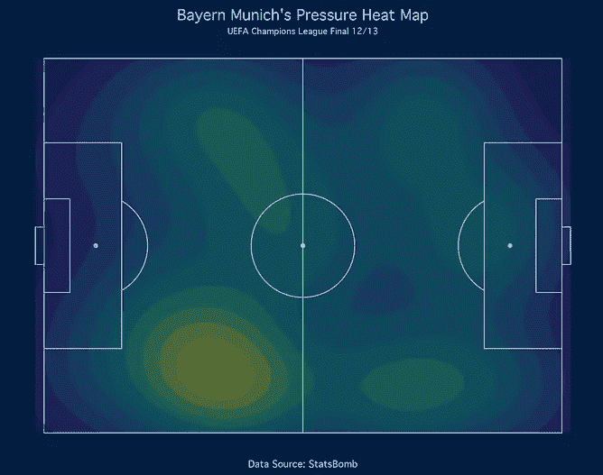
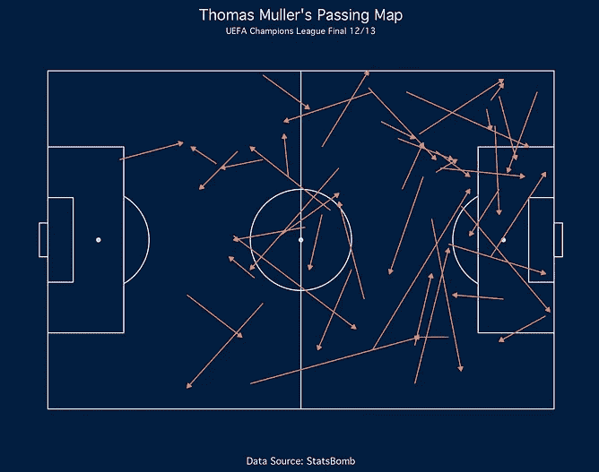
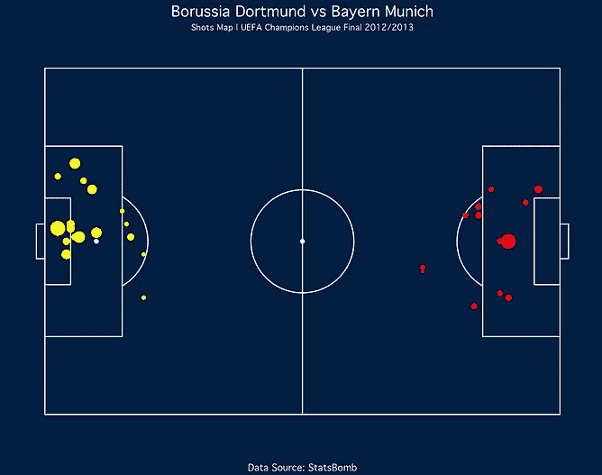
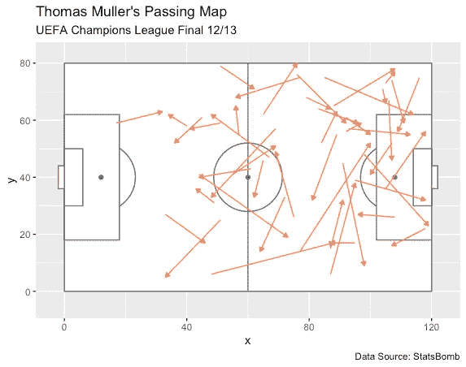
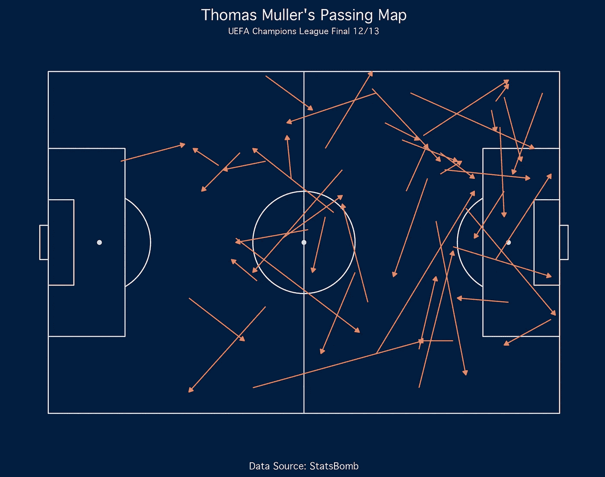
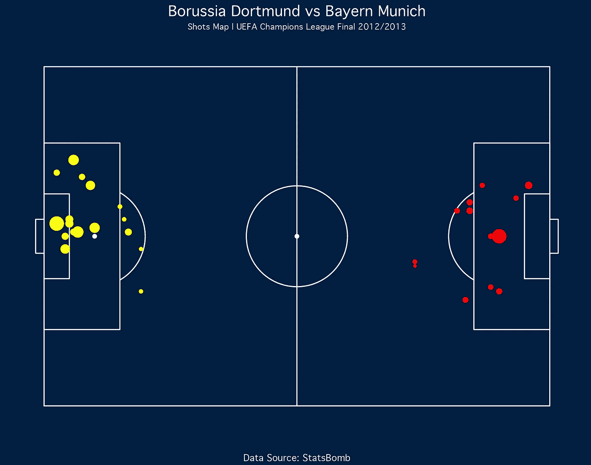

# 如何使用 R 可视化足球数据

> 原文：<https://towardsdatascience.com/how-to-visualize-football-data-using-r-ee963b3a0ba4>

## 关于创建快照、过程和热点图的教程


照片由[雅诺什·迪格尔曼](https://unsplash.com/@janoschphotos?utm_source=unsplash&utm_medium=referral&utm_content=creditCopyText)在 [Unsplash](https://unsplash.com/s/photos/uefa?utm_source=unsplash&utm_medium=referral&utm_content=creditCopyText) 上拍摄

# 介绍

近年来，足球分析发展迅速。有了数据，我们可以从不同的角度去理解游戏。

在本文中，我将向您展示如何使用 r 可视化足球数据。在本文结束时，您将能够创建如下可视化:



所有图片均由作者创作。

**事不宜迟，让我们开始吧！**

# 履行

## 数据源

我们将使用来自 StatsBomb 的 [**开放数据**](https://github.com/statsbomb/open-data) ，我已经得到许可使用这些数据作为例子。StatsBomb 是一家足球分析公司，为足球俱乐部提供赛事数据和分析服务。

由于事件数据不同于常规的表格数据，StatsBomb 提供免费数据来帮助我们了解如何使用数据分析足球。

我们可以从公开数据中选择的联赛有欧冠、世界杯、印超等等。

对于这篇文章，我们将基于 2012/13 赛季拜仁慕尼黑和多特蒙德之间的冠军联赛决赛来创建可视化效果。

StatsBomb 数据格式类似于 JSON 文件，因此使用它来分析数据将是一个挑战。但值得庆幸的是，我们可以通过使用一个名为 [**StatsBombR**](https://github.com/statsbomb/StatsBombR) 的函数轻松检索数据。

## 安装并加载库

我们需要几个库来帮助我们创建可视化。这些库是:

*   StatsBombR = >检索 StatsBomb 数据
*   Tiduverse = >一个库，它编译用于预处理和可视化数据的库
*   Ggsoccer = >一个在可视化界面上生成足球场的库

让我们安装库。下面是实现这一点的代码:

```
**# Install the necessary libraries**
install.packages('devtools')
devtools::install_github("statsbomb/SDMTools")
devtools::install_github("statsbomb/StatsBombR")
install.packages('tidyverse')
install.packages('ggsoccer')
```

之后，您可以通过运行以下代码行来加载库:

```
**# Load the libraries**
library(tidyverse)
library(StatsBombR)
library(ggsoccer)
```

现在我们准备好动手了。

## 预处理数据

由于 StatsBomb 提供了不同联赛的公开数据，我们需要指定比赛 ID 和要分析的赛季。

首先，我们需要查看 StatsBomb 提供的所有比赛。下面是实现这一点的代码:

```
**# Retrieve all available competitions**
Comp <- FreeCompetitions()
```

从这段代码中，你会看到一个包含所有联赛的数据框。

正如我之前提到的，我们将分析欧冠决赛拜仁和多特蒙德的比赛。对应的比赛 ID 和赛季分别是 16 和 2012/2013。

让我们通过运行下面的代码来过滤数据:

```
**# Filter the competition**
ucl_german <- Comp %>%
  filter(competition_id==16 & season_name=="2012/2013")
```

接下来，我们检索对应于该联赛和赛季的所有比赛。下面是实现这一点的代码:

```
**# Retrieve all available matches**
matches <- FreeMatches(ucl_german)
```

获得所有匹配后，我们可以通过运行这行代码来检索事件数据:

```
**# Retrieve the event data**
events_df <- get.matchFree(matches)
```

最后，我们清理数据。下面是实现这一点的代码:

```
**# Preprocess the data**
clean_df <- allclean(events_df)
```

现在我们有了数据。让我们创建可视化！

## 通行证地图

第一个是通行地图。传球地图显示了一个球员或一个球队创造的所有传球。在本例中，我们将创建 Thomas Muller 的通行证地图。

让我们通过穆勒的所有传球来过滤数据。下面是实现这一点的代码:

```
**# Passing Map**
muller_pass <- clean_df %>%
  filter(player.name == 'Thomas Müller') %>%
  filter(type.name == 'Pass')
```

现在有趣的部分来了。为了创建 viz，我们将使用一个名为 ggplot 和 ggsoccer 的库。下面是创建基本 viz 的代码:

```
ggplot(muller_pass) +
  annotate_pitch(dimensions = pitch_statsbomb) +
  geom_segment(aes(x=location.x, y=location.y, xend=pass.end_location.x, yend=pass.end_location.y),
               colour = "coral",
               arrow = arrow(length = unit(0.15, "cm"),
                             type = "closed")) +
  labs(title="Thomas Muller's Passing Map",
       subtitle="UEFA Champions League Final 12/13",
       caption="Data Source: StatsBomb")
```

如果你是 R 用户，相信你对 ggplot 已经很熟悉了。

ggsoccer 扩展了 ggplot 库，因此我们可以在包含开始和结束坐标的事件数据上构建可视化。

这个库提供了 annotate_pitch 来创建足球场，提供了 geom_segment 来创建传球路线，这可以从上面的代码中看到。剩下的就是你在 ggplot 上看到的那个了。

这是结果:



这个形象是作者创造的。

嗯，好像视觉上不美观。让我们添加主题功能来定制 viz 的外观。下面是完整的代码，以及主题函数:

```
ggplot(muller_pass) +
  annotate_pitch(dimensions = pitch_statsbomb, fill='#021e3f', colour='#DDDDDD') +
  geom_segment(aes(x=location.x, y=location.y, xend=pass.end_location.x, yend=pass.end_location.y),
               colour = "coral",
               arrow = arrow(length = unit(0.15, "cm"),
                             type = "closed")) + 
  labs(title="Thomas Muller's Passing Map",
       subtitle="UEFA Champions League Final 12/13",
       caption="Data Source: StatsBomb") + 
  theme(
    plot.background = element_rect(fill='#021e3f', color='#021e3f'),
    panel.background = element_rect(fill='#021e3f', color='#021e3f'),
    plot.title = element_text(hjust=0.5, vjust=0, size=14),
    plot.subtitle = element_text(hjust=0.5, vjust=0, size=8),
    plot.caption = element_text(hjust=0.5),
    text = element_text(family="Geneva", color='white'),
    panel.grid = element_blank(),
    axis.title = element_blank(),
    axis.text = element_blank()
  )
```

这是结果:



这个形象是作者创造的。

现在看起来棒极了！

## 镜头地图

在这一部分，我们将为两个团队创建拍摄地图。但是我们会在不同的坐标上绘制每个俱乐部产生的镜头。

因此，我们将创建拜仁和多特蒙德射门数据的两个数据框。让我们运行这几行代码:

```
dortmund_shot <- clean_df %>%
  filter(type.name == 'Shot') %>%
  filter(team.name == 'Borussia Dortmund') %>%
  select(player.name, location.x, location.y, shot.end_location.x, shot.end_location.y, shot.statsbomb_xg)bayern_shot <- clean_df %>%
  filter(type.name == 'Shot') %>%
  filter(team.name == 'Bayern Munich') %>%
  select(player.name, location.x, location.y, shot.end_location.x, shot.end_location.y, shot.statsbomb_xg)
```

创建射击贴图也类似于创建过程贴图。我们用 geom_point 函数改变 geom_segment 函数。如果你知道，那就是绘制散点图的函数。

我们将该函数应用于每个数据帧。而对于多特蒙德的投篮数据，我们通过将数值减去 120 来反映 x 坐标。

看看这段代码:

```
ggplot() +
  annotate_pitch(dimensions = pitch_statsbomb, colour='white', fill='#021e3f') +
  geom_point(data=dortmund_shot, aes(x=location.x, y=location.y, size=shot.statsbomb_xg), color="red") +
  geom_point(data=bayern_shot, aes(x=120-location.x, y=location.y, size=shot.statsbomb_xg), color="yellow") +
  labs(
    title="Borussia Dortmund vs Bayern Munich",
    subtitle = "Shots Map | UEFA Champions League Final 2012/2013",
    caption="Data Source: StatsBomb"
  ) + 
  theme(
    plot.background = element_rect(fill='#021e3f', color='#021e3f'),
    panel.background = element_rect(fill='#021e3f', color='#021e3f'),
    axis.title.x = element_blank(),
    axis.title.y = element_blank(),
    axis.text.x = element_blank(),
    axis.text.y = element_blank(),
    panel.grid.major = element_blank(),
    panel.grid.minor = element_blank(),
    text = element_text(family="Geneva", color='white'),
    plot.title = element_text(hjust=0.5, vjust=0, size=14),
    plot.subtitle = element_text(hjust=0.5, vjust=0, size=8),
    plot.caption = element_text(hjust=0.5),
    plot.margin = margin(2, 2, 2, 2),
    legend.position = "none"
  )
```

让我们看看代码的结果:



这个形象是作者创造的。

## 压力热图

最后，我们将创建拜仁慕尼黑进行的压力热图。让我们使用下面几行代码来过滤数据:

```
# Pressure Heat Map
bayern_pressure <- clean_df %>%
  filter(team.name == 'Bayern Munich') %>%
  filter(type.name == 'Pressure')
```

为了生成 viz，它与前一个类似。请看看这段代码:

```
ggplot(bayern_pressure) +
  annotate_pitch(dimensions = pitch_statsbomb, fill='#021e3f', colour='#DDDDDD') +
  geom_density2d_filled(aes(location.x, location.y, fill=..level..), alpha=0.4, contour_var='ndensity') +
  scale_x_continuous(c(0, 120)) +
  scale_y_continuous(c(0, 80)) +
  labs(title="Bayern Munich's Pressure Heat Map",
       subtitle="UEFA Champions League Final 12/13",
       caption="Data Source: StatsBomb") + 
  theme_minimal() +
  theme(
    plot.background = element_rect(fill='#021e3f', color='#021e3f'),
    panel.background = element_rect(fill='#021e3f', color='#021e3f'),
    plot.title = element_text(hjust=0.5, vjust=0, size=14),
    plot.subtitle = element_text(hjust=0.5, vjust=0, size=8),
    plot.caption = element_text(hjust=0.5),
    text = element_text(family="Geneva", color='white'),
    panel.grid = element_blank(),
    axis.title = element_blank(),
    axis.text = element_blank(),
    legend.position = "none"
  )
```

我们使用 geom_density2d_filled 更改 geom_point 函数以生成热图。此外，我们添加了 scale 函数来指定热图范围。

下面是代码的结果:


这个形象是作者创造的。

# 结束语

干得好！你已经学习了如何使用 r 可视化足球数据。我们已经创建了传球，射门和压力热图。

我希望你能在这里学到很多东西。此外，请将这些知识应用到您最喜欢的团队中。

如果你对这篇文章感兴趣，请查看我的 [**中**](https://medium.com/@irfanalghani11) 简介，获取更多足球分析学和数据科学相关教程。

谢谢你看我的文章！