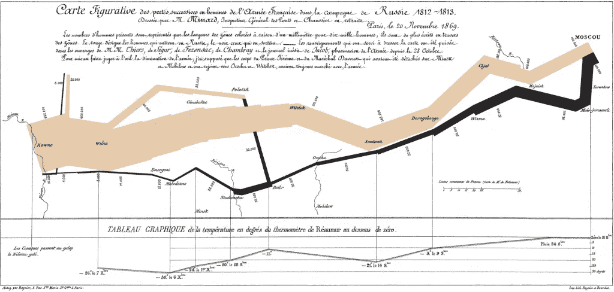
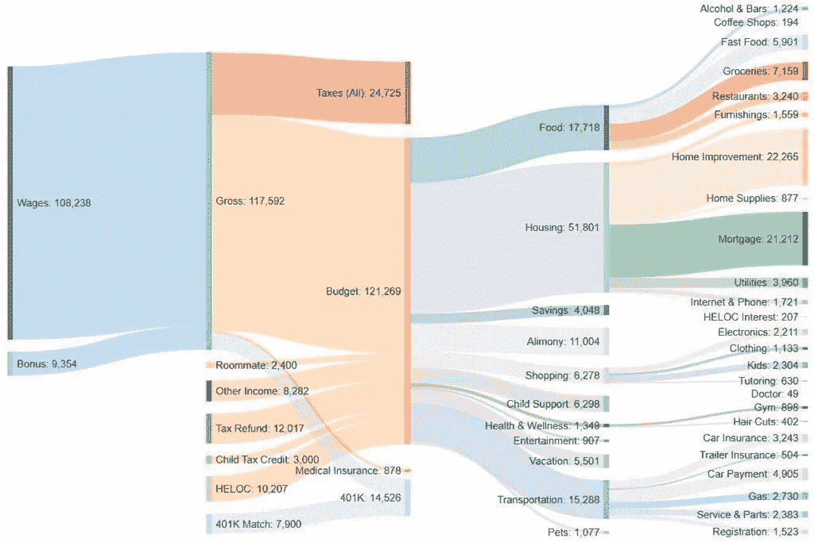
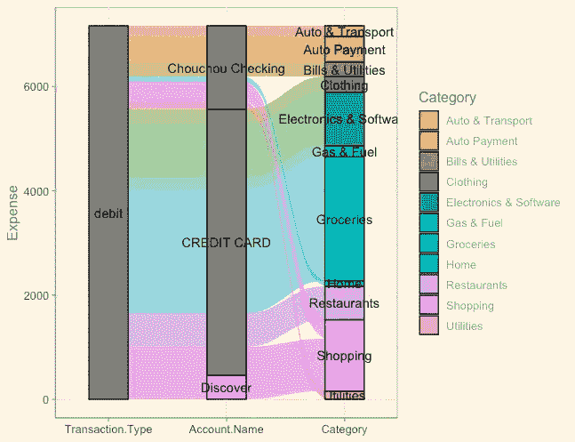
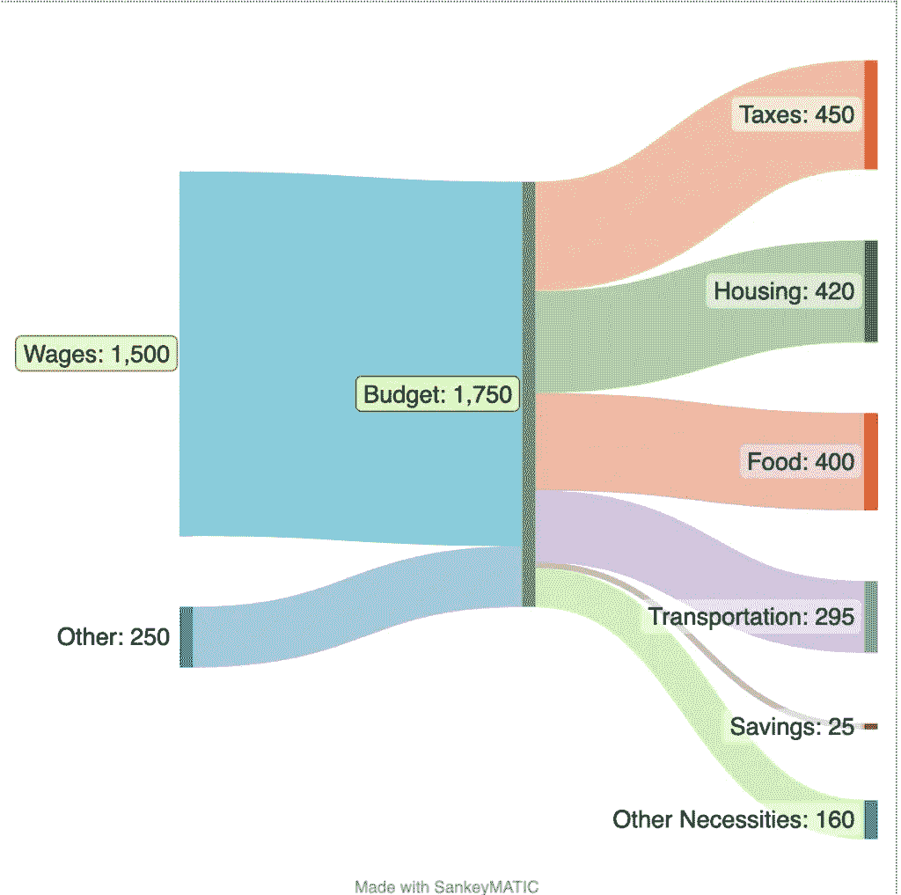

# 如何以一种全面的方式可视化每月开支:用 R 开发一个 Sankey 图

> 原文：<https://towardsdatascience.com/how-to-visualize-monthly-expenses-in-a-comprehensive-way-develop-a-sankey-diagram-in-r-789df4902cea>

## **绘制桑基图**,对你的财务状况有更深入的了解


照片由[钟登祥](https://unsplash.com/@dengxiangs?utm_source=unsplash&utm_medium=referral&utm_content=creditCopyText)在 [Unsplash](https://unsplash.com/photos/-WXQm_NTK0U?utm_source=unsplash&utm_medium=referral&utm_content=creditCopyText) 上拍摄

如果你使用像 Mint/Personal Capital/Clarity 这样的个人预算/财务工具，可视化每月现金流并不新鲜。所有这些工具主要提供三种类型的图表:饼图、条形图和折线图。然而，你有没有想过图表是否足够好，可以让你更好地了解你的月收入和支出？有什么方法可以全面的可视化每月的开销？在这篇文章中，我将与你分享如何在 R 中创建一个**桑基图**，以帮助你更好地了解你的财务状况。

# 什么是桑基图

来自维基百科:**桑基图**是[流程图](https://en.wikipedia.org/wiki/Flow_diagram)，其中箭头的宽度与流速成正比。著名的桑基图之一是[拿破仑](https://en.wikipedia.org/wiki/Napoleon)对俄罗斯[的入侵](https://en.wikipedia.org/wiki/French_invasion_of_Russia)。下图清楚地显示了部队离开的时间和数量。



密纳德关于拿破仑入侵俄罗斯的经典图表——维基

回到个人财务每月现金流，采用桑基图来展示现金流以及资金来自或流向哪个账户是一个完美的用例。

Mint 应用程序中的饼状图和条形图不会显示现金流如何，而是显示一个类别中花费/赚得的钱数，这是通过现金流深度挖掘个人财务的限制之一。

这是 Reddit 上的一张漂亮的[桑基图。我们在本文中的目标是从 Mint 这样的个人金融应用程序中使用数据转储重新创建一个类似的应用程序。](https://www.reddit.com/r/dataisbeautiful/comments/sbwqkv/oc_2021_spending_and_income_34_yr_old_divorced_3/)



桑基图— [来自 Reddit 的收入](https://www.reddit.com/r/dataisbeautiful/comments/sbwqkv/oc_2021_spending_and_income_34_yr_old_divorced_3/)

# 先决条件

虽然它要求您安装 R 来获得更好的定制结果，但是您可以自己添加很少的代码，并且不要求您对 R 有很深的理解。你可以复制粘贴这篇文章中的代码。

你需要[安装 R](https://www.r-project.org/) 和 [RStudio](https://www.rstudio.com/) 来获得最好的体验

# 如何从 Mint 下载您的每月交易

我们将以 Mint.com[的](http://mint.com/)为例下载交易。从 web 应用来说很直接，手机 APP 没有这个选项。登录 Mint 后，转到[事务](https://mint.intuit.com/transaction.event)，滚动到按钮，您应该会看到一个选项“**导出所有 xxx 事务**”当您点击该选项时，将会下载一个 CSV 文件。

下载的 CSV 文件包含以下字段:日期、描述、原始描述、金额、交易类型、类别、帐户名、标签和注释。我们将使用**金额、交易类型、类别和账户名称**来构建桑基图。

# 在 R 和 ggplot2 中创建 Sankey 图

我们将用来构建桑基图的一个库是[gg 冲积](https://cran.r-project.org/web/packages/ggalluvial/vignettes/ggalluvial.html#:~:text=The%20ggalluvial%20package%20is%20a,the%20feedback%20of%20many%20users.)。设计和功能最初受到了[冲积](https://github.com/mbojan/alluvial)包装的启发。gg 冲积的一个优点是它建立在 ggplot2 之上，你可以从图形的[语法中获益](https://williamv30.sg-host.com/why-is-ggplot2-so-good-for-data-visualization/)

我也写过一篇关于*为什么 ggplot2 对数据可视化这么好*的文章？

[](/why-is-ggplot2-so-good-for-data-visualization-b38705f43f85) [## 为什么 ggplot2 对数据可视化这么好？

### 探索 ggplot2 中的图形语法

towardsdatascience.com](/why-is-ggplot2-so-good-for-data-visualization-b38705f43f85) 

下面是从 mint 下载的 CSV 中提取数据、执行一些基本转换并使用 ggplot 可视化为 Sankey 图的代码。

```
library(ggplot2)
library(dplyr)
library(ggthemes)
library(ggalluvial)

df = read.csv("~/Downloads/transactions.csv")
df <- df %>%
  select(Date, Amount, Category, Transaction.Type, Account.Name) %>%
  mutate(Date=as.Date(Date, format="%m/%d/%Y")) %>%
  filter(Date > as.Date('12/01/2022', format="%m/%d/%Y")) %>%
  group_by(Category, Transaction.Type, Account.Name) %>%
  summarise(Expense = sum(Amount)) %>%
  filter(Expense > 100, Transaction.Type == "debit", !Category %in% c("Transfer", "Paycheck", "Credit Card Payment", "Mortgage & Rent", "Investments"))
ggplot(df, aes(axis1 = Transaction.Type, axis2 = Account.Name, axis3 = Category, y = Expense)) +
  scale_x_discrete(limits = c("Transaction.Type", "Account.Name", "Category"), expand = c(.2, .05)) +
  geom_alluvium() +
  geom_stratum() +
  geom_text(stat = "stratum", aes(label = after_stat(stratum))) +
  theme_economist() +
  scale_colour_economist()
```

上面的代码可以分为三类:

1.  **导入**库并读取下载的 CSV 文件
2.  **转换:**我们只选择需要的字段；已将时间戳从字符串转换为日期；按交易类型、帐户名称和类别对美元金额组求和。根据条件，该小组将帮助建立桑基图阶段。
3.  **构建数据可视化**:我们所要做的就是将分组条件放入轴中，然后在`scale_x_discrete`中命名我们希望看到流程的字段，然后调用`ggalluvial`开始构建图表。

现在我们可以将图表形象化如下，它清楚地显示了每个类别的现金流来自哪个账户以及每个类别是如何分配的。



桑基图薄荷由 R |图片由作者

# 无需编码即可创建桑基图

还有一个叫做 sankeymatic.com[的网站](http://sankeymatic.com/)，它提供了一个不用编码就能画出漂亮桑基图的选项。它要求用户以某种方式格式化输入，然后你应该得到和上面 Reddit 帖子一样的结果。



桑基图|图片来自[https://sankeymatic.com/](https://sankeymatic.com/)

# 最后的想法

个人财务应用程序提供了快速、简单的数据可视化，但它仅限于高级的综合用途，如现金流分析。我希望这篇文章能对你的个人理财分析有所补充。请在下面留下评论，让我知道你对桑基图和使用 R 构建这样一个优秀图表的看法。

希望这个故事对你有帮助。本文是我的工程&数据科学系列的**部分，目前包括以下内容:**


[赵承志](https://chengzhizhao.medium.com/?source=post_page-----789df4902cea--------------------------------)

## 数据工程和数据科学故事

[View list](https://chengzhizhao.medium.com/list/data-engineering-data-science-stories-ddab37f718e7?source=post_page-----789df4902cea--------------------------------)47 stories

你也可以 [**订阅我的新文章**](https://chengzhizhao.medium.com/subscribe) 或者成为 [**推荐媒介会员**](https://chengzhizhao.medium.com/membership) 可以无限制访问媒介上的所有故事。

如果有问题/评论，**请不要犹豫，写下这个故事的评论**或通过 [Linkedin](https://www.linkedin.com/in/chengzhizhao/) 或 [Twitter](https://twitter.com/ChengzhiZhao) 直接**联系我。**