# 如何用 TensorBoard 可视化文本嵌入

> 原文：<https://towardsdatascience.com/how-to-visualize-text-embeddings-with-tensorboard-47e07e3a12fb>

# 如何用 TensorBoard 可视化文本嵌入

## 从文本数据中轻松创建引人注目的图表，并检查嵌入内容的质量

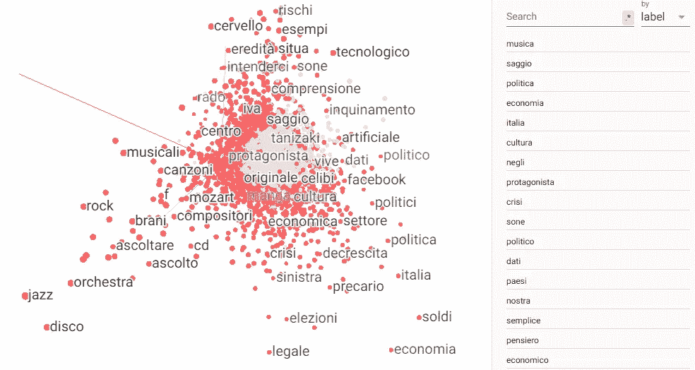

图片作者。

# 目录

1.  [简介](#725a)
2.  [数据建模](#e65a)
    2.1 [导入数据集](#da7a)
    2.2 [拆分训练并验证集合](#39d1)
    2.3 [标记器](#9218)
    2.4 [填充](#6ae3)
    2.5 [创建并拟合模型](#a10b)
3.  [导出并可视化嵌入](#11c7)
    3.1 [配置张量板](#ee9c)
    3.2 [玩嵌入](#1294)
4.  [参考文献](#9d2d)

# 1.介绍

**单词嵌入**是将单词转换成数字的任何方法，它是任何涉及文本数据的机器学习(ML)工作流的首要任务。

独立于所面临的问题(分类、聚类等)，利用输入文本的有效数字表示对 ML 模型的成功至关重要。

但是什么是文本的有效数字表示呢？基本上，我们希望将一个单词嵌入到一个能够传达单词含义信息的数字或向量中。

直观理解这一概念的一种方式是通过**词语类比**，即以下形式的关系:“ *word₁之于 word₂，如同 word₃之于 word₄* ”。这就允许解决诸如“*男人之于国王如同女人之于..？*"通过矢量加减法，如下图所示:

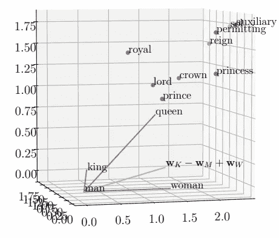

最接近 w(国王)- w(男人)+ w(女人)的嵌入是女王的嵌入。图片来自[1]。

现在，让我们设想有一个通用数据集，其中每个文本样本都与一个类(或标签)相关联。例如，我们可能面临一个情感分析任务(带有诸如:中立、消极、积极等标签)或者一个对话代理的意图检测问题。在这种情况下，我们将训练一个分类模型，并使用准确性、精确度、召回率、F1 分数等指标来评估其性能...但是，我们怎样才能容易地观察到嵌入文本的图形表示，如上图所示？

在本帖中，我们涵盖了从一个文件导入的通用数据集开始，访问文本嵌入的吸引人的动态可视化所需的所有步骤。为了实现这个目标，我们将使用 TensorFlow(一个流行的开源 ML 库)和 TensorBoard。

# 2.数据建模

## 2.1 导入数据集

在之前的 post⁴中，我们描述了一个由罗马图书馆读者的评论组成的数据集的制造，从由“[*istituzione biblioteche di Roma*](https://www.bibliotechediroma.it/)”⁵.公开的公开数据开始

数据集由**两列**组成，一列为纯文本格式的读者评论(他们的语言是意大利语)，另一列为他们各自的标签。这些标签标识了 review⁶.的主题我们希望创建一个多类文本分类器，能够预测输入评论的主题，并观察文本嵌入。

我们从导入所需的库开始:

我们从文件中加载数据集。值得注意的是，我们将描述可以**应用于任何数据集**的步骤，该数据集至少包含输入文本样本及其各自的标签，任何语言中的**:**

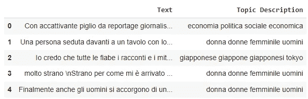

图片作者。

主题分布如 follows⁴:

1.  关于女性在社会中的地位的评论，或者有着强势女性主角的小说(n=205，25.5%)
2.  专辑和音乐会的评论，或音乐家的传记(n=182，22.64%)
3.  关于经济和社会政治状况的书籍和论文的评论(n=161，20.02%)
4.  与日本或日本文化相关的评论(n=134，13.67%)
5.  科技泄密论文综述(122 篇，15.17%)

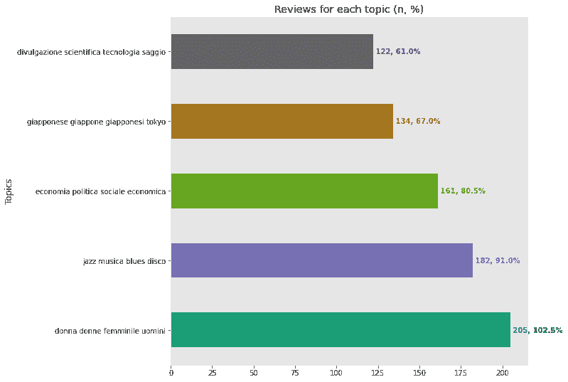

图片作者。

出于分类的目的，我们需要数字标签。因此，我们将主题描述映射到整数:

## 2.2 训练和验证集中的分割

我们将训练集和验证集中的数据拆分如下:

## 2.3 标记器

此时，我们的训练集和验证集仍然是由文本组成的。为了通过将每个评论转化为整数序列来对文本语料库进行矢量化，我们利用了`tf.keras.preprocessing.text.Tokenizer` ⁷类。

我们任意选择一个词汇大小，即要保留的最大单词数，然后实例化 tokenizer 类并使其适合训练集。之后，我们为训练集和验证集生成数字序列:

标记化的文本序列看起来怎么样？我们可以观察到如下随机处理的序列:

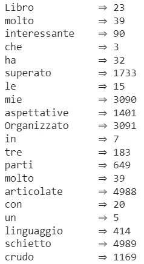

图片作者。

从上图中，我们可以看到输入句子中的每个单词是如何映射到一个不同的整数上，从而创建一个数字序列的。对于出现不止一次的单词，我们注意到它们总是得到相同的数字表示(例如，" *molto = > 39* ")。

我们最后创建一个包含单词和整数之间关联的字典:

## 2.4 填充

我们有效地将文本转换为向量，但是我们仍然不能将它们用作 ML 模型的输入，因为任何句子都可能有不同的长度。我们现在必须找到一种方法，使它们一致(即大小相同)，而不产生不需要的噪声。

获得相同大小的序列的一种方法是通过**填充**它们，即向较短的序列添加相同的便利值(通常为零)，允许它们匹配所需的长度:

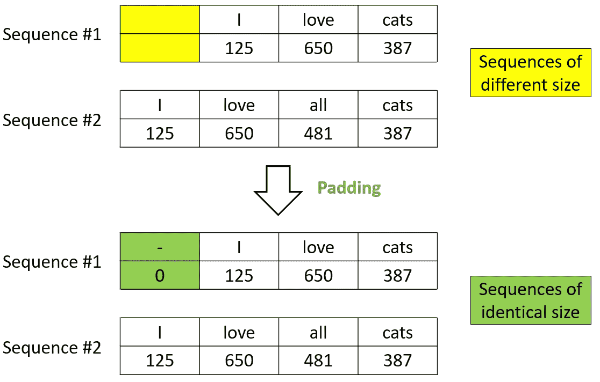

填充示例。图片作者。

在张量流中实现这一点的一种方法是使用`tf.keras.preprocessing.sequence.pad_sequences` ⁸:

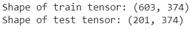

图片作者。

值得注意的是，`pad_sequences`接受一个输入参数(`padding`)来指定是否应该在每个序列的(默认行为)之前添加**或者在**之后添加**。我们可以通过提示`data_train[0]`来打印和检查一个填充序列:**

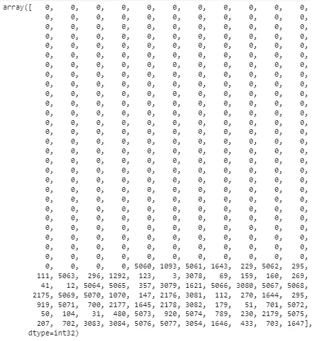

填充序列。图片作者。

## 2.5 创建并拟合模型

我们定义一个由`Dense` ⁹和`Dropout` ⁰层组成的简单模型。用户可以随意修改参数和层，但请务必记住:

1.  最后一个`Dense`层的输出空间维度必须等于我们想要预测的类的数量。
2.  当我们面临多类分类问题时，我们利用`softmax`激活函数。它估计目标类的离散概率分布。
3.  `Embedding`层应该具有等于词汇表大小的输入维数，即最大整数索引+1:

我们选择训练 50 个时期的模型，但是我们也使用`EarlyStopping`回调以便在训练期间监控`validation loss`:如果度量在至少 3 个时期(`patience = 3`)没有改善，则训练被中断，并且来自`validation loss`显示最佳值(即最低值)的时期的权重被恢复(`restore_best_weights = True`):

我们可以从由`fit`方法返回的`History`对象中观察到分类的准确性:

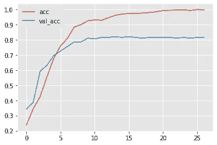

图片作者。

多类文本分类器的创建对于我们的最终目标是必不可少的，即**提供从通用模型中提取文本嵌入的指导，并可视化地探索它们**。因此，我们不会将精力集中在进一步的模型改进和性能评估上。

# 3.导出并可视化嵌入

## 3.1 配置张量板

TensorBoard 是“ *TensorFlow 的可视化工具包*”。这是一个工具，提供有用的测量和可视化，以监测 ML 工作流程。例如，人们可以使用 TensorBoard 来跟踪损失和准确性等指标，观察模型图，探索权重和偏差，并**将嵌入投影到更低维度的空间**。

为此，在前面的章节中，我们引入了 TensorBoard 嵌入式投影仪:

```
from tensorboard.plugins import projector
```

我们加载 TensorBoard 笔记本扩展:

```
%load_ext tensorboard
```

我们创建一个目录来存储所需的信息。然后，我们将单词到整数的字典和来自`Embedding`层的权重保存在目录中，最后设置`projector.ProjectorConfig()` 配置:

我们最后通过`logdir`参数指定我们刚刚创建的日志目录来启动 TensorBoard:

```
%tensorboard --logdir /logs/fit/
```

## 3.2 玩嵌入

为了可视化嵌入，我们从 TensorBoard 仪表盘右上角的下拉菜单中选择`PROJECTOR`:

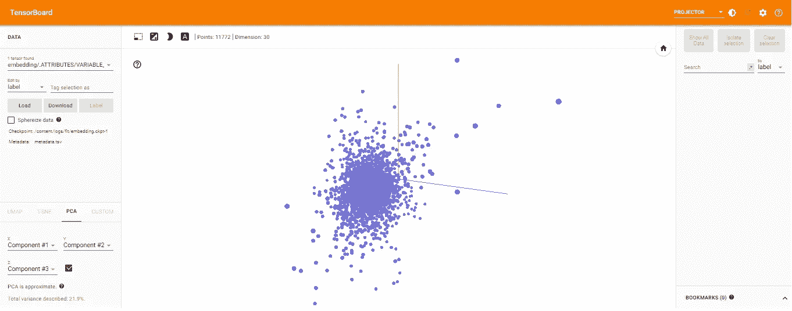

图片作者。

在左下方，我们注意到该界面提供了多种维度缩减技术**供选择( **UMAP、t-SNE、PCA、自定义**)，以便直观地检查二维或三维投影维度中的高维向量。**

我们可以使用右上角的菜单来搜索特定的单词，并使用余弦相似度或欧几里德距离来突出显示它们最近的邻居。

例如，“ *pianoforte* ”(钢琴)这个词更接近于“*巴赫*”的名字，这可能是因为这位著名的德国作曲家对钢琴改编曲的评论非常流行:

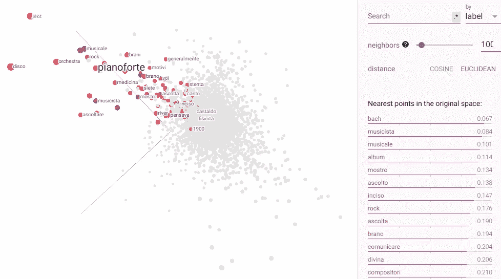

图片作者。

如果我们搜索单词" *Giapponese* "(日语)，三个最接近的单词依次是:"*宫崎骏*"、" *urbanistica* "(城市规划)和"*香蕉*"，表明读者对作者宫崎骏和吉本芭娜娜的可能偏好，以及对日本城市规划概念的兴趣(例如*町村*):

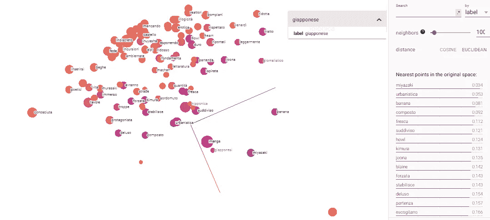

图片作者。

# 4.参考

[1]卡尔·艾伦(Carl Allen)，蒂莫西·霍斯佩达莱斯(Timothy Hospedales)，《类比解释:走向理解单词嵌入，2019， [arXiv:1901.09813](https://arxiv.org/abs/1901.09813) 。

[tensorflow.org/](https://www.tensorflow.org/tensorboard)

[tensorflow.org/tensorboard](https://www.tensorflow.org/tensorboard)

[4][towards data science . com/multi-label-text-class ification-using-Bert-and-tensor flow-D2 e88d 8 f 488d](/multi-label-text-classification-using-bert-and-tensorflow-d2e88d8f488d)

【www.bibliotechediroma.it/it/open-data-commenti-lettori 

[6][towards data science . com/romes-libraries-readers-comments-analysis-with-deep-learning-989d 72 bb 680 c](/romes-libraries-readers-comments-analysis-with-deep-learning-989d72bb680c)

[7][tensor flow . org/API _ docs/python/TF/keras/preprocessing/text/Tokenizer](https://www.tensorflow.org/api_docs/python/tf/keras/preprocessing/text/Tokenizer)

[8][tensor flow . org/API _ docs/python/TF/keras/预处理/sequence/pad_sequences](https://www.tensorflow.org/api_docs/python/tf/keras/preprocessing/sequence/pad_sequences)

[9][tensorflow.org/api_docs/python/tf/keras/layers/Dense](https://www.tensorflow.org/api_docs/python/tf/keras/layers/Dense)

[tensorflow.org/api_docs/python/tf/keras/layers/Dropout](https://www.tensorflow.org/api_docs/python/tf/keras/layers/Dropout)

[11][tensorflow.org/api_docs/python/tf/keras/layers/Embedding](https://www.tensorflow.org/api_docs/python/tf/keras/layers/Embedding)

[tensorflow.org/tensorboard/tensorboard_projector_plugin](https://www.tensorflow.org/tensorboard/tensorboard_projector_plugin)