# 如何在 Python 中对网格和点云进行体素化

> 原文：<https://towardsdatascience.com/how-to-voxelize-meshes-and-point-clouds-in-python-ca94d403f81d>

> 本文介绍了使用四个广泛流行的 Python 库生成点云和网格的体素表示的步骤，这四个 Python 库是:[*【open 3d】*](http://www.open3d.org/)*、* [*Trimesh*](https://trimsh.org/index.html) *、* [*PyVista*](https://docs.pyvista.org/) 、*和* [pyntcloud](https://github.com/daavoo/pyntcloud) 。体素化是许多 3D 深度学习模型的重要预处理步骤。这篇文章展示了如何计算体素级别的特征，如颜色、点密度和占用率等。最后，还演示了如何创建简单的交互式体素化和阈值处理示例。谁说体素化要复杂？


Open3D 中点云的体素化示例—不同的体素大小(左)和体素网格的构建(右)|作者的图像

3D 数据的深度学习正在成为机器学习和理解我们周围世界越来越重要的一部分。随着深度相机和激光雷达等新的 3D 数据提取硬件在 CCTVs、相机和智能手机中变得越来越常见，越来越多的人正在使用它提供的额外维度。此外，摄影测量和基于运动的结构正成为 3D 重建和建模管道的正常部分，并且提取和操纵大型 3D 数据集正变得必要。用于 3D 深度学习的非结构化数据可以有不同的表示:

*   点云[3，4，11]
*   体素和体素网格[1，8，9]
*   深度图[2]
*   图[5，10]

这些远不是所有可能的 3D 数据表示，还有其他像参数化 CAD 模型、多视图图像、体积等。要想更好地了解其中的一些内容，你可以阅读 Florent Paux 撰写的关于“[如何表示 3D 数据？](/how-to-represent-3d-data-66a0f6376afb)”。

在本文中，我们将着重于将 3D 数据表示为体素。但是首先什么是体素？最简单的比较就是体素就是 3D 像素。体素被排序到体素网格中，这可以被视为图像的有序结构的 3D 等价物。当点云或网格变成体素表示时，它与体素网格相交。然后，点云或网格中的点落入某些体素中。留下这些体素，而不与任何点相交的所有其他体素要么被丢弃，要么被置零，留给我们的是物体的雕刻表示。体素化可以仅仅是表面级别的，或者贯穿整个网格/点云体积。

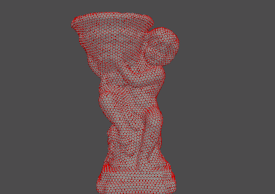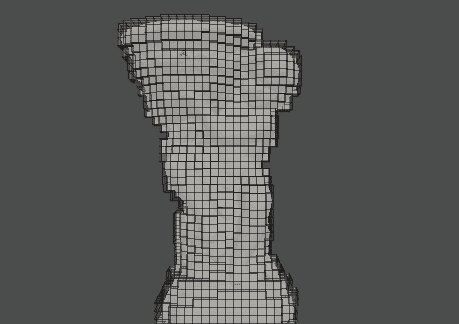

作者使用 PyVista | Image 将左侧的天使雕像转换为右侧的体素表示的体素化示例

构建网格和点云的体素化表示是许多深度学习方法的数据预处理中的重要步骤。体素化也广泛用于处理点云，包括二次采样、特征提取和占用分析等。最后，生成网格的体素表示对于创建游戏资源和简化模拟表面也很有用。

在文章中，我们将探索四个 Python 库的体素化能力——[*【Open3D】*](http://www.open3d.org/)*[*Trimesh*](https://trimsh.org/index.html)*[*py vista*](https://docs.pyvista.org/)*和 [pyntcloud](https://github.com/daavoo/pyntcloud) 。我选择了这些库，因为它们提供了相对简单的体素化功能，以及用于分析所创建的体素的内置解决方案。其他较小的库，如 [PyVoxelizer](https://github.com/p-hofmann/PyVoxelizer) 、 [Voxelizer](https://github.com/archi-coder/Voxelizer) 、 [simple-3dviz](https://simple-3dviz.com/) 和 [DepthVisualizer](https://github.com/ErenBalatkan/DepthVisualizer) 也提供了体素化功能，但它们被认为过于有限。另一个提供体素化功能的库是 [Vedo](https://vedo.embl.es/) ，但是在最初的测试之后，我发现它们是针对 3D 体数据的，这限制了它们的使用。如果您想了解更多关于如何使用这些库创建漂亮的可视化效果的信息，您可以看看我以前的文章“**用于网格、点云和数据可视化的 Python 库**”(第 1 和第 2 部分)。我们将使用的唯一一个以前没有讨论过的库是 pyntcloud，所以我们将更详细地讨论如何安装和设置它。***

**[](/python-libraries-for-mesh-and-point-cloud-visualization-part-1-daa2af36de30)  [](/python-libraries-for-mesh-point-cloud-and-data-visualization-part-2-385f16188f0f)  

为了演示点云和网格上的体素化，我提供了两个对象。首先是**中的一个兔子雕像点云。txt** 格式，包含每个点的 *X、Y、Z* 坐标，以及它们的 *R、G、B* 颜色，最后是 *Nx、Ny、Nz* 法线。第二，一只公鸡雕像网在一个**里。obj** 格式，加上一个**。mat** 文件和一个纹理在**中。jpg** 格式。这两个物体都是使用运动摄影测量的结构创建的，并且**可以在商业、非商业、公共和私人项目中免费使用**。这些对象是一个更大的数据集[6]的一部分，并已用于噪声检测和检查方法的开发[7]。为了跟随教程，除了使用的库和它们的依赖项，您还需要 NumPy 和 SciPy。所有代码都可以在 GitHub 库[这里](https://github.com/IvanNik17/python-3d-analysis-libraries)获得

# 使用 Open3D 进行体素化

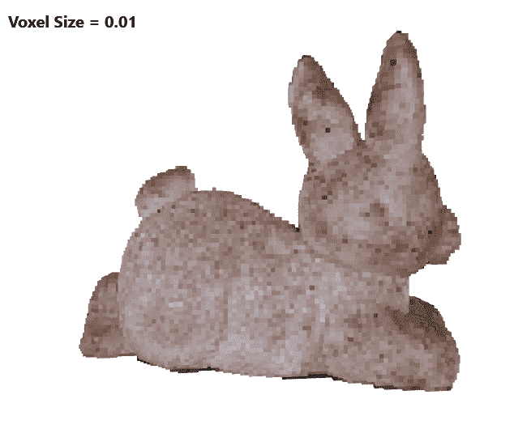

Open3D 使用不同大小的体素网格进行体素化的结果|图片由作者提供

pen3D 是功能最丰富的 Python 库之一，用于 3D 分析、网格和点云操作以及可视化。它包含了从点云和网格生成体素的优秀工具。该库还支持大量 3D 图元，如球体、立方体、圆柱体等。这使得从体素生成 3D 网格变得容易。最后，体素网格也可用于二次采样点云并生成分割。关于如何安装和使用 Open3D 的分步教程，可以看看我之前的文章“[网格、点云、数据可视化的 Python 库(第一部分)](/python-libraries-for-mesh-and-point-cloud-visualization-part-1-daa2af36de30)”。我们将使用大量相同的可视化和回调代码。

我想再次指出 Florent Poux 博士的一个优秀教程—“如何使用 Python 自动进行 3D 点云的体素建模”，其中他给出了使用 Open3D 从点云生成体素的很好的概述和用例。在我的文章中，我以教程中提供的信息为基础。

为了更好地理解体素化过程，我们将使用 Open3D 构建两个示例—一个可视化多个体素网格级别以及它们如何影响体素化模型，另一个显示体素化过程。

我们首先使用 NumPy 的`loadtxt()`函数加载兔子雕像点云。我们将数组分为点、颜色和法线，并通过首先使用`Vector3dVector`函数将数组转换为矢量来创建一个 Open3D 点云。从这里开始，通过调用`VoxelGrid.create_from_point_cloud()`并给它点云和体素尺寸参数，创建一个体素网格是很简单的。如果我们从一个网格开始，我们可以用`create_from_triangle_mesh()`做同样的事情。如果我们在 Open3D 中使用体素网格来操作和分析点云/网格，我们可以在此停止。我们还可以通过调用将体素网格作为几何图形添加到 Visualizer 对象来快速可视化它。下面给出了代码。

我们也将继续处理体素网格，并将其转换为网格，因为我们想用它来创建一个动画，截至编写时，体素网格不能被转换。我们使用 Florent Poux 博士提出的方法。我们通过调用`geometry.TriangleMesh()`创建一个空的三角形网格，然后通过调用`voxel_grid.get_voxels()`从网格中提取所有体素，并获得所创建体素的真实大小。这样，我们可以在每个体素位置创建一个 Open3D box 图元，将这些框缩放到体素的大小，并通过调用`voxel_grid.get_voxel_center_coordinate()`将它们定位在体素中心。最后，我们将这样创建、缩放和定位的盒子添加到 TriangleMesh 对象中。

为了演示不同的体素网格大小如何改变最终的体素输出，并使示例更有趣一些，我们将制作体素输出之间的旋转过渡动画。为此，我们通过调用`register_animation_callback()`向可视化工具注册一个新的回调。在回调函数中，我们生成体素网格，并从中创建一个体素网格。我们将这样创建的网格旋转 360 度，破坏网格，并重复不同大小的体素网格。我们还利用一个小类来保存在回调更新循环中会发生变化的所有变量。下面给出了完整旋转可视化的代码。

为了更好地理解创建体素和体素网格的过程，我们将通过动画对其进行可视化。这个可视化的代码与我们已经展示过的非常相似，但是这次我们通过添加每个新的体素作为回调函数循环的一部分来可视化创建体素网格的过程。为了得到兔子雕像的轮廓，我们还使用体素函数`get_voxel_center_coordinates`来提取体素中心，并使用它们来生成点云。这样，我们以迂回的方式生成输入点云的二次采样和均匀采样版本。整个可视化的代码如下所示。

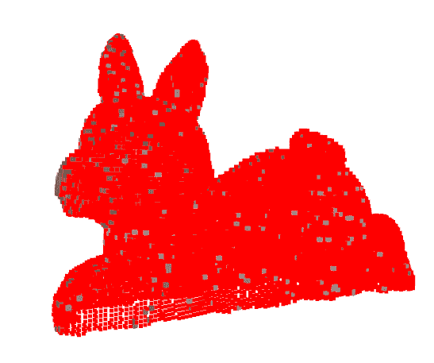

作者在 Open3D| Image 中从输入点云生成体素网格的可视化表示

# 使用 Pyntcloud 的体素化


Pyntcloud 体素化的结果，体素基于密度着色|作者的图像

Pynt cloud 是一个轻量级的强大的 Python 3 库，用于点云和网格的分析和预处理。它包含用于体素化、特征提取、网格平滑和抽取、点云二次采样、离群点检测等工具。它直接用作 jupyter 笔记本的一部分，包含用于 **threejs** 、[**python reejs**](https://pythreejs.readthedocs.io/en/stable/#:~:text=pythreejs%20is%20a%20Jupyter%20widgets,js.)、 **PyVista** 和 **matplotlib** 的可视化绑定。它可以很容易地集成到其他大型库(如 Open3D 和 PyVista)的工作流中。

pyntcloud 的体素化功能非常强大，体素表示已经包含许多预先计算的特征，如体素到点的对应关系、体素网格段信息、每个体素中的点密度和二进制掩码等。

Pyntcloud 可以在 Linux、Mac 和 Windows 上使用 Python 3。它需要 NumPy 和熊猫作为先决条件。该库在不断发展，并且每月更新。它可以使用 pip 或 Anaconda 安装。我们通常将每个库安装在一个新的 Anaconda 环境中，以保持一切整洁，但在这种情况下，我们将 pyntcloud 与 Open3d 一起安装，以利用前者的可视化功能。我们这样做是因为 pyntcloud 中的体素和网格可视化需要 threejs 或 pythreejs，而这又需要 jupyter 笔记本或启动本地服务器。这些超出了本文的范围，但是我仍然会给出如何在 pyntcloud 中直接可视化体素的例子。

```
conda create -n pyntcloud_env python=3.8
conda activate pyntcloud_env
pip install open3d
pip install pyntcloud
OR
conda install pyntcloud -c conda-forge
```

一旦我们安装了所有的东西并且没有错误，我们就可以测试两个库，首先一起调用`import open3d as o3d`和`print(o3d.__version__)`，然后一起调用`from pyntcloud import PyntCloud`和`print(PyntCloud.__version__)`。如果两个库都导入了，我们就可以继续学习教程了。

pyntcloud 的 I/O 模块无论好坏都相当简化。它使用`PyntCloud.from_file()`来加载网格和点云。该函数根据需要加载的文件的扩展名来决定调用什么内部函数。要获得 pyntcloud 支持的所有文件类型的列表，您可以在这里阅读它们的 I/O 页面。对于包含点云的 ASCII 文件，pyntcloud 直接调用 Pandas，并需要额外的输入参数，如分隔符、列名、是否有标题部分等。在本教程的情况下，我们导入兔子雕像点云，并需要显式指定所有列的名称。一旦我们加载了点云，我们需要调用`.add_structure("voxelgrid", grid_size_x, grid_size_y, grid_size_z)`在点云的顶部创建一个体素网格。该函数的输出是点云中的点与网格相交的体素网格 id。然后，我们通过调用`name_of_point_cloud.structures[voxelgrid_ids]`使用这些 id 来创建点云的已占用体素表示。从这里开始，我们可以使用这个对象来提取体素的信息，并可视化一切。下面给出了导入点云并提取体素的代码。

一旦我们创建了点云的体素表示，我们可以通过调用`voxelgrid.plot(cmap="hsv", backend="threejs")`使用 pyntcloud 直接可视化它。这里可以调用不同的后端，但是对于网格和体素，只支持`threejs`和`pythreejs`。为了能够在不需要运行服务器的情况下更容易地可视化一切，我们将把创建的体素网格转移到 Open3D，并使用 Open3D 部分中显示的技术来可视化它。通过这种方式，我们还展示了结合这两个库，利用它们的优势是多么容易。

我们首先创建一个空的 Open3D `geometry.TriangleMesh()`，它将被体素填充。然后，我们循环遍历 pyntcloud 体素网格上的所有体素。我们可以从`voxelgrid.voxel_n`数组中获得当前的体素 id，并且我们可以通过调用`voxelgrid.voxel_centers[voxel_id]`使用这个 id 来获得它的体素中心。为了获得我们将用作体素颜色的密度值，我们使用体素网格中体素的 X、Y 和 Z 位置，这是我们已经提取的。从这里开始，一切都与 Open3D 的例子相同。我们给盒子图元着色，缩放它，并将其平移到体素中心。最后，我们初始化一个 Open3D 可视化工具，并将创建的体素网格作为几何图形添加到其中。下面给出了完整的 pyntcloud/Open3D 可视化代码。

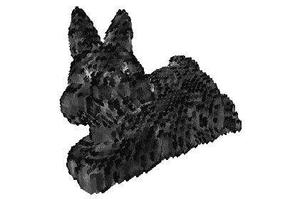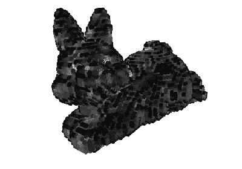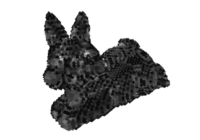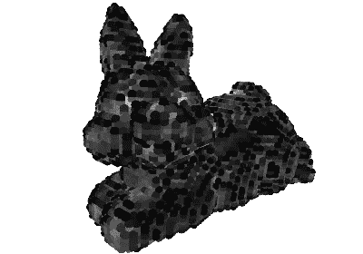

使用圆锥体(左上)、圆柱体(右上)、八面体(左下)和球体(右下)的体素网格|作者图片

为了更有趣，我们可以在创建体素网格时用其他图元替换长方体图元。Open3D 有大量的图元——球体、圆柱体、圆环体、八面体、圆锥体等。我们创建一个小的选择函数，它采用图元的名称并返回 3D 对象。那么我们唯一要改变的就是将`primitive = o3d.geometry.TriangleMesh.createbox()`改为新的函数调用`primitive = choose_primitive("cylinder")`。该函数的代码如下所示。

# 使用 Trimesh 的体素化

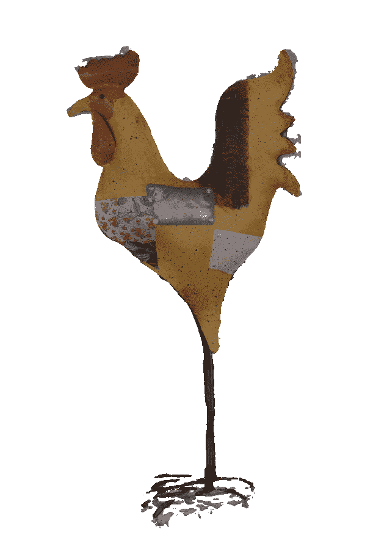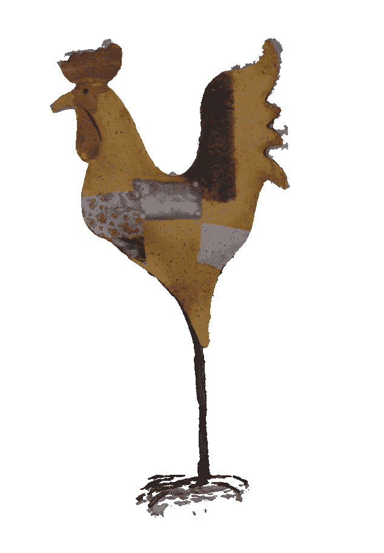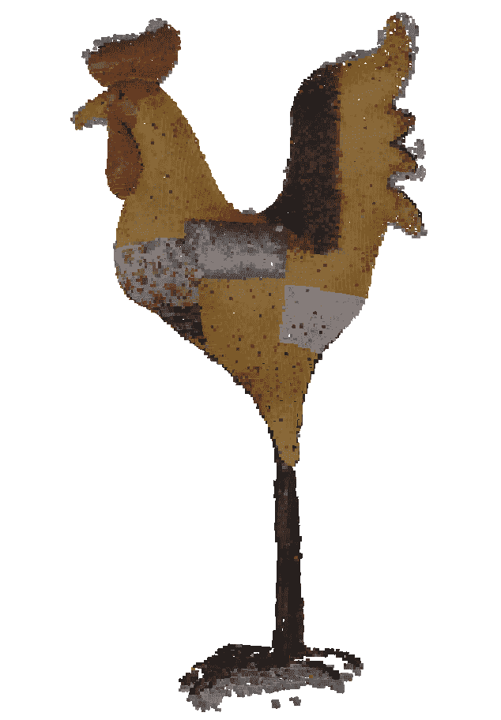

在 Trimesh 中创建彩色体素化网格的过程-带有纹理的输入网格(左)，带有映射到每个顶点的颜色信息的网格(中)，以及彩色体素化网格(右)|作者的图像

T [rimesh](https://github.com/mikedh/trimesh) 是使用最广泛的 Python 库之一，用于处理网格。大量其他库和独立项目使用它或者直接构建在它之上。它提供了大量的点云和网格分析和转换工具。有关 Trimesh 的安装说明和可视化使用示例，您可以查看文章“ [Python 库用于网格、点云和数据可视化(第 1 部分)](/python-libraries-for-mesh-and-point-cloud-visualization-part-1-daa2af36de30)”，其中我们展示了如何处理网格和点数据集。

对于体素化，Trimesh 有许多方法来创建体素网格，在内部挖空它们，以及使用形态学操作(如闭合和二进制膨胀)填充它们。它也有直接的方法，通过分别调用`trimesh.voxel.morphology.surface` 和`trimesh.voxel.morphology.fill`来提取体素网格的表面或填充。该库还提供了快速分析体素网格的工具，如提取边界，检查网格中体素空间是空的还是填充的，以及计算被占用体素的比例和体积。用于执行行进立方体计算的功能也是容易获得的。

Trimesh 的一个非常棘手的功能是提取网格的纹理颜色信息，并将其作为颜色提供给体素表示。为此，我们首先提取纹理信息，并将其作为颜色信息映射到网格的每个顶点。这是通过调用`name_of_the_imported_mesh.visual.to_color().vertex_colors`来完成的。然后，我们可以将它转换成一个 NumPy 数组，并为每个网格顶点自由访问它。然后我们可以通过直接调用`name_of_the_imported_mesh.voxelized().hollow()`从网格中创建一个体素网格，在这里我们可以指定体素网格的分辨率。我们还将体素化转换为空心表示，因为我们需要计算网格和体素表示之间的距离。

由于 Trimesh 不包含将网格颜色直接映射到体素表示的体素的功能，我们首先需要调用`trimesh.proximity.ProximityQuery(name_of_the_mesh).vertex(voxel_grid_name.points)`来计算网格的每个顶点和已经创建的体素表示点之间的距离。然后，我们需要遍历每个点，提取最近的网格顶点的颜色，并将其映射到大小为(X，Y，Z，4)的颜色数组中，其中 X，Y 和 Z 是生成的体素网格的大小，3 是颜色的 R，G，B 和 A 分量。一旦我们有了映射，我们可以调用`voxel_grid_name.as_boxes(colors = mapped_color_array)`，这使得体素网格成为一个三维网格对象，体素/框的颜色等于初始网格的颜色。运行代码时，读者会发现体素化的网格上有洞。这很可能是因为公鸡雕像的网格由于运动过程的结构而不是完全防水的。体素化过程的代码如下所示。

# 使用 PyVista 的体素化

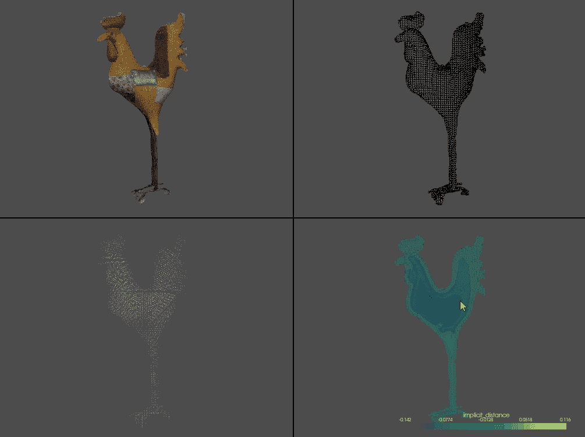

PyVista 网格的多点可视化(左上)、体素化表示(右上)、代替立方体的圆锥体表示(左下)以及到网格的每体素距离可视化(右下)|作者图片

P [yVista](https://docs.pyvista.org/index.html) 是一个全功能的网格可视化和分析库，构建于 VTK 之上。它可以用来创建包含多个窗口、GUI 元素以及通过鼠标、键盘和 GUI 进行交互的复杂应用程序。该库使用过滤例程来转换点云和网格，并提取任何所需的信息。它可以用作物理模拟、计算机图形、GIS、建筑可视化、光线跟踪和数学计算展示的一部分。有关 PyVista 的安装说明和可视化使用的示例，您可以查看文章“ [Python Libraries for Mesh，Point Cloud，and Data Visualization (Part 1)](/python-libraries-for-mesh-and-point-cloud-visualization-part-1-daa2af36de30) ”，其中我们展示了如何处理网格和点数据集。

由于 PyVista 建立在 VTK 之上，它包含了一个简单的接口，用于将网格转换成`UniformGrid`对象，以构建体素表示。要提到的重要一点是 PyVista 只能用于网格的体素化。如果给定一个点云，首先需要将它三角化成网格。对于更简单的点云表面，这可以在 PyVista 中使用`delaunay_3d`三角测量直接完成。另一个要点是，PyVista 在体素化时默认期望无缝网格。如果网格有洞、重叠边或其他不正确的几何体，尝试对其进行体素化将会导致错误。体素化是通过调用`pyvista.voxelize(input_mesh)`完成的。如果这个方法抛出一个错误，说明使用的网格不是防水的，有两种方法可以继续——要么在另一个软件如 Blender 中修复网格，要么添加参数`check_surface=False`。在网格中有小瑕疵的情况下，第二种方法将产生良好的结果，没有任何噪声或伪影。请注意，如果有大洞或几何缺陷，跳过表面检查可能会导致不正确的体素化和噪声。

一旦`voxelize`被调用，结果是一个包含所有体素的统一网格对象。然后可以从表示中提取附加信息，如体素中心、每个体素的 X、Y、Z 边界坐标、包含网格部分的体素的凸包等。PyVista 的[示例](https://docs.pyvista.org/examples/01-filter/voxelize.html#sphx-glr-examples-01-filter-voxelize-py)中给出了对体素表示的有用分析。一旦我们有了体素，我们可以调用`compute_implicit_distance`来计算体素和网格之间的距离。这对于检查体素化过程是否有任何不一致是有用的，并且用于过滤掉网格内部的体素以创建中空体素表示。另一个有用的转换是使用不同于立方体的图元对象来表示体素。这可以在调用`voxelize`时直接设置，也可以稍后通过调用`voxelized_object.glyph(geom = type_of_primitive())`创建。最后，对于这一部分，我们还将在单独的子窗口中可视化所有内容，并将它们链接起来。这与 matplotlib 的方法相同，在设置绘图仪`pyvista.Plotter(shape=(num_horiz_windows,num_vertical_windows))`时给出了窗口的数量。一旦设置完毕，就可以通过调用`pyvista.subplot(horizontal_num, vertical_num)`来调用每个子窗口。下面给出了用于产生输入网格的四个子窗口可视化、具有立方体的体素化表示、具有锥体的体素化表示以及网格和体素之间的最终距离的代码。

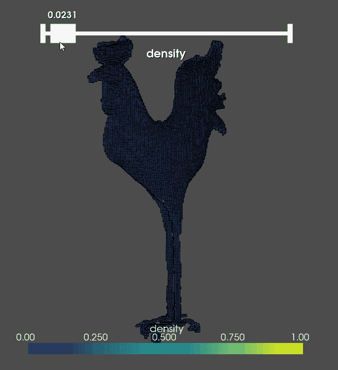

PyVista 阈值化体素网格基于每个体素中的点密度，使用 GUI 部件|作者提供的图片

我们将使用体素化上下文来展示如何在 PyVista 中创建一个简单的 GUI，并为生成过程添加交互性。首先，一个简短的例子演示了如何为每个体素生成点密度。之所以选择这一步，是因为这是一个有用的分析步骤，PyVista 中没有这一步。为此，需要 SciPy 的`KDTree`功能。我们用它来得到每个体素中心的所有相邻网格顶点。SciPy 有一个函数`query_ball_point`，它以一个点为圆心，以指定的半径制作一个球体，并将所有相邻的点都放到这个球体上。当然，当我们在一个体素立方体形状内部寻找点时，使用一个球体会导致不完美的结果。对于本教程，我们将使用这种简化。为了计算球体的半径，使其具有与体素立方体相同的体积，我们使用已知的立方体侧面 *x* 来首先找到立方体的体积:

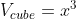

接下来，我们得到球体的体积:

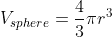

从那里如果想让两个体积相等，我们可以计算半径为:

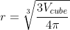

这可以用 Python 写在一个小的帮助器函数中，如下所示。

一旦我们有了每个体素中心附近的所有顶点，我们就对它们进行计数，并用最大计数将它们除以，以便在 0 和 1 之间对它们进行归一化以便可视化。最后，我们将这些值作为场添加到体素中。代码被分成下面给出的另一个函数。

PyVista 包含一个现成的内置可视化工具，用于对网格和点云进行阈值处理，名为`add_mesh_threshold`。这直接将对象添加到场景中，并创建一个滑块小部件，该小部件连接到最近的活动字段或指定字段。完整可视化的代码如下所示。

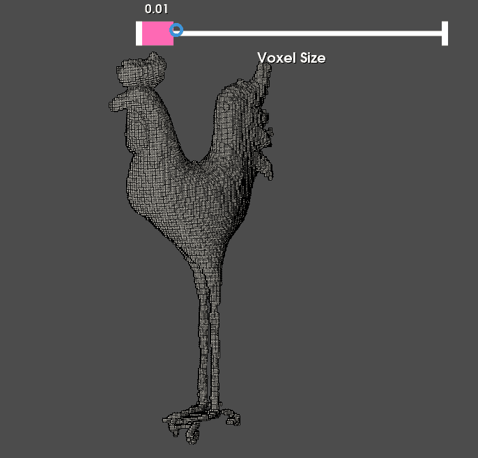

PyVista 自定义 GUI 小部件，用于交互式更改体素化体素大小|作者图片

最后，我们将创建一个自定义的 slider 小部件来演示它在 PyVista 中是多么简单。移动滑块将改变体素的大小，并重新计算整体。为了更简洁，我们将把所有东西添加到一个类中。要创建一个 slider 小部件，我们只需要调用`add_slider_widget(name_of_callback_function, [min, max], start_value, title_of_widget, how_often_should_the_widget_call_callback)`。最后一个输入决定了当我们单击鼠标按钮、释放鼠标按钮或者每次移动鼠标时是否会调用回调函数。在我们的例子中，我们使用最后一个选项。在回调函数中，我们进行体素化计算，并将其添加到绘图仪中。这里，在绘图仪中指定网格对象的名称很重要。这样 PyVista 就知道我们在更新同一个网格，而不是每次移动滑块都创建一个新的。下面给出了整个 GUI 交互性的代码。

# 结论

V 当使用点云和网格时，oxelization 可以是你的武器库中最强大的工具之一。使用 Python 生成和处理体素非常简单。在本文中，我们探索了如何创建体素网格，从体素中提取特征，以及将图元从立方体更改为球体、圆柱体、圆锥体等。我们还展示了如何完成体素构建过程，以及如何创建交互式体素化和阈值工具。

一旦有了体素表示，就可以很容易地将其插入到现有的深度学习或资产创建管道中，以实现所需的结果。在接下来的文章中，我们将探索更多通过邻接分析、PCA 特征提取、RANSAC 实现等从点云和网格中提取特征和有用信息的方法。

如果您想了解更多关于从点云和网格中提取特征的信息，请阅读我的一些关于三维表面检测和噪声检测的文章[11]和[7]。您可以在我的 [**页面**](https://ivannikolov.carrd.co/) 上找到这些文章和我的其他研究，如果您看到有趣的东西或只想聊天，请随时给我留言。继续关注更多！

# 参考

1.  Qi，C. R .，Su，h .，Nieß ner，m .，Dai，a .，Yan，m .，& Guibas，L. J. (2016)。用于 3d 数据对象分类的体积和多视图 cnns。在*IEEE 计算机视觉和模式识别会议记录*(第 5648-5656 页)；[https://open access . the VF . com/content _ cvpr _ 2016/html/Qi _ volume _ and _ Multi-View _ CVPR _ 2016 _ paper . html](https://openaccess.thecvf.com/content_cvpr_2016/html/Qi_Volumetric_and_Multi-View_CVPR_2016_paper.html)
2.  Su，h .，Maji，s .，Kalogerakis，e .，& Learned-Miller，E. (2015)。用于三维形状识别的多视图卷积神经网络。*《IEEE 计算机视觉国际会议录》T11(第 945-953 页)；[https://www . cv-foundation . org/open access/content _ iccv _ 2015/html/Su _ Multi-View _ 回旋 _ neuro _ ICCV _ 2015 _ paper . html](https://www.cv-foundation.org/openaccess/content_iccv_2015/html/Su_Multi-View_Convolutional_Neural_ICCV_2015_paper.html)*
3.  Qi，C. R .，Su，h .，Mo，k .，& Guibas，L. J. (2017)。Pointnet:针对 3d 分类和分割的点集深度学习。*摘自《IEEE 计算机视觉与模式识别会议录》T15(第 652-660 页)；[https://open access . the VF . com/content _ cvpr _ 2017/html/Qi _ point net _ Deep _ Learning _ CVPR _ 2017 _ paper . html](https://openaccess.thecvf.com/content_cvpr_2017/html/Qi_PointNet_Deep_Learning_CVPR_2017_paper.html)*
4.  齐春日，易，李，苏，h .，，吉巴斯，刘杰(2017)。Pointnet++:度量空间中点集的深度层次特征学习。*神经信息处理系统的进展*，*30；*[https://www . cs . Toronto . edu/~ bonner/courses/2022s/CSC 2547/papers/point _ nets/point net++、_qi、_nips2017.pdf](https://www.cs.toronto.edu/~bonner/courses/2022s/csc2547/papers/point_nets/pointnet++,_qi,_nips2017.pdf)
5.  王，孙，刘，S. E .萨尔马，布朗斯坦，M. M .，&所罗门，J. M. (2019)。用于点云学习的动态图 cnn。*Acm Transactions On Graphics(tog)*， *38* (5)，1–12；[https://dl.acm.org/doi/abs/10.1145/3326362](https://dl.acm.org/doi/abs/10.1145/3326362)
6.  **尼科洛夫一世**；麦德森，C. (2020)，“GGG——粗糙还是嘈杂？SfM 重建中的噪声检测指标”，门德利数据，V2；[https://doi.org/10.17632/xtv5y29xvz.2](https://doi.org/10.17632/xtv5y29xvz.2)
7.  **尼科洛夫，I.** ，&马德森，C. (2020)。粗暴还是吵闹？SfM 重建中噪声估计的度量。*传感器*、 *20* (19)、5725；[https://doi.org/10.3390/s20195725](https://doi.org/10.3390/s20195725)
8.  Poux 和 r . Billen(2019 年)。基于体素的三维点云语义分割:无监督的几何和关系特征与深度学习方法。国际摄影测量与遥感学会国际地理信息杂志。8(5), 213;[https://doi.org/10.3390/ijgi8050213](https://doi.org/10.3390/ijgi8050213)
9.  徐俊杰，张，r，窦俊杰，朱，孙俊杰，&蒲，s(2021)。Rpvnet:用于激光雷达点云分割的深度有效的距离-点-体素融合网络。在*IEEE/CVF 计算机视觉国际会议论文集*(第 16024–16033 页)；[https://open access . the CVF . com/content/iccv 2021/html/Xu _ RPVNet _ A _ Deep _ and _ Efficient _ Range-Point-Voxel _ Fusion _ Network _ for _ LiDAR _ ICCV _ 2021 _ paper . html](https://openaccess.thecvf.com/content/ICCV2021/html/Xu_RPVNet_A_Deep_and_Efficient_Range-Point-Voxel_Fusion_Network_for_LiDAR_ICCV_2021_paper.html)
10.  豪勒姆，J. B .，阿拉哈姆，M. M .，林奇，M. S .，亨里克森，K. S .，**尼科洛夫，I** 。默斯伦德，T. B. (2021 年 2 月)。使用合成点云的下水道缺陷分类。在 *VISIGRAPP (5: VISAPP)* (第 891–900 页)；【https://www.scitepress.org/Papers/2021/102079/102079.pdf 
11.  **尼科洛夫，I.** ，&马德森，C. B. (2021)。使用砂纸粒度量化风力涡轮机叶片表面粗糙度:初步探索。在*第 16 届计算机视觉理论与应用国际会议*(第 801–808 页)。科学出版社数字图书馆；[https://doi.org/10.5220/0010283908010808](https://www.scitepress.org/Link.aspx?doi=10.5220/0010283908010808)**