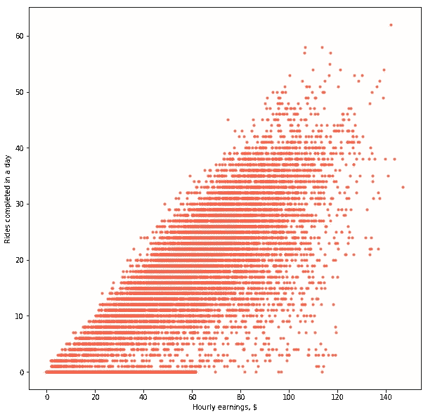
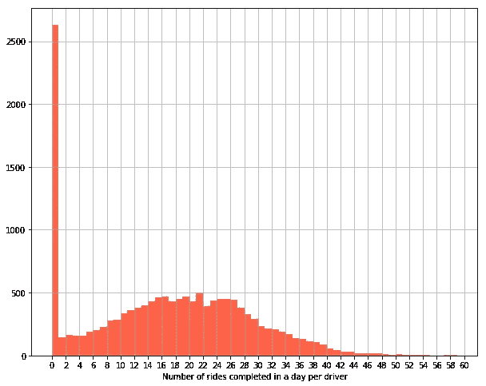
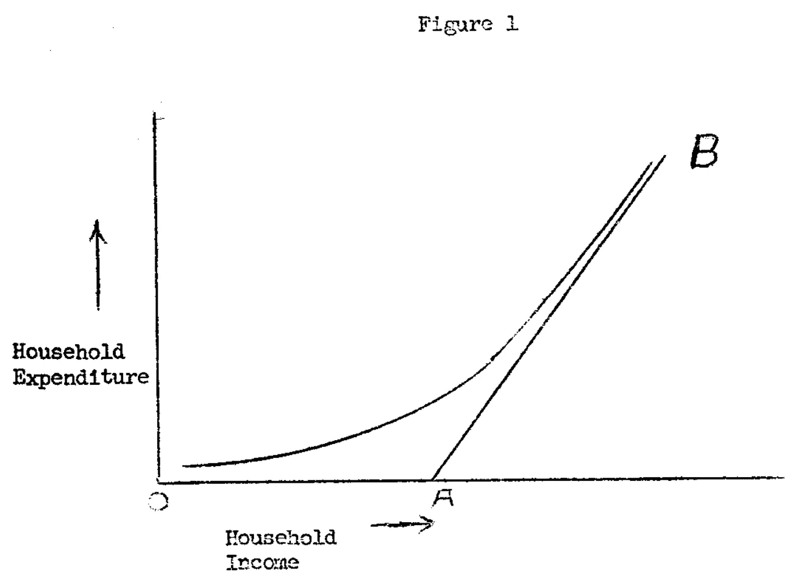
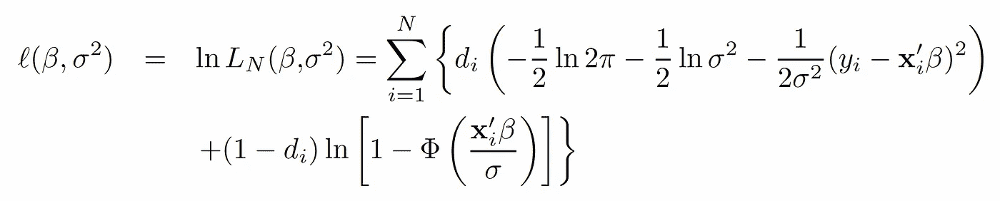
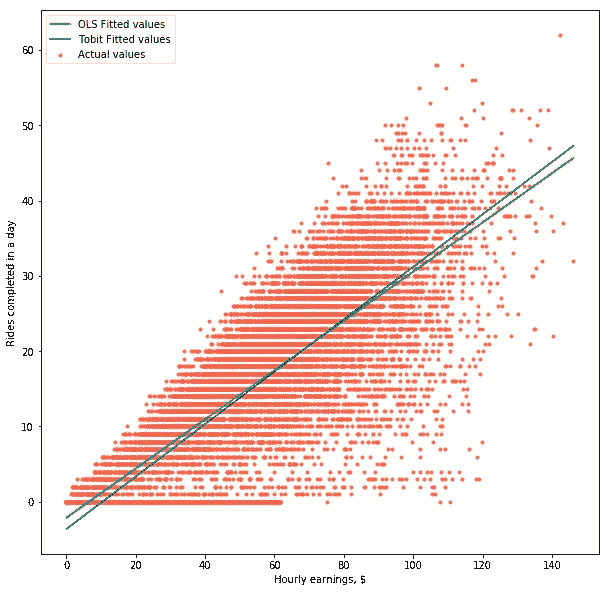
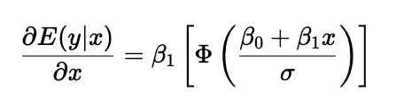

# 如何处理经过审查的数据

> 原文：<https://towardsdatascience.com/how-to-work-with-censored-data-26b7b6e2c7f>

## Tobit 模型在零工经济中的应用


[凯·皮尔格](https://unsplash.com/@kaip?utm_source=medium&utm_medium=referral)在 [Unsplash](https://unsplash.com?utm_source=medium&utm_medium=referral) 上的照片

线性回归可能是统计学习中最基础的话题。几乎所有机器学习、统计学、计量经济学的课程都是从普通最小二乘法的基础开始的。为什么不呢？它的定义方程*y =β*₀+*β₁**x+e*看起来足够简单。但是你为什么会关心 OLS 方程呢？诚然，在大型语言模型和无人驾驶汽车的时代，谈论线性回归听起来几乎很神秘。然而，正如我们将在本文中看到的，有时线性回归正是您所需要的。

线性回归的优点之一是可解释性。在我们上面的等式中，我们可以说 *x* 对 *y* 的影响是*，*平均而言， *β₁* ，考虑到一些随机噪声， *e* ，以及一个常数项， *β* ₀ *。然而，这个简单的解释是基于对数据如何产生的强有力的假设:在 *x* 和 *y* 之间的关系实际上是线性的吗？我们是否正确测量了 *x* 和 *y* ？我们看到的是目标人群的代表性样本吗？你可能已经猜到，在现实生活中，这些问题的答案往往是*不*。这就引出了我想在本文中展示的用例:删失数据的 Tobit 模型。*

# 零工经济遭遇数据审查

```
**Note**: This article uses simulated data. This data is meant to be representative of a real-life scenario, but it does not contain any real transactions from any company mentioned in the article nor does it reflect their actual state of operations.
```

假设你是 gig 行业公司的一名数据科学家。假设你的公司运行一个骑行应用，比如优步。(这适用于任何配对业务，从送餐到家政服务或运输。)您的经理想知道优惠价格对司机一天完成的乘车次数有什么影响。您有一个数据集，其中包含驾驶员在登录应用程序后一天内完成的乘车次数，包括那些没有完成任何乘车次数的驾驶员。该数据集还包含一个收入变量，该变量已按小时标准化，因此乘车次数具有可比性。“简单——你对自己说——我只要运行一个线性回归，然后取β值就行了”。你确定吗？看下面的图表。它显示了一个城市中有多少司机完成了每小时收入的函数。有什么奇怪的吗？



作为小时收入的函数完成的乘坐次数。来源:作者

乍一看，不尽然。虽然差异很大，但每小时收入和完成的乘坐次数之间似乎存在正相关关系。换句话说，如果司机得到更多的报酬，他们就会做更多的工作。经济学 101。但是让我们更深入地分析一下数据。看下面的直方图。它显示了每位驾驶员每天完成的乘坐次数的分布。如您所见，0 次乘车有大量积分。



每位驾驶员每天完成的乘坐次数分布。来源:作者

现在再来看看散点图。是不是感觉云*想让*继续在 x 轴的负侧？“但这没有意义——你想——你不可能在一天之内完成消极乘坐！”这是真的，你不能。但是你的数据也不一定是错误的。相反，这是经济学领域众所周知的现象。我们在这里看到的是一个数据审查的例子:司机只有在他们愿意以特定的速度完成一次骑行时才会完成。然而，其他一些司机会登录该应用程序，查看当时支付的费率，并决定不值得他们花时间。这些是零骑的。

# 托比特模型

> “什么叫少于一无所有？”威尔伯回答道。“我不认为有比一无所有更少的东西。无绝对是虚无的极限。这是你能出的最低价了。这是这条线的终点。有东西怎么会比没有东西少呢？如果有比无更少的东西，那么无就不是无，它会是有，即使只是很小的一点点。但是如果没有什么就是没有什么，那么没有什么就没有比它更少的东西。”
> ——*詹姆士·托宾 1958 年引用埃尔文·布鲁克斯·怀特的*《夏洛特的网》 *(1952)*

这个问题最早是由詹姆斯·罗宾提出的，他在 1958 年的论文[1]中研究了个人在耐用品上的支出。特别是，他注意到他的美国家庭样本显示，大多数美国家庭报告汽车或耐用品的零消费，因为他们买不起。换句话说，他的样本必然有一个零下限。他在论文的图 1 中巧妙地描述了这个问题，如下所示。



托宾(1958)的截图——复古，对吧？

请注意这对 OLS 估计量的重要影响。如果你要运行一个简单的线性回归，你的 *β₁* 会不一致，因为你观察到的数据在图表上不是线性分布的。如果我们取上面托宾的图像，你会想要一个从 a 到 b 的直线斜率的估计*β₁*——换句话说， *x* 和 *y* 之间的无条件平均关系。但是，因为您的数据是经过审查的，所以观察到的关系(条件平均值)不是线性的，而是类似于 O 和 b 之间的线。基本上，您的模型对于某些小时费率会看到太多的零，如果我们允许“负乘”来保持线性关系(即，如果我们让数据云继续进入 y 轴的负值)，则实际上应该是负值。因此，因为我们的样本在零行程时被删截，所以数据不允许我们画出代表 *x* 和 *y.* 之间线性关系的真正直线

在他的论文中，Tobin 提出了一种使用截尾数据估计 *β₁* 的方法，这种方法后来被称为 *Tobit* 模型。他的想法是通过考虑观测值被删截为 0(或任何其他值，从下往上)的概率来修正我们估计β₁的方法。你会问，为什么是托宾模型而不是托宾 T21 模型？这个术语是由另一位经济学家亚瑟·戈德伯格创造的。它是单词 *Tobit* and 和 *probit，*的组合，这是一种分类技术，用于计算观察结果被删截的概率。

虽然模型的推导超出了本文的范围，但是让我们快速地看一下这个问题的完整性。下面的函数显示了我们必须通过最大似然估计来解决的最大化问题，以得到我们真正的 *β₁* (在向量符号*中显示为β，*与 *β* ₀) *。*托宾解暗示误差是独立且正态分布的，标准差σ。在函数中，如果 *y = 0* ，则 *dᵢ* 取值为 0，否则取值为 1。因此，总和的左边(乘以 *dᵢ* ，在顶行)相当于 OLS 似然函数，而右边(乘以 *(1-dᵢ)* ，在底行)，说明观察值 *i* 被删除的概率。



Tobit 模型的似然函数。来源:作者

# 履行

虽然很酷，但据我所知，Python 中没有使用 Tobit 模型的 Python 包(至少我在`pip`或`conda`上没见过)。然而，我发现 [James Jensen 的实现](https://github.com/jamesdj)非常有用。我分叉了我自己的版本，你可以在这里找到，我强烈鼓励你也这样做！

还记得我说过，如果我们用简单的 OLS 估计，β₁会不一致吗？用数学术语来说，这意味着我们对 *β* 的估计不会收敛到它的实际值。更简单地说，我们的线性关系的斜率将是 off。为了说明这一点，下图中的绿线显示了我们的驱动程序示例中的 OLS 拟合值。另一方面，使用 Tobit 模型估算 *β* 给出了一个稍高的值(`0.35`对`0.33`)，用蓝线表示。



小时收入和乘坐次数之间的最佳拟合线已完成:OLS(绿色)和托比特模型(蓝色)。来源:作者

OLS 估计值和托比特估计值之间的差异会因您的模型规格而异，有时会更大，有时会更小。请注意，我们的等式中没有包括任何控制变量，也没有任何可靠的识别策略来支持它。这意味着我们的模型可以改进，这可能会影响我们的估计。因此，我们不应该试图从这些特定的数字中推导出任何意义。

# 边际效应

现在你已经运行了你的 Tobit 模型，并得出了对 *β₁、*的估计，你可能会忍不住说，每增加一美元，每位车手将完成 *β₁* 更多的旅程。但事情没这么简单！我们来看看为什么。

一般来说，我们的目的是估计收入变化对完成的游乐设施的平均影响。这就是经济学家所说的“边际效应”。虽然我们将跳过数学细节，但这相当于等式中 *y* (乘车次数)相对于 *x* (收益)的导数。在 OLS 模型中，这就是简单的 *β₁.*但是，在 Tobit 模型中， *x* 对 *y* 的边际效应稍微复杂一些。因为我们在推导 *β₁* 的过程中包括了一个观察被删节的概率，所以我们在解释它的时候也需要考虑它。



Tobit 模型中 x 对 y 的边际效应。来源:作者

上面的等式显示了收入的变化如何转化为平均完成的乘坐次数——因此在左手边有条件的期望。在右边，我们得到了我们的 *β₁* ，乘以正态分布的累积分布函数(CDF，用φ表示)，在我们的模型对 *y、*的估计值处评估，即*β*₀+*β₁**x*，并通过我们的误差标准偏差σ归一化。

我上面描述的可能听起来很复杂，但是你会发现实际上并不复杂。边际效应等式的意思是，每小时收入变化的平均影响确实取决于β₁.然而，该系数由个人愿意以当前小时工资率工作的概率加权，如 CDF 所示。换句话说，提供额外一美元的边际效应将会不同，这取决于那次乘坐最初是 10 美元还是 40 美元。如果你想一想，这是有道理的:有人为 40 美元工作的概率可能高于为 10 美元工作的概率！

为了了解这在实践中是如何工作的，让我们回到我们的 Python 实现。为了计算边际效应，我创建了一个名为`margins`的函数，它建立在詹姆斯·詹森的解决方案之上。根据我们估计的`0.35`的 *β₁* 和 10 美元的起始时薪，估计的边际效应将是`0.17`。然而，将起步价改为 40 美元会产生边际效应`0.32`。如果我们把每小时的收入进一步提高，比如说 100 美元，边际效应已经是`0.35`。如你所见，收入越高，我们的边际效应就越接近 *β₁，*因为司机更有可能愿意为了更高的时薪完成一次驾驶。

# 结论

在这篇文章中，我们已经看到，如果我们的观察数据被审查，一些表面上简单的回归问题实际上可能变得棘手。对于零工经济行业的公司来说，情况就是这样，他们可能想知道给员工提供多少工资来增加他们在平台上的参与度。为了解释这个删失数据问题，我们引入了 Tobit 模型，这是一个由詹姆士·托宾在 1958 年开发的计量经济学模型。

你可以在这个 [Github repo](https://github.com/AlvaroCorrales/tobit) 中找到跟随这篇文章的代码。

# 参考

[1]托宾·詹姆斯(1958)。[“有限因变量的关系估计”](http://cowles.yale.edu/sites/default/files/files/pub/d00/d0003-r.pdf) (PDF)。*计量经济学*。**26**(1):24–36。