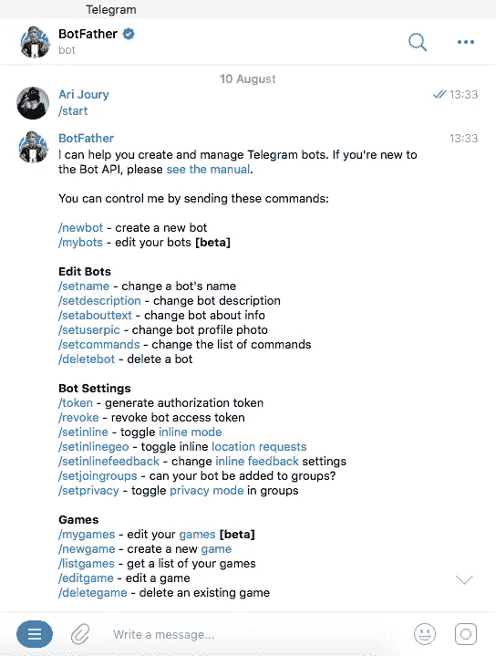
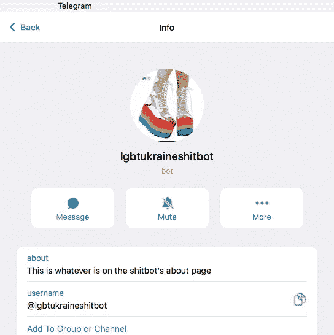
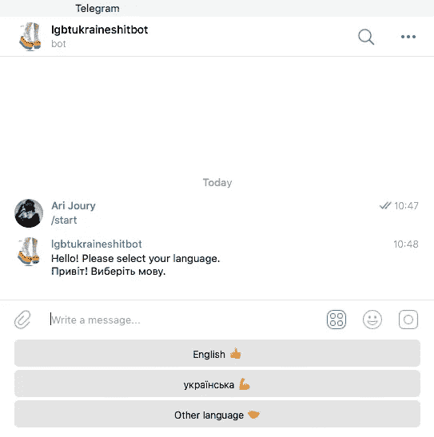

# 如何用 Python 写一个电报机器人

> 原文：<https://towardsdatascience.com/how-to-write-a-telegram-bot-with-python-8c08099057a8>

## 没有比这更容易的了


Python + Telegram =一个胜利的组合！作者图片

 我 不记得上一次遇到一个使用零消息服务的人。一些人使用 WhatsApp 或 Signal，一些人使用 Twitter DMs 或 LinkedIn messages，其他人再次使用 Instagram 或抖音。

我的几个朋友没有社交媒体，但即使是他们也使用老式短信。信息传递很重要。

我的设备上有几个信使，但我最喜欢的肯定是电报。它很好用，你可以参加大型聊天小组，隐私得到很好的保证，你可以关注人们的公共频道，最棒的是，它对 gif 和愚蠢的噱头有令人难以置信的支持。

Telegram 基本上类似于 WhatsApp，但在开发方面领先两年。它是独立的，没有像 Meta 这样的大型科技巨头的氛围。

我想造电报机器人的原因，简单来说就是乌克兰战争。在东欧，电报是使用最多的信使(这些家伙品味不错！)，我是志愿者和非政府组织网络的一员，他们帮助受战争影响的平民获得食物、医疗用品和心理支持等基本物资。

电报机器人将成为受影响个人的生命线，并帮助我们简化工作，以便他们需要的东西尽快到达。

在战争开始时，我们已经建立了一个非常基本的电报机器人，它与后端客户支持系统集成在一起。这意味着我们团队的所有成员都能够访问与机器人的聊天，并努力让人们得到他们需要的东西。

在早期，这已经足够好了，因为每个人的情况都是独特而复杂的，需要人的直接参与。事实上，它不是一个真正的机器人，它是一种人类客户支持系统。

随着战争的持续，人们的要求越来越相似。许多人找到了一个安全的住处，但需要经济援助来购买食物或修缮房屋。这些不再是复杂的决定，而是相对简单的行动过程。

于是，我心中的工程师觉醒了，他说:*让我们自动化吧！*

# 如何在 Telegram 中创建机器人

首先，你需要联系电报员。如果你有电报账号，只需搜索 BotFather，按`/start`。这是你将会看到的:



作者截图。

然后，你猜对了，用`/newbot`创建一个新的机器人。机器人父亲会询问这个机器人的名字(必须以“bot”结尾)，并给你一个机器人的令牌。

这个令牌是由字母和数字组成的序列，你有责任保护它的安全。任何拥有令牌的人都可以控制这个机器人，所以让它远离窥探的眼睛。

然后，通过`/setdescription`，用户可以设置在用户按下`/start`之前出现的描述。它可能包含如何使用机器人的基本说明。

使用`/setabouttext`，用户可以更改出现在机器人页面上的文本。就像你的电报状态线。与`/setuserpic`一个改变个人资料照片。

这是结果看起来像什么(对不起，低劣的机器人名称；是原型！):



作者截图。

一旦这样做了，你就可以使用 Python 并研究机器人的内部逻辑了！

# Python 如何升级电报机器人

有几个 Python 包[让编写电报机器人变得非常简单。也有其他语言的软件包。但是 Python 是我的日常编程语言，所以我决定坚持使用它。](https://core.telegram.org/bots/samples#python)

## 基本设置

我选择 AIOGram 包只是因为似乎有足够的教程来帮助我开始使用它。其他软件包可能更复杂，但我想要一些足够简单的东西，我最多在几个下午就能完成一些基本代码。

在创建了一个新的 Python 文件之后，我用我需要的 AIOGram 片段和一些关于机器人的基本信息填充了文件头:

首先，出于安全原因，我已经更改了这个文件中的 bot 令牌。我不会把我对机器人的控制权交给整个互联网😯

来自 AIOGram 的部分是帮助与电报机器人 API 交互的`Bot`,处理所有消息的`Dispatcher`,确保定期检查消息状态的`executor`,以及我们可能需要控制用户体验的`types`对象。

在这些`types`中，我们需要为用户的响应添加自定义键盘的`ReplyKeyboardMarkup`，以及指定哪些按钮将进入自定义键盘的`KeyboardButton`。

原则上，AIOGram 有更多的部件，以及更复杂的键盘。还有一个内部内存处理器，它应该比我用来保存用户响应的`answers = []`数组更有效。

但是我想快速地写一些东西，我们的机器人不会被每天成千上万的请求轰炸。这就是我现在要做的。

## 内在逻辑

许多使用机器人的人更喜欢用乌克兰语交谈。所以我们的机器人会问的第一个问题是他们更喜欢哪种语言。用户可以选择一种语言，如下所示:



作者截图。

在我的代码中，我需要创建上面显示的自定义键盘，并且我需要告诉机器人在用户一按下`/start`就询问语言。看起来是这样的:

你可以看到不同的键盘按钮，以及它们是如何在`ReplyKeyboardMarkup`中组合在一起的。选项`resize_keyboard=True`确保它总是看起来很好，选项`one_time_keyboard=True`确保一旦不再需要它就消失。

人们可以将命令`.add(lang1).add(lang2).add(lang3)`链接起来，使按钮一个接一个地出现，或者可以编写`.add(lang1,lang2,lang3)`使按钮一个接一个地出现。

Bot 消息是通过使用函数装饰器中的`message_handler`来启动的。人们可以回复命令或特定的消息。

我还添加了一条`help`消息，它对命令`/help`做出反应，以防用户不确定他们在做什么或者意外地开始使用机器人。

如果用户在语言提示后选择了英语，我们接下来会询问他们需要什么。因此，我们需要一个新的键盘，我们需要一个对`English`答案做出反应的消息处理器。看起来是这样的:

当然，如果用户选择乌克兰语作为语言，也会发生同样的情况——对话将只使用乌克兰语。

键盘按钮中的傻表情符号不是一个噱头。在测试期间，我很快意识到这个问题*你需要什么？*出现在用户可能在回答中提到*英语*的任何时候，无论是现在还是以后。在最坏的情况下，这将使机器人循环运行并迷惑用户，这显然不是我想要的。

我认为用户回复英语是不太可能的👍在任何回答时他们都在键入自由文本，所以这就是输入键盘按钮的内容，而`regexp`会触发问题*你需要什么？*

所有其他键盘按钮和触发问题同上。

当然有更好的解决方案，但是我想要一个快速而有效的版本。

从这个问题开始，我还将所有回答存储在一个名为`answers`的数组中，因为有时机器人需要组合用户提供的不同信息，以便将他们引导到满足他们需求的正确的非政府组织。

逻辑是这样的(整个脚本大约有 600 行长)，但是我会把剩下的留给你。

# 部署机器人

现在，我们需要做的就是运行脚本。这和进入一样容易

```
python3 lgbtukraineshitbot.py
```

当然是在你的终端里，同时把我的文件名换成你的。

只有一个问题。我的电脑很旧，并不总是有一个最佳的响应时间，我在晚上关机。这对于应该全天候可用的应急机器人来说并不理想。

所以我把这个机器人部署在云服务上。我选择了 Heroku，因为那里也是我们处理后端软件的地方。但是你可以使用任何你喜欢的云服务。

在 Heroku 中，我需要创建一个新项目，添加 Python 脚本，将 buildpack 设置为 Python，并添加上面的代码行，以便 Heroku 知道如何运行脚本。我不会详细说明这一点，因为不同的云服务会有所不同，而且他们的文档通常都很好。

我使用的是 Heroku 免费版的有限功能，因为它还是一个原型。好奇的读者可能已经注意到了，我的机器人仍然没有一直响应，但这比在我的笔记本电脑上运行要好。

一旦我们将这些变化部署到人们正在使用的主要机器人上，并将其与我们的后端系统集成，我们将有更少的工作要做——脚本将完成所有多余的任务，当一个人的情况复杂到有必要时，我们可以进行干预。而且机器人会反应更快，因为不像人类，它不需要睡觉和休息。

# 吹牛

许多人使用信使，但没有多少人知道如何在需要时自动对话。

这是软件开发者享有的众多特权之一。我们像其他人一样与软件互动，但我们也对它有足够深入的了解，可以在它的基础上进行构建。

对于我们为应对战争而构建的 bot，我希望它能为我们的团队节省大量时间，并加速它为我们的用户获得帮助所需的时间。

它不是最复杂的聊天机器人，但它能完成任务。这才是最重要的。

当我有更多的时间时，我可能会为世界上的其他地区开发类似这个机器人的东西。乌克兰不是唯一陷入严重困境的国家；我想到了巴基斯坦、阿富汗和埃塞俄比亚等许多国家。

愿未来是快速的、自动化的、有益的。

*成为* [*中等会员*](https://arijoury.medium.com/membership) *对我的内容进行完全访问。*