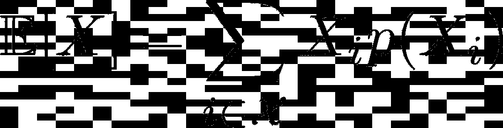
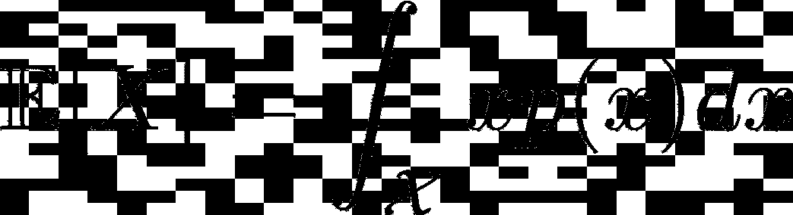

# 如何用 Python 写出更好的科学代码

> 原文：<https://towardsdatascience.com/how-to-write-better-scientific-code-in-python-9349adc7c7e2>

## 关于如何使用 python 和 numpy 编写更好的数据科学代码的一些技巧。我们用一个定制的案例来展示好的模式。


晚上拍照取乐，波兰 2021。(作者供图)。

# 介绍

任何科学工作的很大一部分在于编写代码。无论是典型的机器学习建模、分析，还是参与数据项目，都有很大一部分时间用于构建新功能的原型。由于是探索性的，预计计划的几个部分将被替换或修改，经常超出最初的计划。

与“消费者软件”不同，变更通常不是由客户的需求引起的，而是由过程的结果引起的。由于这个原因，如果实验证据表明有不同的路径，那么以不需要“完全重建”的方式来设计它是非常有价值的。

编写科学代码伴随着两个(额外的)特殊挑战:第一个与数学错误有关。计算中的错误通常很难追踪，尤其是当代码在语义上是正确的时候。没有发现错误。不会引发任何异常。一切看起来都不错，但(数字)结果是错的。特别是，在实现概率模型时，结果有时可能看起来不错，这取决于一些初始条件或随机因素。

第二个来自前面描述的事实。总会有实验部分，而且一直在变。所以关键是要设计好每一个组件，这样大部分工作才能留下来，作为下一阶段开发的坚如磐石的基础。

在本文中，我们将重点放在可以使代码更健壮、更容易理解、总体上更容易处理的模式上。您将看到简单的改进是如何导致更多的可重用代码和更少的错误的。

# 玩具任务

为了便于演示，我们的任务是计算随机过程结果的**期望值**。数学上，它归结为这个公式:



其中是概率质量函数(PMC)，或者对于连续变量:



其中是概率密度函数(PDF)。

正如你可能想知道的，这里的挑战是你想让它与任何*分布一起工作:连续的或离散的。或者如果不合理，您希望至少认识到问题的本质，这样您就可以顺利地修改代码。*

# 错误代码——起点

让我们从一个不太好的代码开始。说你想掷六面骰子。由于每个结果的概率相等，这归结为计算采样结果的平均值。

```
import random
import statistics

def die(sides = 6):
    return random.randint(1, sides)

def expected_value(n_samples):
    samples = [die() for _ in range(n_samples)]
    return statistics.mean(samples)
```

这个代码有什么问题？几件事…

首先，`die`函数一次返回一个样本。需要调用`N`次才能得到`N`样本，速度很慢。

其次，`expected_value`函数强烈依赖于产生样本的`die`函数。很明显，一旦你考虑使用不同的模具，比如 12 面的。使用这种设计，您需要“打开”T2 来接受一个额外的参数 T3，只需将它传递给 T4 来扩展它，使其适用于更一般的情况。虽然这可以工作，但它使`expected_value`的*接口*违反直觉，但解决方案仍然依赖于使用`die`作为样本源，因此很难考虑其他分布。

# 补救措施…

让我们考虑一下您的选择:

## 想法一

您可以使用外部变量来存储样本:

```
def expected_value(samples):
    return statistics.mean(samples)

samples = [die(12) for _ in range(n_samples)]

ev = expected_value(samples)
```

这是显而易见的，但是你只是把问题移到了别处…现在，`samples`成为了一个新的实体，存储数据(甚至是非常大的数据)，并且它是相当匿名的。`expected_value`函数期望接收它，但是准备它是你的责任。

## 想法二

另一种方法是通过将`die`作为对象传递给`expected_value`来将它保存在内部。

```
from functools import partial

twelve_sided_die = partial(die, 12)

def expected_values(die, n_samples):
    samples = [die() for _ in range(n_samples)]
    return statistics.mean(samples)

ev = expected_values(twelve_sided_die, 10000)
```

该想法使用准备好的`die`的“版本”,并让`expected_value`将其用作样本源。然而，一个新的问题出现了:`expected_value`只与`die`兼容。它不能用任何其他“样本生成器”计算结果，或者至少不能保证它能正确地这样做。

## 想法三

第三个想法是在更抽象的层面上认识问题，设计更好的界面。

在抽象层次上，我们有两个概念:

*   存在一个**概率分布**，我们可以从中取样。(可以是骰子、硬币、正态分布——无所谓)。
*   有一个**数学运算**消耗和转换数据。(例如，计算平均值、方差等。).

让我们更加关注如何构建正确的抽象以及如何控制它们的相互兼容性。

# 分布(数据)

数学上，概率分布可以是函数——连续的或离散的，有限的或无限的，从中我们可以*抽取样本。*根据问题的不同，该功能的“处方”可能会有很大不同。我们可以使用“现有”公式，如高斯或泊松分布，但它也可以是从直方图等导出的“自定义”公式。

考虑到这一点，让我们建立以下抽象:

```
from abc import ABC, abstractmethod

class Distribution(ABC):

    @abstractmethod
    def sample(self):
        ...
```

# 履行

由于`@abstractmethod`，我们的发行版强制要求我们对从这个抽象派生的任何子类实现`sample`方法。对于我们的死亡，这可以是:

```
import numpy as np

class Die(Distribution):
    def __init__(self, sides = 6):
        self.sides = sides

    def sample(self, n_samples):
        return np.random.randint(1, self.sides + 1, size=n_samples)
```

这里，通过调用特定于掷骰子的方法`sample`:`Die(12).sample(10000)`来交付样本。此外，由于`numpy`，我们可以通过用`np.ndarray`替换列表理解来非常快速地创建大量数据。

事实上，事情可以进一步改善。目前，调用`Die()`会返回类似这样的`<__main__.Die at 0x7f43f4448400>`的东西，这并不具有信息性。同样`Die() == Die()`的值为`False`，对于 python 来说，它们是同一个类的两个不同的对象实例。要修复它，我们需要实现另外两个方法:

```
def __repr__(self):
        return f"{self.__class__.__name__}(sides={self.sides})"

    def __eq__(self, other):
        if isinstance(other, self.__class__):
            return self.sides == other.sides
        return False
```

`__repr__`方法使得对象的渲染很好看，只有骰子“等边”的情况下`__eq__`才会返回`True`。

# 数据类

每次实现这四种方法可能会很繁琐。此外，`Die`的当前实现并不能防止对象的改变，即使是偶然的，通过像`die.sides = 20`这样将属性分配给一个已存在的对象。

因此，我们可以使用 python 的`dataclasses`重新定义`Die`类。

```
from dataclasses import dataclass

@dataclass(frozen=True)
class Die(Distribution):
    sides: int = 6

    def sample(self, n):
        return np.random.randint(1, self.sides + 1, size=n)
```

这个例子的行为和前面的例子是一样的。此外，设置`frozen=True`，给`die.sides`分配一个新值将引发一个异常。如果我们想要一个新的骰子，我们应该创建一个新的对象。

现在，我们的`expected_value`函数可能会将`die`作为一个分布对象，并通过调用它的`sample`方法来进行计算。

```
def expected_value(distribution, n):
    return distribution.sample(n=n).mean()
```

# 打字

上面的例子很简洁。我们确切地知道`expected_value`是做什么的，并且很容易测试。然而，n 面骰子并不是我们想要计算期望值的唯一分布。例如，对于掷硬币来说，结果不是数字的(除非我们建立一个约定并坚持下去)。自然，提供一些关于哪些接口可以一起使用以及如何使用的提示是有意义的。

对于像 python 这样的*动态类型的*语言，你不必坚持变量的类型。然而，使用各种 ide 和工具，如`mypy`，键入可以帮助您发现潜在的失败点，并使代码更加透明。

让我们使用`typing`重新定义我们的类，并创建两个更具体的发行版。

```
from typing import Generic, Sequence, TypeVar

D = TypeVar("D")

class Distribution(ABC, Generic[D]):

    @abstractmethod
    def sample(self, n: int) -> Sequence[D]:
        ...

@dataclass(frozen=True)
class Die(Distribution[int]):
    sides: int = 6

    def sample(self, n: int) -> Sequence[int]:
        return np.random.randint(1, self.sides + 1, size=n)

@dataclass(frozen=True):
class Coin(Distribution[str]):
    outcomes: tuple = ("H", "T")
    fairness: float = 0.5

    def sample(self, n: int) -> Sequence[str]:
        p = (self.fairness, 1.0 - self.fairness)
        return np.random.choice(self.outcomes, size=n, p=p)

@dataclass(frozen=True):
class Gaussian(Distribution[float]):
    mu: float = 0.0
    sigma: float = 1.0

    def sample(self, n: int) -> Sequence[float]:
        np.random.normal(loc=self.mu, scale=self.sigma, size=n)
```

这里发生了几件事。感谢`D = TypeVar("D")`，我们现在可以定义一个新的变量类型，通过它我们可以参数化每个分布的类型。你可以注意到`Distribution`不仅继承了抽象基类，还继承了`Generic[D]`，这也将它变成了一个新的(参数化的)类型。现在，它变成了一种身份，构成了一种新的数据类型。

每个版本的`sample`都被期望返回一个特定类型的序列，该序列对每个单独的发行版的上下文有意义。这样，我们就有了一个参数化的统一界面。我们可以用这个来确保`expected_value`的正确行为:

```
def expected_value(
    distribution: Distribution[float | int], n: int
) -> float:
    return distribution.sample(n=n).mean()
```

虽然传递例如`die = Die()`或`gaussian = Gaussian()`到`expected_value`将会工作(因为`int`和`float`都是数字)，但是传递`coin = Coin()`将会被例如`mypy`标记出来，声明

```
> error: Argument 1 to "expected_value" has incompatible type "Coin";
> expected "Distribution[Union[float, int]]"
```

这可以在我们运行代码之前给我们一个早期的警告。

# 提高纯度

正如你所看到的，使用`typing`设计接口有助于形式化意图并尽早发现错误。你甚至可以通过利用`numpy`的`dtype`把它带到下一个层次。这样，您不仅可以确保不同的元素相互匹配，还可以更加关注数据的内存占用。

例如:

```
import numpy.typing as npt

class Distribution(ABC, Generic[D]):

    @abstractmethod
    def sample(self, n: int) -> np.NDArray[np.generic]:
        ...

class Die(Distrinution[int]):
    sides: int = 6

    def sample(self, n: int) -> npt.NDArray[np.uint8]:
        return np.random.randint(
            1, self.sides + 1, size=n, dtype=np.uint8
        )
```

这样，如果`die.sample`方法返回不同于严格无符号 8 位整数的数字，您甚至会得到通知。问题是你想不想去那么深的地方？这是值得思考的事情。

# 计算

让我们回到设计计算部分。到目前为止，我们已经准备好使用数字分布。自然，我们可以计算`Die`和`Gaussian`的期望值，但不能计算`Coin`的期望值。目前的设计不会。

要解决这个问题，有两个选择:

*   我们可以通过映射创建一个*代理*分布，例如`("H", "T") -> (0, 1)`，或者
*   我们在`expected_value`中加入了一个映射，给出了一个可能的“适配器”。

第一种方法创造了一个人造物体，它的想法依赖于惯例。它不阻止任何人用`("H", "T") -> (1, 0)`定义另一个代理，导致一个难以察觉的 bug。

相反，我们可以修改`expected_value`，让它有可能使用定制适配器。

```
def expected_value(
    d: Distribution[D],
    f: Callable[[D], Any] = lambda x: x,
    n: int = 1000
) -> float:
    return np.mean(np.apply_along_axis(f, axis=0, arr=d.sample(n)))
```

`expected_value`的第二个参数是可调用的(一个函数)，我们可以随意使用它来翻译结果，例如`Coin()`分布。然而，默认情况下，它将保持结果不变。

```
die = Die(12)
expected_values(die, n=10000)

gaussian = Gaussian(mu=4.0, sigma=2.0)
expected_value(gaussian, n=100000)

# but
coin = Coin(fairness=0.75)
expected_value(coin, f=lambda x: np.where(x == "H", 1.0, 0.0))
```

在这里，我们不仅避免了创建代理分布，还设法避免将`expected_value`与任何特定的数据转换方式联系起来。`expected_value`函数只做它承诺要做的事情:计算期望值。如果需要任何调整或转换，则由外部提供。注意，这里我们还有一个选项:我们可以定义一个命名函数(例如`coin_conversion`)，以防我们计划重用它，或者当一个单独的定义没有增加价值时坚持使用`lambda`。

# 合成和迭代

事实证明，抽象出数学计算是非常有用的，尤其是在设计迭代算法时。通常，除了主要的计算，我们还必须关注一些附带的结果，比如收敛、提前停止(最大迭代次数)、度量等等。

让我们以常数为例。从数学上讲，我们可以通过以下限制来获得它的值:


越高，近似值越精确。

怎样才能充分解决？

## 不是最好的方式…

先说一个穷人用循环的方法。

```
def approximate_e(
    initial_guess: float,
    max_iter: int = 10,
    epsilon: float = 0.01
) -> float:
    e_value = initial_guess
    for n in range(1, max_iter + 1):
        new_e_value = (1.0 + 1.0 / n) ** n
        if abs(new_e_value - e_value) < epsilon:
            return new_e_value
        e_value = new_e_value

    return new_e_value
```

同样，这种方法有什么问题？

首先，该函数做三件事，而不是一件。行`8.`是计算的绝对本质。然而，由于早期停止和收敛条件，我们留下了大量的代码开销，这与实际计算紧密相关。虽然这两个条件看起来更一般，但如果我们选择替换近似值的主题(例如，替换为平方根)，我们将不得不复制粘贴这些额外的代码，并确保它不会破坏新的算法。

其次，关于参数化这两个条件，我们唯一的选择是硬编码`max_iter`和`epsilon`的值，或者允许用户提供它们作为参数。它破坏了界面，使测试更加困难。

最后，算法“急切地”生成数据。它不是专注于数学并“在被问及时”提供数值，而是将数据抛给你。对于大量数据，这可能会导致内存问题。

# 计算上的抽象

现在，让我们通过划分不同部分的责任来同时解决这三个问题。我们有三样东西:

*   我们期望返回正确的数字(实际的计算)，
*   如果通过了足够数量的迭代，就停止该过程(提前停止)，
*   如果数值不再显著提高(收敛)，则停止该过程。

```
from typing import Iterator
import itertools

def approximate_e() -> Iterator[float]:
    n = 1
    while True:
        yield (1.0 + 1.0 / n) ** n
        n += 1

def early_stop(
    values: Iterator[float], max_iter: int = 100
) -> Iterator[float]:
    return itertools.islice(values, max_iter)

def convergence(
    values: Iterator[float], epsilon: float = 0.01
) -> Iterator[float]:
    for a, b in itertools.pairwise(values):
        yield a

        if (a - b) < epsilon:
            break
```

这种设计使用迭代器，迭代器实现了“懒惰”加载。数据项只有在被请求时才被一个接一个地返回(因此有了关键字`yield`)。多亏了这一点，我们(几乎)不必担心记忆。

此外，这三种功能中的每一种都可以单独存在。它们有特定的接口，可以单独进行单元测试。

最后(也是最重要的)，最后的结果可以通过*把*链接在一起得到！

```
values = approximate_e()
values = early_stop(values, max_iter=50)
values = convergence(values, epsilon=0.001)

for value in values:
    print("e becomes:", value)
```

## 旧 python

对于 3.10 之前的 python，可以将`itertools.pairwise`写成:

```
def pairwise(values: Iterator[D]) -> Iterator[Tuple[D, D]]:
    a = next(values, None)
    if a is None:
        return
    for b in values:
        yield a, b
        a = b
```

# 结论

科学编程带来了额外的挑战。这是一个令人兴奋的学科，但是陷阱的数量似乎至少与问题的复杂性成二次方增长。

在本文中，我们讨论了似乎在每个科学编程任务中反复出现的两个主要组成部分:数据和计算。希望通过正确的方式抽象它们，你不仅可以提高代码的效率，减少错误，还可以让编码成为一种更好的体验。为了你和你的团队！

*原载于*[*https://zerowithdot.com*](https://zerowithdot.com/improve-data-science-code/)*。*