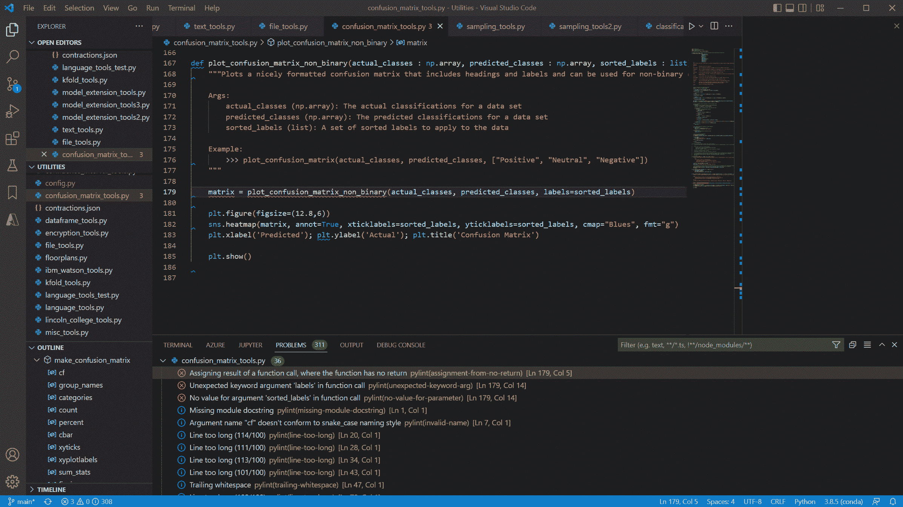
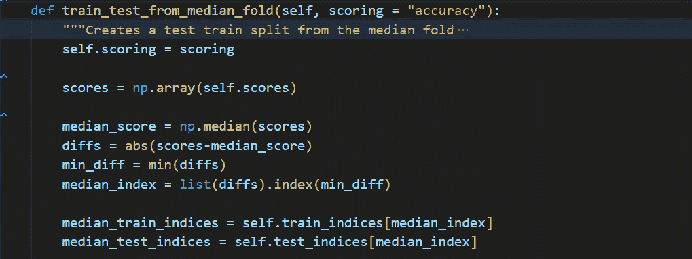
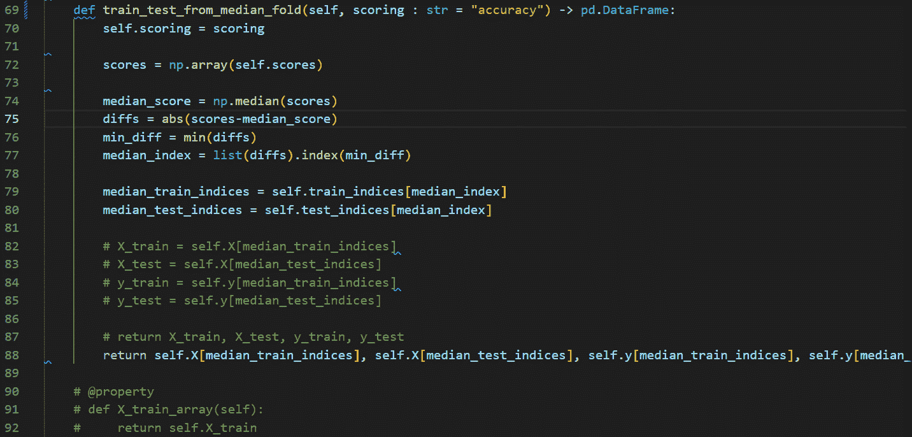
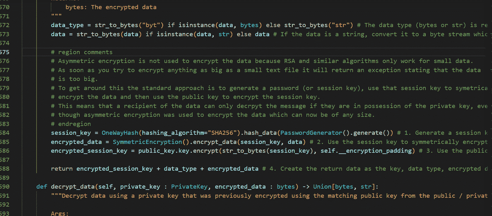
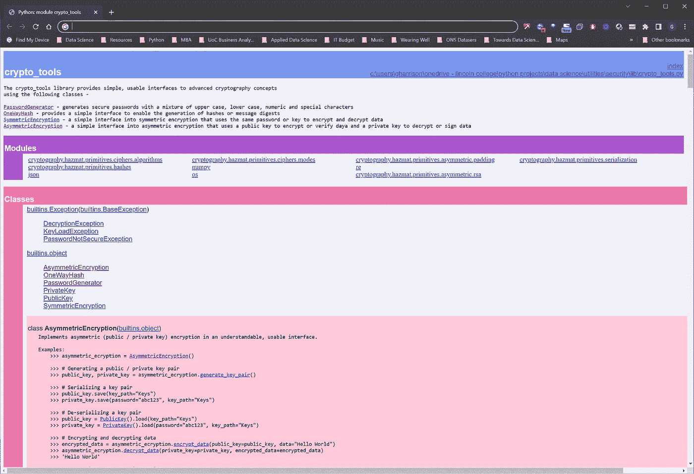
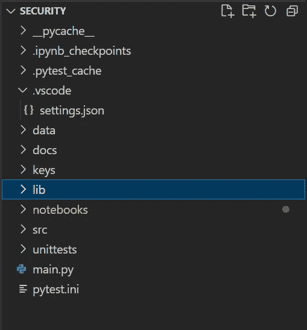
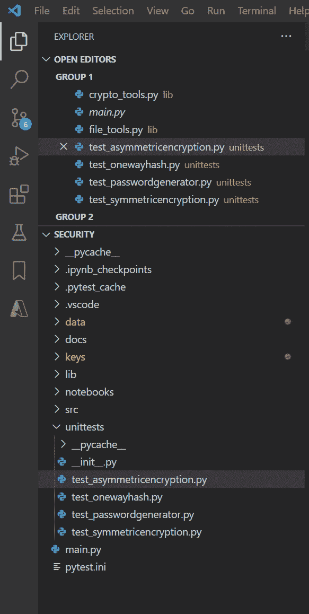

# 像专家一样写代码的 10 个简单技巧

> 原文：<https://towardsdatascience.com/how-to-write-code-like-a-pro-659760804724>

## 帮助你按照专业标准编写代码的 10 个简单技巧


凯文·Ku 在 [Unsplash](https://unsplash.com/s/photos/program-code?utm_source=unsplash&utm_medium=referral&utm_content=creditCopyText) 上的照片

# 背景

我已经写了 20 年的代码，在这段时间里，我建立了一套 10 条原则，我相信程序员、开发人员和数据科学家可以采用这些原则来帮助他们按照专业标准编写代码。

这些方法通常适用于任何软件开发环境，但是由于这些天我所有的编码都是在 VS 代码开发环境中用 Python 语言编写的，所以我将重点放在这些工具上，以获得特定的示例。

在我们深入了解技巧之前，请考虑…

[通过我的推荐链接](https://grahamharrison-86487.medium.com/membership)加入 Medium(如果你使用这个链接注册，我将收取一定比例的费用)。

每当我发表新故事时，订阅一封免费电子邮件。

[快速浏览我之前的文章](https://grahamharrison-86487.medium.com/)。

[下载我的免费战略数据驱动决策框架](https://relentless-originator-3199.ck.page/5f4857fd12)。

## 1.林挺

帮助编写专业代码的第一个简单方法是使用林挺。

> “林挺强调你的 Python 源代码中的语法和风格问题，这通常有助于你识别和纠正微妙的编程错误或可能导致错误的非常规编码实践。”([https://code.visualstudio.com/docs/python/linting#](https://code.visualstudio.com/docs/python/linting))

要在 VS 代码中启动林挺，使用 Ctrl+Shift+P 进入命令面板，输入“选择 linter”，然后选择你想要使用的 Linter。

有一系列的 linters 可用，选择将取决于个人和团队的偏好，但我个人最喜欢的是“pylint ”,因为我喜欢它呈现错误和警告的方式，也因为它易于设置和配置。

一旦打开林挺，VS 代码将在问题窗口中显示建议，当你编写新代码和改进现有代码时，它将动态更新



作者图片

解决所有的 pylint 错误和警告将很快使您的代码反映专业的、一致的标准并遵循最佳实践。

## 2.注释、类型提示和文档

让我们从类型提示开始。Python 是一种“动态类型”语言。变量的类型不是必需的，大多数在线例子省略了变量的类型、参数和返回类型。

缺点是客户端或调用者不容易知道函数期望的是什么类型。

但是，如果可选地将变量类型添加到代码中，可读性和可理解性会显著提高，因为客户端或调用者会立即知道函数期望的是什么类型…



作者图片

一旦包含了类型提示，下一步就是对代码进行良好的注释和记录，这是专业代码与众不同的地方之一。

除了提高可读性和可维护性之外，当您添加注释、类型提示和文档时，它使您从不同的角度思考您的代码，从而导致反思性的自我反馈和改进。

一旦在 VS 代码中安装了 docString 扩展，只需在函数声明下按 return 键，输入三个双引号，然后填写为您创建的存根…



作者图片

将一般注释留在代码体中以增加可理解性和可维护性也很重要，将注释块包装在一个区域中可以使它们在 VS 代码编辑器中整齐地折叠起来…



作者图片

当类型提示和文档字符串在整个模块中完成后，创建一整套专业的文档就变得非常容易了。简单地调用 pydoc 如下…

```
python -m pydoc -w "..\lib\crypto_tools.py"
```

…将会自动创建一个文档网页…



作者图片

## 3.项目结构

许多较小的项目可以在包含运行项目所需的所有代码和配置文件的单个文件夹中创建。

然而，用不了多久，一个文件夹就会变成一个无组织的垃圾场，导致混乱和不专业的项目。

我已经看到了几个关于 Python 项目的标准文件夹布局的建议，并得出结论，只要它提供了一个合理的、逻辑的、直观的、离散的和一致的项目资源组织，选择哪一个并不重要。

这是我在项目中采用的标准…



作者图片

“数据”子文件夹包含与项目相关的任何数据文件，如果我的项目清理或转换数据，我通常会添加“输入”和“输出”子文件夹。

“docs”是我存储 pydoc 从 docStrings 和一个批处理文件创建的文档的地方，该批处理文件调用 pydoc 来实现一次点击文档制作。

“keys”是这个特殊项目的一个特殊项目，它表明我不反对根据项目的需要扩展我的标准方法。

“lib”是我存储任何可重用代码库的地方。在这种情况下，我将所有具有潜在未来重用价值的代码移到 crypto_tools.py 中，并对其进行重构，以最大化可用性和可维护性。

“笔记本”是所有 Jupyter 笔记本被分开存放的地方。我通常使用笔记本来创建一个样本用户界面，并演示一个项目是如何工作和使用的。

“src”是我存储其他不可重用的 Python 代码的地方。

“单元测试”是存储所有 pytest 单元测试的地方。在一个大中型项目中，可能会有许多单元测试文件，这些文件确实需要移动到一个离散的位置以保持整洁。这需要一点额外的配置，我将在以后的文章中记录。

一个组织良好、结构合理的项目会立即给程序代码增加专业声望。

## 4.单元测试

花时间开发单元测试对于像专业人员一样编码是至关重要的，我个人偏爱的单元测试框架是 pytest。

一旦创建了单元测试(参见 https://code.visualstudio.com/docs/python/testing[的](https://code.visualstudio.com/docs/python/testing)了解更多细节),只需使用 VS 代码中的烧瓶图标来发现所有的单元测试，然后点击 play 来执行它们



作者图片

如果一切正常，它们会亮绿色，如果任何单元测试失败，它们会亮红色。

全面的单元测试的强大之处在于，未来的更改和更新可以在这样的信心中进行，即如果有任何东西被无意中破坏了，单击一次测试运行就会立即突出问题。

通过这种方式，可以专业地开发和维护代码，并且当前和未来的代码质量将会很高。

## 5.面向对象编程

面向对象编程(OOP)的 4 个主要概念是

**继承** —一个类从另一个类继承属性和方法。

**封装** —数据通过私有属性隐藏在类中并受到保护。

**多态性**——方法可以有相同的名字，但实现不同——想想`len(int)`和`len(list)`。

**抽象**——标准接口的自动执行——想想 scikit-learn 中的`.fit()`和`.fit_transform()`。

这里可以找到一些 Python 例子的详细解释—[https://www . analyticsvidhya . com/blog/2020/09/object-oriented-programming/](https://www.analyticsvidhya.com/blog/2020/09/object-oriented-programming/)。

与传统的过程式编程相比，面向对象编程有很多好处。包括代码重用、可维护性、安全性、生产率、更容易的故障排除等。

然而，对我来说，OOP 的主要优势是类和对象的消费者和客户有一个更加直观和可用的接口，导致前端代码更加紧凑、可维护和可读。

例如，下面的代码片段显示了一个直观而简单的单向哈希接口，否则它可能会变得混乱而复杂

这就是 OOP 的强大之处，也是为什么我总是把我的代码写成类和对象，这是提高程序代码专业性的关键方法之一。

## 6.避免代码重复

重复相同或非常相似的代码会导致项目容易出错。如果一段类似的代码在一个项目中重复了 10 次，然后需要修复一个 bug 或添加一个增强功能，那么它需要做 10 次，这是低效和费力的，并且为错误提供了 10 个机会。

考虑这些简单的功能——

每一个都只是替换一行代码，为什么要这么麻烦呢？这个代码片段取自一个包含数百个解码和编码实例的项目，在项目中的某一点上，编码必须从“utf-8”改为“ascii”。

这需要许多更改，不知何故，其中一些被遗漏了，导致直到代码投入生产后才被发现的 bug 和错误。

通过将所有实例转移到两个简单的函数中，代码看起来更干净，重复被消除，并且可以快速和自信地对编码进行任何未来的更改。

在编程术语中，这被称为“干”方法——“不要重复自己”(更多细节见[https://en.wikipedia.org/wiki/Don%27t_repeat_yourself](https://en.wikipedia.org/wiki/Don%27t_repeat_yourself))。

## 7.代码重构

重构是一种迭代的方法，用来检查和改进现有的代码，直到它变得尽可能的干净、整洁和专业。

以下是一些问题和注意事项，有助于审查过程…

1.几行代码可以用更少的行代替吗？

2.相反，代码是否需要更详细一点来提高可读性？

3.在现有的库可以做同样工作的地方，是否已经编写了定制代码？

4.重复代码可以消除吗？

5.几个相关的函数和数据可以重写为一个类(OOP)吗？

6.可以扩展代码以增强和改善未来的可靠性和可重用性吗？

7.是否考虑并包括了异常和错误处理？

8.拥有“pythonic 式”方法，如 lambda 函数、列表理解等。被充分利用了吗？

9.代码执行起来是否高效快速？

10.代码是可重复运行和重用的吗？

考虑这些问题，痴迷于迭代重构代码，直到它接近完美，这是帮助你像专家一样编码的关键技术之一。

## 8.构建代码库

总是有来自雇主和客户的压力，要求快速工作，这有时会导致草率的编码，但是通过构建可重用的代码库，您可以在不牺牲质量的情况下快速工作。

我个人的方法是维护两个目的略有不同的库。

第一个叫做“样本代码”。它是我在网上和书中遇到的所有有用的代码片段的垃圾场，我知道我将来会想要参考这些代码片段，但后来却找不到了！

我的第二个库是我的“实用工具”库。为了获得这个库的资格，代码必须被重新分解、整理、测试、文档化和结构化，以使它在未来的项目中普遍有用和可重用。

这里有一个例子。我需要一些合成数据来测试分类算法。谷歌很快就帮我找到了一些代码，但是有点乱，也没有文档记录。经过一些额外的工作，我的工具库获得了一个有用的新方法，如下所示

您需要做的唯一其他事情是将您的库导入到未来的项目中，如下所示

`sys.path.insert`将 utilities 文件夹添加到项目的 Python 路径中，然后`make_classification_data`被导入并可以使用。

构建一个实用程序库的样本代码历史将真正帮助你以专业程序员的速度和质量进行编码。

## 9.撰写编码博客

被保护人效应是一种心理现象，其中…

> 教导…或准备教导他人信息有助于一个人学习这些信息([https://effectiviology . com/protege-effect-learn-by-teaching/](https://effectiviology.com/protege-effect-learn-by-teaching/))。

这只是定期写关于编码的博客的众多好处之一。

<https://grahamharrison-86487.medium.com/>  

准备一个博客包括用一种新的批判的眼光审查代码；毕竟你不希望任何错误，使之成为一个公开的文章！

此外，向他人解释你的代码将帮助你完全理解它，并在这个过程中提高你的知识和专业技能。

相信我，你未来的读者和学生之一就是你自己！在 6 个月或一年的时间里，你会忘记你发现的真正有用的编码技术的细节，你会回到你自己的文章来帮助你记忆。

最后，在像 medium 和 towards data science 这样的知名平台上写博客将有助于在网上建立你的职业形象，这有助于你的同行、编程社区和潜在的未来雇主了解你的职业标准和能力。

## 10.阅读和挑战

尽可能多地阅读相关资料，以帮助你提高专业编码技能和专业知识。

注册真正的 Python([https://realpython.com/](https://realpython.com/))这样的邮件列表，并确保你加入 medium.com…

<https://grahamharrison-86487.medium.com/membership>  

注意:如果你使用这个链接注册，作者将收到一定比例的费用。

…然后把这个应用程序放在你智能手机的最前面，这样每当你排队购物或者等着水壶烧开的时候，你就可以阅读你的主题了…


作者图片

还可以注册“走向数据科学”播客，这样你就可以在开车或坐在沙发上的时候提高自己的专业技能——https://open.spotify.com/show/63diy2DtpHzQfeNVxAPZgU?[si=224fbdb47b6f4c1f](https://open.spotify.com/show/63diy2DtpHzQfeNVxAPZgU?si=224fbdb47b6f4c1f) 。

除了这些免费或低成本的资源，有时购买一本好的、老式的书也是值得的。以下是我最近读过的提高技能的最佳书籍——

<https://www.amazon.co.uk/Hands-Machine-Learning-Scikit-Learn-TensorFlow/dp/1098125975>  <https://www.amazon.co.uk/Python-Machine-Learning-Example-scikit-learn/dp/1800209711>  <https://www.amazon.co.uk/Deep-Learning-Coders-fastai-PyTorch/dp/1492045527>  <https://www.amazon.co.uk/Practical-Blockchains-Cryptocurrencies-Application-Applications/dp/1484258924>  

本节的最后一个建议是利用丰富的在线工具和资源挑战自我。

如果你想要一般的 Python 编码挑战，你可以使用像“Python 原理”这样的资源——https://pythonprinciples.com/challenges/。

如果你想要一个更大的数据科学类型的挑战，并衡量你与同行的表现，为什么不在 Kaggle 上选择一个你喜欢的数据集，看看你能在排行榜上走多远。

我目前在下面的比赛中排名第四，为什么不看看你是否能打败我？…

<https://www.kaggle.com/competitions/credit-default-prediction-ai-big-data/leaderboard>  

# 结论

成为一名专业的程序员确实需要努力工作和奉献，但是如果像我一样，编码让你兴奋和热情，如果你热爱你的主题，你就会达到目标。在这篇文章中，我探索了 10 种可以加速这个旅程的工具和技术。

除了写作，我还辅导过许多程序员，如果你正在考虑辅导，为什么不通过[ghar rison @ Lincoln college . AC . uk](mailto:GHarrison@lincolncollege.ac.uk)与我联系呢？

如果你喜欢这篇文章，请考虑…

[通过我的推荐链接](https://grahamharrison-86487.medium.com/membership)加入媒体(如果你使用这个链接注册，我将收取一定比例的费用)。

[每当我发表一个新故事时，订阅一封免费电子邮件](https://grahamharrison-86487.medium.com/subscribe)。

[快速浏览一下我之前的文章](https://grahamharrison-86487.medium.com/)。

[下载我的免费战略数据驱动决策框架](https://relentless-originator-3199.ck.page/5f4857fd12)。

# 此外，我很高兴收到您的来信，了解您对我的文章或任何与数据科学和数据分析相关的内容的看法。

请随时联系 https://www.linkedin.com/in/grahamharrison1 的 LinkedIn 或发电子邮件至 GHarrison@lincolncollege.ac.uk。