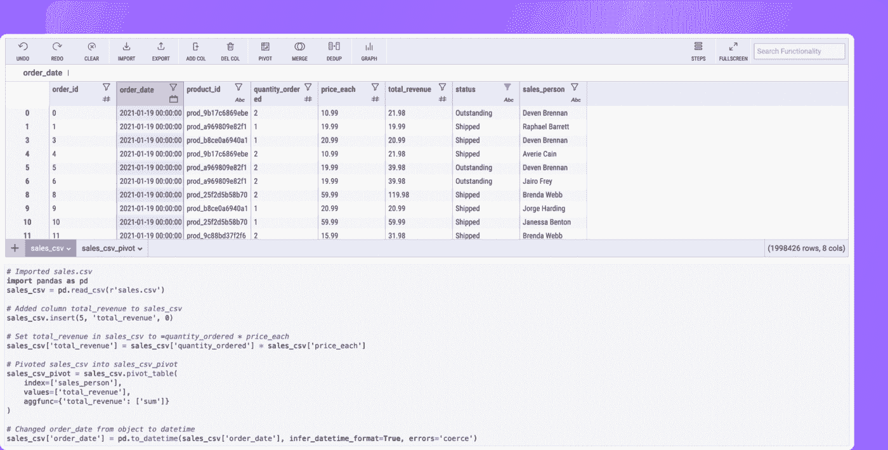
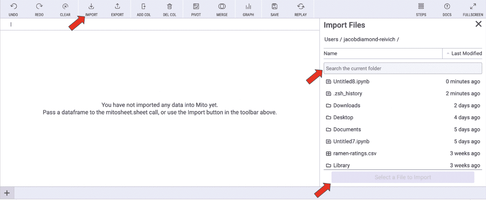
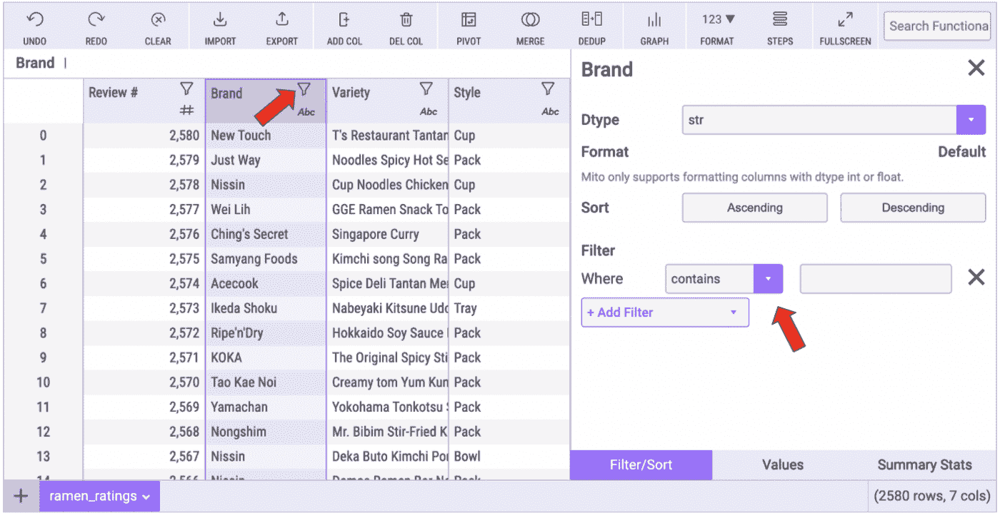
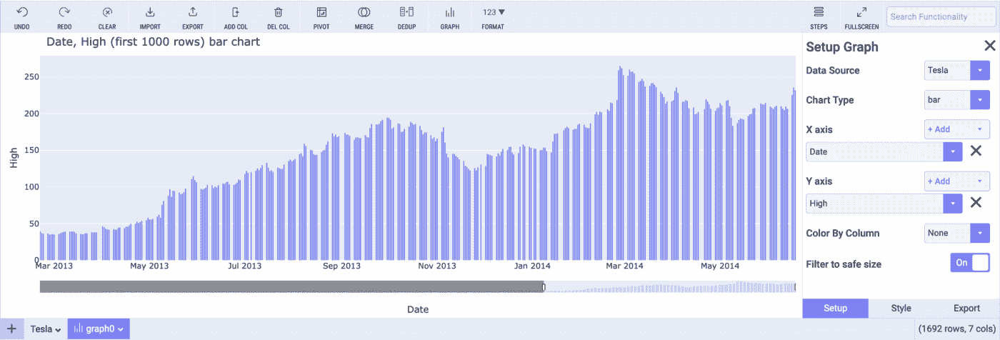
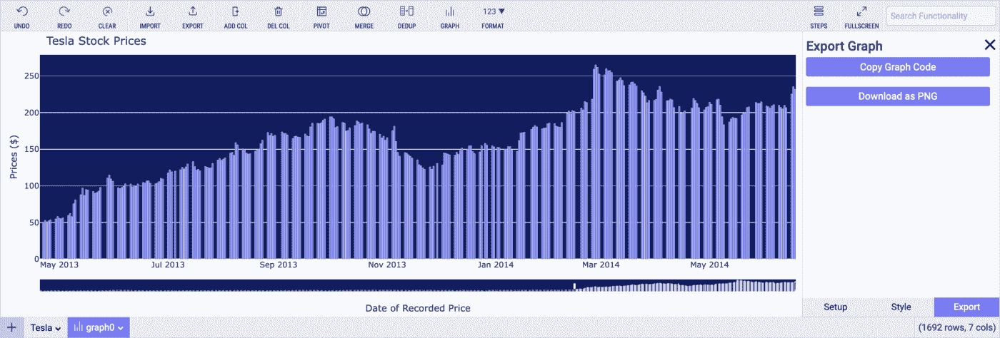

# 如何不用代码写 Python

> 原文：<https://towardsdatascience.com/how-to-write-python-without-code-cbd536046fa9>

## 简要介绍在分析数据时生成代码的 python 包


Joshua Woroniecki 在 [Unsplash](https://unsplash.com?utm_source=medium&utm_medium=referral) 上的照片

各行各业对 ython 的使用持续增长。其中一个原因是分析大型数据集的需求日益增加。许多 Python 新用户都有电子表格的背景，他们发现虽然 Python 可以更快地处理大得多的数据集，但他们错过了 Excel 或 Google Sheets 中电子表格的可视化特性。

米托是一个 Python 包，它将电子表格的好处带给了 Python。这个包允许您将一个电子表格调用到您的 Python 环境中，在这里您可以传入一个 DataFrame 或一个 Excel 文件— **您在电子表格中所做的每一次编辑都会自动写入相应的 Python 代码。**



您在电子表格中所做的每一次编辑都会自动写出相应的 [Python 代码](https://github.com/mito-ds/monorepo)(图片由作者提供)。

关于自动代码生成的一个伟大的事情是，你不需要花很多时间去栈溢出或谷歌来获得正确的语法。你所需要做的就是完成电子表格中的操作，代码已经为你写好了。

要安装米托，请在终端中使用以下命令:

```
python -m pip install mitoinstaller
python -m mitoinstaller install
```

然后打开 Mitosheet 界面:

```
import mitosheet
mitosheet.sheet()
```

以下是完整的[安装说明](https://docs.trymito.io/getting-started/installing-mito)的链接。

# 探索您的数据

在 Python 中，电子表格界面简化了探索性数据分析。米托提供了电子表格中的自定义功能，但将它们带到了 Python 环境中，并生成了等效的代码。

你可以用两种方法之一把你的数据输入米托。第一种是通过将现有数据帧添加到 mitosheet.sheet()调用来传入该数据帧。

以下是将一些示例数据帧传递到米托的示例:

```
# import Python packages
import mitosheet
import pandas as pd# create some simple data to displaytrain_stations = pd.DataFrame({'Zip': [21001, 97321, 49224, 87102, 24910, 22301], 'City': ['Aberdeen', 'Albany', 'Albion', 'Albuquerque', 'Alderson', 'Alexandria'], 'State': ['MD', 'OR', 'MI', 'NM', 'WV', 'VA'], 'Ticket_Office': ['N', 'Y', 'N', 'Y', 'N', 'Y']})demographics = pd.DataFrame({'Zip': [21001, 97321, 49224, 87102, 24910, 22301], 'Median_Income': [53979.0, 112924.0, 37556.0, 28388.0, 30914.0, 54087.0], 'Mean_Income': [66169.0, 147076.0, 50371.0, 39529.0, 40028.0, 64068.0], 'Pop': [18974.0, 11162.0, 14900.0, 22204.0, 5383.0, 19504.0]})# render the Mitosheet with the data
mitosheet.sheet(train_stations, demographics)
```

第二种方法是使用导入模式直接传递 Excel 或 CSV 文件:



[将数据导入米托](https://docs.trymito.io/how-to/importing-data-to-mito)(图片由作者提供)。

一旦数据集位于米托境内，诸如以下要素:

*   汇总统计数据
*   过滤
*   分类
*   数据透视表
*   电子表格公式

此外，允许您快速浏览数据，而无需编写任何代码。



用[米托](https://docs.trymito.io/how-to/filter-data)过滤数据(图片由作者提供)。

值得指出的一个简单特性是，在米托，你可以通过编辑单元格来**更改数据集**中的任何值——就像在电子表格中一样。像这样的特性提供了可视化分析和编辑数据的能力，这增强了 Python 的体验。

# 可视化您的数据

米托拥有内置于工具中的 [Plotly](https://plotly.com/python/) Python 包的绘图能力。通过单击工具栏中的 graphing 按钮，您可以创建完整的 Plotly 图形，并为该图形生成等价的代码。



用[米托](https://docs.trymito.io/how-to/graphing)可视化你的数据(图片由作者提供)。

Plotly 图形非常适合 Python 中的分析，因为它们是可共享的，并且具有交互功能，这使得它们可以供技术和非技术受众使用。

在米托，您可以在菜单中配置您的图形并导出等效的代码。这是一个巨大的时间节省，因为获得正确的语法来绘制代码在 Python 中是众所周知的乏味。



[用米托导出数据](https://docs.trymito.io/how-to/graphing)(图片由作者提供)

# 结论


伊恩·施耐德在 [Unsplash](https://unsplash.com?utm_source=medium&utm_medium=referral) 上拍摄的照片

这是一个可怕的米托包简要介绍。你知道米托也是开源的吗？你可以在这里查看 Github。

想了解更多，请看我关于米托的其他故事。

你是视觉学习者吗？这是一个在米托绘图的视频指南。