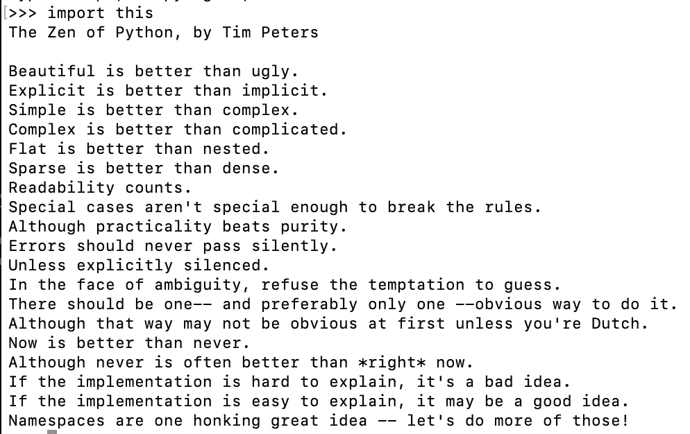
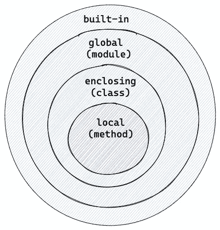

# 如何编写 Pythonic 代码

> 原文：<https://towardsdatascience.com/how-to-write-pythonic-code-208ec1513c49>

## 充分利用这美丽的语言


在 [Unsplash](https://unsplash.com/) 上由 [Hitesh Choudhary](https://unsplash.com/@hiteshchoudhary) 拍摄的照片

E 每种编程语言都有自己的习惯用法，由用户定义。在 Python 社区中，*Python*是一个描述代码的词，它不仅语法正确，而且以预期的方式使用语言。从可维护性、可读性和效率的角度来看，它提高了整体代码质量。广义地说，它还为整个开发团队创建了一个代码模式，以关注问题的真正本质。要使库成为 Python 库，就要让 Python 开发人员很自然地在他们的代码库中使用它。记住，读**代码比写**代码更频繁。

但是它实际上是什么意思呢？这听起来像是一个模糊的概念。我该如何通过向他们展示‘T9’可信的‘T10’Python 代码来破解 Python 采访呢？在本文中，我想告诉你 8 个广泛推广的 Pythonic 特性，它们将把你的代码带到下一个层次。它们主要是为希望快速提高技能的 Python 初学者设计的，但也有一些针对中间用户和专家的技巧。最后，我会给你一些关于编写一个 Pythonic 库或框架的技巧，以及一些有助于你自学的免费资源。

我知道这是一篇长文章。为了给你一些期望，这里是内容。请随意跳过您已经知道的内容。

*   蟒蛇的禅
*   PEP8
*   价值交换&多重分配
*   传递多个参数(*args 和**kwargs)
*   理解
*   强调
*   上下文管理器
*   发电机
*   命名空间和范围
*   可变默认参数
*   编写一个 Pythonic 库
*   其他免费资源

## 蟒蛇的禅

如果我不从*蟒蛇的禅*开始，这篇文章就不完整了。您可以通过键入`import this`在任何给定的时间找到它。这是编写 Python 代码的 19 个“指导原则”的总结。我更愿意将其视为一种思维方式，而不是实际的语法指南。然而，这首诗中的哲学已经影响了全球成千上万的 Python 开发人员。



蟒蛇之禅(摄影:高)

我稍后将向你们展示的例子肯定是遵循这一理念的。请通读一遍。我将向您传达一些核心概念，以便您为示例做好准备。

**简单明了&可读性**

我把这三个特征放在同一个桶里，因为总的来说，这意味着编写每个人都能理解的简单和干净的代码。你可以用许多不同的方式来解释它。这首诗中的一个例子是`flat is better than nested`，意思是在你的项目中不要有太多的子类别(模块/包)。`sparse is better than dense`意味着不要在一行代码中塞进太多的函数 *(79 个字符的规则无论如何都会换行)*。

**没事*打破*规则**

就结构而言，Python 不如 Java 等其他编程语言严格。您可以编写纯过程(如脚本)或面向对象范例(如 Java ),或者两者兼而有之。关键是你不必把你的代码放进不适合你的鞋子里。过分遵循规则会导致高度抽象和样板代码。

**注意错误处理**

错误不应该被忽略。快速失败并捕获它们比隐藏错误并继续程序更好。当 bug 远离原来的位置时，它们变得更难调试，因此现在而不是以后引发异常。

**应该有一种——最好只有一种——显而易见的方法来做这件事**

虽然是作为指南写的，但是我感觉用 Python 真的很难做到这一点。Python 被认为是一种灵活的编程语言，受到大型社区的支持，这意味着人们每天都可以对现有的解决方案提出新的想法。然而，它试图传达的主要信息是，不值得花力气去学习每一种可能的方法。社区已经做了一些努力来标准化这些格式，我马上会谈到。

## PEP8

正如我前面提到的，Python 是一种灵活的语言，在格式上没有太多限制。这就是 PEP8 出现的原因。欢迎您以任何方式编写 Python 代码，只要它是有效的。然而，使用一致的风格使你的代码更容易阅读和维护。PEP8 提供了丰富的项目列表。绝对值得一查。

一些著名的 linters，如 [Flake8](https://flake8.pycqa.org/en/latest/) 和 [Pylint](https://pylint.org/) 可以在你提交代码之前发现问题，从而为你的同事节省审查时间。像 [Black](https://black.readthedocs.io/en/stable/) 这样的库甚至可以自动修复格式问题。常见的做法是将这些工具集成到您的 IDE(例如 vscode)和 CI/CD 管道中。

## 价值交换和多重分配

你可能以前见过这个问题:如何交换两瓶水？答案是得到第三个空瓶子。大多数语言都是这样处理的，需要一个额外的变量来交换值。

然而在 Python 中，生活变得更容易了。您可以像这样交换两个值:

```
a = 1
b = 2
a, b = b, a
```

看起来太神奇了。第`a,b=b,a`行被称为赋值，其中右边是一个表达式，左边是几个变量。右边的表达式`b,a`其实就是**一个元组**。不信？在终端中尝试一下:

```
>>> 1,2
(1, 2)
```

**括号在元组中并不是真正必要的。**

此外，Python 支持多重赋值，这意味着左侧可能有多个变量，每个变量都被赋值给元组中的一个值。这也称为*拆包*分配。另一个解包赋值的例子是 list:

```
fruits = ["apple", "banana"]
f1,f2 = fruits
```

结果会是`f1="apple"`，`f2="banana"`。

通过这样做，您可以轻松、优雅、自然地分配变量，而无需样板代码。

## 传递多个参数(*args 和**kwargs)

与前一点相关，Python 允许向函数传递多个参数，而无需在函数中定义它们。一个例子可以是一个将一些数字相加的函数，但是数字的大小是未知的。

一种简单的方法是创建一个列表变量作为函数的输入。

```
def calculate(values):
    for val in values:
        ....
calculate([1,2,3,4])
```

然而，在 Python 中，你可以有一个接口而不提供列表。

```
def calculate(*values):
    for val in values:
        ....
calculate(1,2,3,4)
calculate(*[1,2,3,4]) # this works too
```

`*values`等于`(1,2,3,4)`是一个**元组**(一个可迭代的)，函数内部的逻辑可以保持不变。

与`*args`类似，`**kwargs`接受命名参数，并将它们解包成键、值对。当你有一堆有不同含义的可选参数时，这很有用。在这个例子中，房子可以由不同类型的房间组成。如果你不喜欢有太多的争论，你可以提供一本字典来代替。

```
def build_house(**kwargs):
    for room,num in **kwargs:
        ...
build_house(bedroom=2,kitchen=1,bathroom=1,garden=1)
build_house(bedroom=2,kitchen=1,bathroom=2,storage_room=1)
```

解包的另一个有趣的事情是你可以很容易地合并两个列表或字典。

```
first = [1,2,3]
second = [4,5,6]
result = [*first, *second] 
# [1,2,3,4,5,6]first = {"k1":"v1"}
second = {"k2":"v2"}
result = {**first, **second}
# {"k1":"v1", "k2":"v2"}
```

## 理解

理解很酷。这是我对它的第一印象。理解用于在单个指令而不是多个操作中创建数据结构。一个经典的例子是将一个 for 循环转换成一行代码。

```
result = []
for i in range(10):
    result.append(i**2)# use list comprehension
result = [i**2 for i in range(10)]
```

一般来说，理解的表现更好，因为它的操作更少，因此不需要对每一项都执行`.append()`。在复杂的函数中，理解可以明显减少代码的行数，使读者容易理解。另一个可比较的方法是使用[λ表达式](/learn-python-lambda-from-scratch-f4a9c07e4b34)。同样的表达式可以写成这样:

```
result = list(map(lambda x:x**2, [i for i in range(3)]))
```

但是，如果代码创建了复杂的表达式，不要强迫它成为一行代码。我读过《Python 中的干净代码》一书，其中有一个很好的例子。`collect_account_ids_from_arns`函数接收一个值列表，然后解析、匹配并最终将它们添加到`collected_account_ids`中。

这是 for 循环的简单解决方案。

```
def collect_account_ids_from_arns(arns):
    collected_account_ids = set()
    for arn in arns:
        matched = re.match(ARN_REGEX, arn)
        if matched is not None:
            account_id = matched.groupdict()["account_id"]
            collected_account_ids.add(account_id)
    return collected_account_ids
```

这是有领悟的版本。

```
def collect_account_ids_from_arns(arns):
    matched_arns = filter(None, (re.match(ARN_REGEX, arn) for arn in arns))
    return {m.groupdict()["account_id"] for m in matched_arns}
```

另一个更紧凑的版本是使用 walrus operator。该示例将代码推送到实际的一行程序中。但这并不一定比第二种方法更好。

```
def collect_account_ids_from_arns(arns):
    return { matched.groupdict()["account_id"] for arn in arns if (matched := re.match(ARN_REGEX, arn)) is not None }
```

理解可以简化代码并提高性能，但是考虑可读性也是必须的。

## 强调

Python 中使用下划线的方式不止一种。每种类型代表属性的不同特征。

默认情况下，对象的所有属性都是公共的。没有 *private* 关键字阻止你访问一个属性。Python 在函数名前使用下划线(如`def _build()`)来划定对象的接口。以下划线开头的属性应该被认为是私有的，不能从外部调用。类的私有方法/属性只能在内部调用。如果这个类获得了太多的内部方法，这可能是这个类违反了单一责任原则的标志，也许你想把一些责任提取给其他类。

下划线的另一个 Pythonic 特性是所谓的 [*魔法*方法](https://rszalski.github.io/magicmethods/)。神奇的方法被双下划线包围，如`__init__`。好玩的事实，根据 [*原黑客的字典*](https://www.dourish.com/goodies/jargon.html) ，神奇的意思是

> *一个没有公开的功能，它允许一些本来不可能的事情。*

Python 社区在 Ruby 社区之后采用了这个术语。它们允许用户访问语言的核心特性，从而创建丰富而强大的对象。成为魔术方法的专家可以让你的客户拥有干净的代码。听起来很抽象？让我们看一个例子:

```
class House:
    def __init__(self, area):
        self.area = area
    def __gt__(self, other):
        return self.area > other.areahouse1 = House(120)
house2 = House(100)
```

通过覆盖魔法方法`__gt__`，使用`House`的客户端可以用`house1 > house2`比 2 个房子，而不是类似`house1.size() > house2.size()`的东西。

另一个例子是改变类的表示。如果你打印`house1`，你会得到一个带有 id 的 Python 对象。

```
print(house1)
# <__main__.House object at 0x10181f430>
```

有了魔法方法`__repr__`，打印语句变得更加不言自明。神奇的方法对客户隐藏了实现细节，同时给了开发人员改变其原始行为的能力。

```
def __repr__(self) -> str:
    return f"This house has {self.area} square meters."print(house1)
# This house has 120 square meters.
```

尽管使用下划线很常见，但是不要使用双下划线来定义属性，也不要定义自己的神奇方法。它不是 Pythonic 式的，只会让你的同行感到困惑。我写了一篇关于这个话题的文章。你可以在这里查看。

</5-different-meanings-of-underscore-in-python-3fafa6cd0379>  

## 上下文管理器

上下文管理器值得单独写一篇文章。这是一个非常有用的特性，可以帮助你在某些动作之前和之后运行一些东西。资源管理是它的一个很好的用例。您希望确保文件或连接在处理后关闭。

在 Python 中，可以使用两种方法来分配和释放资源:

*   使用`try .. finally`挡块
*   使用`with`构造

例如，我想打开一个文件，阅读内容，然后关闭它。这就是使用`try .. finally`的样子。`finally`语句保证无论发生什么情况，资源都被正确关闭。

```
f = open("data.txt","r") 
try:
  text = f.read()
finally:
  f.close()
```

尽管如此，您可以使用`with`语句使它更加 Pythonic 化。如您所见，许多样板代码被删除了。当您使用`with`语句时，您进入了一个上下文管理器，这意味着当程序块完成时，文件将被关闭，即使发生了异常。

```
with open("data.txt", "r") as f:
  text = f.read()
```

这是怎么发生的？任何上下文管理器都由两个神奇的方法组成:`__enter__`和`__exit__`。`with`语句将调用方法`__enter__`，它返回的任何内容都将被赋给`as`之后的变量。在该块中的最后一行代码完成后，Python 将调用`__exit__`，其中资源被关闭。

一般来说，我们可以自由地用自己的逻辑实现上下文管理器。我想向您展示实现上下文管理器的 3 种不同方法(是的..我们正在打破*Python 的禅*的规则。假设我想为备份创建一个数据库处理程序。数据库应该在备份前脱机，并在备份后重新启动。

*   **创建上下文管理器类。**在这个例子中，在`__enter__`扇区不需要返回任何东西，这是可以的。`__exit__`扇区接收从块中产生的异常。您可以决定如何处理异常。如果您什么都不做，那么在资源被正确关闭后，异常将被引发给调用方。或者您可以根据异常类型处理`__exit__`块中的异常。但是总的原则是不要默默地接受错误。另一个通用提示是不要在`__exit__`块中返回`True`，除非你知道你在做什么。返回`True`将忽略所有的异常，它们不会被提交给调用者。

```
def stop_db():
  # stop databasedef start_db():
  # start databasedef backup_db():
  # backup databaseclass DatabaseHandler:
  def __enter__(self):
    stop_db()def __exit__(self, exc_type, ex_value, ex_traceback):
    start_db()with DatabaseHandler():
  backup_db()
```

*   **使用** `**contextmanager**` **装饰器。你不必每次都创建一个类。想象一下，您希望将现有的功能转变为上下文管理器，而不需要过多地重构代码。在这种情况下，您可以使用装饰器。装饰者本身是另一个话题。但它本质上做的是把原来的函数变成一个生成器。`yield`之前的所有内容都是`__enter__`的一部分，产生的值成为`as`之后的变量。在这个例子中，不需要放弃任何东西。一般来说，如果您只需要一个上下文管理器函数而不需要保留太多状态，这是一个更好的方法。**

```
import contextlib@contextlib.contextmanager
def db_handler():     
  try:         
    stop_db()         
    yield     
  finally:        
    start_db()with db_handler():     
  db_backup()
```

*   **基于** `**contextlib.ContextDecorator**`创建一个装饰类:第三个选项是创建一个装饰类，它是前两个选项的混合。您不用使用仍然可以使用的`with`语句，而是将它用作函数顶部的装饰器。这样做的好处是，通过简单地将装饰器应用于其他函数，您可以任意多次地重用它。

```
class db_handler_decorator(contextlib.ContextDecorator):
  def __enter__(self):
    stop_db() def __exit__(self, ext_type, ex_value, ex_traceback):
    start_db()@db_handler_decorator()
def db_backup():
  # backup process
```

哇，对于一个项目来说，这是一个相当长的部分。我不会在上下文管理器上深入讨论太多。但是总的建议是，即使你是一个初学者，你也应该至少理解它的工作原理。作为一名中级或专家，您可以尝试从头开始创建一些上下文管理器，以发现它更多的本质。

## 发电机

在上一篇文章中，我提到了一个叫做生成器的概念，这也是区别于 Python 的一个独特的特性。生成器是一个 iterable，它定义了一个`next()`方法。但特别的是你只能迭代一次，因为它们不会把所有的值都存储在内存中。

生成器被实现为一个函数，但是它没有像常规函数一样使用`return`，而是使用了`yield`。

```
def generator():
  for i in range(10):
    yield i**2print(generator)
# <function generator at 0x109663d90>
```

你会看到这在`asyncio`中被大量使用，因为协程本质上是一个生成器。然而，它的优势之一是减少内存使用，这可能会对大数据集产生巨大影响。假设我想对 1M 的记录进行一些计算。

在了解`yield`之前，你会这样做。问题在于，你必须将所有 100 万条记录的结果存储在内存中。

```
def calculate(size):
  result = []
  for i in range(size):
    result.append(i**2)
  return resultfor val in calculate(1_000_000):
  print(val)
```

这是一个使用`yield`的替代方案。只在轮到它的时候才计算结果，从而节省了大量的内存使用。

```
def calculate(size):
  for i in range(size):
    yield i**2for val in calculate(1_000_000):
  print(val)
```

生成器也是懒惰求值背后的秘密，对此我写了另一篇文章。请随意检查。

</what-is-lazy-evaluation-in-python-9efb1d3bfed0>  

## 命名空间和范围

作为*Python 的禅*的最后一行，我们来谈谈 Python 中的命名空间和作用域。名称空间是 Python 中的一个系统，用于确保所有名称(属性、函数、类、模块)在程序中是唯一的。在 Python 中，名称空间作为一个字典来管理，其中键是对象名，值是对象本身。

一般来说，Python 中有 4 种类型的名称空间:Python 内置的、全局的、封闭的和按层次排序的局部的。这个图也被称为 **LEGB** 规则。解释器首先在本地搜索名称，然后是封闭的，然后是全局的，最后是内置的，这意味着低级别的名称(例如本地的)将覆盖高级别的相同名称(例如封闭的)。



由创作[高](https://medium.com/u/2adc5a07e772?source=post_page-----208ec1513c49--------------------------------)

它如何影响我们的编码？大多数时候，如果你只是遵循 LEGB 规则，你不必做任何特别的事情。这里举个例子。在继续前进之前想一想。产量是多少？

```
val = 1def outer():
  val = 2

  def inner():
    val = 3
    print(val)

  inner()print(outer())
print(val)
```

根据 LEBG 规则，较低的级别应该覆盖较高的级别。在函数`inner()`中，`val`的值为 3，所以调用函数`outer()`将返回 3。然而，如果你只是像`print(val)`一样打印出`val`，你将得到 1，因为你目前在函数之外，并试图访问全局值`val = 1`。

但是如果你想从较低的级别修改一个全局值，这可以用`global`关键字来实现。你需要的是在你想要改变全局值的地方加上`global val`。

```
val = 1def outer():
  val = 2

  def inner():
 **global val**    val = 3
    print(val)

  inner()print(outer()) # 3
print(val) # 3
```

这只是一个声明，像`global val = 3`这样的语法是不正确的。另一个选择是`globals()[“val”] = 3`。

## 可变默认参数

最后但同样重要的是，我想向您展示一个 Pythonic 警告，您可能认为这是一个 *bug* ，但实际上是一个特性。尽管它令人困惑，但它仍然是每个人都必须与之相处的 Pythonic 特性。

考虑下面的例子。功能`add_to_shopping_cart`将`food`加到`shopping_cart`上。如果没有提供，`shopping_cart`默认为空列表。在这个例子中，在没有提供`shopping_cart`的情况下调用这个函数两次应该会得到两个列表，每个列表有一个元素。

```
def add_to_shopping_cart(food, shopping_cart = []):
  shopping_cart.append(food)
  return shopping_cartprint(add_to_shopping_cart("egg"))
# ["egg"]
print(add_to_shopping_cart("milk"))
# ["egg","milk"]
```

但这是实际发生的事情。解释是——变量`shopping_cart`是**在函数**的定义上只创建一次，也就是这个函数第一次被调用的时刻。从那时起，Python 解释器将在每次调用函数时使用相同的变量，这意味着每当值改变时，Python 将把它传递给下一次调用，而不是用默认值重新创建它。

修复很简单——使用`None`作为缺省的 sentinel 值，并在函数体中分配实际的缺省值`[]`。由于名称空间和本地范围的原因，`shopping_cart`将在每次`None`时被重新创建。

```
def add_to_shopping_cart(food, shopping_cart=None):
  shopping_cart = shopping_cart or []
  shopping_cart.append(food)
  return shopping_cartprint(add_to_shopping_cart("egg"))
# ['egg']
print(add_to_shopping_cart("milk"))
# ["milk"]
```

我的经验是不要改变可变的默认参数，除非你知道你在做什么。

## 写一个 Pythonic 库

到目前为止，我们讨论的都是每一个 Python 特性。当谈到编写 Python 库或框架时，我们还应该考虑如何设计 Python API。除了遵循常见的 Python 习惯用法，旨在被其他人使用的接口通常比其他语言更小、更轻量级。如果这个库过多地重复发明轮子，就会被认为不是 Pythonic。考虑到*“只有一种方法”，最好将另一个第三方软件包安装到您的库中。*

另一个通用的提示是，不要仅仅为了遵循像 Java 这样的设计模式而编写样板代码。一个例子是[如何用 Python](https://stackoverflow.com/questions/6760685/creating-a-singleton-in-python) 写一个 singleton。

## 其他免费资源

我没有提到的是一些基本的 Pythonic 表达，比如用`for i, color in enumerate(colors)`代替`for i in range(len(colors))`。这里有一些很棒的 Youtube 视频，让你重温一下知识。

[https://www.youtube.com/watch?v=OSGv2VnC0go](https://www.youtube.com/watch?v=OSGv2VnC0go)(将代码转换成漂亮的、惯用的 Python)

[https://www.youtube.com/watch?v=x-kB2o8sd5c](https://www.youtube.com/watch?v=x-kB2o8sd5c)(一条蟒蛇？美学:美丽和我为什么是蟒蛇)

你也可以看看 2003 年的这个[帖子，当时人们在讨论什么是 Pythonic。很有趣的一个！我喜欢这一段:](https://mail.python.org/pipermail/tutor/2003-October/025930.html)

> Unpythonic 正在进行大量的类型检查，或者非常努力地使
> 成为私有/受保护的东西。或者使用索引来循环遍历列表
> ，而不仅仅是“在我的列表中查找项目”。基本上，人们做的任何事情都是因为他们在其他语言中是这样做的，认为它已经尽善尽美了。

## 结论

谢谢你能来这里。感谢您的宝贵时间！这篇 15 分钟的文章只是关于*python*特性的冰山一角。除了每一项和文章中没有包括的许多其他项目之外，还有很多要说的。无论如何，我希望这能启发你重新审视你的 Python 代码，并能给你的同行更多有价值的评审意见。任何想法都欢迎在评论区发表！