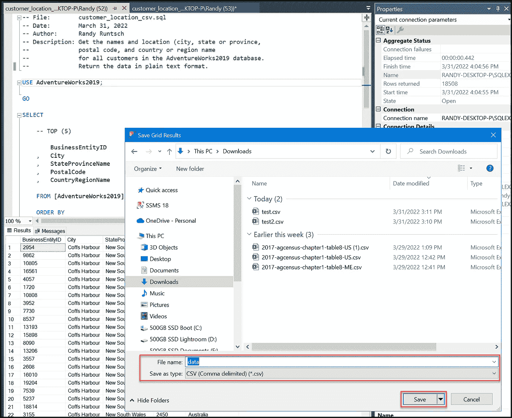
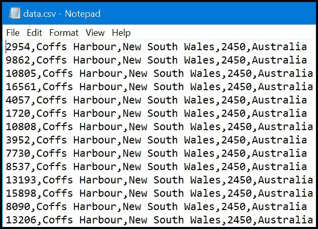
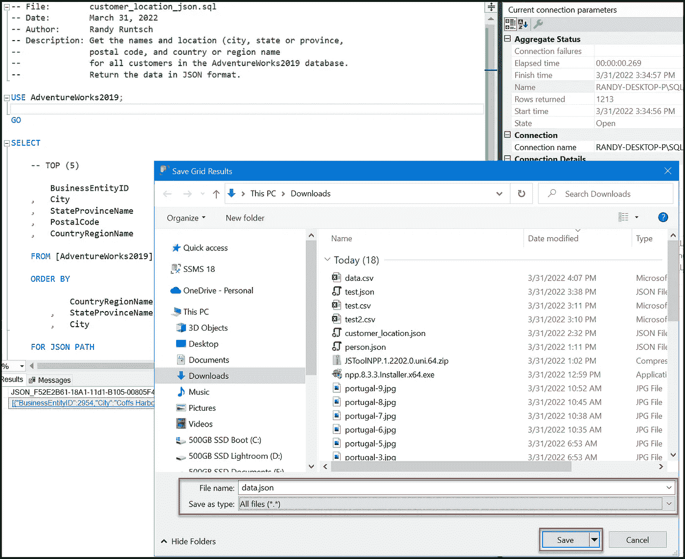
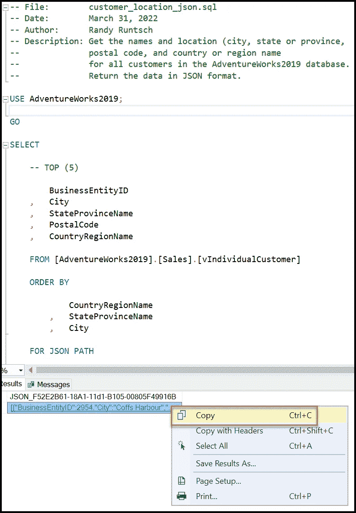
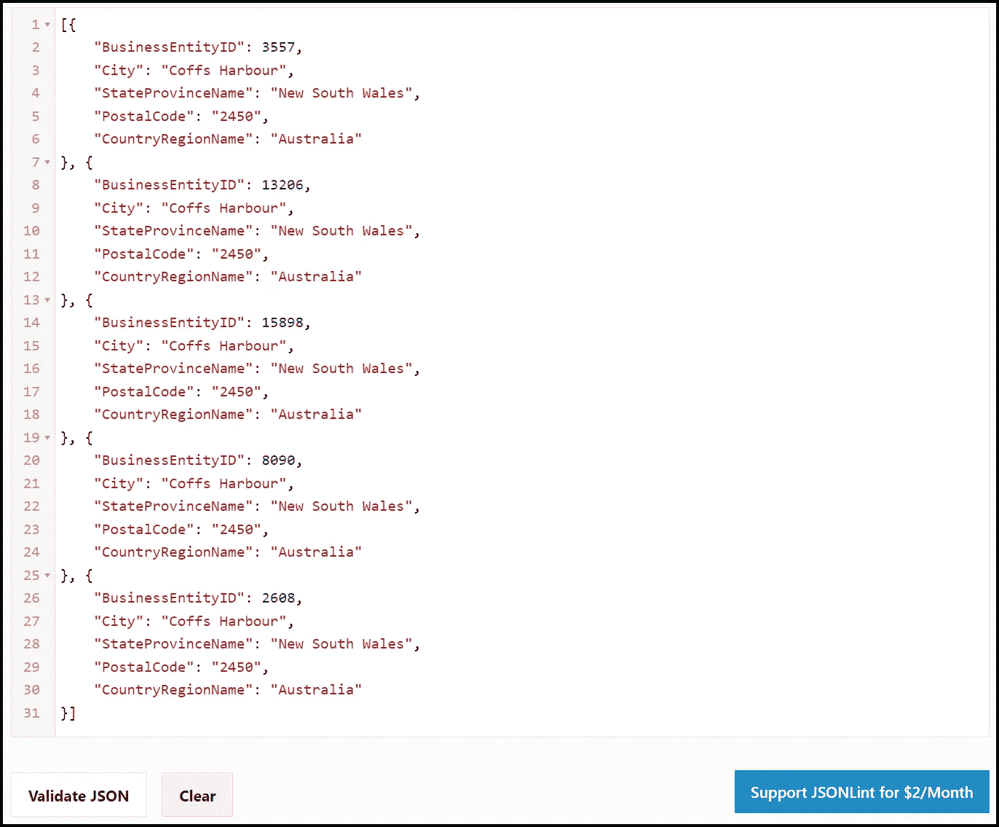

# 如何将 SQL Server 查询结果写入 CSV 和 JSON 文件

> 原文：<https://towardsdatascience.com/how-to-write-sql-server-query-results-to-csv-and-json-files-a1b059ed4588>

## SQL、SQL Server 和数据工程

## 这种技术既快速又简单

Pixabay 的照片:[https://www.pexels.com/photo/stock-exchange-board-210607/](https://www.pexels.com/photo/stock-exchange-board-210607/)

有时，当我在 Tableau 中创建数据可视化仪表板时，Tableau 直接从关系数据库中读取源数据表。但这并不总是可能的。例如，Tableau 服务器环境可能不具备访问数据库的凭证。或者数据很少改变，使得对文件的访问更有效。在这种情况下，我可能会从 Excel 电子表格、CSV 文件或 JSON 文件中获取数据。本教程将向您展示如何对 Microsoft SQL Server 运行选择查询，并将结果数据写入 CSV 或 JSON 文件。

# 本文中使用的工具

为了准备这篇文章，我使用了下面列出的工具。如果您想继续学习，但没有所需的工具，可以参考安装免费版本的说明。

*   **微软 SQL Server**——我用的是这个数据库管理系统(DBMS)的免费版本，叫做 SQL Server 2019 Express，你可以[在这里下载](https://www.microsoft.com/en-us/sql-server/sql-server-downloads)。
*   **微软 SQL Server Management Studio(SSMS)**—我使用 SSMS 管理 SQL Server 数据库，并创建、测试和运行 SQL 查询。其他工具可能可用，但这个工具是免费的，在这里[可用](https://docs.microsoft.com/en-us/sql/ssms/download-sql-server-management-studio-ssms?view=sql-server-ver15)。
*   **SQL Server 数据库**—SQL Server 的实例必须包含一个数据库，该数据库包含要对其运行 SQL SELECT 查询的数据。对于我的示例查询，我使用微软名为 AdventureWorks2019 的示例数据库。要设置它，您可以[从这里下载 AdventureWorks2019.bak 文件](https://docs.microsoft.com/en-us/sql/samples/adventureworks-install-configure?view=sql-server-ver15&tabs=ssms)并在您的 SQL Server 实例中恢复它。您可以使用 SSMS 来执行此任务。
*   **JSON 在线验证器**—JSON 格式的数据可以粘贴到这个[免费在线工具](https://jsonlint.com/)中，以验证其格式是否正确。

# 示例查询

对于本演示，我编写了一个 SQL SELECT 查询，该查询获取 Adventure Works 数据库中所有客户的唯一 ID 和位置(城市、州或省、邮政编码以及国家或地区)。如下所示，它从*vindividalcustomer*视图中选择数据。请注意，可以取消对“TOP (5)”子句的注释，以限制返回测试的行数。

# 将查询结果写入 CSV 文件

要对 AdventureWorks2019 数据库运行示例查询并将其结果保存到 CSV 文件，请按照下列步骤操作:

1.打开 SSMS 并连接到您的 SQL Server 实例。

2.在对象资源管理器中，右键单击 AdventureWorks2019 数据库名称。然后，单击[新查询]。

3.将上一节中显示的 SQL 查询粘贴到查询窗口中。

4.确保将查询输出设置为查询下方的网格。为此，在主菜单中，在查询窗口中单击。然后，从主菜单中点击[查询]、[结果到]，最后点击[结果到网格]。

5.单击功能区菜单中的[执行]运行查询。

6.查看结果网格中的数据。它应该看起来像下面的截图。

7.右键单击结果网格中的任意位置，如下所示。点击[将结果另存为…]。出现提示时，选择您选择的输出文件夹。然后，输入文件名(在本例中，我输入了“数据”)，并选择文件类型“CSV(逗号分隔)”(*。csv)。点击[保存]保存文件。

从 SSMS 查询结果网格中保存 CSV 文件。图片由 Randy Runtsch 提供。

接下来，在文本编辑器(如记事本或 Excel)中打开文件，检查其内容。它应该看起来像下面显示的记事本截图中显示的数据。

查询结果集以 CSV 格式存储在文件 data.csv. Image 中。

如果一切正常，文件已正确保存到指定的 CSV 文件中。它可以用于输入到另一个工具，如 Tableau，用于数据可视化，甚至 Excel。例如，它也可以导入到另一个数据库中。

# 将查询结果写入 JSON 文件

将 SQL 查询结果写入 JSON 文件就像将它们写入 CSV 文件一样简单。但它还涉及到一个步骤。按照上述 CSV 文件说明中所列，执行步骤 1 至 5。然后，将子句“FOR JSON PATH”添加到查询的末尾，如下面的代码所示。继续第 5 步和第 6 步。运行查询应该只返回两行输出行；一个以“JSON”开头的隐藏标题，后跟一个数据行(包含 JSON 格式的所有数据)。

将输出写入 JSON 格式的 SQL。由 Randy Runtsch 编写的代码。

现在，按照以下说明将输出保存到一个 JSON 文件:

> *在结果网格中，仅单击以“JSON”开头的 cyptic 值下面的行中的结果集，如下面的屏幕截图所示。点击[将结果另存为…]。出现提示时，选择您选择的输出文件夹。然后，输入扩展名为“”的文件名。例如，名为“data.json”的文件是有效的。接下来，选择文件类型“全部(*。*)."最后，点击[保存]保存文件。*

以 JSON 格式存储在文件中的查询结果集。图片由 Randy Runtsch 提供。

要检查文件中的 JSON 数据结构，请取消查询中的“TOP (5)”注释。然后，重新运行它，只返回前五行。复制 SSMS 结果网格中的结果数据，如下所示。然后粘贴到 [JSON 在线验证器](https://jsonlint.com/)工具中，点击【验证 JSON】。数据应该是 JSON 格式的，如下面的第二个截图所示。

右键单击以“JSON”开头的行下面的灰色行，复制 JSON 格式的数据。然后，单击[复制]。图片由 Randy Runtsch 提供。

使用免费的 JSON 在线验证器来确保 SQL Server 正确格式化来自 SQL 查询的记录。图片由 Randy Runtsch 提供。

# 摘要

本教程描述了如何将 SQL Server SELECT 查询的输出保存到 CSV 文件和 JSON 文件中。从 SQL Server 数据库获取数据的人，如数据工程师、数据分析师、数据科学家和软件开发人员，可能会受益于这种将数据从 SQL Server 数据库移动到其他工具的技术。