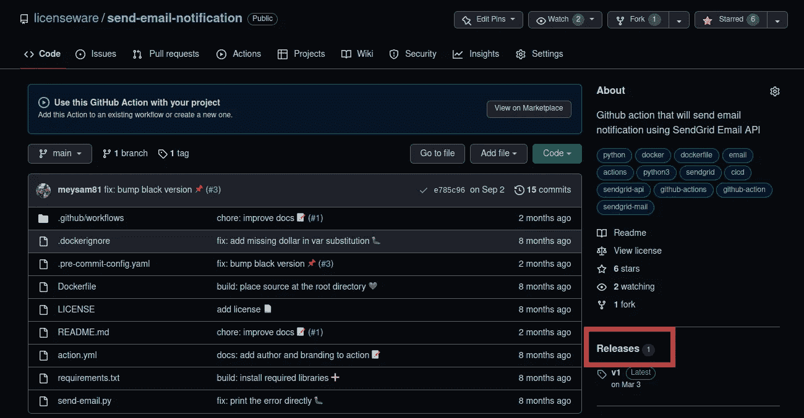
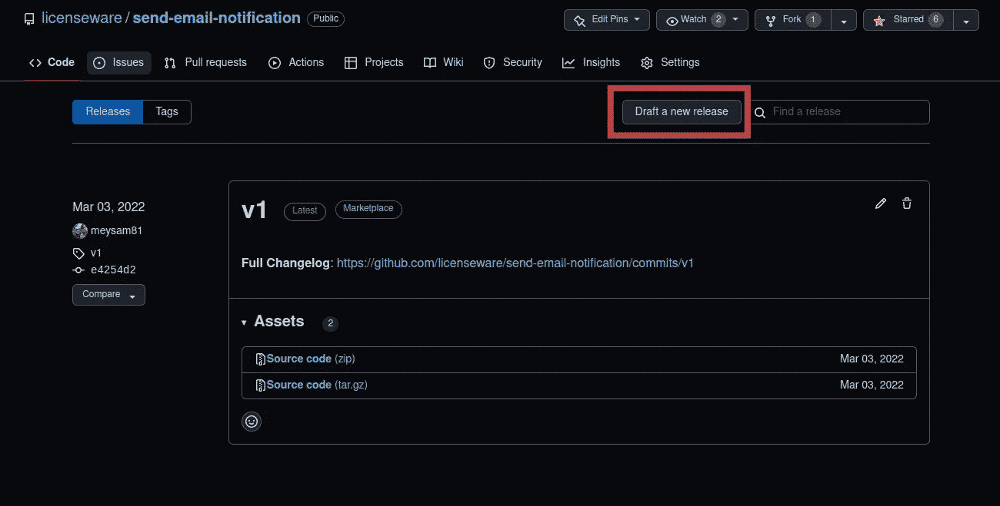
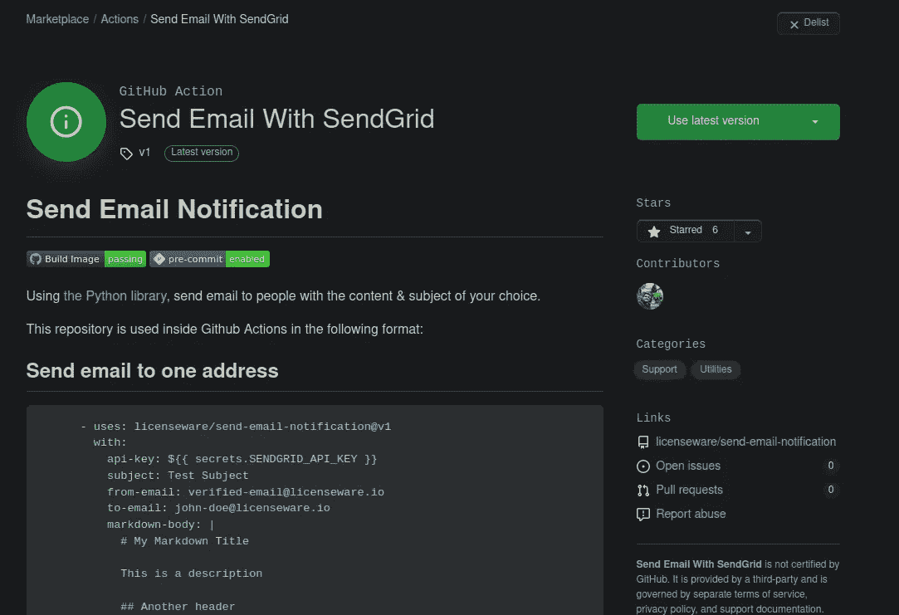

# 如何编写自己的 GitHub 动作

> 原文：<https://towardsdatascience.com/how-to-write-your-own-github-action-59cc4746a57a>

## 使用 GitHub 工作流完善您的 CI/CD 工具箱

照片由 pix abay:[https://www . pexels . com/photo/aroma-aromatic-distriction-bottles-531446/](https://www.pexels.com/photo/aroma-aromatic-assortment-bottles-531446/)

# GitHub 简要介绍时间表

自从微软接手以来，GitHub 已经发生了很大的变化，在大公司的集团性质中，或者说尽管如此。在 GitHub 中，CI/CD 管道得到了极大的改进。 [GitHub 提供了许多好的工作流程](https://github.com/actions)和[其他由开源社区](https://github.com/marketplace?category=&query=&type=actions)在最近几年开发的工作流程，随着技术的发展，还会有更多的工作流程出现。

这为许多机会打开了大门，因为许多公司已经将他们的源代码保存在 GitHub 中，GitHub 是市场上的第一批玩家之一[[source](https://en.wikipedia.org/wiki/GitHub)]！

虽然这听起来很可怕，但让一家公司比其他公司更强大也可以带来许多可能性和创新，因为社区的牵引力将推动创造越来越多的价值，最终将使每个人受益。

# 什么是 GitHub 动作？

尽管对许多工程师来说这很琐碎，但对初学者来说，定义这个术语是至关重要的。GitHub Action 是您在 GitHub 中拥有一个或多个存储库的帐户后获得的 CI/CD 管道，每个存储库都有其管道工作流。

它使您能够定义您希望在一组指定的[触发器](https://docs.github.com/en/actions/using-workflows/events-that-trigger-workflows)上发生的所有步骤。以下是这种“行动”的一些例子:

*   当一个拉请求进来时，在你的存储库上运行测试。
*   在每次推送时，在您的项目上运行特定于语言的 linters。
*   发布新版本时部署到开发/生产。

这些只是 GitHub Action 的几个例子，根据项目的需求，您还可以想到更多的例子。

照片由 nappy:[https://www . pexels . com/photo/man-weaking-white-sweet-and-black-shorts-about-to-run-936094/](https://www.pexels.com/photo/man-wearing-white-sweater-and-black-shorts-about-to-run-936094/)

# 为什么要编写定制的 GitHub 动作？

我们生活在 21 世纪，几乎每个软件问题都已经解决了；您只需要足够努力地寻找问题领域，将材料结合在一起，并最终以符合您需求的方式配置整个平台。

对于 GitHub 动作来说都是一样的，因为已经有许多工作流定义可以放入项目的 CI/CD 定义中，传入正确的值并得到您期望的结果。

这将我们带到一个点，你可能不需要从头开始重写东西。

但即使如此，也可能有这样的情况:

*   可用的解决方案不适合你的问题
*   问题的复杂性和可用的解决方案不一致
*   该解决方案在配置方面不够灵活

所有这些以及更多的理由都足以让你编写自己的定制 GitHub 动作，这也是本文的主旨。

我们将深入研究编写自定义 GitHub 动作的不同方法，并提供每种方法的实际例子。

# 如何编写自定义 GitHub 动作？

撰写本文时，有三种方法可以编写 GitHub Action。下面的方法可以用来创建和发布 GitHub 动作，可以是开源的，对社区公开，也可以是你自己的。

可用的 GitHub 操作类型有:

1.  JavaScript:如果你是 1750 万 JS 开发者中的一员，或者如果你是 7 万 Stackoverflow 调查对象中的 65%中的一员，你很可能会喜欢这种方法，因为你可以用你喜欢的语言编写你的逻辑。
2.  Docker:如果你和我一样不是 JavaScript 开发人员，你会发现这个非常有趣，因为任何可以被容器化的东西都可以作为 GitHub Action 发布；如今，由于许多伟大工程师的努力，这意味着任何应用。
3.  复合:最后但并非最不重要的，我非常喜欢的一个，允许你将多个 GitHub 动作合并成一个，也是作为“可重用工作流”出售给公众的。

由于我不是 JavaScript 开发人员，不仅仅是能够阅读并在一定程度上理解它的功能，我不会把更多的注意力放在那里，而是放大我感觉最强的地方:Docker & Composite。

Victoria Akvarel 的照片:[https://www . pexels . com/photo/two-boys-playing-soccer-ball-side-cars-1564868/](https://www.pexels.com/photo/two-boys-playing-soccer-ball-beside-cars-1564868/)

# GitHub 动作通用定义

选择任何一种编写 GitHub 动作的方法，你都需要一个关键的文件作为 GitHub 动作的**定义**。

该文件的名称必须精确到`action.yml`，并且它应该位于您的项目的根目录下。除了许多其他事情之外，下面是您在该定义文件中指定的内容:

*   输入是什么
*   如何调用操作，即执行什么文件或二进制文件
*   人们可以期望得到什么样的输出

像许多其他伟大的定义文件一样，这个定义是 YAML 格式的，是最有争议的格式之一。这里有一个取自 GitHub 文档的样本`action.yml`。

该文件有三个主要部分:所有其他选项都是可选的。

*   `name`:这是分配给动作的唯一名称。这个名字作为 ID，要求是唯一的，因为会给它一个 URL `github.com/marketplace/actions/MY_GITHUB_ACTION`，不能重复；这只适用于打算发布到 GitHub Marketplace 的公共操作，否则不需要是唯一的。
*   `inputs`:动作将接收的一组名称作为其参数。想想`kubectl get pod --output=yaml`，在这种情况下,“输出”是`kubectl`二进制的一个参数。
*   任何动作的基本部分是你定义动作的“类型”，上面描述的三种类型之一。该“类型”在键`using`下指定，并告诉“跑步者”如何跑你的动作。使用`docker`时，需要用属性`image`指定 docker 文件的路径。`args`是不言自明的，因为它将把`inputs`传递给底层实现。

这个定义，当正确指定时，将告诉 [GitHub Runner](https://github.com/actions/runner) 如何运行您的动作。它充当入口点；没有它，存储库中定义的逻辑将不会被执行，因为运行者不知道如何执行。

现在我们已经定义了 GitHub 动作的轮廓，让我们通过一些实际的例子来完成这个论证。

# 第 1 幕:使用 Docker 编写您的第一个 GitHub 动作

容器化的应用程序在最近几年获得了很大的发展，这是有原因的。它们允许你用你选择的编程语言编写你的应用程序，把它放在自己的“胶囊”里，并把它运送到任何地方，[至少*几乎*](https://docs.docker.com/build/building/multi-platform/) 。

即使有特定于平台的映像构建的限制，您仍然能够创建内容并提供给更广泛的受众；与裸机是唯一选择的时代相比，例如，需要保持安装在所有机器上的 JVM 版本的同步！

现在让我们进入实际的代码，在这里我们将开发一个实际的 GitHub 动作。

## 要求:在每次 GitHub 发布时发送电子邮件通知

随着介绍、历史和定义的结束，是时候写一些代码了。在这段代码中，我们将向每一次 [GitHub 发布](https://docs.github.com/en/repositories/releasing-projects-on-github/managing-releases-in-a-repository)的人员列表发送一封电子邮件。

实现逻辑是语言不可知的，但实现不是。这里我们将编写一个 Python 应用程序，使用 [SendGrid 的 SDK](https://pypi.org/project/sendgrid/) 来完成这项工作。

如您所见，代码并不复杂；它将接收所需的输入，准备电子邮件，并相应地发送它。几个调试行帮助用户理解我们所处的阶段，一个异常处理除了在[标准错误](https://linux.die.net/man/3/stderr)上打印出来之外什么也不做。

使用 [Markdown 库](https://pypi.org/project/Markdown/)是因为我们将获取发布说明并以 Markdown 格式将其传递给 GitHub 动作。

## 容器化应用程序

编写一个`Dockerfile`是让我们能够在一个隔离的环境中，随时随地，在任何操作系统上运行应用程序的关键。

如果你对如何写一个合适的 docker 文件的提示和技巧感兴趣，看看下面的链接。

 [## 写一份合适的文档的 10 个技巧

### 编写一个合适的 docker 文件并不太难

medium.com](https://medium.com/skilluped/10-tips-on-writing-a-proper-dockerfile-13956ceb435f) 

如上所述，应用程序的定义可能如下所示:

当然，`send-email-with-sendgrid.py`必须用正确的[命令](https://en.wikipedia.org/wiki/Shebang_(Unix))来执行。要使它可执行，您将运行`chmod +x FILENAME`。

## 定义 GitHub 动作

到目前为止，我们只编写了我们的逻辑，但是如果没有一个很好的和适当的定义`action.yml`，它就不能用于 GitHub 动作，这就是下一步要做的事情。

我们将需要一个 YAML 格式的文件，它将定义动作的名称，输入，以及如何运行它，即如何传递参数。

这是这样一个文件的样子。

在`action.yml`中定义的`args`是作为 `[cmd](https://stackoverflow.com/a/21564990)` [传递给 docker 容器](https://stackoverflow.com/a/21564990)的[。这些参数与上面 Python 应用程序中用`argparse`定义的参数相同。](https://stackoverflow.com/a/21564990)

## 发布到 GitHub 市场

我们已经编写了将应用程序作为 GitHub 动作运行所需的所有逻辑实现代码。然而，作为最后一步，如果我们想在[market place](https://github.com/marketplace)中发布我们的应用并使其可被搜索，我们将需要创建一个新版本，这可能是最容易的一步。

作为演示，下面提供了截图。

最后一个复选框非常重要，因为它表示您希望在市场上发布您的 GitHub 操作，有效地允许其他人使用它。最终，你会在市场上看到你的 GitHub 行为，类似于下图。

GitHub 发布后，您和其他人将能够使用 GitHub 操作，使用下面的 YAML 格式的工作流，该工作流位于存储库的`.github/workflows/`目录下。

这是最简单不过的了。当然，你可以变得更有创意，做更多新奇的东西！

## 源代码

所有文件都可以通过下面的链接获得。

 [## GitHub-licenseware/send-email-notification:GitHub 动作将使用…

### 将使用 SendGrid 电子邮件 API 发送电子邮件通知的 Github 操作…

github.com](https://github.com/licenseware/send-email-notification/) 

# 第 2 幕:使用 Shell 编写第二个 GitHub 动作

理解 GitHub Runners 在每次被触发时都包含在一个新的虚拟机中是至关重要的&它们将在完成时被处理掉[ [source](https://docs.github.com/en/enterprise-server@3.4/actions/using-github-hosted-runners/about-github-hosted-runners) ]。这意味着您在之前的运行中所做的工作将不可用，除非您保存了结果，例如 [GitHub 工件](https://github.com/marketplace/actions/upload-a-build-artifact)或 [GitHub 缓存](https://github.com/marketplace/actions/cache)。

也就是说，您可以组合工作流文件的多个阶段，并将其发布为单个 GitHub 操作，允许您作为一个统一的整体“重用”它，因此得名“[可重用工作流](https://docs.github.com/en/actions/using-workflows/reusing-workflows)”

这种类型的 GitHub 动作被称为“复合”顾名思义，它由其他步骤组成。对于多个存储库需要不同的 CI/CD 步骤的场景，这是非常理想的。您不希望到处重复相同的步骤，而是希望维护一个存储库并相应地更新。

## 需求:将 Helm 版本部署到 Kubernetes 集群

我们希望在每次对默认分支进行新的推送时，将带有一组可配置标志的 Helm Chart 部署到特定的 Kubernetes 集群。这需要以下步骤:

1.  安装一个特定的头盔版本，最好是可配置的。
2.  获取 Kubeconfig 和 Helm 值文件，作为 YAML 编码的字符串或作为底层操作系统中的文件路径，例如，从 AWS S3 获取。
3.  根据用户请求更改 Kubeconfig & Helm 值文件的文件权限。
4.  使用可配置的发布名称部署实际图表。
5.  出于安全原因，清理用户请求，即删除 Kubeconfig 和 Helm 值文件！

下面是 GitHub 动作定义文件中这样一个需求的样子:

注意`.runs.using`下的值是`composite`，这意味着我们将在同一个`action.yml`文件中定义可运行的步骤。

这些“步骤”与您放在`.github/workflows/`下的任何文件中的步骤是一样的，唯一的区别是`shell`属性，它是每个步骤的必需键。它告诉跑步者命令应该如何运行。此处记录了可用外壳的列表[。](https://docs.github.com/en/actions/using-workflows/workflow-syntax-for-github-actions#jobsjob_idstepsshell)

该文件的语法是不言自明的，也是人类可读的。您在每个步骤的`run`属性下看到的一切都是一组 bash 可执行的命令。

您还可以将任何 Python 或 JavaScript 文件放在同一个存储库中，并从同一个`action.yml`文件中调用该文件，使您的 GitHub 操作更加强大和灵活。

## 这个怎么用？

使用上面的 GitHub 动作，您将有效地拥有一个类似于下面的工作流定义。

## 源代码

所有文件都可以通过下面的链接获得。

 [## GitHub - licenseware/helm:在 GitHub 动作中部署头盔图表

### 在 GitHub 行动中部署头盔图。在 GitHub 上创建一个帐户，为 licenseware/helm 开发做贡献。

github.com](https://github.com/licenseware/helm) 

照片由 Nout Gons 拍摄:[https://www . pexels . com/photo/road-in-city-during-sunset-248159/](https://www.pexels.com/photo/road-in-city-during-sunset-248159/)

# 结论

CI/CD 使我们的运营变得更加轻松，使我们能够灵活地进行开发，并消除了手动和可重复部署的负担。在 21 世纪，随着许多旨在自动化可重复工作的工具和技术的兴起，CI/CD 已经成为最成功的工具之一，是当今每个公司不可或缺的一部分，使它们不再是一种奢侈品，而是将可维护性保持在最大水平的要求。

GitHub Actions，最著名的 CI/CD 工具箱之一，提供了很多功能。为了与当前的 CI/CD 解决方案竞争，GitHub Actions 在提供可扩展性方面取得了长足的进步，这样人们就可以为特定的需求创建和发布他们的解决方案。您将能够找到许多现成的工作流程，为您的生产之战做好准备。

在本文中，我们给出了实际的例子，说明当您找不到现成的动作时，如何编写一个实际的定制 GitHub 动作。有了这些知识，你将会不可阻挡地为自己、公司和社区创造价值。

祝你今天休息愉快。[敬请期待](https://meysam.io)，保重！

# 参考

*   【https://docs.github.com/ 

如果你喜欢这篇文章，看看我的其他内容，你可能也会觉得有帮助。

 [## 什么是 iptables，如何使用？

### 管理系统端口的防火墙界面

medium.com](https://medium.com/skilluped/what-is-iptables-and-how-to-use-it-781818422e52)  [## 简化的简洁架构

### 以友好的方式解释清洁建筑是如何工作的

medium.com](https://medium.com/amerandish/clean-architecture-simplified-223f45e1a10)  [## 如何在自动气象站 EKS 设置入口控制器

### 以正确的方式在 AWS EKS 上部署入口控制器

towardsdatascience.com](/how-to-set-up-ingress-controller-in-aws-eks-d745d9107307)  [## Tmux:初学者指南

### 将您的单个终端变成多个终端。

medium.com](https://medium.com/amerandish/a-tmux-a-beginners-guide-7c129733148)  [## 像老板一样修补你的依赖

### 我保证，单元测试从来没有这么简单过🤞

medium.com](https://medium.com/geekculture/patch-your-dependencies-like-a-boss-de757367010f)  [## 停止编写平庸的 Docker-Compose 文件

### 带有可操作提示的备忘单

medium.com](https://medium.com/skilluped/stop-writing-mediocre-docker-compose-files-26b7b4c9bd14)