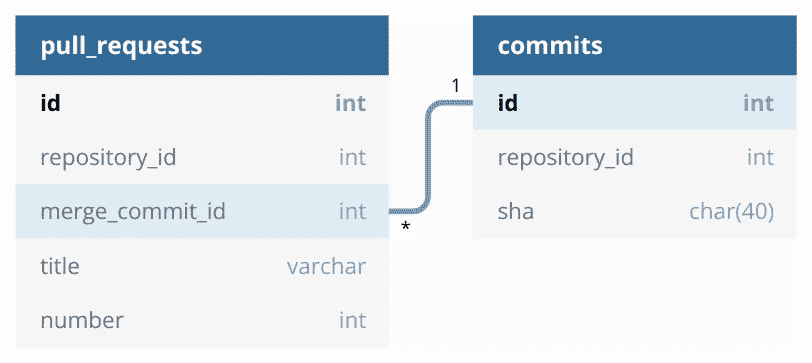
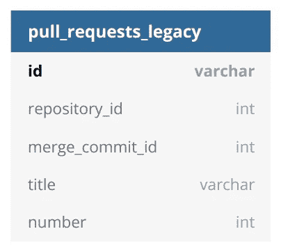
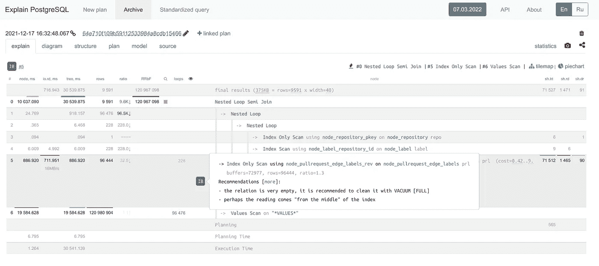
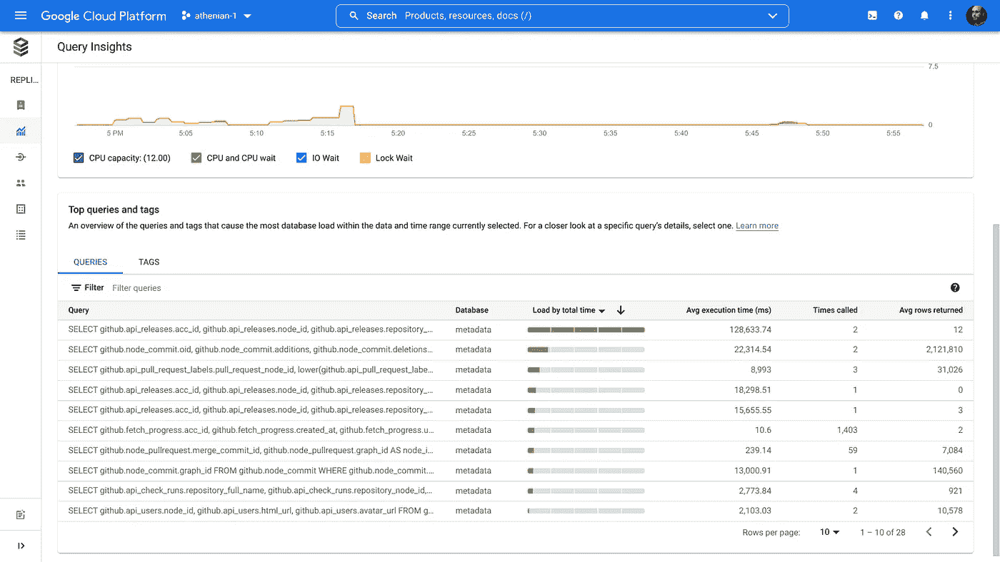
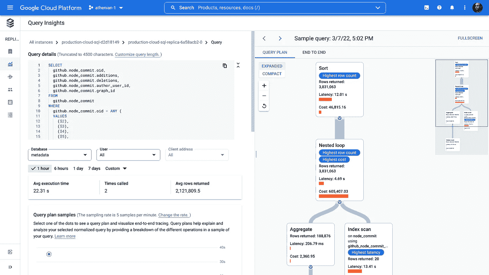

# 我们如何将 PostgreSQL 查询优化 100 倍

> 原文：<https://towardsdatascience.com/how-we-optimized-postgresql-queries-100x-ff52555eabe>

## 我们在 PostgreSQL 中用来加速 SELECT-s 的一些技巧:带冗余条件的左连接、值、扩展统计、主键类型转换、集群、pg_hint_plan + bonus


由 [Richard Jacobs](https://unsplash.com/@rj2747?utm_source=unsplash&utm_medium=referral&utm_content=creditCopyText) 在 [Unsplash](https://unsplash.com/s/photos/elephants?utm_source=unsplash&utm_medium=referral&utm_content=creditCopyText) 上拍摄。

关于 PostgreSQL 优化的帖子数不胜数:兔子洞很深。当我几年前开始编写分析后端时，我已经有了使用 MySQL 和 SQL Server 等其他数据库的经验。尽管如此，我从未如此关注表演。我之前参与的项目要么对处理时间要求不严格(DS/ML)，要么不涉及一次处理许多行(常规的 web 应用程序)。然而这一次，我的疑问是:

*   由 3–10 个`JOIN`通过相关键组成。
*   产生 10 到 1，000，000 行。
*   必须在 UX 规定的时限内执行。
*   无法提示——直到 2021 年底 Cloud SQL——Google Cloud 中托管的 PostgreSQL 支持 pg_hint_plan。
*   不允许直接访问服务器进程，例如，[黑掉一些](https://ardentperf.com/2022/02/10/a-hairy-postgresql-incident/) `[perf](https://ardentperf.com/2022/02/10/a-hairy-postgresql-incident/)`。因为 PostgreSQL 是托管的。

在一个 API 端点获取一百万行听起来不是一个好主意，这表明算法或架构存在问题。当然，一切都可以重写和重新设计，但总要付出代价。不幸的是，现在对我们来说太高了。

就像对 API 服务器的 Python 代码的优化一样，没有一个神奇的咒语可以解决我们所有的 SQL 性能问题。尽管如此，我还是要提几个对雅典人产生影响的好主意。希望其中一些能对读者有所帮助。当然，我不会在这里泄露神圣的秘密；我希望当我们开始的时候，我已经读了像下面这样的东西。

## 左连接的隐藏优势

编写 SQL 的每个人都应该知道`INNER JOIN`和`LEFT JOIN`的区别。当公共列相关时，这些书经常忽略连接类型如何影响查询规划器。假设我们有两张表:



pull_requests 通过 merge_commit_id 引用提交。图片作者。

`pull_requests`包含关于 GitHub 上 pull 请求的记录。`commits`包含关于 GitHub 上提交的记录。`pull_requests`中的`merge_commit_id`引用`commits`中的{0，1 }–1`id`。所有的`id`都有很高的[选择性](https://www.postgresql.org/docs/current/row-estimation-examples.html)。给定表之间的内部连接，

```
**SELECT** pr.*, c.sha **AS** merge_commit_sha
**FROM** pull_requests pr
  **INNER JOIN** commits c **ON** pr.merge_commit_id = c.id
**WHERE** pr.repository_id **IN** (...)
```

PostgreSQL 规划器可能会预测少量的结果行，并发出一个[嵌套循环连接](https://www.postgresql.org/docs/current/planner-optimizer.html#id-1.10.3.8.5)。发生这种失败是因为 PostgreSQL 不知道我们的 commit `id` -s 是相关的，并在连接的行计数估计公式中乘以它们的选择性。因此，如果我们处理大约 10k 行，我们的查询性能会严重下降。让我们考虑一个左连接:

```
**SELECT** pr.*, c.sha **AS** merge_commit_sha
**FROM** pull_requests pr
  **LEFT JOIN** commits c **ON** pr.merge_commit_id = c.id
**WHERE** pr.repository_id **IN** (...)
```

规划器可能会预测与`pull_requests`中过滤的行数量相同的结果行，并且会正确地在大约 10k 上调度一个散列左连接。为了避免散列整个`commits`，我们可以应用我们的领域知识，PRs 和 commits 总是在同一个存储库中。

```
**SELECT** pr.*, c.sha **AS** merge_commit_sha
**FROM** pull_requests pr
  **LEFT JOIN** commits c **ON**     pr.merge_commit_id = c.id
                         **AND** pr.repository_id = c.repository_id
**WHERE** pr.repository_id **IN** (...)
```

第二个连接条件是人为的，不会改变结果。然而，PostgreSQL 足够聪明，可以散列由与`pull_requests`相同的`repository_id` -s 预过滤的`commits`。我们的查询应该执行得更快，拥有所有必要的索引。

这种方法的真正优势体现在多层 JOIN-s 上。PostgreSQL 缓存预先过滤的哈希表，合并它们的成本很低，而不可能缓存嵌套循环。结果，当我在生产中从内连接切换到左连接时，性能提高了 10-100 倍。重要提示:如果不能保证不同的连接返回相同的结果，就必须对空值进行后置过滤。

## 散列值

考虑一个典型的“胖入”查询:

```
**SELECT** *
**FROM** pull_requests
**WHERE** repository_id **IN** (...over 9000 IDs...)
```

这通常计划为索引或位图扫描。我们可以使用`VALUES`表达式重写它:

```
**SELECT** *
**FROM** pull_requests
**WHERE** repository_id = **ANY**(**VALUES** (101), (102), ...)
```

PostgreSQL 产生了一个不同的计划，带有值扫描的 HashAggregate 和可能的 Hash Join(如果预测的行数足够大)。这对性能有影响吗？有时确实如此。我发现它在多连接查询中很有用，但只是在计划器没有在所有连接之后安排它的时候。尽管可以使用提示来提升它。我稍后会介绍它们。在我们的产品中，当“它工作”时，典型的加速是 10-100 倍，但同时，当计划者感到困惑时，速度会慢 10-100 倍。

附注:你不应该直接在 SQL 主体中插入超过 9000 个 id。

```
**WHERE** repository_id = **ANY**($1::text::bigint[])**WHERE** repository_id = **ANY**(**SELECT** * **FROM** unnest($1::text::bigint[]))-- where $1 is an argument passed via the binary protocol$1 = '{...over 9000 IDs...}'
```

注意双重造型`$1::text::bigint[]`。由于推断出 [asyncpg](https://github.com/MagicStack/asyncpg/issues/449#issuecomment-498278718) ( `a sized iterable container expected (got type 'str')`)中的参数类型不正确，直接转换为`bigint[]`可能会失败。此外，如果用`= ANY(ARRAY)`替换`IN (...)`，规划器应该会得到行数的提示，因为后一个构造目前还不清楚。

## 扩展统计

继续前面的 SQL，让我们在`WHERE`中添加另一个条件:

```
**SELECT** *
**FROM** pull_requests
**WHERE** repository_id **IN** (...) **AND** merge_commit_id **IN** (...)
```

`repository_id`和`merge_commit_id`都具有高选择性。对于 PostgreSQL 来说，这两列是黑盒，因此它可能会大大低估最终的行数。悲观的行计数预测会导致糟糕的下游计划决策，比如嵌套循环而不是`LEFT JOIN commits`的散列连接，我们的性能会下降。

这个问题有一个貌似合理的解决方案:[扩展统计](https://www.postgresql.org/docs/14/planner-stats.html#PLANNER-STATS-EXTENDED)。

```
**CREATE STATISTICS** ids_correlation **ON** repository_id, merge_commit_id **FROM** pull_requests;
```

以`ids_correlation`为动力，PostgreSQL ≥13 会意识到`repository_id`和`merge_commit_id`相关，会调整行数估算。

事实证明，扩展的统计数据对于纠正规划者的预测特别有用，在这种情况下，我们通过客户账户 ID 进行软分段。同样，我们得到了散列连接而不是嵌套循环和 10-100 倍的加速。

## 主键类型很重要

我们曾经有一个稍微不同的模式。



具有 varchar 类型的拉请求 id 的旧数据库模式。图片作者。

GitHub 将所谓的节点标识符分配给每个 API 对象，例如 pull 请求。这是一个不透明的字符串:例如，[雅典人/api-spec#66](https://github.com/athenianco/api-spec/pull/66) 是`[PR_kwDOFlTa5c4zPMUj](https://api.github.com/repos/athenianco/api-spec/pulls/66)`。所以我们很自然地决定使用节点 id 作为主键。一切都很好，直到…

直到 [GitHub 改变了节点 ID 格式](https://github.blog/2021-02-10-new-global-id-format-coming-to-graphql/)。迁移对我们来说压力很大，我们最终切换到映射到节点 id 的全局整数 id。从我们的错误中吸取教训:不要依赖外部 id，因为你无法控制它们。

当我们的主键变成整数而不是字符串时，我们很高兴这些列的连接速度提高了 2-5 倍。整数消耗的内存更少，比较和哈希的速度更快。毫无疑问，性能提高了这么多。

## 串

让我们继续拷问`pull_requests`。

```
**SELECT** *
**FROM** pull_requests
**WHERE** repository_id **IN** (...) **AND** number > 1000
```

假设我们已经有了一个合适的索引:

```
**CREATE INDEX** pull_requests_repository_id **ON** pull_requests (repository_id, number)
```

我们还能做些什么来加快查询速度吗？我知道两个选择:

1.  将`SELECT *`中提到的列放入[覆盖指标](https://www.postgresql.org/docs/14/indexes-index-only-scans.html)的`INCLUDE`部分。我们会进行索引扫描。
2.  [通过`pull_requests_repository_id`对](https://www.postgresql.org/docs/current/sql-cluster.html)表进行聚类。

如果额外列的数量适中，第一个选项是可以的。第二个选项更高级。它利用了通常如何访问表的领域知识。值得注意的是，我们可能对存储库存储的 PRs 感兴趣，并且可能只获取最新的 PRs(由`number > 1000`建模)。因此我们将索引声明为`CLUSTER`:

```
**CLUSTER** pull_requests **USING** pull_requests_repository_id
```

该命令完成后，表记录将根据索引列的顺序在磁盘上重新排列。我们的查询返回的行越多，由于加载的相关数据页面越少，我们节省的 IOPS 就越多。

像许多其他人一样，我们在将`CLUSTER ... USING`集成到产品中时遇到了障碍。必须定期执行该命令，因为 PostgreSQL 无法自动维护集群状态。不幸的是，`CLUSTER`获得了一个独占的表锁和挂起的读写块。我们的救星是[pg _ re pack](https://github.com/reorg/pg_repack)——一个没有锁的轻量级替代品。云 SQL 支持它，我们已经在周末推出了它，并取得了巨大的成功。

在`CLUSTER`之后，我们的生产速度提高了 2-5 倍；特别是，它有助于必须从磁盘读取缓冲区的冷查询。

## pg _ 提示 _ 计划

[PostgreSQL 权威一直反对 SQL 提示。](https://wiki.postgresql.org/wiki/OptimizerHintsDiscussion)情况类似于 Go 中禁止泛型，只不过 13 年后 Go 终于加入了泛型，PostgreSQL 超过 36 还没有加入提示。幸运的是，可以通过 GitHub 上的日本项目 [pg_hint_plan](https://github.com/ossc-db/pg_hint_plan) 插入提示。云 SQL 从 2021 年末开始支持 pg_hint_plan。

当我确信他们的警告与我的背景无关时，我总是发现做一些作者强烈阻止我做的事情非常令人满意。这种感觉类似于在接受保修损失时越狱你的手机。或者遇到 web 服务的问题时，直接与技术人员交谈，而不是与第一支持热线联系。像政治家一样，软件开发人员喜欢无条件地限制事情，部分原因是他们会发现迫在眉睫的混乱。

pg_hint_plan 允许很多很酷的技巧。以下是我的荣誉提名。

## 多余的条件在哪里

如果我们给查询添加额外的约束，我们可以加快散列连接的速度。它们不会改变结果，但会减少索引读取。

考虑关于**左连接**部分的查询。

```
**SELECT** pr.*, c.sha **AS** merge_commit_sha
**FROM** pull_requests pr
  **LEFT JOIN** commits c **ON**     pr.merge_commit_id = c.id
                         **AND** pr.repository_id = c.repository_id
**WHERE** pr.repository_id **IN** (...)
```

我们可以这样重写:

```
**SELECT** pr.*, c.sha **AS** merge_commit_sha
**FROM** pull_requests pr
  **JOIN** commits c **ON** pr.merge_commit_id = c.id
**WHERE** pr.repository_id **IN** (...) **AND** c.repository_id **IN** (...)
```

正如我之前提到的，规划器很可能会错误地预测行数，因为它不知道`repository_id` -s 是相关的。然而，我们有一个超级武器，可以纠正这个预测。

```
/*+
  Rows(pr c *100)
 */
**SELECT** pr.*, c.sha **AS** merge_commit_sha
**FROM** pull_requests pr
  **JOIN** commits c **ON** pr.merge_commit_id = c.id
**WHERE** pr.repository_id **IN** (...) **AND** c.repository_id **IN** (...)
```

实际的乘法因子应该是几个典型查询的平均值。所描述的方法有利也有弊。

👍明确的`INNER JOIN`更好地表达了意图。

👍当我们不得不编码`INNER JOIN`时起作用。

👎当表中的统计数据发生变化时，我们应该检查乘法因子。实际上，安全总比事后后悔好，所以当行数较低时，过大的值不会降低性能。

## 甲骨文预测

如果我们使用给定的合并提交散列来搜索 PRs，我们将会遇到常见的错误的行计数估计。

```
**SELECT** pr.*, c.sha **AS** merge_commit_sha
**FROM** pull_requests pr
  **JOIN** commits c **ON** pr.merge_commit_id = c.id
**WHERE** c.sha **IN** (...100 items...)
```

我们可以利用我们的领域知识

1.  `IN`仅包含合并提交。
2.  每次合并提交映射到一个拉请求。

因此，我们将行数设置为`IN`的大小:

```
/*+
  Rows(pr c #100)
 */
**SELECT** pr.*, c.sha **AS** merge_commit_sha
**FROM** pull_requests pr
  **JOIN** commits c **ON** pr.merge_commit_id = c.id
**WHERE** c.sha **IN** (...100 items...)
```

## 超越 set join_collapse_limit=1

联接几个表的顺序可能很关键。官方文档提供将连接级参数`join_collapse_limit`设置为 1，除非你通过 pgbouncer 连接并且物理连接是共享的，否则有效。或者，您不希望锁定整个连接序列，而只锁定几个种子表。或者嵌套顺序不是线性的。继续前面的查询，假设我们通过许多合并提交进行搜索，并决定强制哈希表查找:

```
**SELECT** pr.*, c.sha **AS** merge_commit_sha
**FROM** pull_requests pr
  **JOIN** commits c **ON** pr.merge_commit_id = c.id
**WHERE** c.sha = **ANY**(**VALUES** ...) **AND** ...other clauses...
```

`other clauses`可能会混淆 PostgreSQL 规划器，所以它在联接两个表后调度 HashAggregate。届时，性能影响将是灾难性的。让我们解决这个问题。

```
/*+
  Leading(*VALUES* c pr)
 */ **SELECT** pr.*, c.sha **AS** merge_commit_sha
**FROM** pull_requests pr
  **JOIN** commits c **ON** pr.merge_commit_id = c.id
**WHERE** c.sha = **ANY**(**VALUES** ...) **AND** ...other clauses...
```

或者，如果`other clauses`对`pull_requests`非常严格，并且我们期望 PRs 少于合并提交散列的数量，我们可以在使用过滤的`commits`连接之前独立地应用`other clauses`:

```
/*+
  Leading(pr (*VALUES* c))
 */ **...**
```

`Leading` hint 是 dope，至今一直是我们的超级英雄。

## 无情的指数覆盖

pg_hint_plan 给了我们一把大枪:`IndexScan`和`IndexOnlyScan`。这两个因素推翻了计划者使用指数的决定。不幸的是，如果 SQL 或统计数据发生变化，规划器就会偏离正轨，并显示“未定义的行为”示例:

```
**CREATE INDEX** impossible **ON** pull_requests (merge_commit_id);/*+
  IndexScan(pr impossible)
 */
**SELECT** *
**FROM** pull_requests pr
**WHERE** repository_id **IN** (...) **AND** number > 1000;
```

计划者将发布顺序扫描。如果 autovacuum 跟不上表的写入，那么计划可能看起来完全不可思议，例如，使用正确的索引但忽略索引列并从头开始过滤。无论如何，自动真空滞后是有害的。

## 额外奖励:视觉解释

当我需要优化另一个查询时，这是我的谋生之道。我试过几个 web apps，最喜欢的是 [explain.tensor.ru](https://explain.tensor.ru) 。



explain.tensor.ru 的推荐。图片作者。

优势:

*   关于修复或调整什么的建议。他们不是微不足道的，并证明对初学者非常有帮助。
*   其他视图，如瓶颈饼图。
*   非常健壮的计划解析器。
*   链接可以存活很多年——对于延期研究非常有用。

请在回复中建议其他酷的解释者！

## 额外收获:云 SQL 洞察

Google Cloud 推出嵌入云 SQL 的新工具:[云 SQL Insights](https://cloud.google.com/blog/products/databases/get-ahead-of-database-performance-issues-with-cloud-sql-insights) 。我数不清这个工具救了我们多少次:

*   当我们的后端 DDoS-ed 数据库查询缓慢时，我们不得不在恐慌中尽快修复它。云 SQL 洞察立即指出了杀手级 SQL。
*   当我们的数据检索子系统(镜像来自 GitHub、JIRA 等的数据的子系统。)写得太快，autovacuum 失败，一些表“腐烂”同样，云 SQL Insights 很快指出了什么需要紧急处理`VACUUM ANALYZE`。
*   [增强](https://betterprogramming.pub/continuous-performance-improvement-of-http-api-86290433aa54) [哨兵](https://sentry.io)的常规性能监控。



云 SQL Insights —我们生产中过去一小时内最具影响力的查询。我们应该回顾一下我们如何获取释放，该死的。图片作者。



云 SQL 洞察—查询详细信息。应该有人添加一个 Rows 提示来消除嵌套循环。图片作者。

## 摘要

我介绍了一些 PostgreSQL 查询性能技巧，它们将我们的查询速度提高了 100 倍:

*   `LEFT JOIN`代替了`INNER JOIN`，帮助规划者做出更准确的行数预测。添加冗余的`ON`子句改进了散列连接。
*   `= ANY(VALUES ...)`而不是`IN`可以强制一个有很多元素的哈希聚合。
*   扩展的统计信息通知规划者有关列的相关性。
*   把表主键做成`varchar`是个馊主意。
*   `CLUSTER`当查询返回许多相关行时，会出现异常。
*   pg_hint_plan 提供了强大的提示，包括估计行数修正`Rows`，连接序列实施器`Leading`，以及索引覆盖`IndexScan`。尽管后者可能会反击。
*   我喜欢 [explain.tensor.ru](https://explain.tensor.ru) 来可视化`EXPLAIN` -s。
*   如果你是云 SQL 用户，云 SQL 洞察是必须的。

我将感谢任何反馈和更正。请在媒体上关注我，以获得我下一篇帖子的通知。我写的是应用于软件开发工件的 ML/DS，Python，PostgreSQL。

另见:[我们如何优化 Python API 服务器代码 100x](/how-we-optimized-python-api-server-code-100x-9da94aa883c5) 。

如果你是一个渴望建立持续改进软件开发文化的工程领导者，请查看我们的 [SaaS 产品网站](https://athenian.co)。