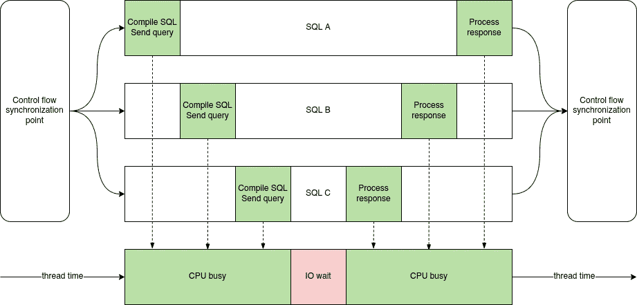
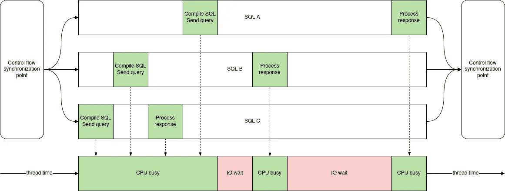
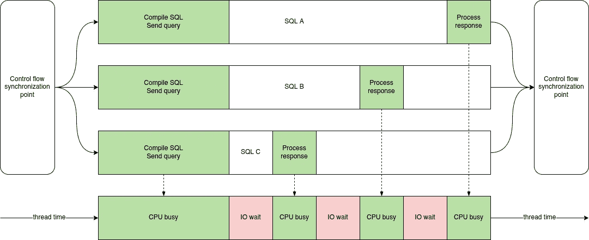
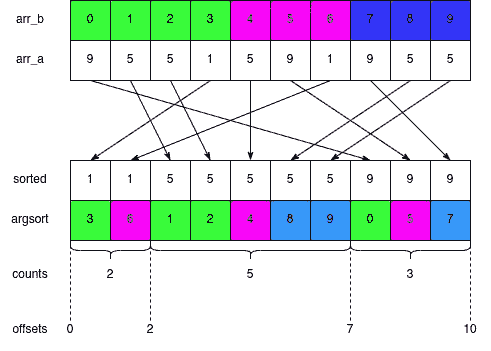

# 我们如何优化 Python API 服务器代码 100 倍

> 原文：<https://towardsdatascience.com/how-we-optimized-python-api-server-code-100x-9da94aa883c5>

## 我们用来加速调用用 Python 编写的分析 API 的一些技巧:用 asyncio 玩，用 SQLAlchemy 捣乱，深入研究 asyncpg，用 Cython 重写部分，找到更好的数据结构，用 pure numpy 替换一些 pandas。


根据 CC0 许可的图像。鸣谢:最大像素贡献者。

Python 代码优化看起来容易或困难，取决于性能目标。如果目标是“尽最大努力”，仔细选择算法并应用众所周知的常见实践通常就足够了。如果目标是由 UX 决定的，有时你必须深入几个抽象层，侵入系统。或者重写底层库。或者换个语言，真的。

这篇文章是关于我们在 Python 代码优化方面的经验，无论你做什么都不够快。我个人非常乐于接受挑战，并将 API 响应时间压缩在一秒钟之内。事实上，这太有趣了，我们已经为一系列博客帖子准备了足够的笔记。

我说的“我们”是指在雅典的[工作的工程师。雅典人提供了一个 SaaS 来帮助工程领导者建立一个持续改进的软件开发文化。为了从 landing-pagish 进行翻译，我们将 GitHub 和 JIRA 元数据镜像到我们自己的数据库，对其进行分析，并在 SPA 中显示指标和图表。暂时如此。当然，计划是征服世界。](https://athenian.com)

## 那些淘气的花冠

API 请求处理通常在两个极端之间平衡:CPU 和 IO 等待。它们之间没有明确的界限；就像阴阳一样，它们以复杂的关系携手共舞。如果你分析一个请求，你会看到一堆杂乱的函数调用，这些调用会投射到 CPU 和 IO 占用轴上。让我们考虑这个简化的代码:

```
await asyncio.gather(query_sql_a(), query_sql_b(), query_sql_c())
```

我们启动了三个从 SQL DB 请求数据的协同例程。雅典人使用 PostgreSQL，那么让我们假设我们使用 PostgreSQL。每个协程都经过三个阶段:

1.  (CPU)准备对 PostgreSQL 的请求并发送它。
2.  (IO wait)等待 PostgreSQL 响应。
3.  (CPU)读取响应并将其转换为 Python 对象。

让我们假设(1)和(3)对于每个协程都用了一秒钟，PostgreSQL 是无限强大的，总是需要 5 秒钟来计算`query_sql_a`的响应，3 秒钟计算`query_sql_b`的响应，1 秒钟计算`query_sql_c`的响应。这并不意味着，例如`query_sql_a`会一直在 IO wait (2)中花费 5 秒，因为 Python 在每个时刻只能执行三个协程中的一个。

`asyncio.gather`按照传递参数的顺序启动协程。这并没有写在[文档](https://docs.python.org/3/library/asyncio-task.html#asyncio.gather)中，必须是一个实现细节，但是考虑这一点很重要:我们将首先执行`query_sql_a`的(1)，然后是`query_sql_b`的(1)，然后是`query_sql_c`的(1)，然后在 PostgreSQL 繁忙时等待一秒钟，然后以相反的顺序执行(3)。



A、B、C 协同程序的执行计划。CPU 时间是 86%，IO 等待时间是 14%。图片作者。

根据执行计划，我们在 CPU 中遇到瓶颈:86%的操作系统线程时间 CPU 在做一些有用的工作。现在考虑启动协程的不同顺序:

```
await asyncio.gather(query_sql_c(), query_sql_b(), query_sql_a())
```



C，B，A 协同程序的执行计划。CPU 时间是 60%，IO 等待时间是 40%。图片作者。

第二个执行计划演示了如果我们不猜测启动协程的最佳顺序，事情会变得多么糟糕。墙壁时间从 7 秒增加到 10 秒，增加了 43%。我们不再有严重的 CPU 瓶颈(60%对 86%)。`query_sql_c`阶段 3 与`query_sql_a`阶段 1 竞争，胜负取决于事件循环内部。

我在这里写的是 Python 代码优化，所以我不会讨论 SQL 性能和减少单个 IO 等待这样的突出问题。因此我的建议是

> 尝试传递按预期 IO 等待时间降序排序的`asyncio.gather()`中的协同程序。也就是说，第一个参数应该是具有最高预期 IO 等待的协程，依此类推。

真实的例子:我们在代码中有一个地方放了 10 个协程。当我按照前面提到的启发式方法排序时，平均总执行时间减少了 **x2** 。

假设`thread_gather`启动并加入线程而不是协程，对其参数排序有意义吗？当然不是。在我的例子中，启动线程比启动协程更快吗？实际上，考虑到 GIL，协程的性能会更好:



A、B、C 线程的执行计划。CPU 时间是 66%，IO 等待时间是 33%。图片作者。

## 在联盟中共享

我们的 API 使用 SQLAlchemy 核心来生成 SQL(没有 ORM)。`WHERE`中有些条件重复的地方不少。一个例子是用`UNION ALL`代替`OR`;而不是

```
SELECT * FROM table WHERE ((a = 1 and b = 2) OR (a = 2 and b = 1)) AND c = 3
```

我们写作

```
(SELECT * FROM table WHERE a = 1 and b = 2 and c = 3)
UNION ALL
(SELECT * FROM table WHERE a = 2 and b = 1 and c = 3)
```

为什么在这种情况下`UNION ALL`通常更好是另一篇博文的主题。让我们关注一下`UNION ALL`在 SQLAlchemy 中的样子:

```
union_all(select([table]).where(and_(a == 1, b == 2, c == 3)),
          select([table]).where(and_(a == 2, b == 1, c == 3)))
```

想象有一个大的表达式代替了`c = 3`，还有变量`IN`，等等。—两次构建这样的对象是很昂贵的。相反，我们可以写:

```
shared_cond = c == 3
union_all(select([table]).where(and_(a == 1, b == 2, shared_cond)),
          select([table]).where(and_(a == 2, b == 1, shared_cond)))
```

这并不适用于每一个 SQLAlchemy 引擎，尤其是 SQLite，因为 SQLAlchemy 在那里生成`?, ?, ?`作为参数占位符，而不是索引引用`$1, $2, $3`。然而，随着从 SQLAlchemy 1.3 升级到 1.4，他们改进了对大 T4 的处理，我们得到了 1.5-2 倍的 SQL 编译速度。

## 从行到列

我们通过 asyncpg 查询 PostgreSQL。asyncpg 像几乎所有其他关系数据库驱动程序一样获取返回行。然而，我们的分析 API 需要构建列式的`pd.DataFrame` -s:每个返回列的值存储在一起。此外，在 pandas 2.0 之前，相同 dtype 的几个列一起存储在同一个 numpy 数组(也称为块)中。

使用`DataFrame.from_records()`天真地构造 DataFrame 是非常低效的。假设 PostgreSQL 敲 asyncpg 的门。接下来是:

1.  解析 PostgreSQL 网络协议并创建 Python 对象。
2.  将这些 Python 对象插入到创建的`asyncpg.Record` -s 中。
3.  迭代行并将 Python 对象插入 dtype `object`的 numpy 数组。
4.  推断更好的数据类型(例如 int、datetime 等。)并将 Python 对象转换成它们。
5.  Consolidate — BlockManager 是 pandas 1.x 的特别之处，它将相同数据类型的 numpy 数组合并在一起。

给定纯`object`列(例如，带有 SQL 空值)，我们接触它们的引用计数器 4 次:在(1)、(3)、(4)和(5)中。`asyncpg.Record`用作辅助容器，可以排除。此外，我们不必执行(4 ),因为我们已经从 SQL 查询中知道了正确的 dtypes。因此，在现代 x86 CPU 上，从 pgproto 到 ready DataFrame 的端到端转换需要超过 500 毫秒，包含大约 20 个对象、大约 20 个类型化列和 300，000 行。

理想的管道是:

1.  解析 PostgreSQL wire 协议，直接写入 numpy 数组，无需具体化严格类型的对象。
2.  构建没有冗余整合的块管理器。

纯`object`值只会增加一次参考计数器。仅仅估计一下，整个过程就要过去大约 5 毫秒。然而，不幸的是，解析 pgproto 和构造`asyncpg.Record` -s 驻留在 Cython 甚至`asyncpg`的 C 代码深处，所以制作理想的管道意味着分叉项目。我们肯定会在征服世界之前叉掉它，但同时必须找到一个折中的办法。

我们当前的折衷渠道:

1.  解析 PostgreSQL 网络协议并创建 Python 对象。
2.  将这些 Python 对象插入到创建的`asyncpg.Record` -s 中。
3.  迭代行并将 Python 对象插入到两个 dtype `object`的 numpy 数组中——一个用于 dtyped，一个用于`object`列。
4.  给定 SQL 查询中的先验知识，转换数据类型。
5.  构造块并将它们包装在块管理器中。

现在，纯`object`值将 refcounters 递增两次:在(1)和(3)中。我们不再试图猜测类型。内存复制膨胀显著减少。我们的测量显示转换时间至少比**快 10 倍，约为 50 毫秒。**

实际的源代码可以在我们的 API 所在的存储库中找到:[雅典人/雅典人-api-open](https://github.com/athenianco/athenian-api-open) 。它不是通用的，也没有足够的意愿使它成为一个合适的开源库。请随意根据您的需求进行调整！我们在麻省理工学院的许可下分发这些文件。

**更新(2020 年 6 月):**我们通过使用 [asyncpg-rkt](https://betterprogramming.pub/i-forked-asyncpg-and-it-parses-database-records-to-numpy-20x-faster-e71024a84bff) 达到了理想的流水线。

让我通过给出一般性的建议来结束这一部分。

> 尽可能避免 pandas DataFrame-s 中的`object`列。使用它们的操作比使用正确类型的要慢得多。

## 迭代没有 GIL 的元组列表

一个非常具体的目标:在原始的`asyncpg.Record` -s 上优化迭代。确实有可能在 GIL 发布后直接与他们合作。Cython 代码如下:

```
cdef extern from "asyncpg_recordobj.h":
    PyObject *ApgRecord_GET_ITEM(PyObject *, int)cdef extern from "Python.h":
    # added nogil -> from cpython cimport ...
    # these are the macros that read from the internal ob_items
    PyObject *PyList_GET_ITEM(PyObject *, Py_ssize_t) nogilcdef nogil_iter(rows: list[asyncpg.Record]):
    cdef:
        Py_ssize_t i, size
        PyObject *record
        PyObject *value size = len(rows)
    with nogil:
        for i in range(size):
            record = PyList_GET_ITEM(<PyObject *>rows, i)
            value = ApgRecord_GET_ITEM(record, 0)
```

`asyncpg_recordobj.h`是 asyncpg 中真实 [recordobj.h](https://github.com/MagicStack/asyncpg/blob/master/asyncpg/protocol/record/recordobj.h) 的简化:

```
typedef struct {
    PyObject_VAR_HEAD

    // asyncpg specifics begin here
    // if they add another field, we will break spectacularly
    Py_hash_t self_hash;
    PyObject *desc;  // we don't care of the actual type
    PyObject *ob_item[1];  // embedded in the tail, the count matches len()
} ApgRecordObject;

#define ApgRecord_GET_ITEM(op, i) (((ApgRecordObject *)(op))->ob_item[i])
```

根据类型`value`的不同，`nogil`的攻击可能很方便，也可能看起来毫无用处。例如，如果`value`是一个字符串，并且您的 CPython 将 Unicode 字符串存储在 UTF-8 内部，`<const char *>PyUnicode_Data(value)`将会工作。如果`value`是整数，`PyLong_AsLong(value)`也可以。但是处理复杂的类需要 GIL。

加速应该是 **~10x。**

如果我们使用元组而不是`asyncpg.Record` -s，我们可以稍微修改上面的代码以保持功能性:

```
cdef extern from "Python.h":
    # added nogil -> from cpython cimport ...
    # these are the macros that read from the internal ob_items
    PyObject *PyList_GET_ITEM(PyObject *, Py_ssize_t) nogil
    PyObject *PyTuple_GET_ITEM(PyObject *, Py_ssize_t) nogilcdef nogil_iter(rows: list[tuple]):
    cdef:
        Py_ssize_t i, size
        PyObject *record
        PyObject *value size = len(rows)
    with nogil:
        for i in range(size):
            record = PyList_GET_ITEM(<PyObject *>rows, i)
            value = PyTuple_GET_ITEM(record, 0)
```

你最好不要同时索引`asyncpg.Record`和元组，否则你会立刻在本机代码中抓住一条龙。

## 零拷贝(反)序列化

我们目前在 PostgreSQL 中存储各种预先计算的数据。我们根据来自应用程序逻辑的许多过滤器来获取它。在 [Sentry](https://sentry.io/) 中收集的配置文件和跟踪明确显示，在`INSERT INTO … VALUES`和反序列化期间，我们有时在数据序列化上花费了太多时间——在解析 pgproto 时创建 Python 对象，我在前面的一节中提到过。

我们能够通过使用基于[结构化 numpy 数组](https://numpy.org/doc/stable/user/basics.rec.html)的特殊的、有限的、不可变的数据结构来优化这个热点。简而言之，它是一个围绕`bytes`的数组包装器。那是`__slots__`里唯一的一项，真的。

当我们想从结构中提取一些字段`"foobar"`时，我们执行:

```
@property
def foobar(self):
    return self._array["foobar"][0]
```

我们的序列化是零拷贝:

```
def serialize(self):
    return self._array.view(np.uint8).data
```

反序列化也没什么:

```
def __init__(self, data: bytes):
    self._array = np.frombuffer(data, dtype=self.dtype, count=1)
```

`dtype`看起来像`np.dtype([("foobar", int), ("baz", "datetime64[ns]")])`

我们结构的秘密武器是非常有效地转换成熊猫数据帧:

```
concat_bytes = b"".join([x.serialize() for x in rows])
boss = np.frombuffer(concat_bytes, dtype=dtype, count=len(rows))
pd.DataFrame({"foobar": boss["foobar"], "baz": boss["baz"]})
```

使用 Cython 中的`nogil`可以进一步优化字节的连接。

实际的实现更加复杂。它支持:

*   numpy 具有的标量非`object`字段，包括 unicode 字符串和 blobs。
*   这些类型的可变长度数组。
*   属性会自动生成。
*   可选可变附加字段(未序列化)。

这是一个例子:

```
[@numpy_struct](http://twitter.com/numpy_struct)
class PullRequestFacts:
    class Immutable:
        created: "datetime64[s]"
        first_commit: "datetime64[s]"
        ...

    class Optional:
        repository_full_name: str
        ...
```

很难比零拷贝和 O(1)快。与将字段存储在单个 SQL 表列中的`pickle`相比，`@numpy_struct`至少为我们带来了**10–50 倍的**性能提升。

然而，也有缺点:

*   我们不能处理任意的类型。
*   我们不能将字段上的过滤器下推到 SQL。

所以`@numpy_struct`并不是所有问题的万能解决方案。

## 没有熊猫的熊猫

熊猫 1.x 是微性能垃圾箱火。那是[官方](https://dev.pandas.io/pandas2/internal-architecture.html#removal-of-blockmanager-new-dataframe-internals)。同时，pandas 非常方便，总的来说是一个很棒的、有据可查的工具。

我们不得不重写 API 代码的某些部分，以支持低级的 numpy 数组操作。让我举几个例子。第一个是通过列上的一些条件提取子数据帧。

```
df = pd.DataFrame({"a": [...], "i": [...]}).set_index("i")
df[df["b"] > 10]
```

我们做得更详细但更有效:

```
df.take(np.flatnonzero(df["a"].values > 10))
```

如果我们在一个循环中重复调用这个函数几百次，并且数据帧的大小小于 100 行，那么我们的提取速度会快一个数量级。发生这种情况是因为`df[...]`通过索引值进行选择，因此执行了不必要的索引查找，还因为我们没有执行大量底层粘合代码。

第二个例子是对由列“a”的值分组的列“b”的值执行一些`function`。

```
df = pd.DataFrame({"a": [...], "b": [...]})
df.groupby("a")["b"].apply(function)
```

这是另一种更快捷的方法:

```
arr_a = df["a"].values
arr_b = df["b"].values
keys, indexes, counts = np.unique(
    arr_a, return_inverse=True, return_counts=True)
order = np.argsort(indexes)  # better when arr_a's dtype is S or U
offsets = np.zeros(len(keys) + 1, dtype=int)
np.cumsum(counts, out=offsets[1:])
for i, key in enumerate(keys):
    grouped_b = arr_b[offsets[i]:offsets[i + 1]]
    function(key, grouped_b)
```

这段代码利用了`[np.unique](https://numpy.org/doc/stable/reference/generated/numpy.unique.html)`的强大功能，它可以有效地计算数组中的唯一值(`return_counts=True`)，还可以找到第一次遇到的值(`return_index=True`)或将每个值映射到一个唯一的索引(`return_inverse=True`)。我们对`arr_a`的元素进行排序，并在知道每个组的大小的情况下迭代这些组。



DataFrame.groupby 替换为 np.unique. Image by Author。

Pandas 对`groupby`使用了一种[散列表技术](https://github.com/pandas-dev/pandas/blob/539d51ce4c1c3be4e13566305f84bae2028648bd/pandas/core/algorithms.py#L556)，因此比排序具有更好的 big-O，然而，高度的抽象和糟糕的微性能增加了巨大的线性损失。实际的加速取决于数据帧的大小以及列“a”和“b”的性质。在我们的生产中，典型的提升是 **20 到 50 倍**。

可以类似地替换`groupby`之上的许多其他操作，例如`idxmin()`或`count()`，甚至可以通过 NaN-s 和 NaT-s 解决丢失的值

我们过去常常遵循另一种方法:

```
df.groupby("a").grouper.groups.values()
```

`np.unique`方式避免了具体化每个组的可变长度数组索引的整个列表，因此速度更快。

## 所有这些都值得吗？

我不会把性能优化和剃牦牛比，而是和训练跑马拉松比。你开始时的状态非常糟糕，然后慢慢地进步，一周接一周，每次都会产生稍微好一点的结果。直到有一天你达到了体能要求，跑了马拉松。比赛的每一公里都会提醒你，为了能够向前跑，你经历了什么。

Athenian API 处理由 10 个不同属性过滤的数十万个项目，在几毫秒内将几个软件开发活动逻辑地加入到一个巨大的可查询 DAG 中。两年前，我们从一个非常慢的 MVP 代码库开始，当时公司刚刚成立 4 个月。我为那段代码感到羞耻，这是一件好事:我们没有矫枉过正。两年后，同样的 API 查询执行速度提高了约 1000 倍。我几乎触及了我们达到 1000 倍所做的事情的表面，我们绝对没有完成！下面这篇博文应该总结了我们的 PostgreSQL 查询优化经验。仅考虑 Python 代码性能，**提升了~ 100 倍**。

## TL；速度三角形定位法(dead reckoning)

我考虑了一些 Python 代码技巧，帮助我们提高分析后端性能。他们是:

*   `asyncio.gather`按 IO 等待时间排序的自变量。
*   SQLAlchemy 核心中的共享过滤器。
*   从`asyncpg.Record` -s 定制构建熊猫数据帧。
*   在 Cython 中迭代没有 GIL 的列表。
*   零拷贝(解)序列化数据结构。
*   用纯 numpy 替换熊猫`groupby`。

这些技巧让我们的工作负载性能提高了两个数量级。示例源代码在 [GitHub](https://github.com/athenianco/athenian-api-open) 上。关于我们如何决定优化什么，我写了后续的帖子:[HTTP API 的持续性能提升](https://betterprogramming.pub/continuous-performance-improvement-of-http-api-86290433aa54)。还有类似的关于 PostgreSQL 优化的:[我们如何优化 PostgreSQL 查询 100x](/how-we-optimized-postgresql-queries-100x-ff52555eabe) 。

如果我们正在构建的产品听起来像是你的工程组织需要的东西，去看看 Athenian.com。