# 我们如何改变可视化调试工具的设计

> 原文：<https://towardsdatascience.com/how-we-transformed-the-design-of-a-visual-debugging-tool-93d16068944f>

## 我们如何通过用户研究改变笨重的可视化调试工具的设计

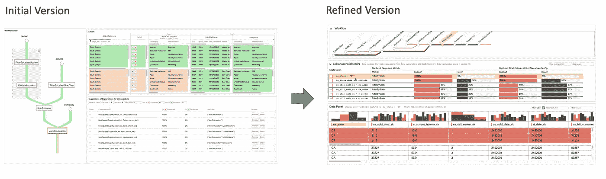

WhyFlow 转型概述。图片作者。

数据流接收多个数据源，如逗号分隔值文件、表格等。，并通过几个代码模块转换和处理数据。数据最终被合并和连接，并输出这些数据。

在科学界可以找到数据流的例子，他们有几种数据源，如地理数据、温度数据和气候数据，然后他们通过数据流将这些数据源组合在一起。输出是一个合并的表，工具可以很容易地读取它，并为希望分析数据的科学家可视化。

数据流动的另一个例子是在政府部门，他们收集了数千家公司的文件，以及它们的纳税申报和收入。这些数据来自几个来源，如美国国税局、美国证券交易委员会的文件和公司本身。数据必须通过复杂的数据流接收和连接。数据的输出可以在其他地方使用，通常存储在数据库中。

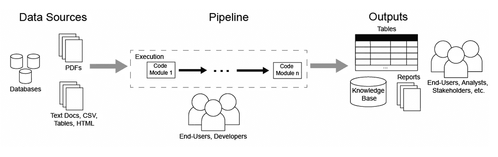

图片作者。

在几种情况下，数据流的输出中会出现错误。在数据流中追溯错误的来源是很困难的:

*   它通常是通过反复试验来完成的。
*   错误在整个数据流中传播，因此人类必须分析每个中间输出，以便找出哪里出错了。
*   不是错误源但传播错误的代码模块可能被误识别为错误源。

为了帮助用户调试通过数据流中的几个代码模块传播的错误，我们构建了一个名为 **WhyFlow** 的可视化交互式调试工具。WhyFlow 帮助用户识别数据流中传播错误的模块。

我们首先构建了 WhyFlow 的初始版本，然后进行了一项用户研究，要求用户识别小玩具数据流中的错误。我们从用户那里得到反馈，然后创建了一个改进版的 WhyFlow。在本文中，我们将讨论如何根据用户反馈改造我们的可视化调试工具。

# 用户研究设置

当用户调试数据流时，WhyFlow 支持三个主要任务:

1.  使用**工作流视图**了解数据流
2.  通过使用**数据面板**分析数据流中的模块如何影响错误流来检查错误流
3.  借助**解释面板**中的*解释*诊断错误

我们进行了一项用户研究，告诉我们如何重新设计 WhyFlow 的每个部分。用户收到的数据流在其中一个代码模块中有错误。他们被要求描述数据流。然后，他们被要求尽力解释错误，描述错误数据点的共有特征，并识别传播错误的代码模块。

他们没有被给予任何关于代码模块实现的细节，以便在更大的数据流上模拟真实生活的场景(其中并非代码模块的所有实现细节一开始都是已知的)。相反，只给他们代码模块的输入和输出及其标签，即数据点是正确的还是错误的。

我们将介绍 WhyFlow 的每个主要部分，以及用户对每个部分的看法和我们是如何重新设计它的。

# 完善总体布局

## 初始版本

在最初的版本中，工作流视图位于左侧，因为它是我们希望用户检查的第一件事。工作流视图让他们对数据流以及代码模块如何相互连接有了一个大致的了解。

数据面板和解释面板都被放在了右边，因为我们希望用户在从工作流视图中选择了要检查的代码模块之后检查这两个面板。

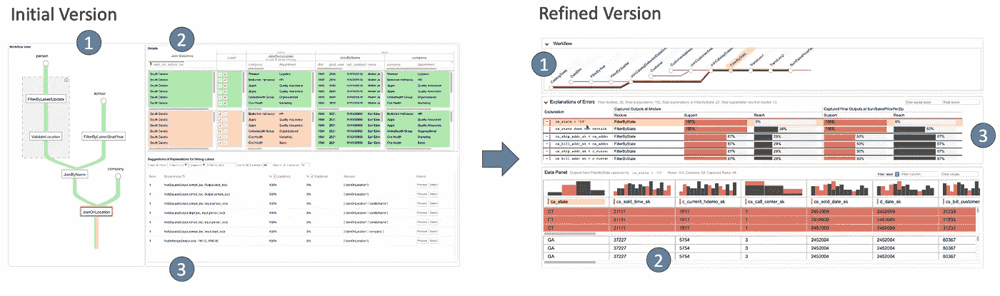

概述了我们的调试工具在我们运行用户研究之前和之后是如何转变的。(1)工作流视图，(2)数据面板，(3)解释面板

## 精致版

在最初的版本中，我们注意到用户为了继续他们的调试任务，会先看数据面板，而不是解释面板。这分散了他们对调试任务的注意力，使他们更关注输入和输出关系，而不是使用解释来帮助他们快速发现数据中的错误模式。在改进后的版本中，我们对布局进行了垂直重新排序，首先是工作流视图，其次是解释面板，最后是数据面板。

# 优化工作流视图

## 初始版本

在最初的版本中，数据流是垂直可视化的。数据流的代码模块由节点表示，并由边连接，边表示从一个代码模块流向另一个代码模块的数据点。每条边由每个数据点的标签进行颜色编码，其中绿色表示正确的数据点，红色表示错误的数据点。边缘的宽度代表通过的数据点的数量。宽度越大，表示通过的数据点越多。

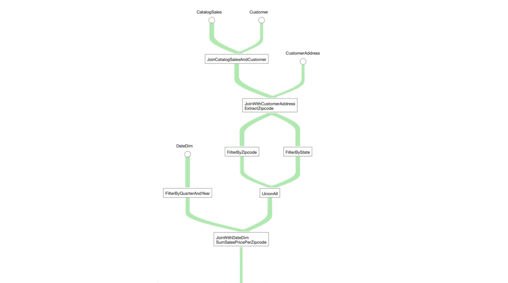

在 WhyFlow 的初始版本中，具有 9 个代码模块的大型数据流是可视化的。图片作者。

数据从上到下流动，这意味着代码模块的输入位于其上，输出位于其下。

有些数据流可能很长。如果一个分支是一长串只有一个输入和输出边的代码模块，WhyFlow 允许用户将它们折叠成一个模块。

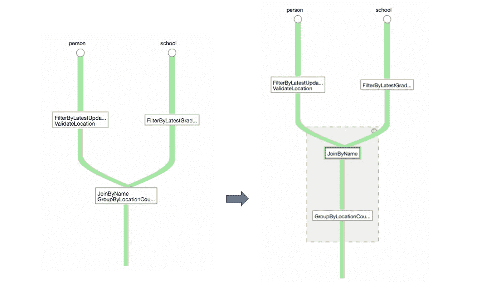

长长的模块链倒塌了。图片作者。

## 用户的反应

用户发现数据流可视化直观且易于导航。然而，我们发现对于较长的数据流， ***很难在一个垂直视图中显示所有内容，这使得用户需要花费时间来浏览它们。*** 也很难把长名字的代码模块装进盒子里。

## 精致版

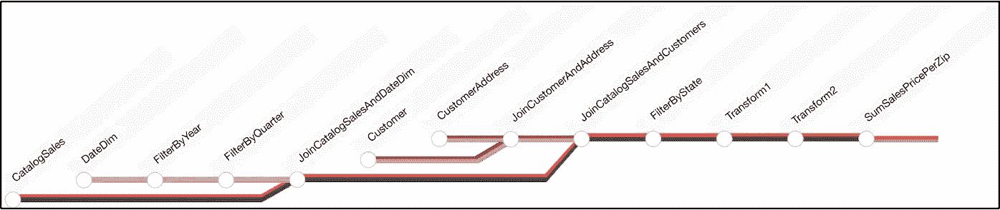

工作流视图的改进版本，使用 9 个代码模块可视化相同的大型数据流。图片作者。

由于数据流从一个方向增长，即使在折叠时导航也会变得笨拙，所以我们旋转视图，使其水平。数据流从左向右读取，这与数据从输入到输出的方向相匹配。矩形节点被小圆代替。放置关联的代码模块名称，以便大部分文本不会被截断。这个视图提供了数据流的最佳视图，而不需要太多不必要的放大和缩小。注意，我们能够在数据流中包含 9 个代码模块，而不会浪费太多的空白空间。

我们还改变了颜色编码方案。正确数据点的颜色编码从绿色变为灰色，这样用户的注意力就集中在错误的数据点上。此外，我们还在红色上添加了阴影:浅红色表示误差较小，深红色表示误差较大。具有较少暗红色错误分支的分支指示错误贡献的分散，暗红色分支指示更多可疑分支。这允许用户容易地消除要检查的分支。

# 细化数据面板

当用户点击模块或边缘时，使用数据面板。然后，数据面板以表格形式显示模块的输入和输出数据点。

## 初始版本

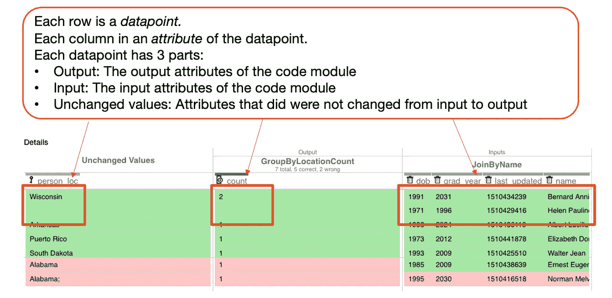

图片作者。

在最初的版本中，数据点被可视化在一个表格中，其中每一行都是一个数据点。它的右侧是输入数据点，这些数据点构成了数据点。左侧是没有任何从输入到输出发生变化的值的列。

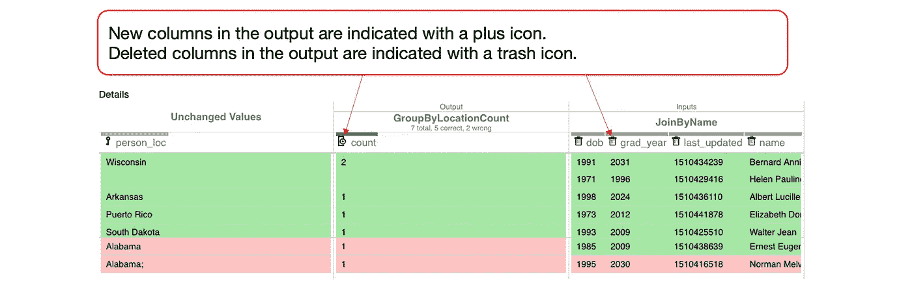

添加的列和删除的列的示例。图片作者。

该表还包括关于代码模块的输入和输出之间的每列关系的信息。输入到输出列的关系类型由图标表示。以下是输入到输出列关系的类型:

*   **增加列**:只出现在输出中而没有出现在输入中的列被认为是代码模块创建的新列。该列用加号图标表示，并且只出现在输出表中。上图中的*计数*列就是一个例子。
*   **删除列**:只出现在输入中而没有出现在输出中的列被认为是删除列。该列用垃圾桶图标表示，并且只出现在输入表中。
*   **Key column** :对于每条记录，同时出现在输入和输出中并且它们的值在输入和输出之间没有变化的列，则该列被认为是 Key 或 join 列。该列由钥匙图标表示。
*   **被操纵的列**:在输入和输出中都出现的列，对于某些记录，它们的值在输入和输出之间发生变化，则该列被认为是被操纵的列。该列由三角形或三角形图标表示。

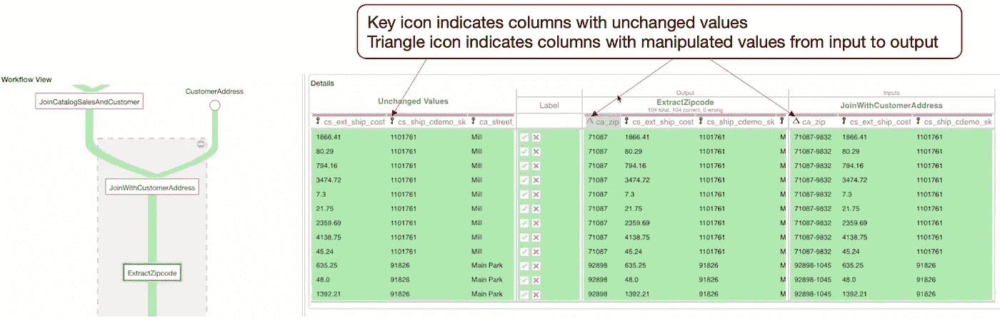

键列和操作列的示例。图片作者。

## 用户的反应

模块输入和输出的并排详细表示提高了用户理解特定模块行为的性能。然而，我们的用户观察显示， ***用户花费了太多的时间筛选和滚动表格*** ，尤其是对于访问和产生大量列的模块，这分散了他们对错误诊断过程的注意力。

## 精致版

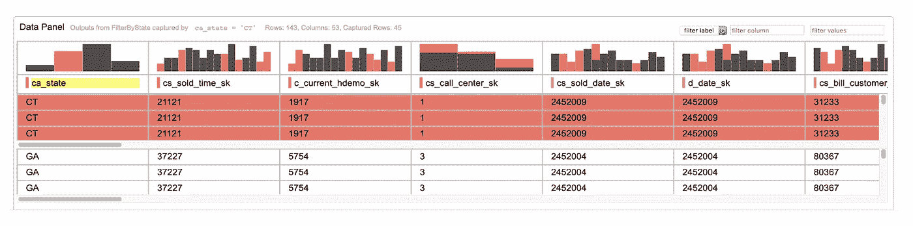

数据面板的改进版本。直方图包含在每列的顶部。图片作者。

我们相信，更有效的起源数据可视化应该能够在错误诊断期间指导最终用户。在界面的优化版本中，我们根据怀疑造成错误的程度从左到右对列进行排序。在本文的[中，我们有一个关于如何计算列的可疑误差贡献的详细公式。](https://openreview.net/forum?id=uO07BC54cW)

此外，为了帮助用户更专注于错误诊断，我们在每列上方添加了一个直方图。直方图将数据点的分布可视化，对误差有贡献的数据点用红色表示，对误差有未知贡献的数据点用灰色条表示。这使得用户可以更容易地发现最有可能导致传播错误的列。

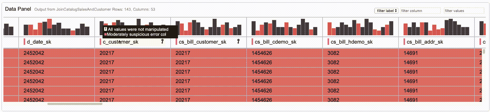

柱轮廓由图标表示。图片作者。

我们还保留了指示输入如何影响列中输出的列图标。我们对图标进行了如下更改:

*   **追加栏**:出现在输出中，但输入用加号图标表示的栏。
*   **键/连接列**:作为键连接多个输入的列用一个键图标表示。对于从输入到输出值保持不变的列，我们不包括此图标，除非它们在连接操作中专门用作键。
*   **被操作的列**:其值从输入到输出被修改的列用一个 delta 图标表示。

我们还删除了用于指示输出中已删除的输入列的垃圾桶图标，因为我们已将数据面板设计为仅显示代码模块的输出数据点，而不是包含输入数据点。简而言之，这些注释允许用户在高层次上理解代码模块的行为及其输入和输出，即使用户没有看到模块的代码。

# 优化解释面板

解释面板显示错误的解释。它们是捕捉错误数据点的模式的谓词，这些错误数据点从不会导致错误的数据点中脱颖而出。

我们将解释公式化为谓词，因为我们观察到调试数据流涉及识别代码模块输出中的异常。这些异常通常与预期的数据点相对照。作为谓词的解释帮助用户完成比较错误输出和非错误输出的核心任务。

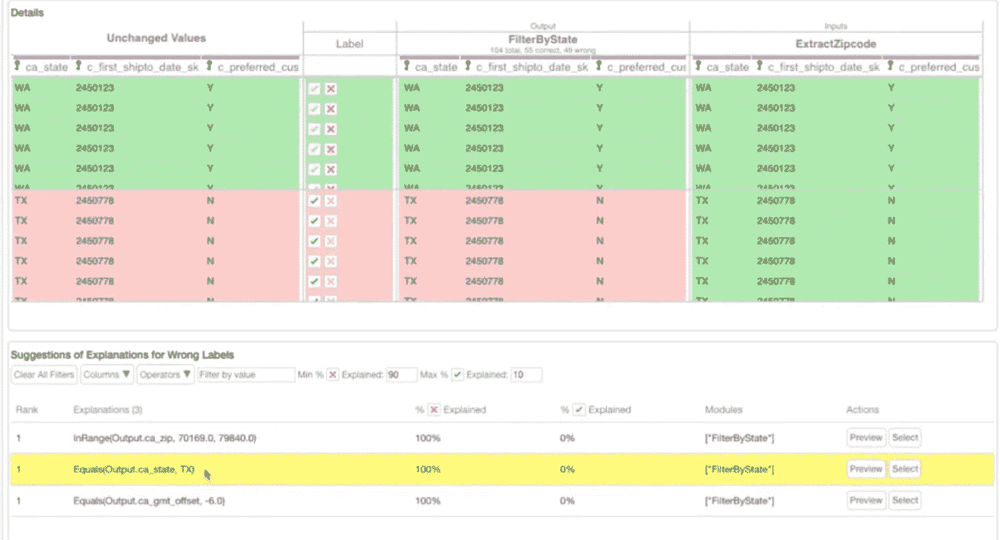

为 FilterByState 代码模块生成的解释。图片作者。

例如，具有异常的数据点可能在 ca_state 列中具有所有值 *TX* 。解释面板将显示一条解释，说明**等于(Output.ca_state，TX)** ，如上图中突出显示的。因此，对于每个代码模块，WhyFlow 都会对代码模块的输出进行解释。注意，WhyFlow 的解释本质上是谓词。你可以在[这篇文章](https://openreview.net/forum?id=uO07BC54cW)中读到更多关于 WhyFlow 的解释语言。

## 初始版本

在最初的版本中，用户必须点击代码模块才能在解释面板中看到任何内容。解释面板将显示代码模块输出中生成的解释。

这种设置促使用户首先探索工作流视图中的代码模块，并且仅在他们怀疑代码模块是错误的来源时检查解释。

## 用户的反应

在用户研究中，每个用户都必须在有解释面板(完整的 WhyFlow 界面)和没有解释面板(基线界面)的情况下调试数据流中的错误。基线接口模拟了真实世界场景中的调试数据流，其中不存在对错误的解释。用户必须亲自检查输入和输出数据点，并经常假设误差如何通过数据流传播，然后进一步检查误差数据点的模式，以证实他们的怀疑。

用户研究证实了为用户在其错误诊断任务中生成的解释的有用性。一个用户解释说，“我不知道(基线)发生了什么，但是解释给了我一些提示。”许多用户表示，他们使用解释来验证他们对错误原因的直觉。一位用户说:“我先在脑子里调试，然后我选择了一个解释。”另一个用户说“当我不是 100%确定的时候，解释特别有用”。

此外，90%的用户认为 WhyFlow 生成的解释简单易懂。

然而，我们观察到用户花在 WhyFlow 中选择解释的时间和识别错误的时间一样多。一些模块生成了多达 60 个解释。三名用户评论说，“有很多解释。”一个用户说“看到一千个解释就好像有几千个不同类型的错误。”四个用户发现很难辨别建议解释的质量，因为他们中的许多人有相同的表现，或者相同的精确度和回忆。

此外，我们观察到一些最终用户对他们的直觉缺乏信心，他们 ***花了大量的时间调查每个模块*** 的最佳解释。我们不得不重新思考如何向用户展示解释，这样他们就不会浪费时间一个接一个地检查每个代码模块的解释。

## 精致版

在优化版本中，解释面板显示所有代码模块的所有解释。最上面的解释是为什么 Flow 与错误源最相关。当用户从工作流视图中选择一个代码模块时，解释面板将只显示该特定代码模块的解释。

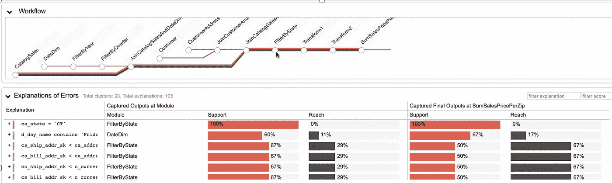

解释面板包含所有代码模块的所有解释。图片作者。

除了显示所有模块的解释，解释面板还根据相同的列对解释进行分组。这里 WhyFlow 显示了每个聚类的所有顶级解释。

第一个解释是在模块 FilterByState。这个解释说，大多数错误在列 ca_state 处具有值 *CT* 。正如你所看到的，为什么 Flow 把与错误最相关的解释排在第一位。

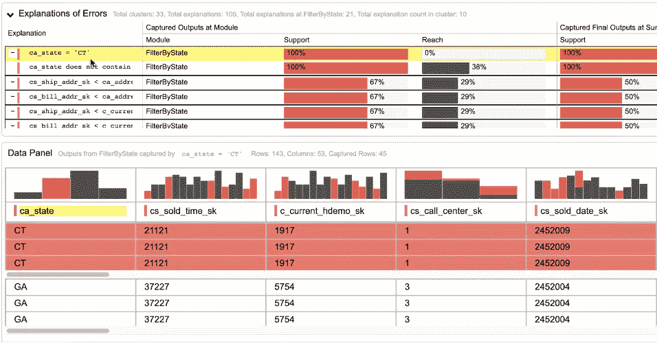

图片作者。

注意，有了改进的界面，用户会注意到第一个解释是关于状态的。它表示所有错误数据点的值都是 *CT* 。点击此解释会将数据面板分为采集的数据点和未采集的数据点。分割显示所有错误数据点的值为 *CT* 。这证实了用户的怀疑:FilterByState 并没有像预期的那样掉 *CT* 。所以，这里的错误在于这个滤波器，它没有过滤掉状态值 *CT* 。

# 结论

利用我们的用户研究结果，我们改变了 WhyFlow 的每个面板，以帮助用户更专注于调试任务，而不是被其他元素分散注意力。虽然这是一篇概述文章，但您也可以在[文章中阅读更多关于具体细节的内容。](https://openreview.net/forum?id=uO07BC54cW)

# 视频参考

初始界面:

最终接口: